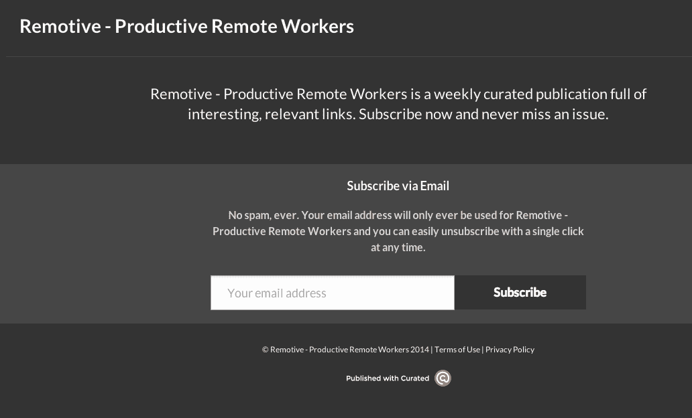
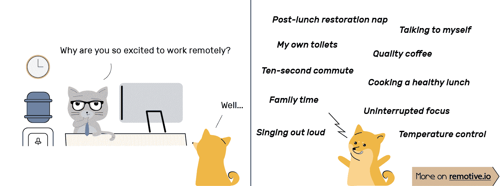
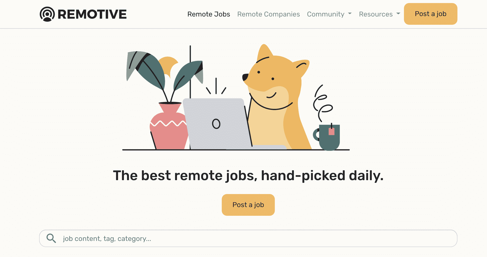

# 作为一名非技术型创始人，月薪高达 12，000 美元

> 原文：<https://www.indiehackers.com/interview/bootstrapping-to-12-000-mo-as-a-non-technical-founder-d635b7619b>

## 你好！你的背景是什么，你在做什么？

嗨！我是鲁道夫， [Remotive](https://remotive.io) 的创始人。我们帮助技术专业人员获得远程工作。

我不是典型的独立黑客；我不会编码，也不会造 SaaS！:)然而我却在这里，经营着一份“兼职变成全职的工作”。

我今年 31 岁，住在法国巴黎。我很幸运，刚从大学毕业就加入了谷歌。我的大多数同事都从事与广告相关的产品。不是我。他们让我把 Gmail 卖给公司。我仍然记得我的部分推销:“……技术好到足以在任何地方工作！”这真的引起了我的共鸣。

几年后，我发现了 Buffer，一家每个人都远程工作的创业公司。我喜欢他们的方式和氛围。我最终成为他们的运营总监，帮助 Buffer 招聘和发展。我的朋友不停地问:“你是如何找到一份很酷的远程工作的？我们如何才能做到这一点？”早在 2014 年，我就开始尝试回答这个问题。今天，我全职工作，养活自己！

## 是什么促使你开始使用 Remotive.io？

我喜欢副业。Tumblrs、时事通讯、博客、创业周末……我以前的项目都没有吸引力，但是每一个都让我学到了很多。

2014 年，我决定回答我的朋友们一直问的那个问题，如何找到一份好的远程工作。那时我已经有了丰富的经验，这感觉就像是我可以轻松倾诉的事情。

所以我[在博客上写了这件事](https://medium.com/@rdutel/working-remotely-getting-things-done-38dcd0413733)。我的同事在社交媒体上分享了这个帖子，时机刚刚好。自从几个月前[的游牧者](https://nomadlist.com/)出现以来，很多人都对远程工作感到好奇。然而以前很少有人远程工作。我的文章在媒体上疯传，所以我添加了一个免费的 MailChimp 捕获表单，并收集了 100 多封电子邮件。一个月后，我在 [Product Hunt](https://www.producthunt.com/posts/remotive) 上发布了 Remotive 作为“远程工作的时事通讯”,我们在发布当天排名第一！

这发生在我在 Buffer 工作的时候。(他们公布了薪水——我的年薪超过 10 万美元。)提到这一点很重要，因为我热爱我的(远程)工作，没有辞职的冲动。辞职前，我平衡了两年的工作和兼职。

回过头来看，Remotive 聚集了很多兴趣却没有爆发式增长。这是非常渐进的。此外，我赚了足够多的钱，我不需要移动就能盈利。当我开始做的时候，我没有打算做全职工作。这只是一个附带项目。

## 构建最初的产品需要什么？

我的 MVP 是我最初的中位，所以那是我开始的地方。写作是一个多步骤的过程。我总是邀请五到十个我信任的人来审阅我的草稿。一旦我高兴了，我会选择一个我觉得最合适的标题和插图。每篇文章花费我一两天的时间。有些文章做得好，有些做得不好。

 

头两年，我唯一做的事情就是策划远程工作的文章。我的朋友杰里米·贝奈姆为这个项目创建了一个登陆页面。它显示了一张图片并捕捉到了电子邮件。整整两年都是这样。

那时，我经营一份每周时事通讯。所有的东西都收集在口袋里。我在星期天精心制作，星期一和 Curated.co 一起寄出。整个过程每周花费我两个小时，每月 100 美元。其余的(管理、发邮件)每周都要花两个小时。

我有一份全职工作和自己的生活，所以每周半天是我能花在有趣项目上的最多时间。大多数时候,*很有趣。有时候，我真的不想发简讯，因为生活就是这样。尽管如此，我还是坚持了下来，在过去的五年里，可能只有一两次没有寄出去。*

渐渐地，我给这个项目添加了不同的部分。这几年慢慢增长。一路上，许多人给了我反馈和想法:Buffer 的 Joel Gascoigne 和 Leo Widrich、Brian Lovin、Hiten Shah 和其他一些人。

我们所有的成长都是通过口口相传实现的。以下是我们在大约三年的时间里从 0 到 25，000 用户的原因:

1.  没有广告，我们依靠社交媒体。在 Buffer 工作教会了我很多关于在社交媒体上分享的知识。此外，Remotive 经常得到 Buffer 及其员工的推广。

2.  我们最初的增长策略是“全力以赴寻找产品”。成功了。多年来，我们有五次 [PH 发布](https://www.producthunt.com/@rdutel/made)，2014 年的发布比 2019 年容易得多。Reddit 并没有真正为我们工作，黑客新闻还不错。

以下三篇文章分享了我们如何从 0 到 5000 名电子邮件订户:

*   [第一个](https://medium.com/@rdutel/how-i-built-a-newsletter-without-having-a-newsletter-64f92d109d00)
*   [第二个](https://medium.com/@rdutel/4-weeks-2-000-subscribers-how-a-side-project-took-off-3d032aa27f7)
*   [第三个](https://medium.com/@rdutel/everything-we-learned-about-launching-a-1-product-on-product-hunt-755d2781b740)

3.  善意。人们可以看到 Remotive 是我兼职经营的一份时事通讯。因此，我从从事技术工作的人那里获得了大量的帮助、分享和转发。我的内容被广泛分享，并经常被推荐。

4.  后来，我们靠电子表格成长。这意味着创建一个共享的电子表格，(我们希望)会成为病毒。我们创造了几十个，其中一些在三年后仍然做得很好。我的理由是数据为王，人们希望直接访问数据。所以，让他们有电子表格！

*   [异地工人工资](https://docs.google.com/spreadsheets/d/1VOehQv0bOs2pY7RkKJ8RmlUbuu8UmSgzfvjR0m5hyxQ/edit#gid=1145296357)
*   [远程招聘的创业公司列表](https://docs.google.com/spreadsheets/d/1TLJSlNxCbwRNxy14Toe1PYwbCTY7h0CNHeer9J0VRzE/edit#gid=1279011369)
*   [远程静修列表](https://docs.google.com/spreadsheets/d/1VOehQv0bOs2pY7RkKJ8RmlUbuu8UmSgzfvjR0m5hyxQ/edit#gid=1145296357)

5.  内容。今天，我们把重点放在内容上。我写博客，但我们也做卡通，我在社交媒体上分享东西。Remotive 的 Twitter 有 16k 名粉丝，我们在 LinkedIn 的影响力[正在起飞](https://www.linkedin.com/feed/update/urn:li:activity:6597516165197770752/)。

我们尝试了附带项目营销，但收效甚微。这些项目往往非常耗时。

 

## 你的商业模式是什么，你是如何增加收入的？

这里有一个时间表可以更好地理解 Remotive:

*   2014-2016: Remotive 是一份兼职，我全职工作。Remotive 赚的钱很少(推出了时事通讯广告和工作板)。
*   2017-2018: Remotive 是一个兼职演出。每年的移动收入约为 6 万美元(推出社区)
*   2019-今天:全职工作，拿工资！💰CTO 兼职加盟。(推出公司和领导力)

2016 年底，我意识到，通过 Remotive 以及咨询和遣散费，我可能在 2017 年赚超过 5 万美元。这就够了，所以我辞职了。在我旅程的早些时候，我从谷歌突然辞职，没有任何收入前景。这一次，我想确保会有“一些”钱。

我用多元化的收入方法建立了 Remotive。正如纳西姆·塔勒布(Nassim Taleb)所言，弹性和“[抗碎性](https://en.wikipedia.org/wiki/Antifragility)”在这个项目中至关重要。任何一个客户都不应该大到让我们把生意赌在他们身上。我的目标是拥有独立的收入来源和客户。如果项目的一部分崩溃，项目的其他部分应该接管。如今，几乎所有支付都通过 Stripe 进行，我们有自己的内置发票工具。

| 年 | 收入 |
| --- | --- |
| '14 | 500 |
| '15 | 5500 |
| '16 | 27181 |
| '17 | 65128 |
| '18 | 72255 |
| '19 | 125000 |

下面是 Remotive 今天的赚钱方式:

*   简讯广告:我们向企业收取 850 美元，让他们站在 2.5 万名远程员工面前。我们审查广告客户，每个电子邮件只有一个广告&两个简讯/月。
*   *招聘板*:远程创业公司在我们这里发布招聘广告，支付 299-448 美元获得一个 30 天的专题。这是我们的主要收入来源。
*   *社区*:我们的 Slack 社区是一个远程员工的虚拟合作空间。目前有 1300 多名成员。定价为 149 美元/终身访问或 99 美元/年
*   公司:我们提供远程雇主品牌服务，促进远程创业。套餐起价 799 美元/月。随时查询；)
*   *领导力*:远程团队的领导者们交流和分享的私人谈话。获得批准的申请人每月支付 25 美元或每年 250 美元。
*   *杂项*:开启和关闭特殊交易，如展示交易、课程、合作等。

专业服务和 SaaS 的费用限制在每月 2，000 美元左右。不包括差旅、临时专业服务和设备。可能更低，也可能更高。总的来说，我们重视方便胜于省钱。在运营上获得兼职帮助是我们今年最好的决定！这样，我就可以专注于增长和新业务。

我们在法国注册，那里的税收和官僚主义让我们保持警惕。但是，我很自豪能在当地注册纳税。Stripe 的 Atlas 看起来不错，但我希望我缴纳的税款用于我居住的地方(法国)的社会服务，而不是特拉华州。

 

## 你未来的目标是什么？

直到 2019 年，Remotive 一直是一家生活方式企业。我唯一的目标是赚足够多的钱，这样我就能有更多的空闲时间，就像蒂姆·费里斯那样。例如，我在 2017-2018 年花了一年半的时间[用法语写了一本小说](https://www.amazon.fr/vingt-cinquaine-M-Rodolphe-Dutel/dp/1730813720)。太棒了。我挣的钱足够养活自己，而且每周只工作 10 个小时。

几个人给我发电子邮件说，Remotive 帮助他们找到了一份远程工作，这对他们来说是改变人生的时刻。听到有人说他们将有更多的家庭时间和可支配收入，这是值得的！

任何一个客户都不应该大到让我们把生意赌在他们身上。

TweetShare

2019 年，一切都变了，变成了真正的生意。我和我的首席技术官从头开始重建它。今天，我们的目标是展示最好的远程工作。这就是为什么我们会精心挑选我们共享的每个远程工作。我们看好在线远程社区和远程雇主品牌。我们将在 2020 年执行这个项目。此外，我们需要在搜索引擎优化改进。今年，我们收到了十多封来自有意收购 Remotive 的人的电子邮件，但一封也没有接受。我们专注于执行。

除此之外，我们希望建立一个针对中小型企业(无论是否偏远)的 SaaS 来帮助招聘。我们意识到，当前的服务可能会在一年左右的时间内达到当地的最高水平，因为我们面对的是一个竞争激烈且有限的市场(下文将详细介绍)。考虑到我们学到的东西，我觉得是时候去 SaaS 了:)

## 如果你必须重新开始，你会做什么不同的事？

2020 年，远程工作是一个拥挤的市场。成千上万的人在竞争极少数高质量的远程工作。超过 20 个招聘委员会正在争夺最大的潜在市场。3000 家公司雇佣远程员工。如果没有重要的杠杆/竞争优势，我不建议现在就进入。如果我们没有多种收入来源，我们早就倒闭了！

另一个例子:2020 年，我不会在一个松散的社区上建立一个完整的企业。我在这里分享了更多关于远程工作的创业公司

从收入的角度来看，我想念 SaaS。我们的业务只有 20%是经常性的，其余的是可预测的，但每个月都有波动。我不断问自己的另一个问题是“如果我停止工作，会发生什么？”我并不总是确信额外的努力会带来更多的收入。

IH 人总是期待进步，这很好，但我们庆祝得不够。

TweetShare

我也一直在思考自己的期待。选择独立黑客的方式意味着我尽量不把自己和那些筹集了大量资金的团队相比较。Remotive 没有*牵引力*。它只是帮助足够多的人把它变成一个小生意。没关系。

## 有没有发现什么特别有帮助或者有优势的？

是啊！我是[德里克·西弗斯](https://twitter.com/rdutel/status/1171342042439606272)的拥护者。他曾经写道，“也许对你来说显而易见的东西对其他人来说是惊人的。”这句简单的话激励我投身(并留在)商界。但是这本身还不够。你还需要追求一个足够大的市场。阅读[“在海滩上卖东西”](https://justinjackson.ca/beach)由独立黑客贾斯廷·杰克逊写的。

拥有杠杆很重要(知识、网络、资本、技术)。Naval 在上的 tweetstorm《如何致富》上点。我努力工作，在这个过程中，我有足够的运气。

## 对于刚刚起步的独立黑客，你有什么建议？

**了解自己的烧伤。**🔥

意思是，知道自己的生活费是多少。你可能不会通过拉面盈利赚那么多，但咨询和自由职业会有所帮助(尤其是参与有限的重复性工作)。Basecamp 就是这样开始的！如果你不知道你需要多少，你就不太可能戒掉。掌控你的财务是关键。

**提早变现。**💵

我错过了几个赚钱的机会，因为我还不够成熟，也不适应接受别人的钱。如果可以的话，尽早赚钱！

**先支付自己。**🤑

你可能想买广告或得到花式 SaaS。如果你不能先支付自己，那就不要做！你是你最好的投资。找到变通办法，足智多谋，永远首先支付自己。

把你最好的时光投资在自己身上。⏰

我把我最好的时间投入到我最喜欢的项目中。我是一个早起的人，所以在上班打卡之前，我先做我的项目。

**选择性组队。**💪

找一些有类似抱负和时间承诺的人一起做一个项目，团队合作会让事情变得有趣。不要因为拿自己和筹集了 4000 万美元的团队比较而失眠。他们有老板，你没有。TechCrunch 是科技界的 GQ，他们发布有抱负的内容，设定不切实际的标准。

**多庆祝。**🎉

作为 IH 赚了你的第一个 1000 美元？去餐厅犒劳自己和亲人。IH 人总是期待进步，这很好，但我们庆祝得不够。你不知道明天会发生什么:当你可以的时候，善待自己。让您的旅程与众不同:)

## 我们可以去哪里了解更多？

在推特上找到我，我的 DMs 是开放的！Remotive 也在推特上。我也在 Remotive 的网站或博客上分享内容

—[<picture id="ember8004184" class="user-avatar ember-view user-link__avatar"></picture>鲁道夫·杜特尔](/Rodolphe?id=6y3OX3zFunRBrX9L4JFRIJNgW1Z2)【remotive . io 创始人

## 想像 Remotive.io 一样建立自己的事业？

你应该加入独立黑客社区！🤗

我们是几千名创始人，互相帮助建立有利可图的业务和副业。来分享你正在做的事情，并从你的同事那里获得反馈。

还没准备好开始使用你的产品吗？没问题。这个社区是一个认识人、学习和实践的好地方。随意[随便浏览](/)！

——[<picture id="ember8004189" class="user-avatar ember-view user-link__avatar"></picture>柯特兰艾伦](/csallen?id=ibTLPyjwVebnZjMGKvz6ztarnuV2)，独立黑客创始人

72votes