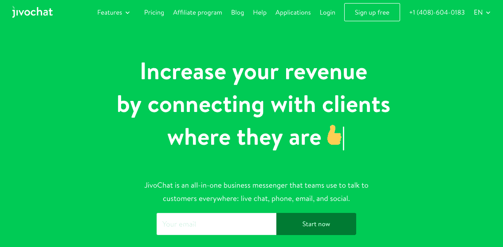
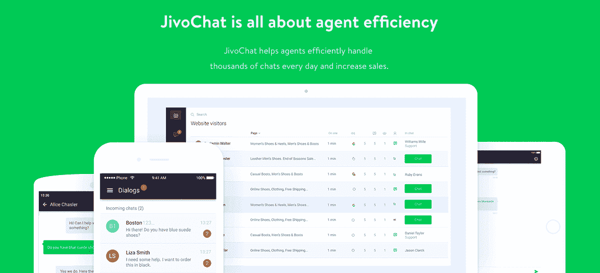
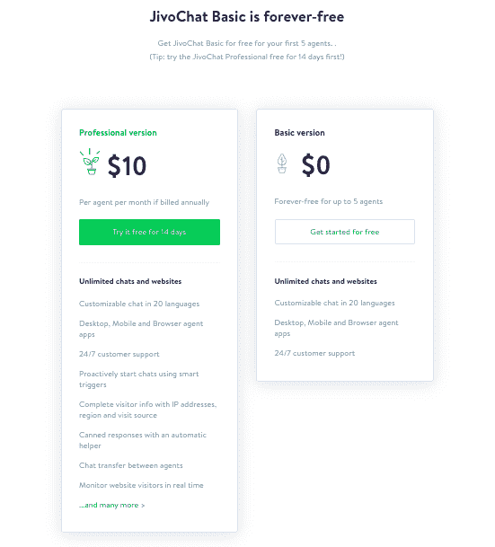

# 通过让我的产品自己说话，我的身价飙升至 750 万美元

> 原文：<https://www.indiehackers.com/interview/bootstrapping-to-7-5mm-by-letting-my-product-speak-for-itself-4784df3837>

## 你好！你的背景是什么，你在做什么？

你好。我叫帖木儿·瓦利舍夫，今年 34 岁，是 [JivoChat](https://www.jivochat.com/) 的创始人兼首席执行官。我来自俄罗斯的莫斯科，我现在住在那里。当我不在 JivoChat 工作时，我会花时间和我 3 岁的女儿和妻子在一起。

JivoChat 是一个全渠道商务信使。简而言之，Jivo 是一种软件服务，它通过各种不同的渠道组织与客户的通信。Jivo 的主要目标是帮助您将您的销售线索转化为客户，并通过聊天、电话、电子邮件以及您的客户可能希望用来联系您的企业的所有其他渠道提供最佳的客户服务体验。我们的客户从小型创业公司到中型企业都有。

目前，我们的 ARR 约为 750 万美元。JivoChat 安装在全球超过 260，000 个网站上，拥有超过 36，000 个付费客户端。我们从一个没有投资者的创业团队开始了这一切。

 

## 是什么促使你开始使用 JivoChat？

我之前在经营我的另一家公司，一家名为 Octoline 的虚拟 PBX 技术初创公司。我经营那家企业有几年了，但我们一直在努力转型。我在寻找建立品牌的方法，并寻找实时聊天工具。市场上没有任何真正好的产品适合我的团队:所有的产品要么太贵，要么太丑，或者两者兼而有之。作为一名工程师，我认为我可以做得更好。就在那时，我找到了我的老同学，开始一起开发一个实时聊天工具。

## 构建最初的产品需要什么？

一开始，我们的启动资金有限。我通过做大多数人会做的事情获得了我的第一个 10 个客户:从我的联系人列表中打电话。我让我的朋友和同事开始免费使用 JivoChat，然后我们就从那里开始了。后来我调查了 web 开发者论坛。当我参与在线社区时，我只是说，“嘿，伙计们。这里有一种新产品。如果你与我们合作，你可以获得 30%的经常性佣金。”剩下的就是历史了。

## 你是如何吸引用户并发展 JivoChat 的？

我们在 2011 年 12 月推出了 JivoChat，并在同一个月上线了我们的第一个客户。从那以后，我们一直保持着增长势头。我们的商业模式最大的好处是，每当有人与使用 JivoChat 的网站互动时，网站访问者可以与我们的聊天工具互动，看到其价值，并寻求购买它的方法。这种方法是我们增长的源泉，也是我们商业模式的基石。

当然，我们在前进的道路上经历了一些障碍。

首先，我们的定价与现在不同。我们的产品一度被分割成几块。如果你想使用特定的功能，你必须单独购买这些功能的访问权限——没有通用的软件包，如果你想要它们，你必须购买额外的功能。

这个分裂的组织是一个错误。我们需要在客户端体验的生命周期中多次转换客户端，而不是一次转换一个客户端。当我们转向只提供两种套餐的模式时，我们看到了收入的大幅增长:免费和付费。

我们还犯了一个错误，没有从第一天就雇佣销售人员。2013 年之前，我们的产品本质上是在卖自己。然而，在加入销售团队后，我们的转化率翻了一番。如果我们早一点做出这样的转变，我们可能早一点成功。

如果我能回到过去，我会告诉年轻的我，以及一般的新企业家，投资于我们自己。

TweetShare

我们的转化率在不同的渠道有很大的差异。例如，转换美国市场的活跃用户比转换拉丁美洲市场的活跃用户要困难得多(仍然不确定这是为什么)。在我们拓展的几个新市场(印度、非洲和东南亚)，我们有稳定的销售线索，但很难从这些市场的客户身上赚钱。有时也很难有效地转换来自脸书的流量。有时我们只为活跃注册支付更多，而忽略付费转化，因为这是以后创造有机增长过程的一部分。

流失也是一个挑战。我们的流失率是 45%，所以平均寿命超过两年。事实上，这在以中小型企业为目标的 SaaS 企业中被认为是一个不错的数字。我们流失率的问题是，企业刚刚关闭，我们对此无能为力。对我们来说，整合是应对客户流失最有效的方法之一。促进我们的产品与其他工具(如 CRM)的集成会直接影响产品的吸引力和“粘性”。

我认为我们做过的最好的决定是为一个轻量级的、易于使用的、能产生即时价值的产品运行一种商业模式。有了这种模式，你马上就会有人来找你使用你的产品。你可以免费使用它，直到你看到你会从使用付费版本中获得更多的价值。有一个明确的“啊哈”时刻，你会意识到投资 JivoChat Pro 的价值。这是我们无需投资就能增长的原因。这是一个完整而平衡的商业模式。2018 年，在没有任何投资者活动的情况下，我们的总收入为 620 万美元。

我的建议是:尝试找到一种平衡的商业模式，让你不用筹集任何资金就能创办一家公司。这样一来，投资者就不会给你带来更快增长的压力，你也就有更大的动力做出明智的支出选择。像那样的模型很有价值。

 

## 你的商业模式是什么，你是如何增加收入的？

我们采用免费增值模式。免费版最多可供五个用户无限期使用，但功能有限。一旦用户意识到 JivoChat 作为销售发电机的价值，他们就会选择最大化他们的成功并升级到 JivoChat Pro。

打折会带来比顾客更多的问题。

TweetShare

我们在不同的国家使用许多不同的支付系统，这取决于特定国家的规范和政府法规。信用卡在美国、巴西、亚洲等地很普遍。在巴西，信用卡支付需要得到政府的批准。在美国，有很多本地支付选择。

找到一个平衡的商业模式，使不需要筹集任何资金就可以创办公司。

TweetShare

2018 年，我们的总收入为 620 万美元，目前的运营率约为 750 万美元。我们每月获得约 100 万访客(60 万唯一访客)，每月产生约 2.8 万注册，其中约 1.4 万是有机的。其余的来自各种其他来源。大约有 22.6 万活跃企业在使用 JivoChat(一个企业可以在几个网站或其他渠道上使用我们的小工具)，36 万企业在为 JivoChat Pro 付费。

总的来说，我们的商业模式有六个参数，在过去的七年里，我们所有的数字都有所改善。

1.  入站注册数
2.  注册成为活跃用户的转化率
3.  从活跃用户到付费用户的转换
4.  流失(按该期间平均付费用户数的百分比计算)
5.  每个代理许可证的平均价格
6.  每个帐户的平均代理许可证数量

**入境注册人数**

2018 年，我们全年有 25 万人注册。我们在这一指标中看到的最大加速是来自有机渠道的注册增长，这主要是由我们通过口碑传播的免费增值模式产生的。之后，我们最重要的渠道是联盟计划和整合。

**转换率**

我们提高了从注册用户到活跃用户的转化率。这些数字因国家而异，从 50%到 80%不等。帮助我们提高转化率的一个有效技巧是，我们开始向人们提供在注册后立即测试聊天工具的选项。这极大地提高了我们从注册用户到活跃用户的转化率。

通过组建和培训一个高效的销售团队，我们平均有 12%的转化率从免费用户变为付费用户。有趣的事实:优秀销售人员从分配的销售线索到付费用户的转化率比一般队友高 50%。

**流失**

流失率有所改善。2013 年，它的流失率为 55%，现在每年约为 45%。客户的平均寿命是两年多一点。

我认为我们做的最重要的事情是投资与第三方软件的集成。我们注意到积极使用集成的客户流失率较低。

**每个许可证的平均价格和每个帐户的许可证数量**

我可以提供的一些建议是，你需要非常小心地提供折扣。打折会带来比顾客更多的问题。

在组建销售团队的同时，我聘请了一名外部顾问来促进发展。他的唯一目标是增加现金流，所以他雇佣了五到七个人，提高价格，同时增加折扣。他利用紧迫感让人们现在就付款——这种方法极大地增加了现金流。在最初的几个月里，我们的收入翻了一番。然而，在那之后，我们的收入有几个月没有增长。我们的承包商目前增加了我们的收入(通过提供大幅折扣)，但这是通过牺牲未来的收入来实现的。这可能是个错误——下次我不会这么咄咄逼人了。

 

## 有没有发现什么特别有帮助或者有优势的？

我发现，将想法、计划和其他一切放入列表和思维导图，然后保持这些列表整洁和相关的技能是有效决策和执行的关键。学会如何有效地使用像 Asana 和 Trello 这样的工具是非常重要的，因为它们会很快变得一团糟。

孙竹的《孙子兵法》很好地提醒了我们，商业就是在与市场、竞争对手和障碍的战斗中赢得金钱。有时候战斗是不对称的——你的敌人可能比你强大得多。但这并不意味着你不能赢。如果你有一个策略，一点勇气，一些资源，和熟练的军官，你可以成功。这激励了我。

如果我能回到过去，我会告诉年轻的我，以及一般的新企业家，投资于我们自己。

## 我们可以去哪里了解更多？

请查看 www.jivochat.com 的[，并在](https://www.jivochat.com/)[脸书](https://www.facebook.com/jivochat/)、[推特](https://twitter.com/JivoChat)、 [LinkedIn](https://www.linkedin.com/company/jivosite/?viewAsMember=true) 和 [Instagram](https://www.instagram.com/jivochat/) 上找到我们。

如果你有任何问题，请在评论区告诉我！

——[<picture id="ember8043909" class="user-avatar ember-view user-link__avatar"></picture>帖木儿](/TimValishev?id=J74wiOziA3UU9LQU7drApFtvOL23)，吉沃沙特创始人

## 想像 JivoChat 一样建立自己的事业？

你应该加入独立黑客社区！🤗

我们是几千名创始人，互相帮助建立有利可图的业务和副业。来分享你正在做的事情，并从你的同事那里获得反馈。

还没准备好开始使用你的产品吗？没问题。这个社区是一个认识人、学习和实践的好地方。随意[随便浏览](/)！

——[<picture id="ember8043914" class="user-avatar ember-view user-link__avatar"></picture>柯特兰艾伦](/csallen?id=ibTLPyjwVebnZjMGKvz6ztarnuV2)，独立黑客创始人

26votes