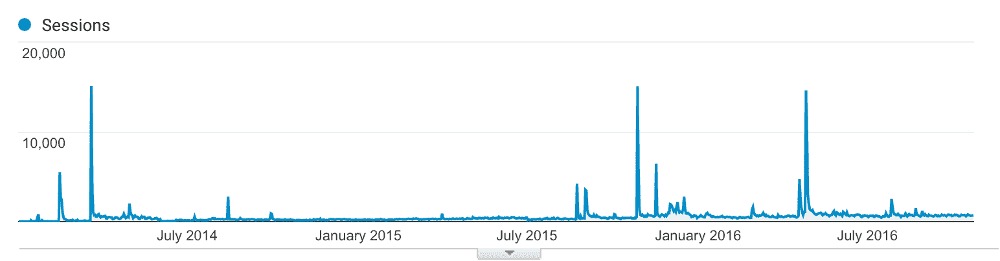

# 从悬崖边上跳回来，第一周就赚了 1000 美元

> 原文：<https://www.indiehackers.com/interview/bouncing-back-from-the-brink-to-make-1000-in-my-first-week-1518bbd0b7>

## 告诉我们关于你自己和你正在做的事情。

嗨，我是克里斯陈。我创建了[Instapainting.com](https://www.instapainting.com/?utm_source=indie-hackers&utm_medium=sponsorship&utm_campaign=sponsored-interview)，这是一个[照片转绘画](https://www.instapainting.com)服务，可以让你把上传的照片变成现实生活中艺术家的手绘作品。

前两年，我完全靠挣得的收入运营，赚了大约 3 万到 5 万美元的利润来支持自己和公司(在昂贵的旧金山，不算少)。现在，这项业务已经进入第三年，年收入超过 40 万美元。我还是自举。

## 你是怎么开始 Instapainting 的？

2011 年冬天，我在一个社交音乐网站做 solo 创始人，这个网站是 Last.fm 的克隆版。我刚从大学休学六个月，还没有回去完成。(我只完成了物理专业的三个学期。)我靠着从 YC 筹集的资金以及我的各种想法和支点生存了大约三年。

后来我没钱了。

幸运的是，此时我已经测试了越来越多偏离“社交音乐”的随机想法，并且我已经非常擅长抛出 MVP。我有一个朋友从中国买画，然后在美国卖，她想让我为她建一个网站，卖艺术复制品。相反，我在 2014 年 1 月推出了 [Instapainting](https://www.instapainting.com/?utm_source=indie-hackers&utm_medium=sponsorship&utm_campaign=sponsored-interview) 。

最初的原型是一个简单的单页网站，允许客户上传他们想要的任何照片，通过 Stripe 收集他们的支付信息，并解释说他们照片的真正手工油画将在两周内邮寄给他们。最困难的部分实际上是传达它不只是一些打印或照片过滤器，这是我今天仍然有困难的事情。

此时，我负债大约 4000 美元，所以我*有*来建立单页网站来募集资金。我只用了几天就创建、测试并发布了它。我在 Reddit 上发布了页面[，在两周内，我的销售额超过了 2000 美元。从一个典型的失败的硅谷创业公司变成一个从第一天起就有积极收入的公司，这真的令人耳目一新。](https://www.reddit.com/r/startups/comments/1vtham/im_softlaunching_here_my_app_that_turns_pictures/)

在那之后，我开始试图获得真正的艺术家，但我没有这样做。最终，我雇佣了一些当地的艺术家朋友来帮助绘制订单。总利润结果略呈负值，但这证明这个想法是可行的。接下来的步骤是提高利润率，制造更大的轰动。几周后，我在 TechCrunch 上推出了[，并在接下来的三个月里获得了超过 3 万美元的收入。](https://techcrunch.com/2014/02/14/instapainting-turns-your-photos-into-hand-painted-oil-paintings-on-the-cheap/)

## 你是如何雇佣艺术家并让商业模式运转起来的？

我的朋友向我介绍了从中国雇佣艺术家并在美国销售画作的概念，她甚至向我推荐了她正在使用的一家供应商。虽然在找到真正的艺术家之前，我确实完成了最初的销售，但事实证明，收购艺术家远不是这个行业最难的部分。

发布后不久，许多艺术家联系我，大多来自中国(他们已经渗透到其他市场，如易贝、阿里巴巴和 Etsy)。第一批订单是收支平衡，但一旦市场价格的艺术家与我们联系，我知道这将是有利可图的。问题是如何保持销量，如何扩大销量。

最初 [Instapainting](https://www.instapainting.com/?utm_source=indie-hackers&utm_medium=sponsorship&utm_campaign=sponsored-interview) 是一个单页网站，有一个条纹结账表格，订单被人工分发给艺术家。今天，它在很大程度上仍然以这种方式出现在访问者面前，但在幕后，它是一个全自动的市场系统。

我们平台上的艺术家和卖家直接与客户沟通，处理客户服务问题、项目更新和发货状态跟踪。双向反馈评级用于自动质量控制，竞价算法用于为每个项目选择理想的艺术家。随着时间的推移，我逐渐调整了软件，使每一个过程都实现了自动化，一般来说，我只需要在极少数高层次纠纷的情况下介入。

## 你的技术是什么？

我用过 PHP、Node.js、Mongo 和 React.js，堆栈主要由微服务组成，这对于允许我(唯一的开发人员)将网站迁移到新技术至关重要。

## 你做了什么来发展和营销 Instapainting？

我想我花了大约 5-6 个月的时间才意识到这项业务主要是靠 SEO 流量维持的。一个朋友注意到了我正在做的事情，并给了我一些 SEO 建议，这些建议有一些非常明显的积极效果。(他后来将自己的咨询公司变成了一家名为 [Rank Science](http://www.ranksci.com) 的 SEO 初创公司。)从那时起，我开始重点关注 SEO。

在我创业的第二年，我获得了这种方法的全部好处，当时我在谷歌上的热门搜索词中排名第一。我事先没有太多的 SEO 经验，但我利用我在黑客新闻上的经验推出了对 SEO 至关重要的内容营销文章。例如:

*   我在两周内[造了一个机器人，它可以自主复制黑白的艺术家画作](https://www.instapainting.com/blog/research/2015/08/23/ai-painter?utm_source=indie-hackers&utm_medium=sponsorship&utm_campaign=sponsored-interview)，后来又复制彩色的。
*   我以艺术风格的神经算法发布了第一个免费使用的在线算法演示[，我相信是在论文](https://www.instapainting.com/ai-painter?utm_source=indie-hackers&utm_medium=sponsorship&utm_campaign=sponsored-interview)发布后的 3-4 天[。](https://arxiv.org/abs/1508.06576)
*   我发布了一篇文章，详细介绍了我在中国参观艺术家和艺术工厂时看到的一些事情，这篇文章被 Ev Williams 阅读，在 Backchannel 上重新发布，总浏览量超过 71k。
*   当 2048 游戏出来的时候，我很快破解了一个 2 人版本的游戏，并把它放在了 Instapainting.com 的域名下。
*   由于懒惰，我给我之前做的机器人挤奶，然后[把它连接到 Twitch.tv](https://www.instapainting.com/twitch-paints?utm_source=indie-hackers&utm_medium=sponsorship&utm_campaign=sponsored-interview) ，人们可以控制它合作绘画。

大多数这些东西的流量都比 Instapainting 主页收到的流量多几个数量级，而且它们通常会在之后持续保持一定的流量增长。但最重要的是，这些努力带来了来自 Intel.com、Wired.com、TechCrunch、Engadget 等知名网站的大量入站链接。

几乎所有这些举措都是从制作黑客新闻的头版开始的，然后他们会获得更多的报道，这将促进 SEO，即使报道本身不会转化为订单:

*   Twitch paints — [109 票支持 HN](https://news.ycombinator.com/item?id=10581735)
*   走进中国的美术工厂—[HN 获得 252 张赞成票](https://news.ycombinator.com/item?id=10466676)
*   神经算法演示— [75 票支持 HN](https://news.ycombinator.com/item?id=10162121)
*   机器人画家——73 票支持 HN
*   2x2048 — [71 票支持 HN](https://news.ycombinator.com/item?id=7436785)

这些巨大的峰值是由于内容营销计划。你可以看到，在这些高峰之后，交通状况得到了永久性的改善。这是由于谷歌搜索排名的提高。

## 你的收支背后有什么故事？

在第一天，这个网站只是一个嵌入在单个页面上的条纹结帐表单。我之前提到过，在 Reddit 上发布后，它立即开始每周销售 1000 美元。

这项业务在大约 2 个月后开始盈利，这也是 TechCrunch 真正推出的时间。盈利，我的意思是它能够支付我的生活费用。在那之前，我一直在努力实现收支平衡。它承受不起太多的损失，因为支点的全部意义在于避免(个人)破产。

如今 [Instapainting](https://www.instapainting.com/?utm_source=indie-hackers&utm_medium=sponsorship&utm_campaign=sponsored-interview) 每年的收入约为 40 万美元。因为我和公司有着千丝万缕的联系，所以这是个人和公司共享的收入。这高于第一年的收入，第一年的收入只有 89-90，000 美元。增长的主要驱动力是来自内容营销的改进的 SEO。

随着 SEO 收入的增加，我在幕后引入了一个市场竞价系统，并雇佣了越来越多的艺术家，从而降低了成本。我还通过实现业务各方面的自动化，减少了我在日常运营中花费的时间。起初，我是手动分配订单和管理艺术家，但今天我有了一个完全自动化的系统，通过双向评论和客户与艺术家之间的直接沟通来实施。

除了我，没有人在工资单上。这个平台的全部意义在于，许多独立的供应商和艺术家可以来到这个网站，提供他们的服务，而不需要太多的开销。雇佣员工将是一项开销，只有当我们的增长速度比现在快得多的时候才有必要。

## 如果你能回到过去，你会做些什么不同的事情？

最初，我最大的恐惧是 TechCrunch 发布后预期的“悲伤低谷”。挑战立即变成了如何持久地提高增长。一旦网站开始做得很好，我就会转移我的注意力，试着扩展到其他的东西，通常是与主要产品有太多的不同。这些结果证明大多是浪费时间。

我要做的另一件不同的事情是，我会更早地将我的时间和资源投入到 SEO 中。我花了 6 个多月的时间才意识到，为什么在 TechCrunch 文章的保质期到期后，我们还在销售。

我也会花更少的时间关注竞争对手。我浪费时间和金钱测试谷歌广告，也匹配功能和复制我的竞争对手的网站。最终它们都不是因素，因为唯一重要的是我们的谷歌排名。

## 帮助你成功的最关键因素是什么？

对我来说，SEO。我承认 SEO 并不适用于所有类型的公司，但它可能是大多数创业公司成功的原因。除非你没有竞争对手，或者你只通过一些其他渠道传播，如口碑或应用程序商店，那么搜索引擎优化是你被发现的主要方式。

一个试金石就是问问你自己，你是否有两个以上的竞争对手。如果你这样做了，那么这是一个很好的迹象，你应该专注于搜索引擎优化，因为一些高得离谱的百分比的人默认使用谷歌的第一个结果。这不仅仅意味着为搜索引擎优化你的网站。这意味着获得宣传，让谷歌认识到你应该有最多的想法，并把你放在搜索结果的顶端。

## 你对打算自己当老板的黑客有什么建议？

对于 Instapainting 来说，最重要的事情就是让 T2 以最快、最易测试的方式去做。而且，随着时间和销售的进展，一个很大的帮助是能够设计和自动化系统，这样我就有更多的空闲时间致力于新功能和新的销售策略。

我给别人的建议是:你的想法不一定要有几十万或者几百万的资金才能实现。如果是这样的话，那么如果你还没有那么多钱的话，这可能是一个错误的想法。你的想法甚至不需要几个月或几年就能实现。它可以像附在支付表格上的一些简单命题一样简单。如果你没有一个简单的建议，去寻找一个非技术创收业务，并帮助他们的技术战略。

## 我们可以去哪里了解更多？

查看我在 [Instapainting 博客](https://www.instapainting.com/blog?utm_source=indie-hackers&utm_medium=sponsorship&utm_campaign=sponsored-interview)上的帖子，或者在下面的评论中给我留下问题，我会尽量回复你。

—[<picture id="ember8065726" class="user-avatar ember-view user-link__avatar"></picture>Chris Chen](/chrischen?id=BUmq1YeTHcPFITNSroX6xVwXqbf1)

## 想像 Instapainting 一样建立自己的事业？

你应该加入独立黑客社区！🤗

我们是几千名创始人，互相帮助建立有利可图的业务和副业。来分享你正在做的事情，并从你的同事那里获得反馈。

还没准备好开始使用你的产品吗？没问题。这个社区是一个认识人、学习和实践的好地方。随意[随便浏览](/)！

——[<picture id="ember8065731" class="user-avatar ember-view user-link__avatar"></picture>柯特兰艾伦](/csallen?id=ibTLPyjwVebnZjMGKvz6ztarnuV2)，独立黑客创始人

25votes