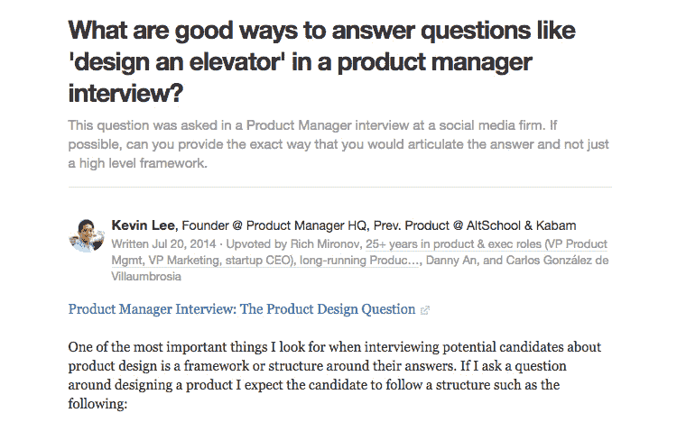
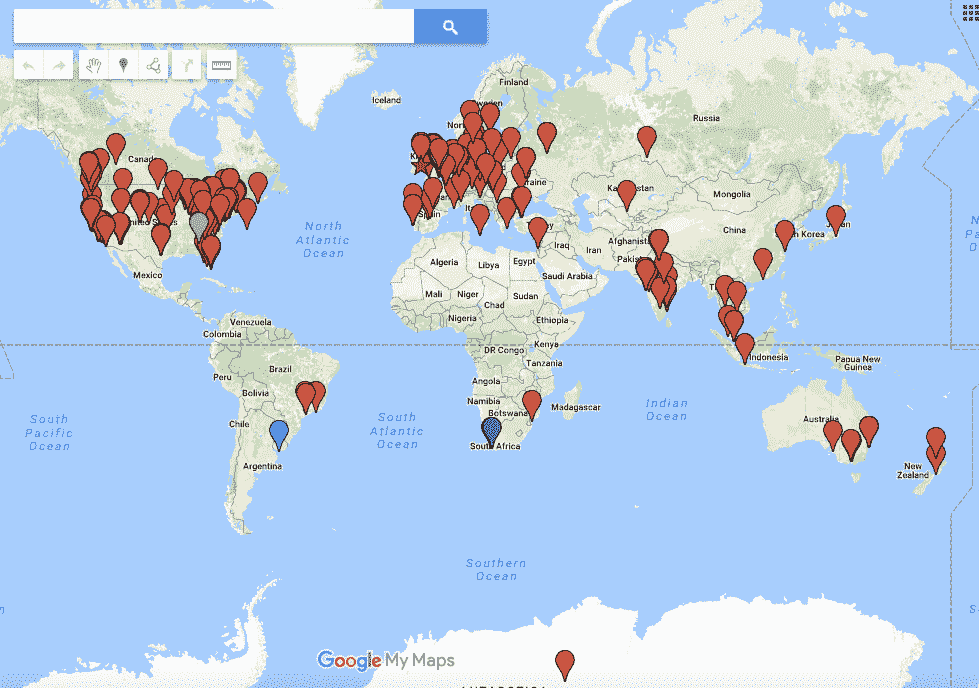
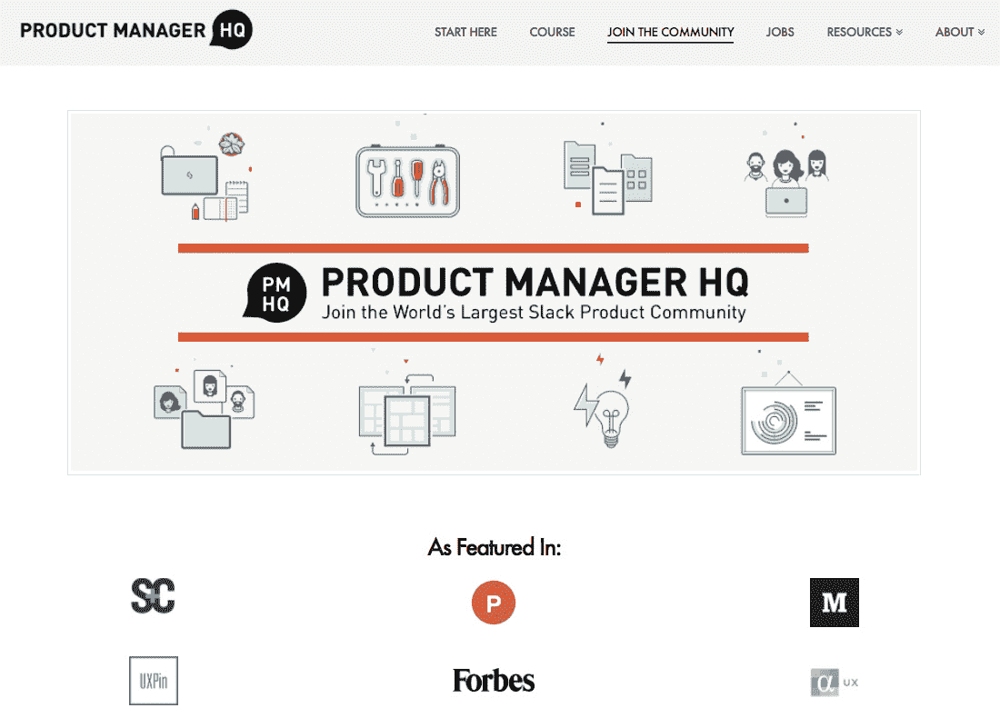
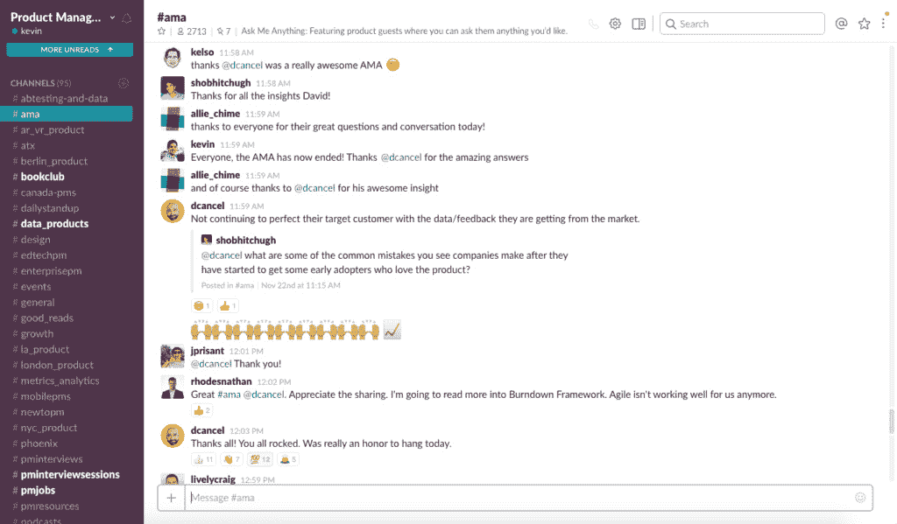
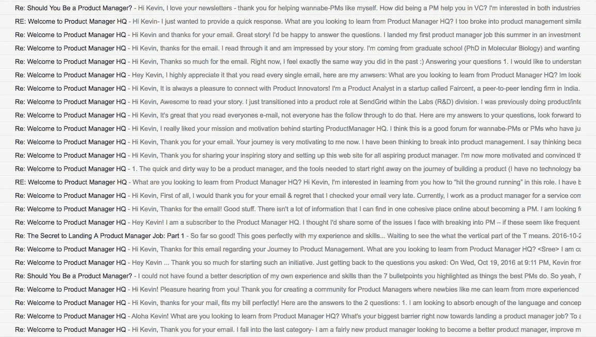
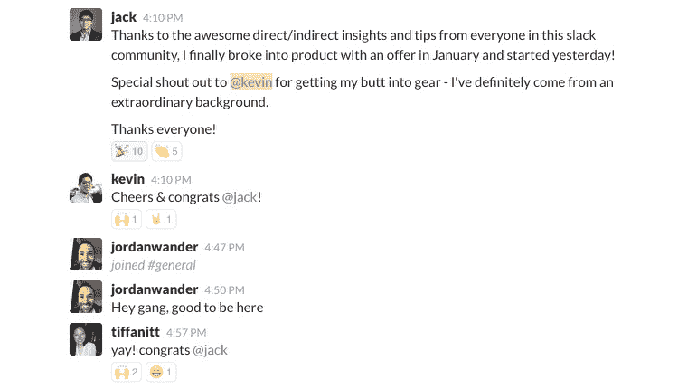

# 打入产品管理，建立社区资源

> 原文：<https://www.indiehackers.com/interview/breaking-into-product-management-and-building-a-community-resource-9bd13ebda6>

## 嗨凯文！告诉我们你的背景和产品经理总部。

嘿，我是李凯文。我创建并运营了[产品经理总部](https://www.productmanagerhq.com/?ref=www.indiehackers.com)，这是一个学习如何进入产品管理的网站。我之所以开始这项业务，是因为我厌倦了这个行业资源的匮乏，此前我在投资银行的第一份职业生涯中，努力奋斗并最终成功打入了产品管理领域。

[产品经理总部](https://www.productmanagerhq.com/?ref=www.indiehackers.com)是一个相当简单的内容/媒体业务，目前由 4 个部分组成:免费的网站文章，免费的每周时事通讯和热门产品阅读，付费会员 [Slack 社区](https://www.productmanagerhq.com/join-the-community/?ref=www.indiehackers.com)(Slack 上世界上第一个&最大的产品社区)，拥有来自世界各地 500 多家公司的数千名会员，以及名为 [One Week PM](http://www.oneweekpm.com/?ref=www.indiehackers.com) 的付费在线课程，教授产品管理的基础知识。

这项业务大约有 2.5 年的历史，已经帮助成千上万的人进入或提高了他们进入产品管理的机会。产品经理 HQ 在[福布斯](http://www.forbes.com/sites/tomaslaurinavicius/2016/03/17/slack-communities-for-tech-entrepreneurs/2/#207d87291e70)(作为科技企业家/产品人员的顶级 Slack 社区)、[闯入初创公司播客](http://breakingintostartups.com/kevin-lee-product-manager-hq/?ref=www.indiehackers.com)(企业家杂志的 24 大企业家播客)以及 [2014/2015 年度产品管理最具影响力人物](http://pmyearinreview.com/?ref=www.indiehackers.com)中被广泛报道。

我最近在 Pear Ventures 担任了一个新的角色，投资早期 pre-seed/seed/A 轮创始人，所以我大大减少了我的时间，每周大约花 1-2 个小时在这项业务上，每年产生大约 7.5-10 万美元的收入。

这项业务完全是以最低的维护成本和没有付费营销的方式启动的——唯一的主要成本是一名社区经理，我最近聘请他来帮助完成一些任务。

## 是什么促使你开始使用产品经理总部？你最初的目标是什么？你是怎么想出这个主意的？

我就读于加州大学伯克利分校，毕业于工商管理专业，技术背景非常有限。我大学毕业后的第一份工作是在技术投资银行，每周工作 100-120 个小时。

在工作了几个月后，我意识到，虽然我加入团队是为了更多地了解科技行业，但我渴望更直接地参与到产品制造中。

有一天我在浏览我最喜欢的网站之一 Quora，偶然发现了产品管理这个话题。我开始痴迷地消费任何我能找到的关于产品管理的信息，但没有任何中心资源，我发现自己试图将多个博客、文章、书籍和在线课程中的零碎信息拼凑在一起。

甚至当我发邮件给业内的产品经理并进行信息采访时，他们也没有人能推荐任何学习产品管理的中心资源！就好像每个人都以完全相同的分散方式经历了学习产品管理的旅程，每个人都忽略了房间里的这头大象，因为缺少学习产品管理和进入行业的有凝聚力的指南或资源。

我花了几个月的时间经历了多轮产品管理面试，但我最终获得了我的第一份产品经理职位，并进行了职业转换。

在我担任新产品角色几个月后，我决定回馈给那些了不起的 Quorans，他们在我自己找工作时给了我很多建议。我开始为产品管理主题写作，随着时间的推移，Quora 和 LinkedIn 上的人开始给我发短信或电子邮件，问我是否可以一起喝杯咖啡，并给他们一些关于闯入产品管理的建议。

起初，我尽可能多地参加当地的咖啡会议，但随着时间的推移，这些要求变得势不可挡，我意识到一天中没有足够的时间来帮助每个人。为了缓解这个问题，我为[产品经理 HQ](https://www.productmanagerhq.com/?ref=www.indiehackers.com) 买了域名，安装了我能找到的第一个看起来不错的 WordPress 主题，拼凑了一个看起来很糟糕的 logo(后来被重新设计了)，并开始写文章总结这些咖啡会议期间不断出现的最常见的话题。

当人们给我发邮件时，我开始给他们发送这些文章的链接，同时向他们道歉，让他们知道文章中的内容是我本来会在面对面的咖啡会议上告诉他们的。

## 所以事情开始于文章和信息的收集。你是怎么把这个网站变成一个社区的？

成立[产品经理总部](https://www.productmanagerhq.com/?ref=www.indiehackers.com)六个月后，我获得了缓慢而稳定的流量，但除了时不时发表一些文章，我并没有花更多时间来建设网站。

与此同时，在我担任产品经理期间，我一直注意到一些反复出现的棘手问题。首先，我注意到产品经理的工作有多孤独(在大多数公司，典型的产品经理与工程师的比例可能是 1:8 或 1:10)，以及我如何经常渴望更多实时的同行反馈，以便我可以知道我做得对或错。其次，我注意到有经验的产品经理不断宣扬“寻找产品导师”的重要性，但我很难在公司内部找到一个。

在谷歌上搜索了一番后，我发现了一些稀疏的聚会，但没什么特别的。我渴望一个真正的社区，在那里我可以和其他公司的项目经理聊天，或者找到一个产品导师，即使他/她远在世界的另一端。

所有这些都发生在 2013 年左右，幸运的是，一家名为 Slack 的有趣公司刚刚在 2012 年关闭了其最初的 MMORPG 游戏，转向了实时协作平台(我们今天知道的 Slack)。我一开始使用 Slack 平台就爱上了它，并意识到这将是一个运营直播社区的惊人媒介。剩下的就是历史了。

## 你自己不是程序员。你是如何着手建立和管理你的网站的？

从大学早期开始，我就努力锻炼我的“肌肉”，我早期的 8-10 个“失败”项目也是简单的 WordPress 网站，我只是用很少或没有编程知识一起黑出来的。通过大量的反复试验，我意识到你可以用 WordPress 和许多第三方插件为大多数想法(尤其是内容密集型业务)拼凑出一个相当不错的 MVP。

我使用的工具:

*   **[WordPress](https://wordpress.org) +一大堆插件**:网站(一点 HTML / CSS / PHP 就够了)
*   **[Bluehost](https://www.bluehost.com/track/indiehackers/product-manager-hq)** :域名/服务器托管
*   **[ConvertKit](http://mbsy.co/glPSt)** :电子邮件序列+时事通讯+管理订阅者(对内森·巴里大喊)
*   **[可教](http://www.teachable.com)** :主持在线课程— [一周下午](http://www.oneweekpm.com/?ref=www.indiehackers.com)(大喊到 Ankur Nagpal)
*   **[SumoMe](http://www.sumome.com)** :社交分享+将读者转化为订阅者
*   **[贾斯廷·杰克逊的网站](https://justinjackson.ca/)** :阅读寻找灵感因为他的文字第一次启发了我开始在网上销售数码产品(对贾斯廷·杰克逊大声喊出来)
*   **[扎皮尔](https://www.zapier.com)** :自动使它看起来像是有一个团队在幕后，而实际上只有我一个人
*   **[Gumroad](https://www.gumroad.com)** :支付
*   **[Paypal](https://www.paypal.com)** :开票赞助商
*   :管理任务和我的“路线图”
*   **[Google Drive](https://drive.google.com)** :通用组织
*   **[素描](https://www.sketchapp.com)** :假扮设计师(幸运的是，我的[女友](http://www.josiebiteng.com/?ref=www.indiehackers.com)是一位才华横溢的设计师，她慷慨地借给我一些时间来帮助重做网站的大部分内容)

## 随着时间的推移，你是如何发展产品经理总部的，你做了什么来吸引用户加入社区？

我要第一个承认，在过去的几年里，我在增加网站流量方面并不是绝对的最佳，所以我没有最引人注目的数字来炫耀。

最初，我通过回答产品管理方面的问题，并在适当的时候链接回我的网站，从 Quora 获得了 99%的网站流量。几年前，Quora 是开放的西部荒野，他们如此关注核心用户的增长，以至于你可以在你写的每一个回答中链接回你的网站。Quora 此后对回答中的外部链接变得极其严格，他们的内容审核机器人非常擅长标记公然的垃圾回答，因此它不再是过去的增长渠道。

[产品经理 HQ](https://www.productmanagerhq.com/?ref=www.indiehackers.com) 已经明显脱离了 Quora，现在大部分流量来自 SEO(每月约 12-15k 有机独立用户)。在过去的一年里，产品经理 HQ 还有幸登上了许多著名的出版物，如《福布斯》,现在有了相当多的反向链接。

至于[产品经理 HQ 社区](https://www.productmanagerhq.com/join-the-community/?ref=www.indiehackers.com)，当我第一次在 Slack 上创建它时，它是免费加入的，我和产品经理朋友一起播种了最初的 10-20 个成员。我希望我能告诉你一些惊人的“独立黑客”，我用它来进行大规模病毒式传播，但老实说，所有的有机增长都来自良好的老式社区建设。

**0-200 名成员:**

在早期，我会给每个成员发 DM(直接消息),开始和他们交流，了解他们在做什么产品。在人们加入社区必须填写的表单和我用来存储每个成员信息的迷你谷歌电子表格 CRM 之间，我有一个很好的心理地图，知道我应该和谁联系。

我把最初的社区建设比作参加鸡尾酒会的经历。想想你一个人去参加聚会，笨拙地试图进入一个谈话圈的时候——坦白地说，那种经历很糟糕。现在对比一下鸡尾酒会，你的一个朋友认识每个人，把你拉到圈子里，同时说“嗨，大家好，你们见过我的朋友 _ _ _ _ _ _ _ _ _ _ _ 吗？”这是一种更舒适的体验，你可能会玩得更开心。

如果一个成员告诉我他/她在 PM 一个企业 SaaS 产品时遇到的问题，我会找到另一个从事类似产品的成员，将他们相互介绍，并请他们在公共渠道谈论他们的问题，以便其他人可以从他们的谈话中学习。为了帮助启动对话并吸引潜在客户，我在公共渠道中植入了一些问题(例如，“这里有人尝试过任何产品路线图工具吗？你最喜欢的是什么？”)每一天。

**200-1000 名成员:**

在大约 200-400 名成员时，我开始看到更多的口碑增长，因为成员们开始推荐业内的朋友和同事加入社区，对话开始在没有我太多投入的情况下每天有机地发生。

 

亲自欢迎社区中的每一个新成员变得有点势不可挡(特别是因为当我可能正在睡觉时，人们从不同的时区加入)，所以我开始使用 Zapier 和 Slack integrations / bots 等工具来获取更复杂和自动化的入职消息。

为了帮助社区参与，我还联系了一些每天聊天的“超级用户”成员，询问他们是否有兴趣成为社区版主。我为这些版主创建了一个私人小组，设置了一些简单的指导原则，并相信他们可以帮助参与社区，并让我知道任何“不良行为”，即垃圾邮件发送者或招聘者。

作为一个习惯于自己做所有事情的 solopreneur，建立这个版主小组对我来说是最重要的课程之一，因为我学会了放手/不要试图自己做所有事情，并在社区中分配责任。

**1000+会员:**

在大约 1000 名会员时，我开始注意到一个趋势，即超过 90%的新会员在最初几周之后就会流失(Slack 每周提供一份报告，说明哪些会员变得“不活跃”)。这很大一部分是因为加入是免费的，所以很多人出于好奇加入，不久后就离开了。我怀疑这种趋势也在发生，因为社区现在已经足够大，每天都有对话发生，对于那些一开始从未打算认真参与的新成员来说，它可能很快变得势不可挡。

为了抵消这一点，我用一个新的登录页面/ Gumroad 插件替换了我的字体，并开始收取 25 美元的一次性终身会员费，以淘汰不活跃的人和不认真参与社区的人。在建立付费墙之后，客户流失趋势完全逆转。

 

为了证明 25 美元的一次性费用是合理的，我确保包括大量的好处，例如与产品负责人建立双月 ama(问我任何问题),以及与产品会议/活动合作，为社区成员谈判大折扣。从那以后，这个社区就有了 AMAs 和业内知名的产品人，包括肯·诺顿(谷歌风投的产品合作伙伴)、普尼特·索尼(Flipkart 的前首席产品官)、亚历山德拉·卡沃拉科斯(Muse 的联合创始人)、大卫·坎塞(Drift 的首席执行官)和埃伦·千纱(Lola 的产品副总裁)等等。

 

迄今为止，[社区](https://www.productmanagerhq.com/join-the-community/?ref=www.indiehackers.com)已经有机地发展到大约 2900 名产品人员，他们来自世界各地的公司，如谷歌、脸书、LinkedIn、Slack、Airbnb、Pinterest、Twitter、微软和 500 多家其他公司。

世界各地的面对面聚会都是通过社区中的初步互动有机地发生的，我们上次在三藩市的聚会(本来应该是与一小群 PMHQ 成员举行的)在脸书火了起来，并吸引了 200 名有抱负的/现任的 pm 来填补当地的一个酒吧。像 Intuit 这样的大型企业甚至已经将他们的 200 多个全球项目经理组织加入到社区中，并继续每年加入新的项目经理团队。

## 你从 PMHQ 赚了多少钱，有哪些不同的收入来源？

收入目前在每年 7.5 万美元到 10 万美元之间波动——可能倾向于这个范围的低端，因为我最近没有花太多时间在营销或公关上。幸运的是，我现在每天都有足够的 SEO 流量和稳定的转化率，所以我可以预测一个相当稳定的基线收入额。

收入通常分为:

*   **[一次性社区会员费](https://www.productmanagerhq.com/join-the-community/?ref=www.indiehackers.com)** : 50%
*   **[一周 PM 课程](http://www.oneweekpm.com/?ref=www.indiehackers.com)** : 40%
*   简讯赞助商/赞助职位列表:10%

成本非常低，所以利润相当高。我为某些工具(在之前的问题中列出)支付了经常性的订阅费，最近还雇佣了一名社区经理来帮助完成一些任务。

## 到目前为止，你学到的最大的教训是什么？如果你必须重新开始，你会做什么不同的事？

*讲故事是关键。*

> “我们都喜欢故事。我们为他们而生。故事肯定了我们是谁。我们都想肯定我们的生活有意义。没有什么比我们通过故事联系在一起更能证明这一点了。”——安德鲁·斯坦顿，皮克斯的导演兼编剧

第一年，我对每个新用户都有一个非常标准/枯燥的电子邮件流程，这在任何方面都很无聊，因为我认为我很“专业”。

与此同时，在我的个人生活中，我一直注意到，如果我喜欢一个产品或服务背后的创始故事，我就会倾向于采用它(不管它与竞争产品相比有多好)。

一个最好的例子是，当我被 ConvertKit 背后的创始人故事深深吸引，决定取消 MailChimp，转而使用 ConvertKit，尽管 ConvertKit 当时缺少一些核心功能。(自那以后，它达到了相对平等，并在许多其他方面超过了 MailChimp。)

我决定彻底改变我的点滴顺序，在新订户收到的第一封电子邮件中加入一个关于我自己努力转型为产品管理的个人故事。通过把与新订户的第一次接触视为一个脆弱和讲述我的故事的机会，我建立了即时的融洽/信任，新订户更有可能回复我的电子邮件中的问题，并告诉他们的朋友订阅。

由于我做出的这一改变，7%的新订户会花时间回复我的电子邮件点滴序列，告诉我他们自己的故事，并回答我在电子邮件中提出的每个问题，这提供了极其宝贵的定性反馈，以完善我的网站内容和产品。

## 在你的旅途中，什么对你最有帮助？你认为你最大的优点是什么？

我坚信保持独立项目的动力需要“小胜利”除非你有极端的纪律性和内在动力(这是你应该 100%努力去拥有的！)，久而久之真的很容易失去干劲。在你的旅程中，最有帮助的优势之一就是庆祝小小的胜利。

对我来说，小的收获是看到了过去几年中会员发给我的数百条个人信息，表达了对他们从社区中获得的价值的感谢。我已经数不清有多少人从社区找到了工作。(我尽量把这些时刻的截图保存在我桌面上一个名为“为什么这很重要”的文件夹里。)

 

## 你对有抱负的独立黑客有什么建议？

阅读并消化这句话(我把它写在我显示器上方的便利贴上):

> “一旦你发现一个简单的事实，生活可以变得更加广阔，那就是你周围的一切你称之为“生活”的东西都是由不比你聪明的人组成的。你可以改变它，你可以影响它，你可以建立你自己的东西，其他人可以使用。一旦你明白了这一点，你就再也不会和以前一样了。”

## 我们可以去哪里了解更多？

产品经理总部:

*   [ProductManagerHQ.com](https://www.productmanagerhq.com/?ref=www.indiehackers.com)
*   [脸书](https://www.facebook.com/ProductManagerHQ/)
*   [@prodmanagerhq](https://twitter.com/prodmanagerhq) (推特)

个人:

*   [领英](https://www.linkedin.com/in/kevinleeme)
*   [@kevinleeme](https://twitter.com/kevinleeme) (推特)
*   [Quora](https://www.quora.com/profile/Kevin-Lee-8)

请在下面的评论中给我留下问题，我会尽快回复你的！

—[<picture id="ember5303086" class="user-avatar ember-view user-link__avatar"></picture>李凯文](/kevinleeme?id=W12EEDOpmyTvC5FHgg8OJe1BjoE3)，产品经理 HQ 的创建者

## 想像产品经理 HQ 一样建立自己的事业？

你应该加入[独立黑客社区](/)！🤗

我们是几千名创始人，互相帮助建立有利可图的业务和副业。来分享你正在做的事情，并从你的同事那里获得反馈。

还没准备好开始使用你的产品吗？没问题。这个社区是一个认识人、学习和实践的好地方。随意[随便浏览](/)！

——[<picture id="ember5303091" class="user-avatar ember-view user-link__avatar"></picture>考特兰艾伦](/csallen?id=ibTLPyjwVebnZjMGKvz6ztarnuV2)，独立黑客创始人

6votes