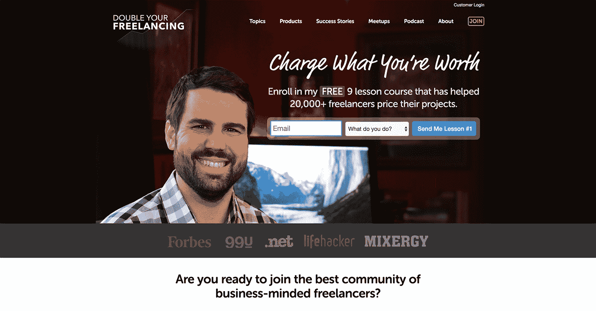
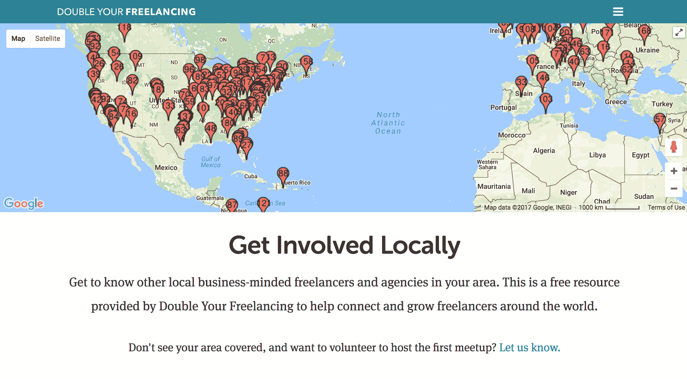
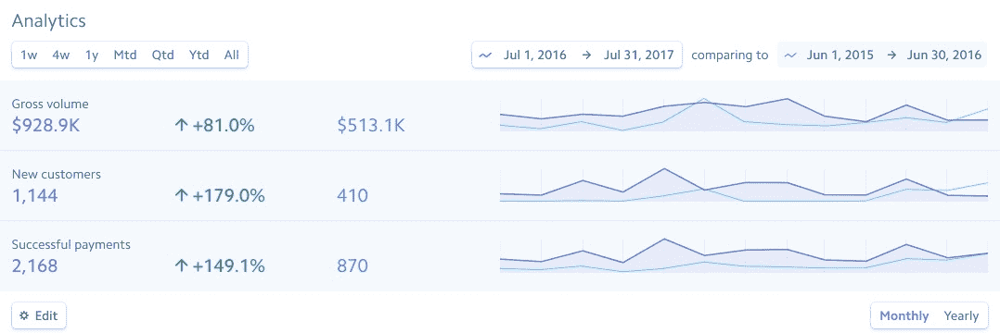

# 布伦南·邓恩寻求在没有观众的情况下推销 SaaS

> 原文：<https://www.indiehackers.com/interview/brennan-dunns-quest-to-sell-saas-without-an-audience-2546708e46>

## 你好！你的背景是什么，你在做什么？

嘿！我是布伦南·邓恩。我是[Double Your freelance](https://doubleyourfreelancing.com)的创始人，我住在弗吉尼亚州的诺福克。

早在 2008 年，我创办了一家网络开发机构，几年后，我决定“逃离”咨询业，进入 SaaS。2011 年末，我推出了 [Planscope](https://planscope.io) ，这是一款面向自由职业者和代理机构的项目管理工具。而且，像许多在线企业一样，我决定开始写关于自由职业的所有事情的博客，希望这会给我带来更多的 Planscope 客户。

成功了。但是效果有点太好了。我的每周文章很快变成了一本书，后来变成了一门课程，一个播客，另外几门课程，一个北美和欧洲会议，以及 Double Your 自由职业者社区的 40，000+活跃成员。

2016 年初，我卖掉了 Planscope，这样我就可以全职专注于让你的自由职业生涯翻倍，今年的平均月销售额约为 78，000 美元。

 

## 是什么促使你开始加倍从事自由职业？

推销项目管理 SaaS 很难。真的很难。

建造它是容易的部分。毕竟，我的代理公司为我们的客户专业地开发网络应用。

但实际上*让人们找到产品并尝试它……*这被证明是一个挑战。

所以我开始写我自己发展代理公司的经历。我分享了我在获得客户、服务定价、甚至发展团队方面的经验。我的假设是，有很多人向谷歌询问“我向我的客户收取多少费用？”，而向谷歌寻求项目管理软件推荐的相对较少。

单枪匹马支持和发展一个 SaaS 真的很难，尤其是当你没有观众的时候。

TweetShare

随着时间的推移，我在 Planscope 博客上制作的内容的有机流量和分享量开始有了相当可观的增长，但它并没有转化为我需要的 Planscope 客户(和收入)水平。

多亏了艾米·霍伊的鼓励，我决定忽略所有让我无法从免费内容中赚钱的自我怀疑。我决定自己出版一本关于定价的书。

这本书叫做[加倍你的自由职业率](https://doubleyourfreelancing.com/rate/)，它是我在经营我的公司时学到的很多东西的一个框架。这个标题有点牵强，但是很有效。

令人惊讶的是，顾客很喜欢它。

出于在扩大“漫长而缓慢的 SaaS 死亡斜坡”的同时支付账单的需要，我开始大量投资制作付费教育内容。这本书让人们开始寻求获得客户的技巧，并由此引发了另一场研讨会。然后，人们开始询问如何发展一个机构，这变成了为期两天的在线研讨会。

然后是每周播客，接着是我们在世界各地帮助组织的聚会。2015 年，我在弗吉尼亚举办了我的第一次会议，然后在欧洲举办了另一次会议。

 

大约就在这个时候，我意识到我的生意无处不在:

*   我所有的文章(和 SaaS)都在 [planscope.io](https://planscope.io) 上
*   我的播客住在 brennandunn.com 的，里面也有关于我做的咨询的内容
*   我的课程是关于单页域名的(比如 doubleyourfreelancingrate.com 的)

我赌了一把，注册了 doubleyourfreelancing.com，并把所有与产品无关的内容从 Planscope 博客上撤了下来，和我的播客以及我所有的产品一起放到了这个新网站上。

## 你是如何吸引用户并使你的自由职业增长两倍的？

目前，我们的订户刚刚超过 41，000 人，并且我们正以每月 2，000 名新订户的速度增长。

大部分增长来自有机增长。我花了大量时间编写主要为人类消费优化的长篇内容，这导致谷歌在过去一年左右的时间里每天给我发送 1000 多一点的访客(并且还在攀升)。

开始时，我做了很多没有意义的事情。我跳进了 Quora、HN 和其他关于自由职业者的讨论。我不会发垃圾邮件，但我会想办法把我网站的内容编织到讨论中，并提供一个反向链接。

在我开始获得一些不错的有机流量后，我专注于研究关键词空白:人们问谷歌什么我还没有答案？

这已经产生了超过 5000 字的指南，每天都有超过 100 个来自谷歌的访问者。

除了有机食品，我还花了很多时间寻找有相似受众的人——他们中的许多人是我在会议上认识的朋友——并询问他们是否愿意和我一起举办一场合资网络研讨会。这是一个简单的销售，因为我带着一份详细记录我的网上研讨会历史统计数据的文件来了:每个注册、每个现场与会者和每个销售的平均收入，以及我将覆盖的内容和如何不强行推销他们的观众的完整分类。

在 2015 年夏天，我的名单上增加了大约 10，000 人，仅通过一场网络研讨会就获得了超过 150，000 美元的收入。

我认为我做的最好的事情是我从来没有关注过产品本身。我试图在他们现在所在的地方会见某人(在这种情况下，是自由职业者)。他们是否在抱怨客户，即使他们实际上有客户沟通问题？那很好。随着时间的推移，我会让他们成为我的理想客户……但一开始，我只是想以他们的水平接近他们，无论他们目前在哪里挣扎。

## 你是如何平衡既跑 SaaS 又跑双倍自由职业的？

不太好。

Planscope 从来没有像我希望的那样起飞过。对于为什么会这样，我有自己的理论:我从来没有认真对待它，它要求客户彻底改变他们的工作方式，以每月 24 美元的速度发展业务是很困难的。

但是我在支持和发展产品方面的无能伤害了客户，所以我求助于我的朋友[托马斯](https://twitter.com/ThomasSmale)， [FE 国际](https://feinternational.com/)的创始人，帮我出售公司。

这很难。如果没有 Planscope，就不会有[双自由职业](https://doubleyourfreelancing.com)。但我意识到了自己的局限性，我不得不接受这样一个事实:我不擅长全职经营两家公司。

## 你的商业模式是什么，你是如何增加收入的？

随着时间的推移，我的商业模式也发生了变化。

大多数销售都是一次性的课程。平均交易规模在 200-1000 美元左右，购买后立即全额交付产品。

这些年来，我涉足了一些类型的订阅产品和更多的高级产品。最近，我退出了一个 9000 美元，超高接触，7 个月长的项目。这需要一种更加个性化的销售形式，而我们没有人力来处理，利润率也不是很高(不到 5%)。我过去也卖过会议门票、会员资格和其他产品。

最后，对于我设计的这种业务以及它吸引的那种客户，统一定价的交易模式一直都是赢家，不仅最容易赚钱，而且最有利可图。

当我开始的时候，我曾经使用外包的电子商务平台(像 [Gumroad](https://gumroad.com) 和 [SendOwl](https://sendowl.com) )，但是随着时间的推移，我想把所有的东西都整合到一个我可以完全控制的平台上。这几天我在用 [WooCommerce](https://woocommerce.com) 。

我们现在正在脱离销售的大启动模式。我们不再为我们的一个产品做季度列表发布，而是转向更多的生命周期和行为宣传。这里的目标是使现金流正常化，因为有些月份可以带来 15 万美元的收入，但其他月份只能带来 5 万美元。我们不仅计划使现金流正常化，而且我们希望更多的行为和有针对性的发布将使平均月销售额翻一番。

为了做到这一点，我们建立了一个完全自动化的系统来获取、培养并最终吸引用户。我们没有对电子邮件和现场信息采取一刀切的方式，而是非常关注超级个性化的内容，根据订户的确切需求来定位我们的内容(免费和付费)。

平均而言，我们的月收入约为 7.8 万美元，业务管理费用约为 1 万至 1.5 万美元(支付给承包商和软件服务，不包括其他全职员工)。)

## 你未来的目标是什么？

[加倍你的自由职业](https://doubleyourfreelancing.com)将继续增长。

因为我们在自动化和让加入我们名单的人最终成为客户的方式方面确实有所改进，这让我们可以将大部分时间集中在:

*   通过从谷歌获取更多我们还没有答案的问题来增加销售线索
*   改进产品(和 R&D 的新产品)

我计划让团队尽可能精简。由于我们跟踪*几乎所有的东西*(渠道、漏斗和人口统计估值)，我们很容易看到漏斗的哪些部分有漏洞，并迅速修补它们。

我为公司做的最棒的一件事，就是让自己摆脱制作适量内容来培养你的受众，然后再制作一个发布序列来吸引他们购买的仓鼠轮子。我们实施的自动化程度使我们能够保持一致(并不断增长)的现金流，最大限度地减少开销，并真正系统化和测试我们正在做的事情。

像许多在线企业一样，我决定开始写博客……它奏效了。但是效果有点太好了。

TweetShare

我已经开了一家新公司， [RightMessage](https://rightmessage.io) ，它是建立在我写的底层代码之上的，旨在让你的自由职业变得超级个性化。虽然由于自动化和一些了不起的人的帮助，你的自由职业生涯在很大程度上继续运行，但我将能够避免我在 2015 年试图同时经营 SaaS 和培训业务时遇到的危机。

## 如果你必须重新开始，你会做什么不同的事？

如果我可以重新开始，我不会从 SaaS 开始。

作为一名开发人员，我想从软件开始，因为软件是我最了解的。但是，单枪匹马支持和发展一个 SaaS 真的很难，尤其是当你没有观众的时候。

R&D 的培训产品要容易得多。做得好的话，它提供了与软件同等水平的每美元价值。它还允许我以一种不同的方式与我的观众和客户打交道(例如，作为一个项目管理软件的供应商，我从未真正认为我的客户的成功部分是因为我。有了双倍的自由职业，顾客一直写信来告诉我这些。)

如果你有双倍的自由职业收入，我就不会拿猎枪去瞄准观众的增长。我可能不会做播客或持续约一周的短命每日视频节目。

我会专注于做几件对我来说真正有效的事情——我会坚持下去。

## 有没有发现什么特别有帮助或者有优势的？

我要感谢几个人帮助我走上了构建和销售产品的道路:

*   艾米·霍伊和亚历克斯·希尔曼的课程， [30x500](https://30x500.com) 。这一切都是从我开始的。
*   [Patrick McKenzie](https://www.indiehackers.com/podcast/013-patrick-mckenzie-of-appointment-reminder) 如此开放地发展自己的业务，并成为一名“开发者的开发者”。
*   罗布·沃林和迈克·泰伯主持了[微 Conf](https://microconf.com) ，它为我打开了无数扇门，也为我们其他人打开了[创业之门](http://startupsfortherestofus.com)

最近，我非常喜欢切特·霍尔姆的《终极销售机器》[,真希望几年前就能读到它。](https://www.amazon.com/dp/B000SMQGLC/ref=dp-kindle-redirect?_encoding=UTF8&btkr=1)

写作经常有所帮助，尤其是因为能够在一两个小时内完成一个销售页面或文章。这使得测试新产品想法和创建作为我的业务主要增长引擎的内容变得非常容易。

## 对于刚刚起步的独立黑客，你有什么建议？

有大量的信息可能会告诉你*确切地说*你需要做什么来开始和发展任何类型的业务。

这种信息可能是，而且经常是好的和有用的。但我能给你的最好建议是不要太沉迷其中。

如果你决定向企业销售，要知道如果你能让他们赚更多的钱或帮助他们减少支出，他们会从你这里购买。寻找一个你能解决的问题来完成这两件事情中的一件(或者，理想情况下，两件都完成！).

也许你已经为雇主或客户解决了这个问题。也许你知道足够多的业务类型，你可以与之交谈，以便尽可能多地了解阻碍他们的任何具体业务问题，并发现你能够帮助他们找到解决方案的方法。

一旦你发现了一个你有能力解决的昂贵的商业问题，你的工作就变成了帮助他们从问题走向解决方案——就是这样。

你如何做到这一点，无论是软件、电子书还是面对面的研讨会，可能都是无关紧要的。只是帮助他们从 A 地到 b 地。

[要做的工作](https://jtbd.info)是如何以正确的方式向人们提问的一个很好的框架，它揭示了*为什么*有人购买(或不购买)。但这通常假设存在一种产品(或一种从问题到解决方案的桥梁)。通过退后一步，做大量的倾听、大量的分析和大量的测试，你将能够想出让人们从他们正在经历的问题转向他们关心的解决方案的方法。

…这是确定*要制造什么*以及*为什么需要制造*的最可靠、最安全的方法，这是你将遇到的任何营销或增长战略的先决条件。

## 我们可以去哪里了解更多？

*   推特上的[@布伦南顿](https://twitter.com/brennandunn)
*   [加倍你的自由职业](https://doubleyourfreelancing.com)
*   [RightMessage](https://rightmessage.io/?ref=indiehackers) (我的新事业)

如果你有任何关于加倍你的自由职业、咨询、个性化或自动化的问题，我会在下面的评论中告诉你！

——[<picture id="ember5298033" class="user-avatar ember-view user-link__avatar"></picture>布伦南·邓恩](/brennandunn?id=QcdalveXp4NtjrWKfs61SEVkrt43)，《双你自由职业》的创作者

## 想要像加倍你的自由职业者一样建立你自己的生意吗？

你应该加入[独立黑客社区](/)！🤗

我们是几千名创始人，互相帮助建立有利可图的业务和副业。来分享你正在做的事情，并从你的同事那里获得反馈。

还没准备好开始使用你的产品吗？没问题。这个社区是一个认识人、学习和实践的好地方。随意[随便浏览](/)！

——[<picture id="ember5298038" class="user-avatar ember-view user-link__avatar"></picture>考特兰艾伦](/csallen?id=ibTLPyjwVebnZjMGKvz6ztarnuV2)，独立黑客创始人

21votes