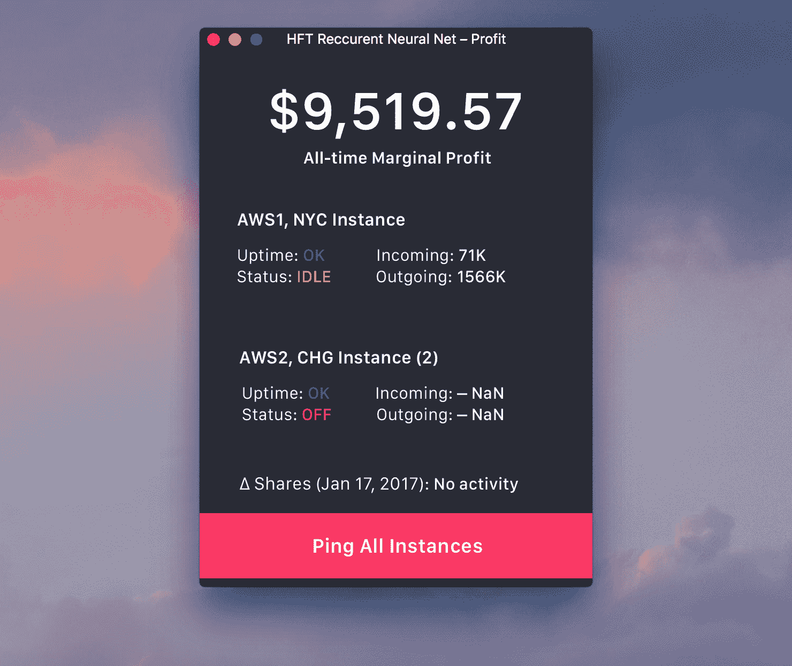
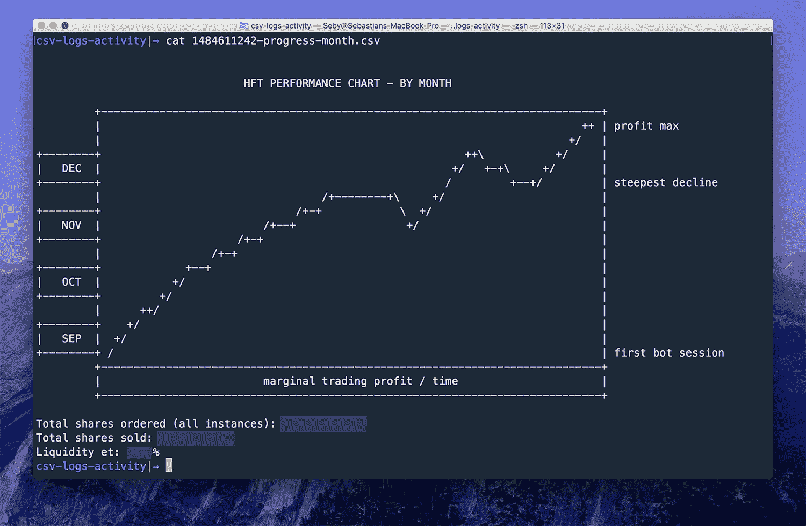

# 构建一个 3500 美元/月的神经网络作为辅助项目进行交易

> 原文：<https://www.indiehackers.com/interview/building-a-3-500-mo-neural-net-for-trading-as-a-side-project-5dda352c13>

## 你好！你的背景是什么，你在做什么？

我是[塞巴斯蒂安·多布林库](http://twitter.com/Sebyddd)，我是一名软件工程师，目前是[的自由职业者](http://sebastiandobrincu.com)。我也是一个狂热的产品制造商，喜欢建立副业和疯狂的项目。机器学习🤖，移动开发📱和设计🖌是与我的专业背景相关的一些关键词。

我最初建造股票交易机器人是作为一个个人研究项目。我正在试水，看看现代机器学习方法是否可以用来预测和自动化今天股票市场中的资产买卖，效率要高得多。

仅在 it 部门工作 5 个月，每月就能获得约 3，500 美元的收入，而维护成本每月不到 90 美元。目前我是唯一的用户。我计划继续努力，目标是尽可能扩大机器人的规模。

## 你是如何想出制作股票交易机器人的主意的？

这个想法是很随意地冒出来的。我正准备登上飞往旧金山的航班，决定下载一些播客。我想尝试一些新的东西，所以我从金融类中挑选了一些最受欢迎的。离地 10000 英尺，我打了 play，让自己很舒服。

主持人提出了流动性的话题，这个话题可以归结为三个衡量标准:价格、规模和时间。本质上，当流动性高时，投资者可以在短时间内成功地交易接近当前价格的较大订单。一旦他们开始争论高频交易是否通过提供流动性来改善市场，我就切换到手机上的 Notes 应用程序，开始疯狂地输入一些主要观点。

在这个项目之前，我在金融方面的经验非常有限。我对交易的基本原理有很深的理解，但除此之外就没什么了。我想改变这一点，但我也记得 99%的金融书籍都是废话。

经过广泛的研究，我选定了拉里·哈里斯的[交易和交易所](http://amzn.to/2lhltU0)，以及约翰·赫尔的[期权、期货&和其他衍生品](http://amzn.to/2jW3lDc)。第一篇可能是我读过的最好的金融文章。它实际上回答了所有好奇的做过交易的人可能会问的问题。另一方面，约翰·赫尔的书从应用的角度给了我一个关于数学金融的精彩介绍。如果你刚开始交易，我强烈推荐这两者。

我相信我们已经在人工智能领域达到了一个高峰。我们现在有强大的机器和足够的数据来处理。考虑到这一点，我的内部工程师对利用当今的技术进步来应对市场的可能性感到兴奋。除此之外，我有创造迷人项目的癖好，这次也不例外。

## 建造你的机器人花了多长时间，你用了什么样的技术？

我最初的目标是引导一个只关注比特币的高频交易(HFT)机器人(主要是因为有很好的可用 API)。巨大的优势是，你不必一开始就对大的交易公司不利。

这是因为当涉及股票交易时，即使是几微秒也可能使交易出错——比如你的机器人成为更快的机器人诱饵报价的受害者。(猜猜谁拥有更快的服务器和机器人？)然而，对于加密货币，这些小的时间增量远没有那么重要。

虽然我相信现在是进入比特币市场的黄金时代(因为它不完美)，但我很快放弃了这个想法(也许太快了？)由于找不到足够稳定的基于 [FIX](https://en.wikipedia.org/wiki/Financial_Information_eXchange) 的 API。不再用技术细节来烦你，可靠的交易 API 大部分是基于 REST 的，这对于我的目标来说还不够快。

出于专有的原因，我将放弃公开讨论许多关于技术实现的细节。虽然我收到了许多开源项目的请求，但我认为披露模型或预测方法的深层细节会损害该解决方案相对于其他现有机器人的优势。然而，对于任何愿意了解更多这方面知识的人来说，在某种程度上，我非常乐意私下讨论。

长话短说，我最终去了股市，但不是真正意义上的高频交易。我的机器人持有从几秒钟到几分钟(有时甚至几小时)的单一头寸，这使它更像自动化交易者，而不是高频交易者。这背后的原因是，作为一个个体交易者，很难与大公司竞争，因为你缺乏额外的好处，如非常强大的硬件，高级培训软件，以及为你的服务器提供良好的位置。离证券交易所越近，你接收信息就越快。大型投资服务器实际上要支付数百万美元，让它们的服务器离交易所更近几英里。

对于交易，我推荐 [Kite](https://kite.trade) ，主要是因为它们稳定的连接 API 和低带宽。他们的限制是每秒 3 个请求，这对于我的新策略来说已经足够了。获得可靠的历史金融数据并不便宜，而且有这么多人访问提供商获取和下载数据，我不怪他们限制提供的信息。 [Intrinio](https://intrinio.com) 是一个很好的实时股票报价提供商，价格非常便宜。然而，获得更深入的数据总是会产生更好的结果。

*我在不到一个月的时间里造出了第一个原型。作为一名自由职业者，我工作到很晚，试图在日常工作中找到时间。在这一点上，机器人不是很聪明。我花了大约 2 周的时间向它输入数据，直到我的错误率令人满意，又花了 2 周的时间在投入生产之前对它进行测试。总而言之，当前版本的技术实现花了大约 4 个月的时间，在此过程中还做了一些改进。*

## 你未来的目标是什么，你打算如何实现它们？

自从我[公开宣布](https://twitter.com/Sebyddd/status/821005789930389504)以来，我已经收到了几十家贸易公司的报价。目前，这个系统让我比其他交易者有优势。如果我卖掉它，我会把这个优势让给其他交易者，然后失去我的领先优势。虽然我不排除未来的收购，但我目前正专注于改进产品，并试图扩大规模。

我计划很快做的事情之一是增加资本，从而使 bot 通过更多的交易量。我想到了大量的改进，尤其是调整持仓时间跨度，以及使其更轻、便于更大批量生产的解决方案。

## 你面临的最大问题是什么？如果你必须重新开始，你会做什么不同的事？

我浪费了太多时间来尝试比特币的高频交易。起初，这个想法听起来很棒，但我很快就面临着许多技术问题，试图扩大请求的数量。然而，我还不相信用加密货币实现真正的 HFT 是不可能的，所以这可能是我将来会回来的事情。

由于技术上的限制，我偏离了 HFT 的想法，我研究了自动化交易中更具分析性的方法。这些概念中的大多数都不能应用于比特币市场，因为它高度不可预测，很难围绕它塑造模型。就在那时，我决定坚持投资股市。

一开始的另一个大错误是过于依赖模型。我没有尝试不同的方法来分析我的数据，而是仅仅依靠模型来识别盈利模式，而没有在其他更直接的解决方案上投入时间。模型只是简单的现实世界抽象，我的常识不止一次拯救了我。

到目前为止，我目前的策略在 95%的情况下都有效。这绝不是一个可靠的指标，有很多因素会影响它。这个机器人还没有足够的测试来保证这不仅仅是一个侥幸(它可能是)。大型投资管理公司会做任何事情来达到这些统计数字，我相信我不会在即将到来的交易中保持这样的成功。到目前为止的成功还受到有利的市场条件、精选股票以及 bot 间歇运行这一事实的极大影响。

此外，当 5%的情况发生时，事情可能会变得非常糟糕📉。我痛苦地了解到这一点。不久前，市场变得相当疯狂，如果我说我不预期我交易的股票会出现重大崩盘，那我是在撒谎。然后就发生了。

虽然我的止损让我避免了一些残酷的损失，但如果我没有在正确的时间介入，机器人会毁了过去几个月的所有利润。那个事件真的让我思考，我决定让它停止运行几天，直到我修复了那个漏洞。

这对我来说也是一次很好的学习经历，我相信如果没有经历那些起起落落，我永远也不会把这个算法发展到今天的水平。我不后悔在比特币上浪费时间，因为它让我更深入地了解了加密货币交易的工作原理，这可能有一天会被证明是有用的。

## 你最大的优势是什么？有什么特别有用的吗？

可能我最大的优势就是作为一个充满幻想的年轻梦想家。从某种程度上来说，这让我有足够的信心去投入别人不会投入的精力。这就是激励我坚持在市场中寻找那些“后门”的原因。虽然许多人认为个人交易者在面对装备精良的公司时没有太大的机会，但我在这里证明，通过正确的实施，市场仍然有很大的空间。

另一个非常有用的资源是网上的公共研究论文。事实上，我从 2006 年发表的论文中获得了巨大的帮助。我经常发现它们中的大多数很容易被忽视，尽管它们包含了非常有用的分析。

成为一个工作狂也对这种成功做出了相当大的贡献。我每天工作 10-12 个小时没有任何问题。随着时间的推移，我养成了一种非常高效且持续的生活方式，设法摆脱了大多数干扰。这让我有时间投资打磨和研究这个项目的不同策略。

## 你对有抱负的独立黑客有什么建议？

*发射东西！如果你辛辛苦苦做了一件事，却放弃了发布，没人会在意这件事。我们生活在一个非常资本主义的社会，人们会根据真实的结果来评价你。没人在乎你的主动，也没人在乎你不推出的理由。*

正如山姆·奥特曼所说，没有什么可以为你没有一个伟大的产品开脱。然而，没有*任何东西*当然比那更糟糕。不要从第一个版本就做的很完美。首先测试市场，收集大量反馈，不断重复你的想法。

虽然这不一定是以客户为中心的产品(还没有？)，我怎么强调副业的力量都不为过。兼职项目允许你尝试疯狂的想法，而不会被贴上疯狂的标签。即使人们基于此来评判你，你也可以打出“是的，这只是一个副业”的牌😁

并且一定要选择你头脑中最疯狂的想法。大多数成功的公司都是这样起步的(比如脸书、优步、AirBnb)。你可能不想花费你最宝贵的资源(⏰)，构建另一个 Snapchat 克隆。每个问题都有解决方法。你只需要有足够的创造力去发现它。

## 读者可以从哪里了解到更多关于你的信息？

你可以通过以下任何渠道找到我，当然也可以在下面的评论中找到我。😄

*   🚩个人网站:[sebastiandobrincu.com](https://sebastiandobrincu.com/)
*   🐤推特:[twitter.com/Sebyddd](http://twitter.com/Sebyddd)
*   💌电子邮件: [【电子邮件保护】](/cdn-cgi/l/email-protection#dab7bf9abeb5b8a8b3b4b9aff4b9b5)

🔴有很酷的项目吗？我目前[可以从事自由职业](https://sebastiandobrincu.com/hire)。🚀

—[<picture id="ember8163954" class="user-avatar ember-view user-link__avatar"></picture>Sebyddd](/Sebyddd?id=ZbytWENOBSd4bai97SC2njuPEJh2)，股票交易机器人的创造者

## 想像炒股机器人一样自己创业？

你应该加入独立黑客社区！🤗

我们是几千名创始人，互相帮助建立有利可图的业务和副业。来分享你正在做的事情，并从你的同事那里获得反馈。

还没准备好开始使用你的产品吗？没问题。这个社区是一个认识人、学习和实践的好地方。随意[随便浏览](/)！

——[<picture id="ember8163959" class="user-avatar ember-view user-link__avatar"></picture>柯特兰艾伦](/csallen?id=ibTLPyjwVebnZjMGKvz6ztarnuV2)，独立黑客创始人

56votes