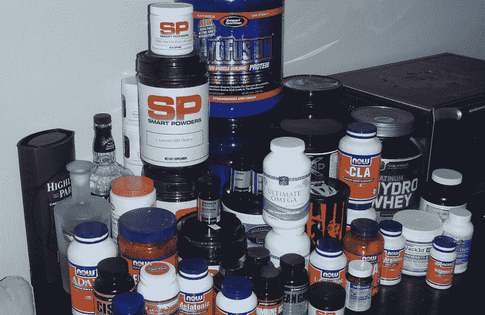
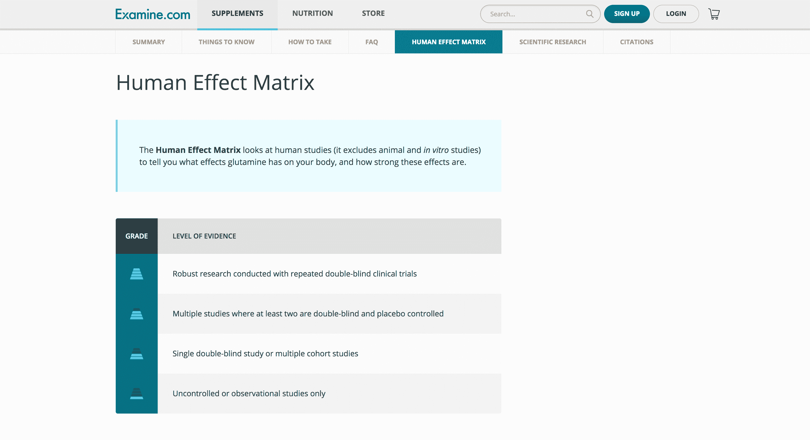
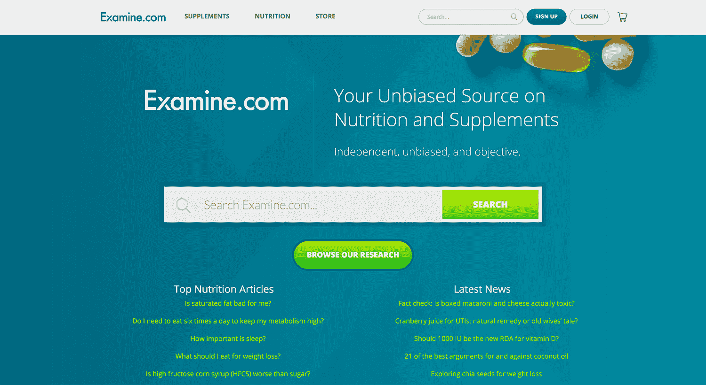

# 成为权威资源，打造 7 位数的业务

> 原文：<https://www.indiehackers.com/interview/building-a-7-figure-business-by-becoming-a-definitive-resource-1a37de660e>

## 你好！你的背景是什么，你在做什么？

嗨，我是索尔。我 14 岁时移民到西方。对我来说，创业一直是拥抱独立的一种方式。(我非常独立，所以合法地改了我的全名。)

我已经做了 18 年的企业家，在网络游戏/虚拟货币、本地搜索和最近的营养方面取得了稳固的成功——7 位数的收入。

六年前，我共同创立了 Examine.com 公司。快进到今天，我们是最大的营养和补充剂数据库。每月有超过 200 万的访客，我们一年的收入只有七位数，媒体都称我们是专家。

## 是什么促使你开始接触 Examine.com？

在我成功地在当地寻找工作后，我实际上退休了，并在美国和阿根廷四处游荡。虽然我一直是一个胖乎乎的孩子，但所有的饼干和冰淇淋都导致了一些难看的体重增加。

  

在我搬回多伦多后，我开始认真对待我的健康，体重下降了。想着它们会有帮助，我买了很多补品(我是说很多)。我最终偶然发现了 reddit 上的健身子栏目 [/r/Fitness](https://www.reddit.com/r/Fitness/) ，并开始阅读兜售的各种补充剂背后的实际科学。

  

我很快就意识到副刊公司在敲我们的竹杠。最重要的是，至少可以说，在 reddit 上寻找补充建议令人沮丧。

有人会来 [/r/Fitness](https://www.reddit.com/r/Fitness/) 问肌酸是否对他们的肾脏有害。其他人会花很多时间用参考资料和细微差别来精心制作回应。由于人们很少搜索，同样的问题会在下一周发布，除非深入的答案永远不会出现。人们只是厌倦了写详细的回答。

Examine.com 将成为解决这一难题的方法。作为一个信息库，我们不会大量生产内容。相反，我们将简单地更新它。

我的方法很简单:与某个主题专家合作。让他们专注于他们最擅长的事情(在 Examine.com 的例子中:补充研究),而我负责其他事情。

我从来不会有一个具体的计划，就“要做的工作”而言。我们的工作是提供公正的循证研究。其余的将随之而来，由我们的访问者希望我们解决的问题决定。

## 构建最初的产品需要什么？

老实说，没那么难。回顾我们在 archive.org 的站点的早期版本，提醒我们我们的方法是多么的简单。

 

我在巴拿马时招募了我的联合创始人 Kurtis。我以前在域名行业呆过，有相当多的域名投资者住在巴拿马。我花了 42，000 美元买下了 Examine.com 域名。我的逻辑是，即使最坏的情况发生，网站失败，我需要在 24 小时内快速现金，我仍然可以以 3 万美元的价格出售该域名。

我回到多伦多后，用了不到一个月的时间编写了一个简单的网站，其功能仅相当于基本的数据库输入。我们创建了自己的简化版 wikicode，因为 HTML 让 Kurtis 感到困惑，这使得嵌入内部链接更快。我们最初的目标是像 [tvtropes](http://tvtropes.org/) 一样补充营养——一旦你被吸进兔子洞，就无法逃脱。

除了我们自己，我们没有人需要回答，这给了我们自由，我们需要多少时间就花多少时间。

TweetShare

我把这个用 PHP (LAMP)编码了，自筹资金。费用相当低。除了域的成本，我有足够的备用服务器容量来“免费”托管它。我还同意支付 Kurtis 一笔津贴，直到我想出如何创收。

这个设计是 CSS 的恶意攻击，我们最初的报道是*只是*主要的健身增刊。我们决定了一些必须知道的任何补充剂(例如，它也被称为什么，服用多少，用什么，什么*不*服用，等等)。如果你回头看看之前 archive.org 的截图，你会发现它并不光滑。

就这样。我们在 3 月 15 日聚在一起，到了 6 月初，我们已经上线了。Kurtis 做了研究，我做了其他的事情。

## 你是如何吸引用户和发展 Examine.com 的？

由于 Kurtis 和我本质上都是/r/Fitness 的一部分，我们的 redditors 同事很快就开始使用这个网站。几乎立刻，人们开始链接到我们的网站的时候，一个补充问题被问及。

从那天起，reddit 给我们带来了超过 150 万的访问者！

与此同时，我开始建立关系。太多的人把网络视为“谢谢你，女士”。我有更长远的观点。我只试着和我认为会相处的人交往。我关注的是事情的非商业方面，因为我有时间和耐心不去想“我现在就需要一些东西。”

我之前做的一件重要事情是像老鹰一样观察我们的推荐和社交媒体提及。每当有人联系到或提到 Examine.com，我就给他们发电子邮件，感谢他们的支持。这有助于建立关系。

我们只是简单的发布，迭代，让草根推动我们前进。

TweetShare

SEO 有点让人头疼。因为 examine.com 的域名被停了，谷歌基本上把我们列入了黑名单。我们花了大约 4 个月的时间才获得牵引力。

通过不采取内容营销的方法(也就是大量发布新的博客文章来增加我们网站的流量),而是专注于拥有一个单独的页面，我们不断更新每一个新添加的补充内容，我们发现自己为我们的 SEO 带来了巨大的好处。

2012 年 2 月，我们深深体会到了这一点。当时，我们每天大约有 200 名谷歌访客。2 月 6 日，该指数飙升至 1，643 点，第二天升至 1，639 点，然后再次开始下降。

发生了什么事？嗯，奥兹博士提到“[覆盆子酮](https://examine.com/supplements/raspberry-ketone/)”是一种神奇的脂肪燃烧剂，我们在谷歌搜索结果中“覆盆子酮剂量”排名前三。"

这个高峰对我们来说非常重要，因为它让我们明白，对我们正在做的事情有着巨大的需求，只要我们坚持下去，就会为我们带来巨大的回报。(如果你想知道，我们将在近十个月内不会再次突破 1643 点。)

道钉加强了我们的工作，让我们继续前进。

我从来没想过与媒体一起发布 Examine.com 的 T2，或者把它提交给黑客新闻或 ProductHunt(尽管其他人在 T4 几年后做了这件事——你可以在评论中看到我们声誉的力量)。

对我来说，上市有点像一场灾难。你的成熟产品和你发布的产品一点都不像，而且太多的人会因为你在做初始发布时需要走的捷径而感到厌烦。

我们只是简单的发布，迭代，让草根推动我们前进。

## 你的商业模式是什么，你是如何增加收入的？

所以一开始我们没有商业模式。我取笑眼球生意，因为我相信追逐眼球通常是为了娱乐，而不是解决实际问题。但是因为我们在解决一个特定的问题，我认为我们是不同的。

大约一年后，我们开始调查我们的客户，我们收到的最大请求之一是能够生成我们数据的摘要或表格版本。一个易于查找的参考。

所以我们把它建在网站上，称之为“人类效应矩阵”。对于我们涉及的每一个补充，我们都根据特定的目标整理了所有的人类证据。

比如肌酸会增加你的力量输出吗？(是的。)[是否降低肾功能？](https://examine.com/nutrition/does-creatine-cause-kidney-problems/)(编号)以此类推。

它也可以在相反的方向上工作，用户可以从一个健康目标开始，如降低血压或增加睾丸激素，人体效应矩阵向他们显示朝着目标工作的补充剂。

 

经过大约一年的测试和完善，我们将它转化为一个产品，并以 PDF 格式出售。

虽然我曾建议其他人如何推出他们的产品，但我自己从来没有这样做过，而且反响非常好。由于我们两年来建立的声誉和关系，每个人都很乐意支持我们。这次发布为我们创造了六位数的收入，然后我们用这些收入雇佣并重复同样的过程:调查我们的客户，找出他们的需求，并为他们设计。

随后，我们推出了堆栈指南和我们的 Examine.com 研究文摘(ERD)。Stack Guides 带来了六位数的销售额，ERD 不仅达到了六位数，还通过订阅带来了一些长期稳定性。

许多人被诱惑进入一种永久发布的形式，他们痴迷于创造新产品，通过发布来创造流量和销售高峰。我们发现这类似于吸毒成瘾。更聪明的长期策略是培养到访的观众，并向他们推销你提供的一切。 [Brennan Dunn](https://www.indiehackers.com/podcast/014-brennan-dunn-of-double-your-freelancing) 有一篇[关于个性化的精彩文章](https://doubleyourfreelancing.com/drip-course/)。

需要注意的是，人们认为测量是一个深入的过程，但事实并非如此。是的，打电话交谈是最理想的。而是像“你在纠结什么？”可以产生非常有用的数据。

## 你未来的目标是什么，你打算如何实现它们？

我们专注于我们所做的事情，成为主导者，然后扩张。因此，我们的重点已经从健美补充剂，到健身补充剂，到健康补充剂，到所有补充剂，到一般营养。

它一直是关于研究的，我们只是扩大了我们的范围。就我们的产品而言，接下来是课程和认证。

我们也想更直接地影响主流媒体，所以我们有一份专门针对记者的每周私人通讯，在里面我们更新最新的营养研究。

在流量方面，我们目前每天大约有 75，000 名访客。我希望到今年年底我们能轻松达到每天 10 万辆。

这里的最终目标是产生影响。整个团队都被这个目标所驱动——成为营养和补充剂研究的可靠来源。

我们不会改变的一件大事是我们不接受任何客户的政策。没有教练，没有咨询。这确保了 RDs、MDs 和私人教练站在我们这边。

 

## 你面临的最大挑战和克服的障碍是什么？

老实说，最大的挑战就是建立信誉。如果真的去参加活动，去见人，速度会快得多。

我的联合创始人库尔提斯(Kurtis)和现在管理 Examine.com 的卡迈勒(Kamal)是这样的人，你见到他们五分钟后，你就会想，“该死，这些家伙很在行。”

每当有人联系到或提到 Examine.com，我就给他们发电子邮件，感谢他们的支持。

TweetShare

参加活动有助于进入对话，让人们感受到 Kurtis 和 Kamal 的知识。

所以，是的，从你的椅子上站起来，去见见人们。这有着天壤之别。

## 你最大的优势是什么？有什么特别有用的吗？

最大的优势是我们有自由。除了我们自己，我们没有人需要回答，这给了我们自由，我们需要多少时间就花多少时间去做我们想做的事情。

另一个很大的优势是，我们对每个人的职责都非常明确。库尔提斯是研究，我是其他一切。我们显然会考虑对方在做什么，但我们相信那个人会做得对。

## 对于刚刚起步的独立黑客，你有什么建议？

有一个联合创始人(或几个)可能很好，但让每个人都知道自己的工作是什么非常重要。有些人喜欢名声，而有些人憎恶它。一些人善于与他人相处，而另一些人更擅长编码。

了解每个人的长处，让他们专注于*那个*。

此外，人们试图做得太多。专注于一个特定的领域。美国的零售电子商务超过 4000 亿美元。网上有很多 T2 的钱。我认识几十个企业家，他们通过专注于一个我根本不知道存在的利基市场，一年获利超过 50 万美元。例如，一个朋友卖摩门教言情小说赚了六位数！

我可以推荐很多人，但这里有一个简单的列表:

*   [学习技巧](http://calnewport.com/blog/)——让你专注于
*   [法南街](https://www.farnamstreetblog.com/)——优化你的学习
*   向其他聪明的企业家学习
*   [SJO.com](http://www.sjo.com/)—我的网站，在这里我谈论我的经历和我从硬数据中学到的东西

## 我们可以去哪里了解更多？

你可以关注我关于 SJO.com 的文章和想法。你也可以在推特上用 [@sol_orwell](https://twitter.com/sol_orwell) 找到我，或者干脆在[脸书](https://facebook.com/sorwell)上找到我。

——[<picture id="ember5311890" class="user-avatar ember-view user-link__avatar"></picture>索尔奥威尔](/SolOrwell?id=examine-com-owner)【Examine.com 的创造者

## 想像 Examine.com 一样建立自己的事业吗？

你应该加入独立黑客社区！🤗

我们是几千名创始人，互相帮助建立有利可图的业务和副业。来分享你正在做的事情，并从你的同事那里获得反馈。

还没准备好开始使用你的产品吗？没问题。这个社区是一个认识人、学习和实践的好地方。随意[随便浏览](/)！

——[<picture id="ember5311895" class="user-avatar ember-view user-link__avatar"></picture>柯特兰艾伦](/csallen?id=ibTLPyjwVebnZjMGKvz6ztarnuV2)，独立黑客创始人

6votes