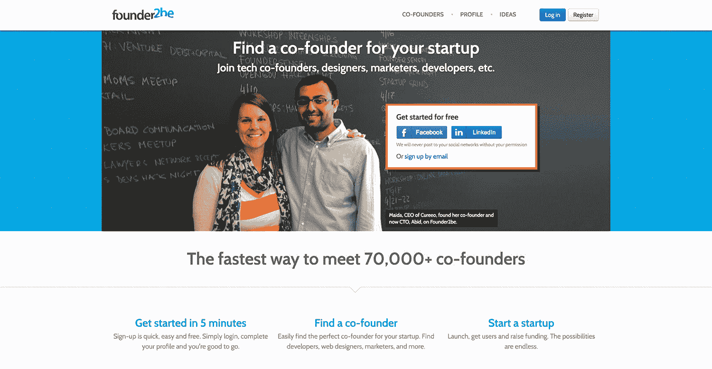
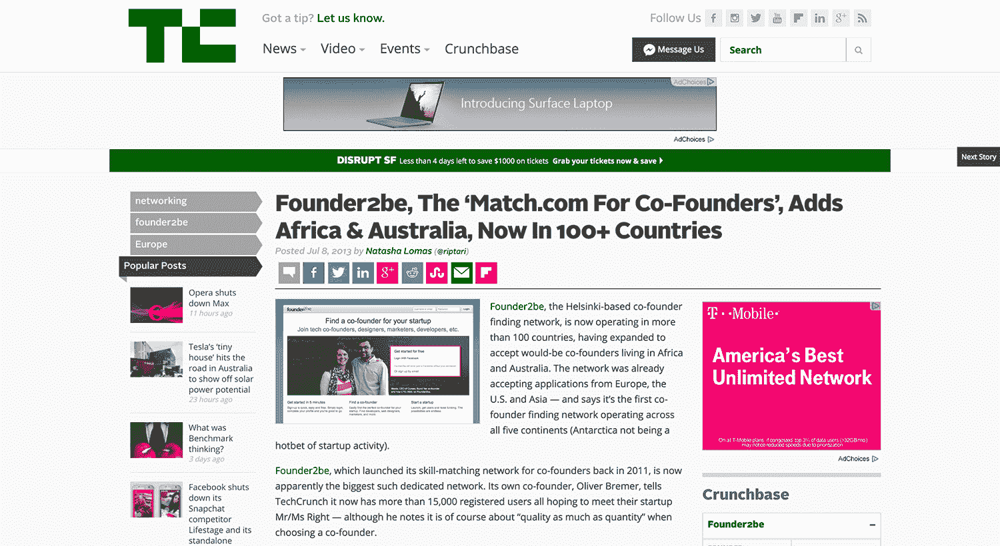
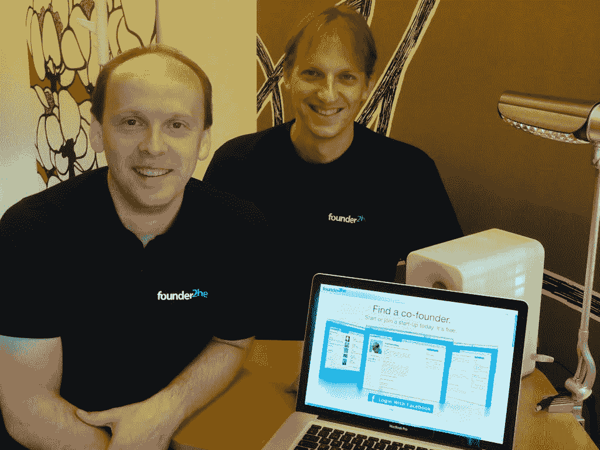

# 建立一个联合创始人约会应用程序来解决我自己的问题

> 原文：<https://www.indiehackers.com/interview/building-a-co-founder-dating-app-to-solve-my-own-problem-6e2f1d922d>

## 你好！你的背景是什么，你在做什么？

你好！我叫奥利弗·布雷默。我正与我的联合创始人弗兰克和沃尔夫冈一起从事[founder 2 be](https://www.founder2be.com/)——最初的联合创始人婚介服务。

我在德国长大，在美国获得计算机科学硕士学位，然后搬到芬兰，在那里我开始在诺基亚工作(当时是世界头号手机制造商)。七年后，我手里拿着第一部 iPhone 的那天，我做了两件事:

1.  我买了苹果的股票。
2.  我辞职了。

两者都被证明是非常好的决定。

接下来，我加入了一家科技初创公司，这让我开始思考用新的方式解决问题。很快我就有了自己创业的各种想法。我只需要一个联合创始人。因此，Founder2be 的想法诞生了:联合创始人的网上约会。

如今，我们通过在 100 多个国家寻找联合创始人，每月能赚 2000 美元左右。

 

## 是什么促使你开始使用 Founder2be？

我有很多创业的想法，但我不想独自创业。每当有新想法时，我都会邀请朋友和同事一起加入。不幸的是，我问过的人中没有一个人愿意围绕我的想法共同创业。

如果我*已经认识的人*都不想合作，我还有什么机会找到我*还不认识的伟大的联合创始人呢？这大概是我灵光一现的时候:通过网上约会认识了我的女朋友，我想:“嘿！我将建立一个约会网站，在那里我将男性/女性换成开发人员/设计师/增长黑客，这就是联合创始人如何相遇的。”*

我再次问我所有的朋友，是否有人愿意和我一起创办约会网站 idea。大多数人认为我已经完全疯了。最常见的反应？“你不能和不认识的人一起开公司。”幸运的是，我的一个朋友认为这个想法比我当时提出的任何想法都好。我和弗兰克就是这样开始的。

**经验之谈#1:** *当有人说，“这永远行不通，”那只是说，“我不知道我自己该怎么做。”*

不要让任何人阻止你把梦想变成现实。

我们没有做太多的验证。网上约会的存在对我们来说已经足够了。如果两个陌生人可以相遇、结婚、组建家庭，那么两个陌生人肯定也可以相遇、讨论想法、创办公司。

后来我发现 Dropbox 的 Drew 和 Arash 在一起开始之前并不认识对方。他们在决定一起创建 Dropbox 之前，曾在麻省理工学院喝过咖啡。我给他们发了封邮件，Arash 回复了，告诉我是 Justin.tv 的 Justin 介绍他们认识的。

2010 年底，我辞去了在诺基亚之后加入的创业公司的工作。自那以后，苹果的股价翻了一倍，这为其提供了发展空间。(我知道:APPL 自 1990 年以来又翻了三番！)我猜你可以说史蒂夫·乔布斯资助了我们的创业公司。:)

## 构建最初的产品需要什么？

当我们开始时，我决定我们将在一个月内推出。弗兰克认为我疯了，但我渴望尽快将我们的服务呈现在用户面前。说实话，我们比自己设定的截止日期晚了一天，于 2 月 2 日发布。

在发布时，我们知道一些大的功能丢失了。我们担心会推出这样一个简单的产品。但俗话说，“如果你在推出时不尴尬，那就是你推出得不够早。”

我们很尴尬。

第一批用户主要抱怨的是他们认为我们应该拥有的确切功能。好消息是:这证实了我们接下来应该关注的问题。我们又花了三周时间来构建这些功能。

如果你开始了，你已经比 99%的人走得更远了。害怕失败是想法消亡的原因。

TweetShare

我们也没有办法让人们分享他们的商业想法，直到几个月后。我想没有人会因为害怕别人窃取他们的想法而想要分享他们的想法，所以我从来没有实现一个支持这个用例的特性。现在我对此一笑置之。

幸运的是，弗兰克坚持我们至少要试一试。他认为，如果没有人使用我们的共享功能，我们可以简单地删除它。人们确实分享了他们的想法。事后看来，这其实并不意外。想法是你自己的延伸:你想做什么，你关心什么，你想解决什么问题。

不用说，我很高兴在这里听了我的联合创始人的话。

经验之二: *判断一件事是否可行的唯一方法就是去尝试。即使你认为它行不通，也要试一试。你可能会感到惊讶。*

## 你是如何吸引用户并发展 Founder2be 的？

我们在发布时最担心的不是缺少功能，而是缺少内容。一个没有潜在匹配的配对网站不是很有吸引力，是吗？

我们有三个简介:弗兰克、我哥哥沃尔夫冈(我们招募他来帮助设计)和我。我们都没有寻找共同创始人。我们关注的是[的创始人。](https://www.founder2be.com/)

一个斯堪的纳维亚科技博客报道了我们的发布，我们给早期会员提供免费的高级订阅。我说的“免费升级”是指他们免费获得了所有的功能。(注意，我们还没有办法向任何人收费，所以事实上我们没有其他选择，只能免费提供一切。)

我们花了很长时间才终于“敢”收费。当我们这样做的时候，第一次付款并没有花很长时间。

TweetShare

我们的早期用户教会了我们很多关于人们真正想要的东西，这帮助我们弄清楚我们可以收取什么费用。

随着时间的推移，我们也试图从大型博客中获取报道:TechCrunch、Mashable 等。令我们惊讶的是，我们收到的最大的问题是，“你筹集了多少钱？”零。我们没有筹到钱。我们不想。没有一轮，人们不想写我们。很奇怪。钱是最重要的。我明白收入对投资者很重要。但是为什么投资对一个博主来说是最重要的呢？那超出了我的理解。(所以我认为你们这些独立黑客关心人们在做什么，并且问我们在引擎盖下发生了什么以及为什么，这是非常酷的。向你致敬！)

有趣的是，当我们不再试图获得报道时，我们突然得到了 Techcrunch。什么感觉？很好！我们那天的销售额和上个月一样多。持续了吗？不完全是。不要把时间花在追逐投资者或博客上。而是专注于你的产品。倾听客户的心声。就像保罗·格拉厄姆说的:“制造人们真正想要的产品。”

 

如果你这样做了，好事就会接踵而至。如果你不这样做，没人会感兴趣。

随着媒体曝光，人们开始听说[创始人 2be](https://www.founder2be.com/) ，一些有趣的事情发生了:

*   很多人联系我们说，“这么长时间以来，我一直有着和你一样的想法。你能建立这项服务真是太棒了，这样我就不用这么做了。”
*   想要加入并帮助我们建立社区的人反应非常热烈。起初，我们不知道如何处理提供给我们的所有帮助。(我们并不真的需要更多的开发人员和设计师。)

我们花了一段时间才想出如何最好地引导它。答案？聚会。我们从来自世界各地的志愿者开始，他们在不同的城市举行聚会来联系共同创始人。它真的起飞了，在我们意识到这一点之前，我们已经在每个大洲举办了聚会。我们驻尼日利亚的大使 Chinedu 和埃梅卡甚至登上了福布斯非洲杂志的封面。

真的很难说什么有用什么没用。我的建议是，你永远不知道，直到你尝试。有些东西可能听起来很棒，但却不起作用。有些事情听起来可能很傻，但结果却很成功。找到答案的唯一方法就是去做。

**经验之谈#3:** *“想法毫无价值。执行力很重要。”*

## 你的商业模式是什么，你是如何增加收入的？

正如我之前提到的，我们采用的是免费增值模式。免费层提供你需要的所有基本功能，高级层旨在帮助联合创始人节省时间，更快地找到合适的匹配。我们在简讯中补充了赞助。

我们已经做了一些定价的小实验，但是这些并没有改变大的图景。价格更高，买的人更少；更低的价格和更多的人购买。最后的总数几乎是一样的。

我唯一的遗憾是没有早点向人们收费。一开始，我们没有付费选项。一切都免费。我们花了很长时间才终于“敢”收费。当我们这样做的时候，第一笔付款很快就到了。这就像你在对 Cronitor 的采访中评论的那样:“很少有好的理由让*而不是*立即开始收费。”

而现在我们大约是 2000 美元/月。

我们没有筹到钱。我们不想。没有一轮，人们不想写我们。

TweetShare

## 你未来的目标是什么，你打算如何实现它们？

我们想让寻找完美的匹配变得更加容易。就像约会一样，在你遇到某个人之前，你通常会想，“嘿，这可能是那个人。”所以我们希望在你找到这个人之前，尽量减少“约会”的次数。

当然，就收入而言，越多越好。这就是我们的目标。我们没有一个具体的美元数字，我们希望在某个日期达到。相反，我们的目标是每个月要测试多少功能和实验，并衡量它们是否能让事情变得更好。当某样东西让我们的用户感觉更好时，我们会保留它。否则，我们将再次删除它。

我还认为，通过为[创始人 2be](https://www.founder2be.com/) 本身寻找合适的合作伙伴，我们可以做得更多:一家受益于更多人创业和那些成功的业务(创造收入和向客户收费)的公司。因此，我们当然也愿意探索合作和收购。

## 你面临的最大挑战是什么？你克服的障碍？如果你必须重新开始，你会做什么不同的事？

我们一开始非常便宜。我想在最初的两年里，我们在每月 10 美元的共享网络主机上运行我们的整个服务。有一次，我们的网站变得非常慢，我们开始停机。我们最终争先恐后地将所有东西都转移到更大的服务器上。我认为创业时节俭是好事，但下一次我可能会稍微不那么吝啬。

我们的创业社区越大，就变得越有趣，不幸的是，不仅仅是对那些寻找联合创始人的人。我们开始看到个人向会员推销服务的案例。因此，我们被迫采取行动，实施垃圾邮件报告系统，并封锁帐户。

成为一名企业家就是要解决一系列的问题。

TweetShare

一天早上，我们也有一个垃圾邮件发送者用“启动想法”淹没我们的服务，这是一个移动服务的广告。我们玩了几天猫捉老鼠的游戏，记下了他的账户，只是为了一个新的账户出现。最终，我们让分享想法的帖子成为了我们付费计划的一个特色，这不仅阻止了垃圾邮件发送者，还增加了收入。

我相信每个问题都代表一个机会。当问题第一次出现时，你会想，“哦，伙计，不是这个，不是现在。”然后你开始解决它。你学习，解决它，然后继续下一个问题。成为一名企业家就是要解决一系列的问题。

## 你最大的优势是什么？有什么特别有用的吗？

这是一个很好的问题。通过网上约会认识我的女朋友当然有帮助。这是解决我们问题的火花:“我如何认识我不认识的人？”不过，这并不是唯一的起点。很多人以前都是通过网恋认识的。我也不是第一个想到解决方案的人，有相同想法的早期用户的大量留言就证明了这一点。

用作家威廉·吉布森的话来说，“未来已经在这里了——只是分布得不太均匀。”意识到这个问题已经在网上约会中解决了，我们“只是”把它应用到一个新的领域。

有点天真也有帮助。如果任何人开始一项新业务时都考虑到了所有可能出错的事情，那么任何头脑正常的人都不会开始。

**经验之四:** *“当你有一个你能解决的问题时，你就在做生意，其他人也有同样的问题，而且他们愿意为你的解决方案买单。”*

另一件很有帮助的事情是我对旅行的热爱。这让我变得相当外向。我并不总是那样。这是可以学习的。

所以走出你的舒适区。抓住机会。去参加那些你不知道会遇到谁的活动。有趣的人走进你的办公室或家的几率远低于你在活动中遇到有趣的人的几率。

通过完全随机的介绍，我认识了像[卡莉·张伯伦](https://twitter.com/CarlyChamber)，Airbnb 的第一批员工之一，[约翰·塞克里斯特](https://twitter.com/sechrest)，创业周末[董事会成员，以及许多其他人。约翰一直在说的一件事是，“奥利弗，你需要向人们收费。”](https://twitter.com/StartupWeekend)

我只希望我能早点听进去。带着开放的心态走出去是你能采取的最有回报的行动。

我认为任何人都可以拥有的最大优势就是开始按照自己的想法行动。如果你开始了，你已经比 99%的人走得更远了。害怕失败是想法消亡的原因。

## 对于刚刚起步的独立黑客，你有什么建议？

我是 YCombinator 的[创业学校](https://www.startupschool.org/)的超级粉丝。如果你已经开始运行你的产品的第一个版本，戴夫麦克卢尔的[盗版的启动标准](https://www.slideshare.net/dmc500hats/startup-metrics-for-pirates-long-version)是必须的。

如果你还在考虑开始，那么根据我的经验，最大的障碍是不知道从哪里开始。担心你的想法或项目可能无法实现。我给任何考虑做出这一飞跃的人的建议是，通过问自己:“如果我不成功，可能发生的最糟糕的事情是什么？”

你会无家可归吗？你会挨饿吗？大概不会。最糟糕的情况可能是你没钱了，不得不和朋友或父母住在一起。你可以随时更新你的简历，找另一份工作，再次存钱，重新开始。一旦你意识到最坏的情况并没有那么糟糕，你就可以把这种想法放在一边，开始行动。

去做吧。比如耐克的广告语。别担心，开始做吧。当你这么做的时候，记住:

*   不要让任何人告诉你这是不可能的。当有人说，“这不行，”这实际上只意味着他们不知道如何让它工作。
*   **在**提前向顾客收费。不要等到你的产品“足够好”才值得为之付费。让你的客户来决定吧。最坏能发生什么？没人付钱。这很可能不会发生。如果是的话，那也不错。这是继续前进，尝试其他事情的最好迹象。
*   **不要羞于伸手**。寻找导师。向他人学习。即使你认为某人“太有名”而无法联系。我们都只是有血有肉的人类。人们被征求意见时会感到谦卑。

## 我们可以去哪里了解更多？

你可以在[founder2be.com](https://www.founder2be.com/)报名，试试 Founder2be。在我们的时事通讯中，我们分享了如何找到联合创始人、提出你的想法并开始行动的建议。你也可以在推特上和我们取得联系。

 

欢迎在评论中提问。我会尽可能回答更多的问题。感谢你邀请我们上独立黑客节目，科特兰！

—[<picture id="ember5201975" class="user-avatar ember-view user-link__avatar"></picture>Founder2be](/Founder2be?id=g8mVZOMZHdR32p5LpfMOUPFsiWp2)，founder 2 be 的创建者

## 想像 Founder2be 一样建立自己的事业？

你应该加入独立黑客社区！🤗

我们是几千名创始人，互相帮助建立有利可图的业务和副业。来分享你正在做的事情，并从你的同事那里获得反馈。

还没准备好开始使用你的产品吗？没问题。这个社区是一个认识人、学习和实践的好地方。随意[随便浏览](/)！

——[<picture id="ember5201980" class="user-avatar ember-view user-link__avatar"></picture>柯特兰艾伦](/csallen?id=ibTLPyjwVebnZjMGKvz6ztarnuV2)，独立黑客创始人

8votes