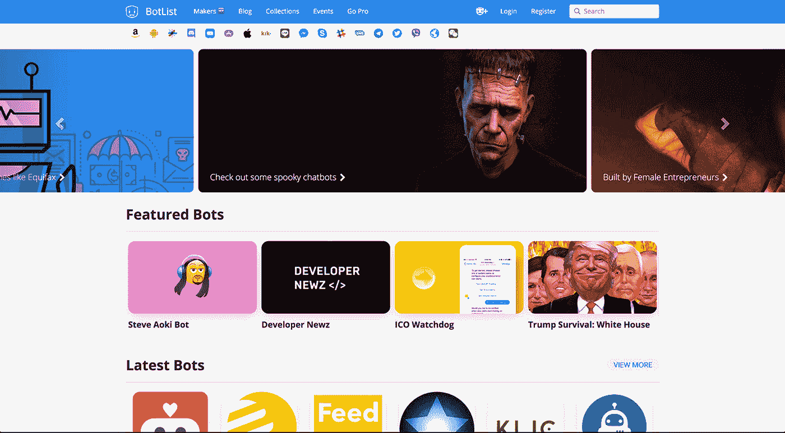

# 利用增长趋势建立一个社区

> 原文：<https://www.indiehackers.com/interview/building-a-community-by-capitalizing-on-a-growing-trend-e158c4267c>

## 你好！你的背景是什么，你在做什么？

嘿！我是赛斯·路易。我是机器人应用商店 [BotList](https://botlist.co) 的联合创始人。

本人有设计背景，涉猎前端开发，一直热爱创作产品。2016 年，我被提名为 Product Hunt 的年度制造商。不幸的是，我没有收到它，但幸运的是，我的商业伙伴和长期的朋友，Mubashar Iqbal 收到了。:)

在过去的两年里，我一直在构建和运行 BotList，这是我第一个真正的创业公司。BotList 本质上是一个包含所有与机器人相关的事物的社区目录。我们专注于为 bot 社区提供发现、教育和发展。所以我们真的有两种受众，机器人的制造者和使用者。

从第一天起，我们就 100%地自力更生，现金流为正。此外，我们每月收到超过 30 万的页面浏览量和平均 10 万用户。

 

## 是什么促使你加入僵尸名单公司？

Mubashar Iqbal (Mubs)、Ben Tossell 和我在 2016 年聊到脸书将如何真正开始推动对话应用(又名...聊天机器人)在 [F8](https://www.f8.com) 。与其他科技巨头一样，比如亚马逊的 Alexa 或 Skype 机器人，我们知道这些平台将会有自己的方式来显示它们的目录。

由于大多数消费者平均使用四个以上的信息渠道，这导致了人们实际上应该在哪里搜索和发现这些机器人的问题。这就是[僵尸列表](https://botlist.co)的创建过程。

Mubs，Ben 和我真的以创造一些最快的 MVP 而闻名，所以我们没有花太多时间来验证这个想法。我们确实假设，如果脸书将会把重点放在机器人和它的信使平台上，机器人将会是巨大的。

到战壕里去！简单明了。如果你想有所成就，就把手弄脏。

TweetShare

当时，我们都真的在寻找一个副业项目来获得一些动力。当我们收到 BotList 的收购要约，而它还没有上线的时候，我就停止了其他所有的项目。

## 构建最初的产品需要什么？

因为我们在运行中验证了这个想法，所以我们想快速提升 MVP，并用 Laravel 框架创建了 [BotList](https://botlist.co) 。Laravel 非常容易使用，以至于我和 Mubs 可以同时开发它，而 Ben 则在寻找所有要发布的机器人。我们可能只花了几个周末就完成了大部分产品。大部分工作是微调一切。

2016 年 1 月中旬是我们真正开始计划产品的时候，但产品搜索的公开发布是在 4 月 10 日，F8 的前一天。我们在 F8 的前一天发布，这样我们就可以驾驭脸书的媒体浪潮，而且它运行得完美无缺。

BotList v0 实际上只是一个主页发现、bot 细节页面和类别排序。很简单很基础。从那时起，我们增加了收藏，活动，广告，用户档案，机器人制造商搜索，僵尸名单专业会员资格，以及更多的功能。

在发布大约一个月后，本在产品搜索部门获得了一个新职位，他无法将时间投入到僵尸名单中，所以 Mubs 和我继续管理它。第一年左右，我们在晚上和周末运营它，2017 年 5 月，我决定全职加入公司。

建立一个社区不是一件容易的事情！我们很幸运地认识了社区中的许多创客，并使用了他们的一些创业策略。像[皮特·里维斯](https://twitter.com/levelsio)、[马克·科尔布鲁日](https://twitter.com/marckohlbrugge)和[贾斯廷·杰克逊](https://twitter.com/mijustin)这样的人已经成为 1-2 个粉碎产品的制造商大军中的创新者。

从反馈到寻求帮助，一个好的社区有助于推动你正在构建的东西。

TweetShare

## 你是如何吸引用户并发展僵尸名单公司的？

启动[僵尸列表](https://botlist.co)真的很简单。脸书的 F8 会议帮助我们获得了媒体的关注，由于产品搜索的推出，我们在头两天就获得了 10 万用户。TechCrunch、Digital Trends、VentureBeat 和其他媒体开始撰写关于僵尸名单的文章。时机再好不过了。

像这样的大规模发布之后，最具挑战性的事情是保持用户的注意力。所以，在过去的两年里，我们每天都在主页上发布新的机器人。与 bot 提交审批和内容分发保持一致是我们成功的关键。这确实让我们的机器人队伍变得庞大，但对于消费者来说，我们一直关注质量而不是数量。

我们还将[挂钩的](https://www.indiehackers.com/podcast/023-nir-eyal-of-hooked)方法添加到用户配置文件中。因此，作为一个机器人的制作者，你可以在你的机器人页面、收藏以及人们关注你时收到关于评论或评论的通知。最近，我们为用户添加了一种方式，让他们可以将自己列为“待聘”，并可以通过网站进行搜索。

由于 Mubs 参与了创建 Quuu，我们用它们来发布博客内容。Quuu 给了我们极大的帮助！贡献者会在我们的网站上写文章，我们会用 Quuu 推广他们。事实上，上周我们有一位撰稿人告诉我们，他们在僵尸名单上的参与度超过了福布斯和 IBM 的文章。这是我们发展和帮助机器人公司成长的秘密武器。

几个月前，我们还聘请了一位 SEO 专家来真正利用谷歌的果汁来增加流量，你可以从我们的数据中看到这是有回报的。

在所有的成功中，我们经历了 10 倍多的失败。我们遇到的最大失败是行动不够快。当竞争对手都在用风投支持的资本运营时，运营一家自举公司肯定很有挑战性，但我们在 BotList 上只有一个全职员工的情况下做得相当不错。；)

*   我们有大约 1 万名注册用户
*   18 个不同的平台(脸书、Slack、Kik 等。)
*   4.3k Messenger 聊天机器人用户
*   3.6k 简讯订阅

这是我们 2017 年的流量。

| 月 | 浏览量 |
| --- | --- |
| 一月 | 233199 |
| 二月 | 211671 |
| 三月 | 226500 |
| 四月 | 226168 |
| 五月 | 276301 |
| 六月 | 289890 |
| 七月 | 306465 |
| 八月 | 312827 |
| 九月 | 268397 |

注意:9 月份我们调整了我们的网址以获得更好的谷歌搜索引擎优化排名，导致流量下降。

## 你的商业模式是什么，你是如何增加收入的？

我们目前有两种不同的赚钱方式:广告和迎合机器人制造商/公司。我们最古老的盈利策略是让人们“快速跟踪”他们的提交。这有所帮助，但不可持续。我们很快意识到广告是一条出路，但它非常耗时。

对于这样一个新兴行业，我们注意到的一件事是，大多数提交的机器人都不是受资助的组织。所以，广告对于副业来说有点贵。这让我们改变了广告结构，实施了一项增长黑客计划。所以，向前看，你可以付费做广告，也可以赚广告位。

通过鼓励用户在文章、帖子、播客等中分享或提及[僵尸名单](https://botlist.co)。，我们获得流量，他们将获得指向广告位的积分。这极大地帮助了我们，也帮助了机器人社区，让更多的对话围绕这个主题。

从第一天起，我们就 100%地自力更生，现金流为正。

TweetShare

BotList 还为专业会员提供了独特的功能。通过支付专业会员资格，制造商可以获得广告补贴、机器人验证、交易，可以被列为“出租”，并在我们的新市场上出售或购买聊天机器人。我们致力于帮助机器人成长，并继续创造更多功能来帮助产品成长。

目前，我们正在创造非常早期的“创业收入”——也就是说，不是很多——但我们的被动收入流正在增长。我们仍然严重依赖广告，我不得不兼职做一些机器人咨询。运行 BotList 最大的好处是，我可以看到哪些机器人有效，哪些无效。；)

我学到的一些建议是，始终关注那些首先会带来收入的功能。一旦你有了收入，你就可以专注于将产品打磨到一个全新的水平。此外，专注于提供价值。如果你提供了价值，钱就来了。

*   9.99 美元专业版订阅(目前 35 美元)
*   第 1 级广告:5，000 美元(每月 1 次)
*   第二级广告:2000 美元
*   第三级广告:500 美元(每月 2-3 次)
*   僵尸工作发布:100 美元(这已经拖慢了一堆)
*   快速提交:49 美元(可能每月 5-10 美元)

 

## 你未来的目标是什么？

我目前的目标是让 1k Pro 会员注册。可以做到。我希望让人们把自己列为“待聘人员”，并为制造商提供更多价值，将有助于我们很快实现这一目标。

我们还希望达到每月 100 万的页面浏览量，并获得更稳固的合作伙伴关系。我们希望成为机器人的 App Annie，并提供宝贵的资源来推动机器人行业向前发展。

## 你面临的最大挑战和克服的障碍是什么？

大多数人并不真正知道的一件事是，我们不得不处理一些法律问题大约一年。我们不知道是否有一天我们所有的努力都会化为乌有。因此，在大约八个月的时间里，我们从未在网站上取得任何进展。我们只是维护了内容。实质上，我们损失了一年的产品开发。精神上也很艰难。

另一个巨大的挑战是在自举时运行一个社区网站。最终我们会雇佣更多的管理助理，这将使我们更专注于产品开发。

如果你打算建立一个像[僵尸名单](https://botlist.co)这样的社区网站，首先一定要想出一个赚钱的策略。

## 有没有发现什么特别有帮助或者有优势的？

参与一个坚实的创客社区绝对是一个优势。从反馈到寻求帮助，一个好的社区有助于推动你正在构建的东西。

我还加入了一些脸书的团体，比如吴彦祖的“Staking Growth”。他们帮助我跟上技术和外部资源，以推进我的营销、增长黑客和内容战略——最终支持[僵尸名单](https://botlist.co)的增长。请记住，任何产品中只有 20%真正在生产。另外 80%是营销。:)

另一件事:创造一个脸书机器人！它有助于分发您的内容。我们的信使机器人每天发送最新的机器人和博客内容。我又少了一件担心的事。

## 对于刚刚起步的独立黑客，你有什么建议？

到战壕里去！简单明了。没有人会为你做任何事，如果你想有所成就，就把手弄脏。所以很多人认为仅仅创造一个产品就能解决所有人的问题，钱就会源源不断地流入。成就伟大需要很长的时间。

我们花了很长时间才完成了[僵尸列表](https://botlist.co)的工作。例如，很多时候我需要 PHP 的帮助，而 Mubs 太忙了。所以我不得不学习一点 PHP。如果你下定决心，你可以做任何事情！

此外，加入一些社区和团体。人们愿意提供建议或反馈。参与就好。

## 我们可以去哪里了解更多？

你可以在 botlist.co 查看僵尸名单。或者，如果你想了解机器人如何改变世界，以及如何为你的机器人增加吸引力，请查看[我们的博客](https://blog.botlist.co/)。我们也在所有的社交网站上，[推特](https://twitter.com/botlistco)，[脸书](https://www.facebook.com/botlistco/)等等。

但是，如果你真的想帮助我们，请查看 [BotList Pro](https://botlist.co/pro) ，并让我们知道你的想法。

——[<picture id="ember8185647" class="user-avatar ember-view user-link__avatar"></picture>赛斯·卢伊](/sethlouey?id=oW6Zxgjo8WQempXRdtCsPEeo37M2)，僵尸名单公司创始人

## 想像 BotList，Inc .一样建立自己的企业吗？

你应该加入[独立黑客社区](/)！🤗

我们是几千名创始人，互相帮助建立有利可图的业务和副业。来分享你正在做的事情，并从你的同事那里获得反馈。

还没准备好开始使用你的产品吗？没问题。这个社区是一个认识人、学习和实践的好地方。随意[随便浏览](/)！

—[<picture id="ember8185652" class="user-avatar ember-view user-link__avatar"></picture>考特兰艾伦](/csallen?id=ibTLPyjwVebnZjMGKvz6ztarnuV2)，独立黑客创始人

13votes