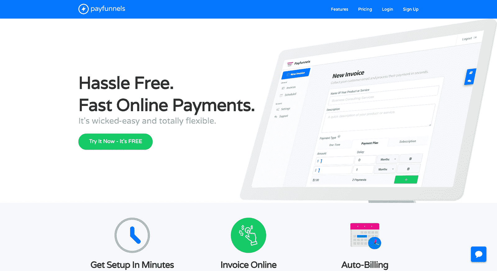
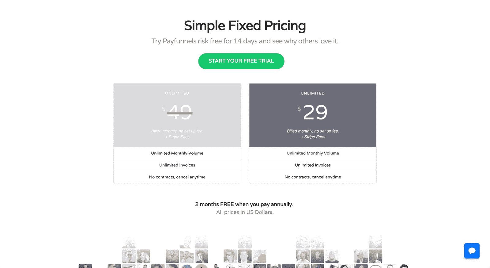

# 建立一家公司来满足我自己的需求，并在 2017 年出售

> 原文：<https://www.indiehackers.com/interview/building-a-company-to-meet-my-own-needs-and-selling-it-in-2017-33ff50b0a0>

## 你好！你的背景是什么，你在做什么？

你好。我叫 Dave Rogenmoser，我创建了[pay funnels](https://payfunnels.com)——这是使用 Stripe 从个人客户那里收取付款的最快捷、最简单的方式。下面我将讨论我的创业、成长之旅，并把生意交给另一个独立黑客来支持我的另一个项目。

如今，超过 500 家顾问、教练和服务提供商使用 Payfunnels 无缝地接受支付，没有任何摩擦。该公司目前的 MRR 约为 10，000 美元，并在稳步增长。

## 是什么促使你开始使用 Payfunnels？

出于需要，我和我的合伙人最初建立了[支付渠道](https://payfunnels.com)。我们在做数字营销咨询，很快意识到，在获得一个新客户后，接受付款对客户来说是一个巨大的摩擦点。一切都取决于交易的顺利进行。

 

我们没有太多的钱来使用像 Freshbooks 这样的服务来做我们的发票，坦率地说，这太复杂了。因此，一个周末，我们建立了支付渠道，通过 [Stripe](https://stripe.com/) 向客户发送简单的发票。

Payfunnels 很快成为我们用来获得所有客户的工具，但我们没有计划提供软件即服务。这发生在我们推出名为 6K 成功的咨询课程之后。这是一个培训项目，在这个项目中，我们教人们如何开始和发展一个有利可图的咨询业务。

很多软件解决了根本不存在的问题。解决企业或消费者真正面临的问题。

TweetShare

随着课程的发展，人们开始找到客户并问我，“戴夫，我应该如何付款？”我会告诉他们，我使用 Payfunnels，但其他任何人都无法使用。

就在那时，我突然意识到，如果我们提供付费渠道，这门课的每个人都会每月付费。因此，我们花了一些时间来重建产品，并将其作为服务提供，这就是我们获得第一批客户的方式。

## 构建最初的产品需要什么？

最初的产品非常瘦。就像…我们在一个周末就建成了它，我认为这是个好主意。如果有一件事我的团队做得非常好，那就是我们真正理解了 MVP，或最小可行产品。一开始，我想做两件事:1)接受使用 Stripe 支付，因为我听说 Stripe 很棒，但不信任 Paypal；2)我希望创建发票的时间不超过 30 秒，我的客户支付发票的时间不超过 30 秒。

我不想要分析、用户账户、花哨的品牌或任何类似的东西。我只是想用它来解决我的痛苦，这样我就可以回来销售更多的客户。所以很自然地[支付渠道](https://payfunnels.com)非常简单。

我的合作伙伴 JP 是一名程序员，所以让他为我们做这个很好。除了时间，什么也没花。至于技术栈，Payfunnels 是使用 Nodejs 和 AngularJS 构建的。

就资金而言，Payfunnels 一直是一家白手起家的公司。我们完全通过向客户销售数字营销服务和销售课程来筹集资金。就个人而言，我认为销售课程或数字产品是发展软件业务和资助开发的一种不可思议的方式。

## 你是如何吸引用户和增加收入的？

增加收入渠道与销售课程或获得客户是非常不同的。我们测试了很多不同的策略，发现了三个真正推动了新用户注册的策略。

1.  **销售我们的 6K 成功课程和支付渠道。** 450 多人以 997 美元的价格购买了 6K Success，我们在其中创建了一个关于“如何向客户收款”的培训。很自然，几乎所有参加过培训的人都报名参加了 Payfunnels 的试用。

2.  **与快速发展的课程创建者建立附属关系。我联系了萨姆·奥文斯，他也有一门培训咨询师如何获得客户的课程。我们达成了一项协议，他建议他的所有客户使用 Payfunnels，作为回报，我给他的客户打了一个大折扣(60%)。因为我为他的客户降低了价格，我没有给他任何介绍费，但如果我没有降低价格，30-40%的持续佣金是我愿意支付的。这是标准的佣金率。萨姆每月给我们送来许多顾客。**

销售课程或数字产品是发展软件业务和资助开发的一种不可思议的方式。

TweetShare

3.  **病毒增长黑客。**我非常喜欢给产品添加内置病毒来加速增长。有了 Payfunnels，我们意识到每次发送发票，都是获得新客户的机会。因此，我们在每张发票上添加了 Payfunnels 徽标，在支付发票后，会有另一个链接允许人们点击回到我们的网站。只要我们创建了一个令人印象深刻的支付流程，我们就能以这种方式获得客户……而且这种方式*奏效了*。

## 你的商业模式是什么，你是如何增加收入的？

[Payfunnels](https://payfunnels.com) 通过每月 29 美元的单选项定价计划创造收入，实现无限支付。

 

老实说，这只是我们最初选择的价格点，我相信增加多个价格点是增加额外收入的快速方法。这是我们正在努力的事情——根据交易量或附加功能确定价格点。

## 你未来的目标是什么？

[支付渠道](https://payfunnels.com)作为一种产品正在有机地发展。我们倾听客户对新功能的需求，并将其交付给他们。

我们最雄心勃勃的目标是在未来 6 到 12 个月内将我们的客户群扩大 3 倍。我们正在寻找一个成长黑客来合作或参与进来。另一种方法是接触有影响力的人和附属机构。

## 你面临的最大挑战和克服的障碍是什么？

我们必须克服的最大障碍是让这个工具用起来更性感。Payfunnels 解决了一个相对“无聊”的问题，所以它不是人们倾向于向朋友吹嘘的东西。“你不会相信我开发票有多容易！”只是没有发生。设置定期订阅或支付计划是如此简单，以至于我们的客户联系我们只是为了确认他们不需要做任何其他事情。

因此，对我们来说，挑战在于创造营销材料，描述一个简单可行的解决方案。为了做到这一点，我们依靠围绕产品创建培训计划，以某种方式出售二手产品。

我们必须克服的最大障碍是让这个工具用起来更性感。

TweetShare

如果我可以回到过去，重新开始，我会在早期创造一个更炫的功能，让人们兴奋起来。如果人们可以截图并在脸书上分享，那就更好了。一个例子可能是人们希望每天查看的一些非常酷的分析。如果我能从他们的 Stripe 账户中提取一些难以追踪的关键数字，就能让他们更容易谈论或与朋友分享产品。

## 你在 pay 漏斗还在增长的时候就卖掉了它。你是怎么做的，为什么？

我们从来没有打算建立和发展[销售的支付渠道](https://payfunnels.com)。在我们的数字营销咨询之旅中，我们想出了一个新的软件创意，可以帮助企业提高转化率——[证明](http://useproof.com)。那时，我们被迫做出决定，要么兼顾两项 SaaS 业务，要么专注于一项。我们决定专注于其中一个，并为我们的新想法提供资金，我们希望为其注入汽油，并使其快速发展。

找到看护人？

Payfunnels 是我们的宝贝，我们希望确保下一个接手的人将拥有构建新功能的技术技能，并像我们一样继续支持客户。这本身就是另一个挑战。我们决定雇佣一个软件经纪人来指导我们寻找一个合格的新主人。

在采访和与几个人交谈后，我们对来自德克萨斯州休斯顿的开发人员感到很满意。当我们交谈时，我们意识到他有天赋和技能来制造我们的客户应得的产品。

在他看来，创业很难。一开始你不知道这个想法是否可行。即使有，你也不确定人们是否会为此买单。此外，找到最初的付费客户也很难。因此，当他找到一个机会，接手一个已经得到验证、赢得了付费客户、现金流为正的 SaaS 产品时，这是一个显而易见的事情。最重要的是，他对我们使用的技术很有经验。

于是 2017 年 4 月 1 日，我们把 Payfunnels 的运营交给了他。从那以后，我仍然和他一起改进产品，添加令人兴奋的新功能，并发展业务。这是一个双赢的局面。

## 对于刚刚起步的独立黑客，你有什么建议？

*   专注于每周增长 10%的 MRR。最好的创业公司都是这么做的。一开始有很多事情要做，但是通过问自己这个问题来做决定，“这个星期我能做什么来让 MRR 增长 10%？”
*   阅读[精益创业](https://www.amazon.com/Lean-Startup-Entrepreneurs-Continuous-Innovation/dp/0307887898/ref=sr_1_1?ie=UTF8&qid=1502301353&sr=8-1&keywords=lean+startup)和[网络秘密](https://www.amazon.com/DotCom-Secrets-Underground-Playbook-Growing/dp/1630474770/ref=sr_1_1?s=books&ie=UTF8&qid=1502301455&sr=1-1&keywords=dotcom+secrets)
*   建造人们想要的东西。这听起来很基本，但却是事实。很多软件解决了根本不存在的问题。解决企业或消费者真正面临的问题，并愿意为此付费。
*   你不必从零开始建造东西。你可以接手现有的副业项目或产品，这些项目或产品已经过验证并在赚钱，但是开发者不再有足够的精力去关注它们。

## 我们可以去哪里了解更多？

*   [我们关于如何创业的博客](https://blog.useproof.com/)
*   [我的个人脸书页面](https://www.facebook.com/david.rogenmoser.7?ref=bookmarks)
*   [Payfunnels.com](https://www.payfunnels.com)
*   [我的邮件](/cdn-cgi/l/email-protection#20494d4f4d494e6050415946554e4e454c530e434f4d)

欢迎在下面的评论中提问。我喜欢谈论软件和分享我所能分享的。

—[<picture id="ember8099027" class="user-avatar ember-view user-link__avatar"></picture>DaveRogenmoser](/DaveRogenmoser?id=obVifPi3GxVArgDwpFoyNUiVBir2)，工资漏斗的创建者

## 想像 Payfunnels 一样建立自己的事业吗？

你应该加入独立黑客社区！🤗

我们是几千名创始人，互相帮助建立有利可图的业务和副业。来分享你正在做的事情，并从你的同事那里获得反馈。

还没准备好开始使用你的产品吗？没问题。这个社区是一个认识人、学习和实践的好地方。随意[随便浏览](/)！

——[<picture id="ember8099032" class="user-avatar ember-view user-link__avatar"></picture>柯特兰艾伦](/csallen?id=ibTLPyjwVebnZjMGKvz6ztarnuV2)，独立黑客创始人

5votes