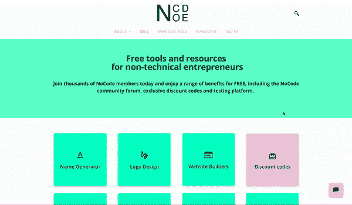
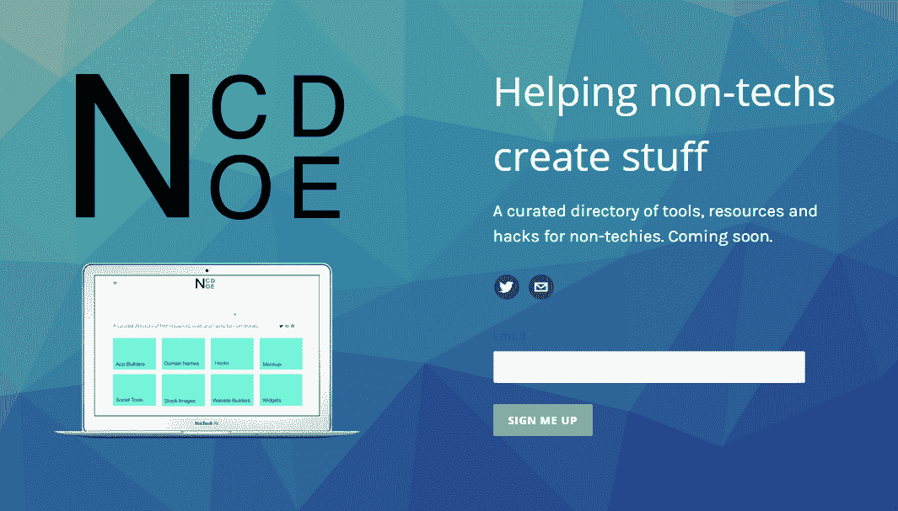
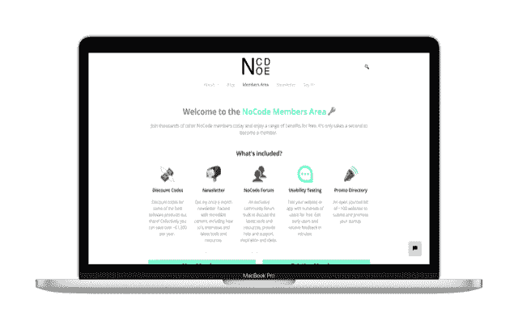
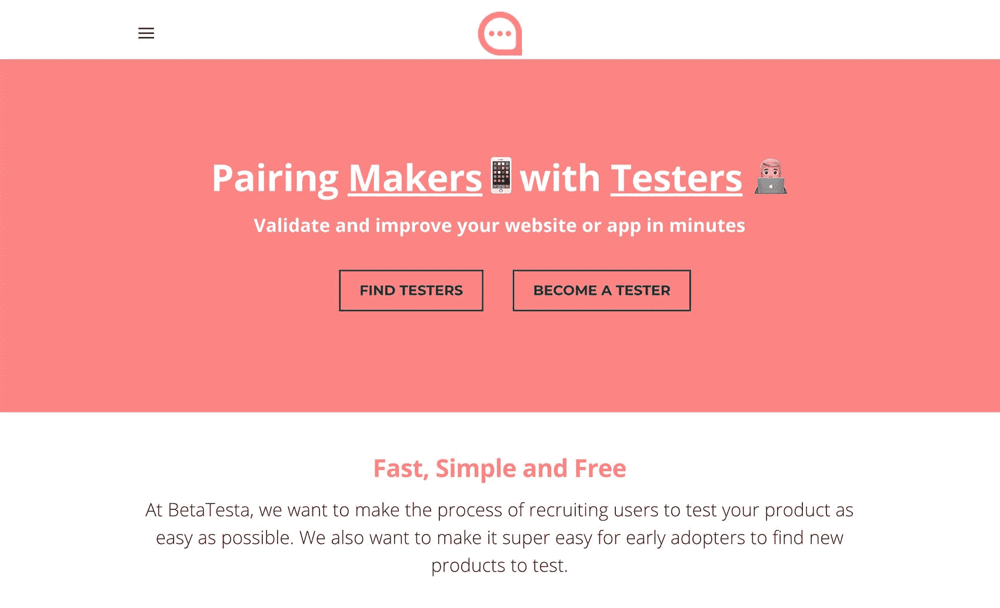

# 为非技术人员建立工具和资源目录

> 原文：<https://www.indiehackers.com/interview/building-a-directory-of-tools-and-resources-for-non-technical-makers-0db30533a5>

## 你好！你的背景是什么，你在做什么？

嗨！我叫山姆·迪克。我住在伦敦，白天是 ucreate 的产品经理，晚上是独立黑客。我是 [NoCode.tech](http://www.nocode.tech/) 的创始人和制造者。

NoCode 是一个免费管理的工具和资源目录，面向非技术人员和企业家。它提供了你创建在线业务所需的所有免费工具和资源。

大约 14 个月前，我推出了 NoCode，目前拥有 3000 多名会员，通过网站上的会员链接和时事通讯赞助，每月净收入约为 400 英镑。

 

## 是什么促使你开始使用 NoCode？

我对 NoCode 的最初灵感来自于我在产品搜索上发现的一个奇妙的网站，名为 [Startup Stash](http://startupstash.com) ，由 [Bram Kanstein](https://twitter.com/bramk) 创建。这个概念非常简单:在一个登陆页面上平铺分类，提供你创业所需的所有工具和资源。这让我开始思考。

这些年来，在构建各种在线项目的同时，我已经积累了数百种不同的工具和资源，保存在电子表格、笔记本、Evernote 和书签中。所以我决定整理这份名单，并让像我一样的非技术型创始人也能在网上看到。

## 构建最初的产品需要什么？

由于我没有技术背景，在创建 NoCode 时也缺乏技术知识，我决定使用 Weebly(一个流行的拖放式网站构建器)来构建这个网站。这让我可以通过挑选现成的主题(折纸)并对其进行一些小的调整，在几周内将一个网站组装起来。然后，我使用基本的嵌入工具实现了各种第三方工具，包括:

*   电子邮件捕获弹出窗口: [MailChimp](https://mailchimp.com/)
*   促销代码弹出:[权限](https://privy.com/)
*   社交分享侧边栏:[分享这个](https://www.sharethis.com/)
*   联系方式:[类型方式](https://www.typeform.com/)
*   实时聊天工具:[漂移](https://www.drift.com/)
*   数据输入:[空气表](https://airtable.com/)

到目前为止，这个设置工作得非常好，我还没有考虑建立一个自定义网站的需要。

该网站通常每周需要大约 2-3 个小时来回复电子邮件、创建时事通讯以及寻找/添加新的工具和资源。

你不需要受过正式的工程教育就能理解构建一个产品的基础。

TweetShare

我运行该网站的唯一成本是 7 个月 Weebly Pro 包订阅。我曾经为我的 MailChimp 列表付费(因为任何超过 2000 的订阅者都需要付费)；然而，在[删除了我 25%的不活跃电子邮件用户](https://www.indiehackers.com/@thisdickie/why-i-unsubscribed-25-of-my-newsletter-subscribers-3dd2d13590)后，我暂时回到了免费层。

## 你是如何吸引用户并发展 NoCode 的？

老实说，我非常紧张(我想你称之为自举),并且依靠寻找免费的方法来获得用户。

最初，在我创建 NoCode 的时候，我使用 [Canva](https://www.canva.com/) 创建了一个带有电子邮件捕获表单的快速登陆页面和一个模拟的主页截图。

然后我设法上了[测试列表](https://betalist.com)，在那里我得到了大约 35 个注册。后来，我让那些感兴趣的早期用户来测试我最初的网站原型，并获得对我的一些想法的反馈。这种方法被证明是非常有价值的信息，并有助于验证我早期的一些假设。

这是我 2016 年的丑屁股登陆页面:

 

在网站公开发布几周后，我有幸让[出现在产品搜索](https://www.producthunt.com/posts/nocode)上。这极大地提高了网站的流量，为我提供了数百名电子邮件订户和大量建设性的反馈供我考虑。

**我今天如何驾驶交通**

*内容*:我[创建了一个媒介账号](https://medium.com/@samdickie)并开始写 *How-to 的*针对我的非技术受众。我还在独立黑客、Reddit (r/startup)以及 NoCode 时事通讯和社区论坛上转发了这些内容。

我还在其他著名网站上写了一些客座博文，效果非常好，增加了网站的高质量反向链接，从而慢慢提高了我的 SEO 排名。这不是你可以看到立竿见影的效果。然而，这肯定值得努力。

社交媒体:我使用 Twitter，虽然我可以用得更多。我还在伦敦做过几次演讲，提到了 NoCode，它也有助于口碑推荐。

为了提高我的搜索引擎优化，我通过 Fiverr 雇佣了一个自由的搜索引擎优化专家来优化网站，因为我不知道如何构建我的网站地图或元标签。几个月后，我注意到来自谷歌的流量有了实质性的提高。现在，我的很多流量来自我的[模型生成器目录](http://www.nocode.tech/mockups.html)，当你在谷歌上搜索术语“*在线模型生成器*”时，它排名第二。

 

我用来增加流量的另一个方法是 NoCode 会员区，它被证明是非常宝贵的。这包括网站上的一些工具和资源的独家折扣代码、社区论坛、时事通讯、免费访问 [BetaTesta](https://www.indiehackers.com/@thisdickie/my-weekend-mvp-acquiring-hundreds-of-users-without-code-or-cash-4dde9db127) (我的另一个项目)以及推广目录列表。自从 6 个月前推出会员专区以来，我看到用户数量翻了一番，保留率也提高了。现在，网站的访问者有理由成为会员并提供他们的电子邮件地址。

## 你的商业模式是什么，你是如何增加收入的？

我只是在过去的 10 个月里才开始赚钱，因为最初我非常担心赚钱太早，在推出时提供的流量和价值很少。然而，当我开始收到更多的网站流量和添加更多的功能时，我开始考虑网站的盈利方式。

我慢慢地开始介绍我在网站上推荐的一些工具和资源的附属链接。不过，我有一句警告！代销商模式是一个有点忌讳的话题，你需要小心不要成为被代销商计划引入歧途的受害者，因为你可能开始变得贪婪，为了获得更多收入而故意开始推销产品。这几乎肯定会影响网站的完整性，我想确保我选择的所有工具和资源都是因为它们将提供价值，因为它们是他们所做的最好的，而不仅仅是因为他们有一个好的联盟计划。

你可以自己学到很多东西。现在有这么多免费的好资源。

TweetShare

过了一段时间，我收到了我的第一笔支出，但当它到来时，这种感觉是难以置信的！这真的增强了我的信心，也证明了我可以通过运营这个网站赚些钱。然而，在网站上的 200 多个工具和资源中，只有大约 15%包含附属链接，所以在网站上使用这种模式只能产生这么多收入。

我也开始每周收到一些电子邮件，询问他们是否可以在我的时事通讯上展示他们自己的工具或资源。因此，我开始收费出现在时事通讯的专题部分。我设法找到一个赞助商，但有很多工作要做，我想改善这个过程。

| 月 | 收入 |
| --- | --- |
| 2017 年 1 月 | 396 |
| 2017 年 2 月 | 158 |
| 17 年 3 月 | 0 |
| 2017 年 4 月 | 105 |
| 2017 年 5 月 | 0 |
| 2017 年 6 月 | 105 |
| 2017 年 7 月 | 105 |
| 2017 年 8 月 | 396 |
| 17 年 9 月 | 0 |
| 17 年 10 月 | 200 |
| 17 年 11 月 | 160 |
| 2017 年 12 月 | 140 |
| 2018 年 1 月 | 198 |
| 2018 年 2 月 | 259 |
| 18 年 3 月 | 401 |
| 2018 年 4 月 | 490 |

这是一个非常不稳定和不稳定的每月收入，所以未来我会考虑各种方法来稳定 MRR，也许会开始向新用户收取一次性会员费。

## 你未来的目标是什么？

我的未来路线图包括围绕 NoCode 构建一个更大的产品生态系统。这是我过去几个月一直在积极努力的事情。我真的很喜欢创建新的附带项目，以某种方式，形状或形式补充 NoCode，并将它们链接到成员区。

我最近创建了 [BetaTesta](http://www.betatesta.xyz) ，这是一个简单的平台，旨在帮助兼职项目的开发者找到用户来测试他们的网站或应用。

 

我喜欢创建一些小的在线被动收入来源的想法，每个新的附带项目补充下一个。然而，我必须承认，比起项目的实际运行，我似乎更喜欢创建副业，这可能是我需要改进的地方。

我的其他未来目标包括改善网站的一些指标，包括跳出率、流量、订户和 MRR。我真的很喜欢创造新的实验，比如用户界面的调整、成长技巧或者时事通讯格式的改变，然后分析这些数据，看看发生了什么变化。

## 你面临的最大挑战和克服的障碍是什么？如果你必须重新开始，你会做什么不同的事？

起初，我缺乏技术技能和经验，这被证明是一个挑战，有时甚至令人望而生畏。然而，坚持不懈是关键，最终我总能找到解决任何问题的替代方案。

也许我最大的挑战*(我相信许多其他人也经历过这个*)是缺少时间。和许多人一样，我在全职工作的同时，还负责多个兼职项目。有时候，我很难找到时间来管理我的工作生活、兼职项目和社交生活。然而，这种约束也迫使我优化我的时间，并确保它以最有效的方式使用。每天晚上划出时间，列出待办事项清单，确保我保持动力，不断前进。

在过去的几个月里，我一直在寻找减少维护网站所需时间的方法。首先，我优化了简讯模板，减少了我每月创建简讯所花费的时间。我还使用 MailChimp(现在是免费的)自动化触发工具为新用户创建了电子邮件自动化。我还使用 [Missinglettr 的](https://missinglettr.com)免费媒体整合和滴流活动工具建立了一个自动社交滴流活动。

老实说，如果我必须重新开始，我不认为我会做什么不同。然而，我会试着多享受一点这种经历，在整个过程中不要让自己受制于如此艰难的个人期限。鞭策自己，养成结构和套路的习惯是一回事。然而，如果你给自己太多压力，你会开始讨厌这个项目，然后它变成你每周待办事项清单上的另一个项目，你可能会开始讨厌做它。

享受这个过程，爱上你正在努力解决的问题，并确保你乐在其中。

## 有没有发现什么特别有帮助或者有优势的？

面向非技术人员的在线工具和资源数量惊人。非技术型企业家的崛起一年比一年普遍。你不需要有技术技能来创建一个网站，列出一个产品/服务，并开始赚钱！

鉴于我缺乏专业技能，我不确定 5 年前我是否会写这篇文章。然而，这些天我还没有遇到需要外界帮助的障碍。有如此多的操作指南、媒体帖子和 YouTube 视频记录了一切。

**播客**

*   [NPR:我是如何建造这个](https://www.npr.org/podcasts/510313/how-i-built-this)
*   [创业聊天](https://thestartupchat.com/)
*   [独立黑客播客](https://www.indiehackers.com/podcast)

**内容**

*   [将副业项目转变为利润丰厚的创业公司](https://www.youtube.com/watch?v=6reLWfFNer0)
*   [如何在没有技术背景或预算的情况下创业](https://producthabits.com/how-to-build-your-startup-with-no-technical-background-or-budget/)Hiten Shah
*   本·托塞尔的[非技术性产品发布指南&附带项目](https://medium.com/startup-grind/the-non-technical-guide-to-launching-products-side-projects-1c5a9562fdb3)

**时事通讯**

*   [启动观看](https://startupwatching.com/)
*   [产品习惯](https://producthabits.com/)

## 对于刚刚起步的独立黑客，你有什么建议？

开始制作吧。你可以把所有的时间都花在研究和计划上，但是很少有人真正开始构建，更少有人真正设法交付他们的项目。一开始这让人望而生畏，会让你面临很多潜在的批评，但另一方面，它也会让你获得很多支持。只需查看独立黑客上的一些附带项目，它令人难以置信地鼓舞人心。

一旦你建立了一个东西，发布了它，并得到了一些用户的支持，这是一种令人难以置信的满足感，并变得有些上瘾。这就像一个食谱，一旦你知道开发它所需的成分，你就会不断迭代，每次都变得更好。

开始制作吧。你可以把所有的时间都花在研究和计划上，但是很少有人真正开始建设。

TweetShare

你不需要受过正式的工程教育就能理解构建一个产品的基础。你可以自己学到很多东西。现在有这么多免费的好资源。只要花时间尽可能多地吸收，它最终会变得有意义。然而，阅读和观看指南只会让你走得更远。你需要开始创造和犯错误！

## 我们可以去哪里了解更多？

你可以看看我的博客,我在那里记录了迄今为止构建 NoCode 的大部分历程。我创建了一个每月的[时事通讯](http://www.nocode.tech/newsletter.html)，在那里我也试着让我的订户了解我的进展、想法和其他附带项目。我在推特 [@thisdickie](https://twitter.com/thisdickie) 上也很活跃，欢迎随时联系！

如果你有任何问题，请在评论中留言，我会尽快回复你！

—[<picture id="ember8067603" class="user-avatar ember-view user-link__avatar"></picture>山姆·迪基](/thisdickie?id=q4tUifsiQNZWCoNqGb1kVg3BYvj2)，NoCode 的创始人(后天)

## 想像 NoCode 一样建立自己的事业？

你应该加入[独立黑客社区](/)！🤗

我们是几千名创始人，互相帮助建立有利可图的业务和副业。来分享你正在做的事情，并从你的同事那里获得反馈。

还没准备好开始使用你的产品吗？没问题。这个社区是一个认识人、学习和实践的好地方。随意[随便浏览](/)！

—[<picture id="ember8067608" class="user-avatar ember-view user-link__avatar"></picture>考特兰艾伦](/csallen?id=ibTLPyjwVebnZjMGKvz6ztarnuV2)，独立黑客创始人

61votes