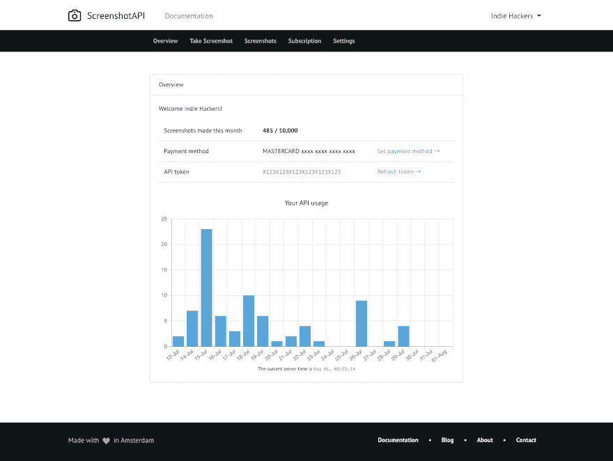
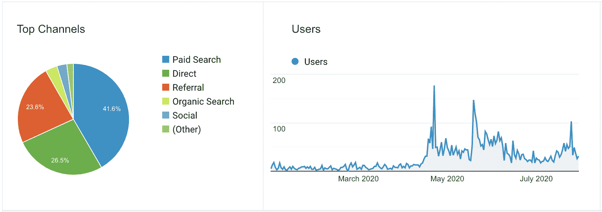
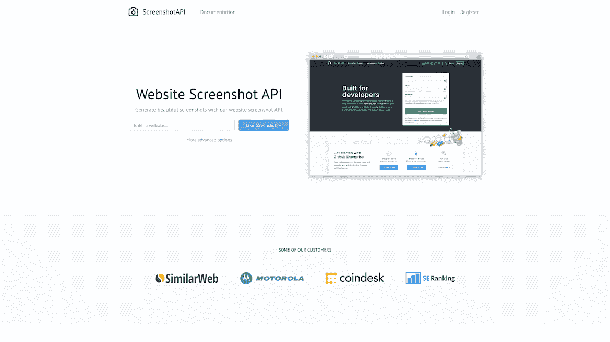

# 建立一个能自我回报的爱好项目

> 原文：<https://www.indiehackers.com/interview/building-a-hobby-project-that-pays-for-itself-c43f9efdc8>

## 你好！你的背景是什么，你在做什么？

我叫德克·霍克斯特拉。我是阿姆斯特丹的一名软件开发人员。

在过去的几个月里，我一直在利用空闲时间研究 screenshotapi.net。Screenshotapi 是一个工具，允许开发人员通过简单的 api 调用对网站进行截图。

今天，这个工具有 20 个活跃的付费用户，每 MRR 大约赚 400 美元。

## 是什么促使你开始接触 ScreenshotAPI.net？

这一切都始于我创建的一个个人爱好项目。我想创建一个新闻文章目录。在主页上，我想显示所有索引新闻文章的截屏。这意味着我必须弄清楚如何自动抓取网站截图。

我的座右铭是，“我不知道我在做什么，但这不会阻止我。我只是要搞清楚什么可行，什么不可行！”

TweetShare

我开始谷歌搜索，无意中发现了截图 API。我测试了一个，很有效。然而，它每月收取我 35 美元。我不喜欢为一个爱好项目每月支付那么多钱，所以我想我应该建立自己的截图系统。当我在做的时候，我想我也可以把这个系统变成一个成熟的截图 SaaS 应用程序。

## 构建最初的产品需要什么？

建造它是相当残酷的，因为我是全职工作。记得下班回家，强迫自己挤出一两个小时编程。但是几个月后，screenhsotapi.net 的 T2 T3 开始运行了。

最初的 MVP 比现在少了很多功能。但是，我想看看用户是否真的会使用我的 API，在我对所有的特性疯狂之前。

## 你的技术是什么？

我是一个 Laravel 的粉丝，所以我总是在 Laravel 创建我的个人项目。对于前端，我使用普通 Javascript 和 Vue 的组合。

我认为如果我要构建一个 SaaS 应用程序，它应该是可伸缩的。所以我决定在谷歌云上运行一切。

截图是通过旋转一个真正的 Chrome 浏览器(使用 [Selenium](https://www.selenium.dev/) )创建的。)这样一来，网站呈现出来的效果就和普通电脑上的完全一样。

我最近写了一篇[深入的文章](https://medium.com/@dirk_hoekstra/building-a-website-screenshot-api-3aeb3f21b465)关于截图是如何创建的。

## 你是如何吸引用户和发展 ScreenshotAPI.net 的？

我遇到了许多其他开发人员遇到的同样的问题。我创造了一个产品，但不知道如何吸引用户。

我做的第一件事是观察我的竞争对手在做什么。我使用了 Ahrefs 工具来查看他们是如何产生流量的，以及他们的反向链接是从哪里来的。

然后我简单地做了看起来对他们有用的事情。这意味着提交 API 到目录列表，在著名的技术博客上写博客文章，等等。

大多数反向链接没有产生流量，尤其是从目录列表网站。但是我认为它们对搜索引擎优化确实有一些价值。

对我来说，真正管用的是谷歌广告。我目前在谷歌上为“截图 API”关键词每月花费 100 美元。到目前为止，20 个付费用户中有 13 个来自谷歌的付费广告。

如果你看一下谷歌分析报告，你会发现当我开始在谷歌广告上做广告时，用户数量激增。

【T2

我还在想办法解决这个问题。但我的策略仍然是观察竞争对手在做什么，并尝试看看这是否也适用于我。

## 你的商业模式是什么，你是如何增加收入的？

ScreenshotAPI 使用 SaaS 的商业模式。有一个免费计划，每月提供 100 张截图，还有一些付费计划，从每月大约 9 美元到每月大约 175 美元不等。

我最近提高了价格。当我刚开始时，我对最小的套餐收费 5 美元，但我觉得如果你收取这么少的费用，人们就不会把你当回事了。不过，价格上涨只针对新客户，因为我觉得我的早期适应者值得一些额外的爱。那是几周前的事了，从那以后就没有新的付费用户了，所以我得看看这是不是一个好的决定。

平均每个月有两个付费客户签约，流失率真的很低。所以收入增长缓慢但非常稳定。

目前，收入约为每月 415 美元。

| 月 | 收入 |
| --- | --- |
| 1 月 20 日 | 10 |
| 2 月 20 日 | 35 |
| 3 月 20 日 | 45 |
| 2010 年 4 月 | 211 |
| 5 月 20 日 | 191 |
| 2010 年 6 月 | 203 |
| 2010 年 7 月 | 353 |

## 你未来的目标是什么？

如果你看看上面的用户图，你会发现大多数用户来自付费广告和推荐链接。

我觉得我可以提高我的搜索引擎优化很多，我的目标是通过这种媒介吸引更多的用户。这意味着我正在提高我的写作技巧，并接触许多知名的博客。我不想盲目地发送我的反向链接，所以我的意图是通过反向链接向[screenshotapi.net](https://screenshotapi.net)发送高价值的文章。

我还计划构建更简单的 SaaS 应用程序。我相信解决一件小事比糟糕地解决五件大事要好。

但目前，我最大的障碍是时间，因为我也在全职工作。如果截图 API 达到 1000 美元的 MRR，然后我会切换到这个全职。但在那之前，它仍然是一个副业。

## 如果你必须重新开始，你会做什么不同的事？

营销方面，我不知道自己在做什么。如果我必须重新开始，我会从头开始。

例如，我不知道寻找产品是一件事。当我提交我的产品时，它悲惨地失败了。所以如果我有机会再做一次，我会在寻找产品上投入更多的努力。

## 有没有发现什么特别有帮助或者有优势的？

我把整个冒险视为一个大实验。我的座右铭是，“我不知道我在做什么，但这不会阻止我。我只是要搞清楚什么可行，什么不可行！”

我相信解决一件小事比糟糕地解决五件大事要好。

TweetShare

我相信这是一个健康的心态，当你开始为自己做事的时候。因为每当事情失败时(比如我的产品搜索发布会)，这种心态帮助我把它更多地视为一次学习经历，而不是一次失败。

## 我们可以去哪里了解更多？

如果你对我的旅程感兴趣，你可以在[推特](https://twitter.com/Dirk1345)或[上关注我，查看我的博客](https://coffeecoding.dev)

如果你还有其他问题，请在下面的评论中告诉我。

感谢阅读！

——[<picture id="ember5249325" class="user-avatar ember-view user-link__avatar"></picture>德克霍克斯特拉](/dirk94?id=oLNUJJfOAiZUK2HBJtjtWnV6Ibj2)

## 想像 ScreenshotAPI 一样建立自己的事业？

你应该加入独立黑客社区！🤗

我们是几千名创始人，互相帮助建立有利可图的业务和副业。来分享你正在做的事情，并从你的同事那里获得反馈。

还没准备好开始使用你的产品吗？没问题。这个社区是一个认识人、学习和实践的好地方。随意[随便浏览](/)！

——[<picture id="ember5249330" class="user-avatar ember-view user-link__avatar"></picture>考特兰艾伦](/csallen?id=ibTLPyjwVebnZjMGKvz6ztarnuV2)，独立黑客创始人

39votes