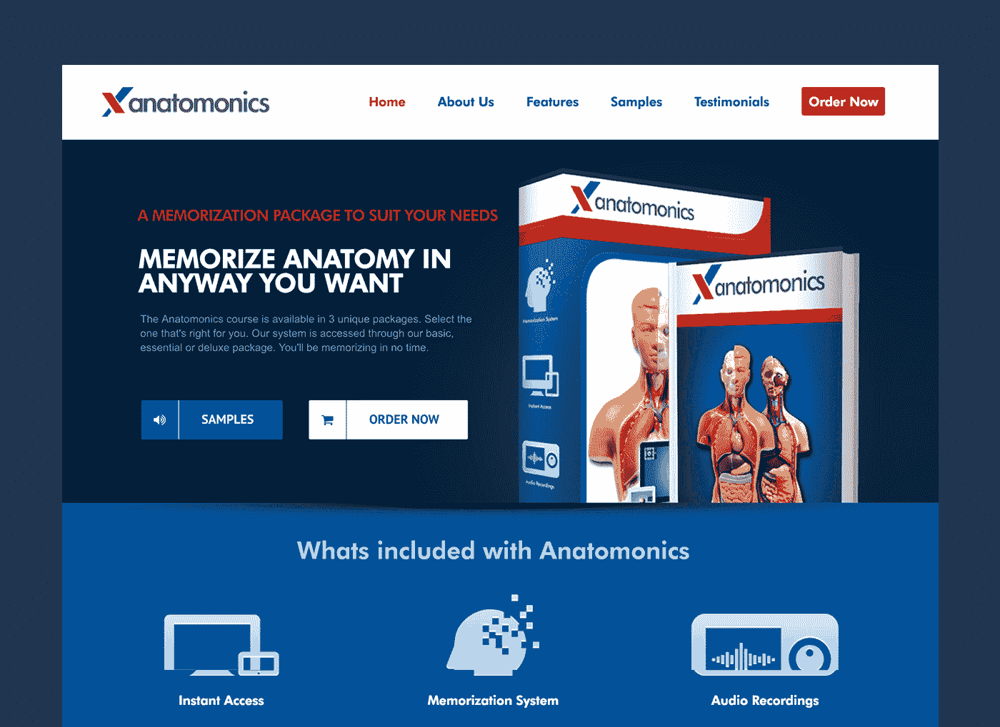

# 为记忆人体解剖学建立一个有利可图的工具

> 原文：<https://www.indiehackers.com/interview/building-a-profitable-tool-for-memorizing-human-anatomy-b87f4f6929>

## 你好！你的背景是什么，你在做什么？

你好。我叫 Mike，是澳大利亚悉尼的一名 web 开发人员。在过去的 10 年里，我一直在网上谋生。在那段时间里，我尝试了几乎所有的方法:联盟营销、产品创造、直运、广告和销售线索挖掘。一路走来，我经历了许多失败和成功。我抛弃了失败，但是成功仍然保留在我的“项目组合”中。

今天，我要谈论的是解剖学。这是一种帮助人们记忆人体解剖结构的音频系统，通常由医学学生和物理治疗师购买。他们喜欢它，因为它简化了所有人体解剖学术语(有数百个)的记忆。

该网站已经上线 7 年，平均收入为每月 800 美元。这没什么值得大书特书的，但这已经是你能得到的最接近被动收入的收入了。

[

今天的 Anatomonics 主页。](http://www.anatomonics.com) 

## 是什么促使你开始学习解剖学？

2007 年，我和许多其他人一样，读了蒂姆·费里斯的《T2》中的《每周 4 小时工作制》。它让我看到了一个新世界和一种新的工作方式。因为我有了可观的积蓄，我辞掉了网站开发的工作，开始工作。

最初，我是靠加盟网站和 SEO 赚钱的。这样做了两年后，我意识到这不是一个伟大的长期战略。我建立的每个网站都会在一段时间内赚很多钱，然后被谷歌禁止或被其他人排名更高。

为了让我的收入更加稳定，我开始考虑长远发展，并决定尝试创造自己的产品。于是，[解剖学](http://www.anatomonics.com)诞生了！

如果你想做的只是支付你的基本开支，一个快速启动的小项目可能会达到目的。

TweetShare

我对该产品的目标非常适中。我想，如果我能做点什么，每月产生几百美元的被动收入，我会很高兴。

## 你是如何想出这个主意并确保人们想要它的？

我一直对记忆感兴趣，所以我认为这是一个很好的起点。我去了谷歌 Adwords 工具(现在的关键字规划器)，输入“记忆”。其中一个关键词建议是“记忆解剖学”，于是我就从那里去了。在头脑风暴了一些想法后，我决定将解剖学记忆术与音频结合起来可能是一个好方法。

为了验证这个想法，我决定创建一个真正的“最小可行产品”(MVP)。事实上，我称之为 MVT:最小可行测试。最初的网站是一个纯文本的单页网站，有一个简单的标志和一些 iStock 图像。没有要“订购”的产品，所以我添加了一个网页选择框，上面写着“要开始订购，只需在下面填写您的电子邮件。”

那些填写了电子邮件的人收到了这样的消息，“很遗憾，我们现在正在升级 [Anatomonics](http://www.anatomonics.com) ，因此无法订购。一旦系统重新启动，我们将很快向您发送电子邮件。”

我通过一些冰冷的电子邮件和广告词来控制流量。在大约 200 名访问者中，有 8 人向我的测试表格提交了他们的电子邮件地址。这意味着每 25 个人中就有一个对我还没有开发的产品感兴趣。不用说，我对推进这个想法感觉很好。

## 独立黑客社区成员 [tvmaly](/user/tvmaly) 问道:迈克尔，如果你今天开始一个新项目，你还会使用伪订单页面吗？

绝对的！事实上，从那以后，我已经多次使用相同的技术。这是测试东西最快最便宜的方法。

也就是说，这可能不是每种产品的最佳方法。这是一次性购买产品或挖掘潜在客户的理想选择。然而，对于 SaaS 或者一个软件产品，你可能需要为你的初始测试做一些直接销售。销售这些类型的产品时，很难让客户接受。

感谢提问:)

## 构建最初的产品需要什么？

制造最初的产品并不困难，但它确实需要一笔现金支出，这笔钱来自我的个人储蓄。我用 Elance(现在是 UpWork)雇佣了一名研究员和一名配音员。研究人员出去收集了尽可能多的解剖学记忆方法，并把它们汇编成一份报告。一旦对助记符感到满意，我就让配音员把每一段录音作为一个单独的 mp3。完成这个产品花了大约 1 个月和几千美元。

该网站是建立在 WordPress 和所有支付使用贝宝处理。我选择这些技术是因为它们免费且易于使用。设置这一切又花了几个星期。从构思到实际推出总共花了大约 2 个月的时间。

## 你用什么策略来增加 Anatomonics 的流量？

我的第一个营销策略是联系已经在我的订单中输入了电子邮件的用户。因为我以相当低的价格获得注册，所以我继续使用我最初构建的登录页面来验证产品。

在你决定创造一个产品之前，找到一个好的营销渠道。

TweetShare

到发布日，我收到了大约 30 个感兴趣的买家的电子邮件地址。我给他们每个人都发了个性化的电子邮件，解释了为什么会耽搁，并提供了一个以 50%的价格购买产品的特殊链接。那天我做了大约 10 笔生意，非常有希望。

推出后，事情逐渐平息，直到我尝试了一些文章营销(当时很热)和 YouTube。YouTube 的影响最大。它带来了大量良好的转换流量，并持续发送流量到今天。我还在网站上做了一些 SEO，这带来了相当有针对性的(尽管是长尾)流量。

| 月 | 收入 |
| --- | --- |
| 瑕疵 | 406 |
| 四月 | 349 |
| 五月 | 292 |
| 六月 | 284 |
| 七月 | 210 |
| 八月 | 233 |
| 九月 | 385 |
| 十月 | 524 |
| 十一月 | 343 |
| 十二月 | 301 |
| 一月 | 402 |
| 二月（February 的缩写） | 441 |

## 你的营收背后有什么故事？

Anatomonics 是一次性购买，我提供 3 个不同价位的不同套装。订阅收入会很好，但它确实不适合这个产品。如果这是你第一次发布产品，我建议你考虑一次性购买的想法。一次付款就能转化一个客户要容易得多，这也是一个让你尝试的好方法。

不要害怕对有实际价值的东西要价很高。开始的时候，我从来没有想过我会收取 87 美元的费用，但是现在你知道了。我还建议在您的订单页面上有 3 个不同的价格点。事实证明，人们更有可能购买位于中间的包装。当我在我的网站上实现这一点时，我立即开始以相同的转换率每销售多赚 30 美元。

当然，销售数字产品的美妙之处在于，一旦你收回了最初的成本，剩下的就是小菜一碟了。我的支出微乎其微:只有贝宝费和托管费。

| 月 | 收入 |
| --- | --- |
| 瑕疵 | 984 |
| 四月 | 870 |
| 五月 | 522 |
| 六月 | 492 |
| 七月 | 435 |
| 八月 | 632 |
| 九月 | 1044 |
| 十月 | 1328 |
| 十一月 | 435 |
| 十二月 | 655 |
| 一月 | 696 |
| 二月（February 的缩写） | 1014 |

## 你面临的最大挑战是什么？

最困难的部分是对我正在创造的产品的市场一无所知。还不算太糟，因为我确实喜欢学习，但它确实让我慢了下来。我给那些没有时间或现金的人的建议是，尝试围绕你所知不多的东西推出你的第一个产品。

也就是说，鉴于这个项目的性质，如果我能回到过去，我不会做太多不同的事情。我一直将它视为一个有趣的项目，看看我是否能成功推出自己的数码产品。从这个角度来看，这是成功的。

## 你最大的优势是什么？有什么特别有用的吗？

我最大的优势是*的运气*！我出生于 1981 年，经历了互联网的黎明，我的父亲在我 13 岁时购买了一台个人电脑和调制解调器。这给了我一个非常好的基础和对不断变化的世界的理解，这导致了我对计算的兴趣，并最终获得了计算机科学的学位。*但是*……我认为这些都不是成功的必要条件。

想出点子最重要的是你的创造力。我几乎每天都想出一些随机的想法，但几乎所有的想法我都不打算付诸行动。我允许自己享受其中的乐趣。

例如，有一天我的个人想法提示可能是这样的，“结合 Twitter 和 YouTube APIs 提出 10 个商业想法。”然后第二天可能是，“为著名企业家主演的电视真人秀想出 10 个点子。”我的目标不是想出百万美元的点子，而是让我的创造力发挥作用。尝试几个星期，你会惊讶地发现自己变得更有创造力了。

附言:我从詹姆斯·阿尔图彻那里偷来了这个想法；)

## 对于刚刚起步的独立黑客，你有什么建议？

从小处着手！不要一上来就试图建造下一个脸书。事实上，根本不要试图打造下一个脸书。把它当作一次学习经历。这样即使失败了，你也可以把它看作是成功的。

对你的目标和工作成果要现实。如果你想做的只是支付你的基本开支，一个快速启动的小项目可能会达到目的。

在你决定创造一个产品之前，找到一个好的营销渠道。如果你的头脑不在某个特定的市场，找到问题来解决会很困难。考虑使用替代资源来寻找你可能没有想到的市场需求，例如谷歌关键词规划器、论坛和群组。

小流量+高转化= $$$。不要建立一个依赖成千上万的用户来赚钱的产品。相反，想想看，“如果我能让 100 个特定人群的人访问我的网站，我该如何最有效地利用这些用户？”

如果你读过埃里克·里斯的《精益创业、彼得·泰尔的《T4》和蒂姆·费里斯的《4 小时工作制》，你就会知道足够多可以开始工作了。如果你读完这些书后仍然难以赚钱，那么问题不在于缺乏信息。问题是你！

出于这个原因，我推荐阅读关于注意力、感知、拖延和生产力的书籍。理解*为什么*你在创造性地挣扎，*为什么*你在拖延，以及*为什么*你似乎不能让事情进展，是解决这些问题的最好的第一步。我建议:

*   斯蒂芬·科维的《高效人士的 7 个习惯》
*   史蒂文·普雷斯菲尔德的《艺术的战争》
*   [可预见的非理性](http://amzn.to/2lrLaWL)丹·艾瑞里
*   更快更好更强医学博士埃里克·海登
*   《动力:激励我们的惊人真相》丹尼尔·平克著

还有很多。如果有人感兴趣，请在评论中告诉我，我会推荐一些。:)

## 我们可以去哪里了解更多？

就社交媒体而言，我完全脱离了网络！我知道，对于一个在网上谋生的人来说，这很奇怪。

然而，我仍然希望听到其他独立黑客的意见。请在下面留下评论或问题，我一定会回答。如果你想要更多的信息，请通过论坛与我联系。我的用户名是 [benko](/user/benko) 。

感谢科特兰邀请我成为独立黑客的一员。这是一个很棒的网站，有很好的资源，我很高兴能参与其中！

——[<picture id="ember8233437" class="user-avatar ember-view user-link__avatar"></picture>迈克·本科维奇](/benko?id=xIMqoekR6AeIHUSdHIY0NiePDhg1)【安纳托利亚学的创始人

## 想像 Anatomonics 一样建立自己的事业？

你应该加入[独立黑客社区](/)！🤗

我们是几千名创始人，互相帮助建立有利可图的业务和副业。来分享你正在做的事情，并从你的同事那里获得反馈。

还没准备好开始使用你的产品吗？没问题。这个社区是一个认识人、学习和实践的好地方。随意[随便浏览](/)！

—[<picture id="ember8233442" class="user-avatar ember-view user-link__avatar"></picture>考特兰艾伦](/csallen?id=ibTLPyjwVebnZjMGKvz6ztarnuV2)，独立黑客创始人

7votes