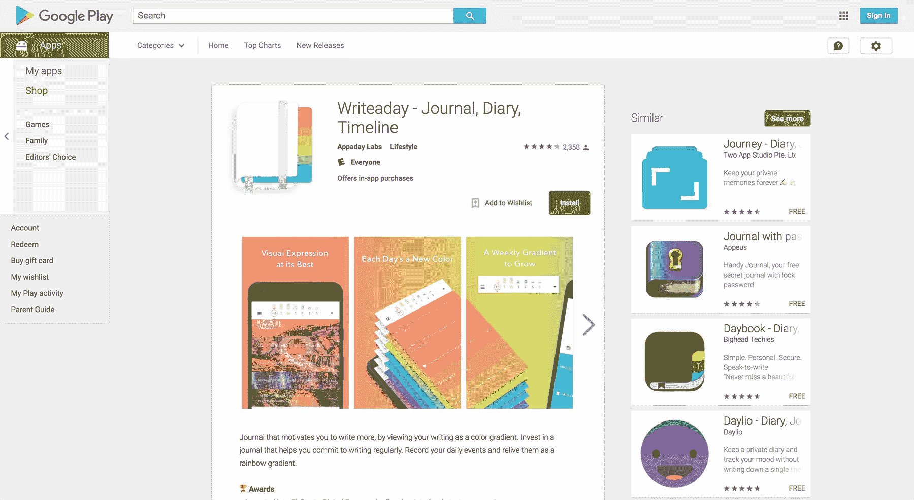

# 建立一个激励他人每天写作的服务

> 原文：<https://www.indiehackers.com/interview/building-a-service-that-motivates-others-to-write-every-day-6365bf519b>

## 你好！你的背景是什么，你在做什么？

嗨！我是 Eddie，来自加州伯克利的 Android 开发者。我自己开发了 [Writeaday](https://play.google.com/store/apps/details?id=com.compscieddy.writeaday) ，这是一款 Android 应用程序，它将写日记的漫长过程分解成几个小块。

老实说，这只是我改善自己写日记习惯的一种方式，但在这个过程中，我发现改善这个古老概念的想法引起了许多其他人的共鸣。

我精心打造了一款平衡的免费增值应用，由于所有伟大的记者都在使用我的应用，它每月能带来 3000 美元以上的收入。老实说，我非常感谢那些给了我很好的反馈并且都是关于积极氛围的用户。

 

## 是什么促使你开始写日记？

我个人对写日记有一种不健康的痴迷，所以 [Writeaday](https://play.google.com/store/apps/details?id=com.compscieddy.writeaday) 有机地产生于为这种痴迷创造一种新工具的愿望。市面上有很多——可能有数千种——日志应用程序。但是我注意到它们看起来非常相似，所以我开始颠覆日志记录。

我认为现在写日记(以及一般的认知记忆)有两个主要问题:

1.  没有人想在一天结束时写 30 多分钟。
2.  当我们*写*日记时，我们写啊写，没有任何东西来帮助我们记住我们过去写的条目。

我开始用 Writeaday 解决这些问题。

## 构建最初的产品需要什么？

在从事 [Writeaday](https://play.google.com/store/apps/details?id=com.compscieddy.writeaday) 之前，我是 Evernote 的一名 Android 开发人员，但我从未自己开发过一个应用程序并向全世界发布。

我经历了几个月的迭代和测试。在整个过程中，我肯定伏击了太多我的朋友，以获得他们的投入和测试他们的新设计。

老实说，没有全职收入来支持你的努力，想要开发一个应用程序是非常困难的。大多数扩大我的用户群的尝试都失败了，所以我很早就决定专注于尽可能做出最好的产品。

除了技术编码方面，我还必须学会设计意识，学会如何使用设计工具，例如[Sketch](https://play.google.com/store/apps/details?id=com.sonymobile.sketch&hl=en)——一个基本上成为我一切的应用程序。

只要把 v1 拿出来，稍微烤一下，然后拼命工作，一次又一次地改进它。

TweetShare

如果你看一下我的草图项目文件，你会看到它基本上看起来像一个日常设计的《我的世界》世界。我的每一次迭代和每一个想法都会直接进入那个文件。

全职开发一个应用程序不仅仅意味着解决一个难题，并试图为它创建一个好的界面。这也是一场与时间的赛跑，消耗你的积蓄，尤其是对于像湾区这样生活成本高昂的地方。

我在调查自己的财务状况时有过一些黑暗的时刻，我想知道在这个应用上工作是否是正确的选择。当用户增长很好的时候，我已经达到了你无法想象的高度。但是还有更多周用户增长停滞或下降。在那段时间里，你必须能够战胜怀疑。

## 你的商业模式是什么，你是如何增加收入的？

我可以预见广告将会受到用户欢迎的未来，但我们现在还没到那个阶段。

凭良心说，我不能在我用户的视网膜上发垃圾广告，所以我采用了免费增值模式。有些用户不能(或不愿)为一个应用付费。我不会浪费时间尝试追加销售。我只是想让他们有一个好的体验，留下一个好的评价。如果你没钱雇佣全职销售人员，免费用户是你最好的销售人员。

我提供订阅和终身保费两种选择。终身选项有助于在短期内刺激收入增长，但其想法是更重视订阅方面的事情，并依赖于未来的发展。

## 你未来的目标是什么，你打算如何实现它们？

这只是我为[写作日](https://play.google.com/store/apps/details?id=com.compscieddy.writeaday)计划的一系列阶段中的第一步。写日志只是正念的一种形式。

我想改变日志记录，直到 Writeaday 看起来不像一个日志应用程序。

## 你最大的挑战是什么？你最大的优势是什么？

怀疑是最大的挑战。你听说的所有初创公司创始人实际上都痴迷于他们正在解决的问题，这绝非巧合。如果不是这样，他们早就放弃了创业带来的所有疑虑。

有很多次，我想放弃，找一份全职工作，但这都要感谢发自内心的用户推荐，我才能够坚持下去。所以我认为积极的反馈是我最大的优势。我真的一遍又一遍地这么说，但如果没有我的用户的鼓励，我真的不可能做到这一点。

全职开发一个应用程序不仅仅意味着解决一个难题，并试图为它创建一个好的界面。也是和时间赛跑。

TweetShare

我让人们写评论说 [Writeaday](https://play.google.com/store/apps/details?id=com.compscieddy.writeaday) 如何帮助他们熬过了去看心理医生之间的那一周。当你得到这样的评价，你的产品产生了真正深刻的影响，你会情不自禁地忽略生活中的其他事情来开发这个产品。

此外，还有如此多的资源、文章和建议。很难辨别哪些适合您的特定挑战，但学会浏览这些信息是您今天可以拥有的最重要的技能之一。

## 对于刚刚起步的独立黑客，你有什么建议？

我知道这是硅谷最老的陈词滥调了，但是请尽快发布。别担心什么盛大的节日发布会。只要把 v1 拿出来，稍微烤一下，然后拼命工作，一次又一次地改进它。

我认为保罗·格拉厄姆的文章是创业圣经。阅读它们，但是不要因为做实际工作而分心。

## 我们可以去哪里了解更多？

如果你想开始记录你的生活，而不是在一天结束时无所事事 30-40 分钟，[试着每天写一次](https://play.google.com/store/apps/details?id=com.compscieddy.writeaday)。

您还可以在您选择的社交媒体平台上关注:

*   [推特](https://twitter.com/writeaday)
*   [脸书](https://www.facebook.com/writeaday/)

有什么问题吗？欢迎在下方评论区提问！

—[<picture id="ember5267325" class="user-avatar ember-view user-link__avatar"></picture>爱德华·李](/EdwardLee?id=writeaday-owner)，Writeaday 的创造者

## 想像 Writeaday 一样建立自己的事业？

你应该加入独立黑客社区！🤗

我们是几千名创始人，互相帮助建立有利可图的业务和副业。来分享你正在做的事情，并从你的同事那里获得反馈。

还没准备好开始使用你的产品吗？没问题。这个社区是一个认识人、学习和实践的好地方。随意[随便浏览](/)！

—[<picture id="ember5267330" class="user-avatar ember-view user-link__avatar"></picture>考特兰艾伦](/csallen?id=ibTLPyjwVebnZjMGKvz6ztarnuV2)，独立黑客创始人

7votes