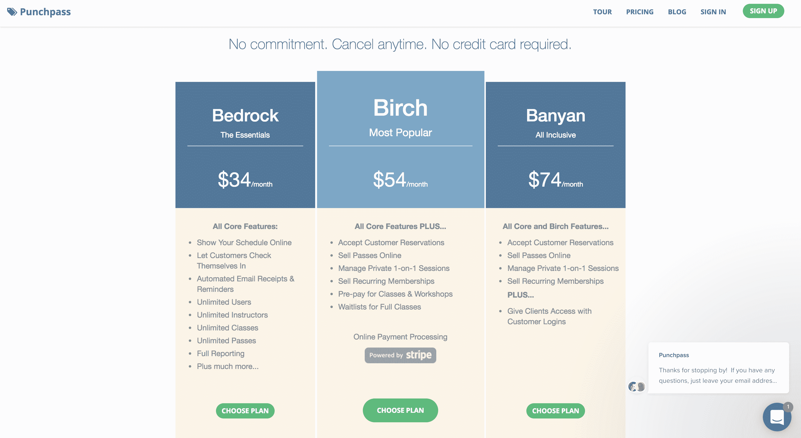

# 为我在当地健身俱乐部发现的问题制定解决方案

> 原文：<https://www.indiehackers.com/interview/building-a-solution-to-a-problem-i-found-at-a-local-fitness-club-7708857c1a>

## 你好！你的背景是什么，你在做什么？

我是克里斯·巴顿，Punchpass 的创始人。我住在佛蒙特州伯灵顿附近，在过去的 14 年里一直住在这里。

我的背景有些不同。我上了一所文理学院，主修艺术史。然后我滑雪游了一年，然后进入科技行业，在一家制作电台和电视台广告植入软件的公司担任安装员/培训师。然后，我过渡到一家硬件公司的技术支持，然后是一家较小的软件公司的 IT。从那里我回到学校拿到了我的 MBA 学位(喘息！)在巴布森学院。在创办 Punchpass 之前，我花了一些时间在其他一些项目上，取得了一些成功，但没有真正的重大胜利。

Punchpass 是一种网络软件，用于跟踪客户课堂出席情况以及小型企业倾向于出售的通行证和穿孔卡片。因此，我们的客户设置他们的课程，在线接受课程预订，向客户出售或分配通行证，然后参加课程。

我们主要用于健身行业——瑜伽馆、私人教练等。但它是非常灵活的软件，所以我们有广泛的客户业务。其中大多数是非常小的本地企业，他们使用 Punchpass 来运行其核心业务，并实现在线交易，如班级预订和 pass 购买。

我在 2013 年创办了这家公司，独自经营了两年，然后引入了一个商业伙伴。我们现在的客户遍布全球 50 多个国家，在 MRR 的收入刚刚突破 27k 美元(每月经常性收入)。

 

## 是什么促使你开始使用 Punchpass？

因此，到 2012 年，我已经启动了几个不同的网络应用程序，一个做得不错，还有几个进展不太好。我目前正致力于推出一款名为 Trillo 的不同应用，并与一家当地企业会面，试图让他们尝试一下。

在谈话过程中，他们说他们还有另一个问题，与他们提供的尊巴健身课程有关。他们有一大盒索引卡，用来记录每个人的出勤情况。因此，他们在纸质名单上记录出勤情况，然后必须将每个出勤记录复制到客户的索引卡上。

他们至少晚了 30 天才报名参加。他们不仅要处理大量的手工工作，而且基本上无法*了解他们的业务是如何运作的。*

我当时的反应基本上是，“这很有意思，但我正在开发一个与给孩子注册课程有关的产品。”

但是这个问题一直困扰着我。几个月后，我处于十字路口——我付不起开发 Trillo 的开发人员的费用，Trillo 只有几个测试客户，所以为了支持这个产品，我需要学习编程。

今天，创建一个网站变得更加容易，营销变得更加容易，接受支付也变得更加容易。

TweetShare

Trillo 是一个 Ruby on Rails 应用程序。多年来，我为自己开发的应用做了大量的前端工作，我有足够的背景知识，我觉得我可以很快掌握 Ruby on Rails。此外，如果一切都走下坡路，至少我有一个坚实的编程技能去找工作！

我通过[实用工作室](https://pragmaticstudio.com/)做了一些标准的在线教程和付费教程(强烈推荐！).但是学习如何编码的最好方法是构建一些东西，我立即想到了在健身工作室跟踪出勤的问题。看起来没那么复杂(著名的遗言)，就着手建了。

## 构建最初的产品需要什么？

我相信我是在 2013 年 2 月开始考虑这个想法的。大约到了 4 月份，我开始认真对待这件事，并在 9 月份开了账单。所以开发花了大约 6 个月的时间，但即使这样，这也是一个非常简单的项目。(这些年来，我们一直在为产品增加许多*功能。)*

到 9 月份，它已经足够好，可以开始收费了，我非常相信这样一个观点，即付费用户是对你的想法能解决问题这一假设的唯一真正验证。

另外，我认为尽早充电可以防止你陷入“只是多了一个功能”的陷阱。虽然更多的功能肯定可以扩大你的市场，你通常可以找到一个较小的部分，你可以更早的目标。

所以在我们的例子中， [Punchpass](https://punchpass.com/) 还没有准备好被一个成熟的瑜伽馆使用，但它非常适合那些每周教几节舞蹈健身课并需要跟踪他们出售的通行证的人。

当我们推出时，我们没有在线课程预订，没有客户登录，没有会员资格，没有在线通行证销售。我们只有核心功能。所以缩小你的视野，意识到你可能比你想象的更早开始充电。

我们从来没有筹集到任何资金，尽管我们在当地的 Burlington，VT，名为 LaunchVT 的创业项目比赛中获得了 15，000 美元的奖金。这让我可以更早一点找到现在的商业伙伴，开始给自己支付固定的薪水，并且减轻了每月支付信用卡账单的压力！

它也允许我购买我们域名的. com 版本。

## 你们是如何吸引用户，壮大 Punchpass 的？

首先， [Punchpass](https://punchpass.com/) 只是我为了学习如何编码而构建的东西。但我觉得那里有些东西。

所以为了决定 Punchpass 是否真的有可能，我发了封电子邮件给一群我在网上找到的尊巴教练。只是解释了我在构建什么，以及我对他们面临的问题的预感。

我很快就得到了强有力的证明，这对于他们来说是一个大问题——没有他们可以使用的简单、负担得起的软件。

所以我继续给舞蹈健身教练和工作室发邮件，最终有 10 个同意成为测试版客户——这意味着他们愿意免费使用软件，给我反馈(并忍受偶尔出现的问题，因为我是一个程序员新手！)，然后当我开始收费时，我会给他们打五折。

我大约在 2013 年 4 月开始这个过程，并在 2013 年 9 月开始计费。那些最初的顾客中有几个今天仍然和我在一起！到年底，我有了 12 个客户，都是通过冷邮件联系的。不是很多，但是一个开始。整个 2014 年的增长主要是冷电子邮件和尝试一点谷歌广告词。

我们最初的重点是舞蹈健身工作室和尊巴舞老师。我真的不记得为什么…这不是我喜欢的东西。但随着时间的推移，随着我们不断添加更多的功能，我们发现我们的大部分入站兴趣来自瑜伽馆。

业内有一家占主导地位的软件提供商，名为 MindBody，但他们的软件有点过时，使用和设置非常混乱，而且非常昂贵。许多 MindBody 客户来找我们，帮助了我们，因为他们不需要这些功能，只是想要更简单、更容易使用的东西。

我们已经试了两次 Google Adwords，但都没成功。很难专门针对瑜伽馆老板。相反，往往会发生的是，你也向瑜伽练习者提供广告，你很快就花光了很多钱。

对我们来说，脸书是一个更好的渠道，因为你可以根据人们的职业来锁定他们。对我们来说，这意味着瑜伽。另外，广告和点击更便宜。

我们在 [Capterra](https://www.capterra.com) 上做了一段时间广告，这是一个商业软件目录——但是我们所在的类别越来越贵。

我相信 SEO 是我们最大的胜利。在过去的一年半时间里，我们非常关注这一点，我们已经看到了流量的大幅增长。我们今天的大部分试用注册仍然来自有机交通。

## 你的商业模式是什么，你是如何增加收入的？

[Punchpass](https://punchpass.com/) 是一款典型的 Saas 应用——我们每月收取重复费用。多年来，我们每次都有 2-5 个不同的计划，现在我们已经选定了 3 个。

 

我们的计划基于“功能集”。我们不按用户数、客户数、系统内导师数收费。我从来都不喜欢这种定价方式——如果客户在数据库中添加另一条记录，我们不会多花多少钱。但是功能复杂性*在支持资源、代码复杂性等方面*确实花费了我们的钱。所以我们的计划是基于客户想要付费的功能。有些人想要非常简单的软件，有些人想要更复杂的。

我们的收入增长非常平稳，但同时也令人沮丧。我们犯了一个非常典型的错误，开始时我们的定价太低。我们已经提出了几次，今年年初，我们实际上把我们的老“祖父级”客户提升到了一个更高价格的计划(但仍然有折扣)。

付钱给顾客是对你的想法能解决问题这一假设的唯一真正验证。

TweetShare

这在现金流方面有很大帮助——我们现在有资源开始壮大团队，真正改进产品。我们今天每个用户的平均月收入是 42 美元，我们的 MRR 是 27k 美元。

然而，我还应该指出，在 SaaS，普遍的看法似乎是“只要把你的价格提高一倍”等等。实际上，我们曾经尝试过这种方法，它在*有效，在*无效。我们显然超出了顾客预期的支付范围。所以，在尝试你的定价和确保你的价格在顾客能承受的范围之间，有一个平衡。

| 月 | 收入 |
| --- | --- |
| 2014 年 12 月 | 2690 |
| 2015 年 6 月 | 6580 |
| 15 年 12 月 | 9439 |
| 2016 年 6 月 | 12855 |
| 2016 年 12 月 | 16626 |
| 2017 年 6 月 | 26776 |

## 你未来的目标是什么？

五月份我们只有 2 个人，到九月份我们就 5 个人了。因此，我们已经有了一个更大更好的团队，现在是时候最终更加关注增长了。除了搜索引擎优化，我们真的很少做营销。

围绕配套产品也有一些想法——针对不同行业的 [Punchpass](https://punchpass.com/) 。比如私人教练。但是如果我们想让 Punchpass 成为最好的产品，还有大量的工作要做。

我们的一大信念是，网络将继续在全球范围内培养企业家精神。我们喜欢帮助人们创办和经营自己的小企业。今天，创建一个网站变得更加容易，营销变得更加容易，接受支付也变得更加容易。

我们认为全球小型企业的持续增长将推动对 Punchpass 等产品的更多需求。因此，我们将赌注压在许多小客户身上，而不是试图进军高端市场，进入健身连锁店等。

## 你面临的最大挑战和克服的障碍是什么？

我总是选择通过自举而不是筹集资金来发展业务，所以这需要一段时间。

对我来说，最大的挑战是保持应用程序运行，因为它开始成为全球客户全天候使用的核心软件。(这么说吧，现在有很多重构正在进行！)

因此，如果我能重新来过，我会更早地请人来，哪怕只是来指导我。

## 你最大的优势是什么？有什么特别有用的吗？

我们最大的优势之一与我有限的编程知识有关——约束。一开始，Punchpass 只是一个非常简单的应用程序，因为我只能做这么多。但事实证明，这就是所有客户想要的——易于使用、易于理解且快速的东西。

首先，Punchpass 只是我用来学习如何编码的东西。

TweetShare

与我过去开发的其他产品相比，Punchpass 解决了一个非常清晰、简单的问题。因此，专注于这款应用是我们做出的最佳决定。

我也很幸运有一个支持我的妻子和孩子，他们不仅在经济上支持 Punchpass 的发展，也在科技泡沫之外让我脚踏实地。

## 对于刚刚起步的独立黑客，你有什么建议？

做点东西给顾客看。我看到太多的人关注他们产品的第三版会是什么样子，而他们应该担心的是第一版。

今天你可以在不同的谷歌服务之间做很多事情，Zapier，Typeform 等等。只是一起拼凑出一个解决方案——你会惊讶于你能走多远以及你将得到的反馈。这就建立了动力，我认为这是早期想法最重要的东西之一。

最后，不要害怕自己创业——与流行的观点相反，你不需要联合创始人。在引入商业伙伴之前，我在 [Punchpass](https://punchpass.com/) 上工作了两年。

## 我们可以去哪里了解更多？

我的个人网站是 http://chrispa.com 的[和推特上的](http://chrispa.com) [@cgpat](https://twitter.com/cgpat) 。有关 Punchpass 的更多信息，请访问[https://punchpass.com](https://punchpass.com)。

欢迎在下面的评论区提出你喜欢的任何问题——我很乐意回答！感谢阅读。

 

—[<picture id="ember8110859" class="user-avatar ember-view user-link__avatar"></picture>克里斯帕](/chrispa?id=2PmsTVY5TzOffa04SpvqvsnBKfA2)，《穿孔器》的创作者

## 想像 Punchpass 一样建立自己的事业？

你应该加入[独立黑客社区](/)！🤗

我们是几千名创始人，互相帮助建立有利可图的业务和副业。来分享你正在做的事情，并从你的同事那里获得反馈。

还没准备好开始使用你的产品吗？没问题。这个社区是一个认识人、学习和实践的好地方。随便去[随便浏览](/)！

——[<picture id="ember8110864" class="user-avatar ember-view user-link__avatar"></picture>考特兰艾伦](/csallen?id=ibTLPyjwVebnZjMGKvz6ztarnuV2)，独立黑客创始人

14votes