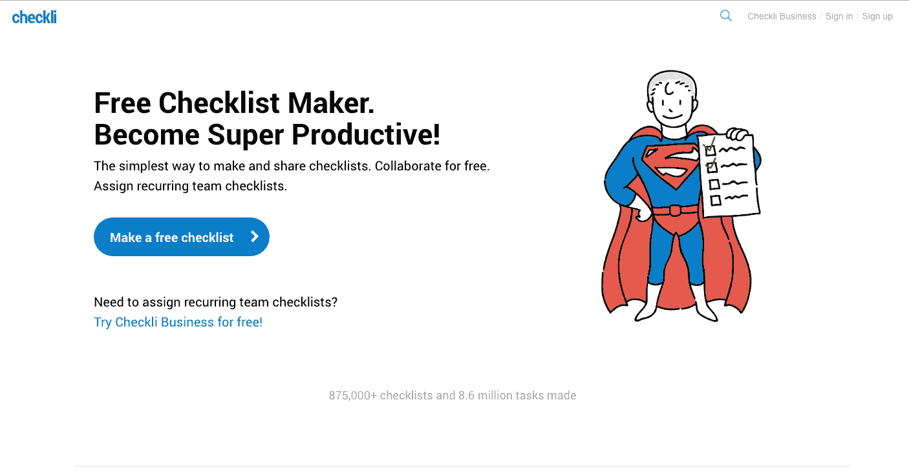
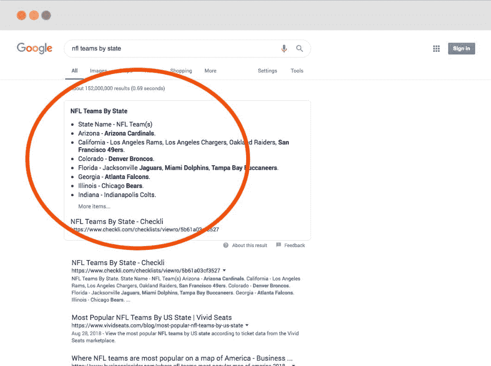
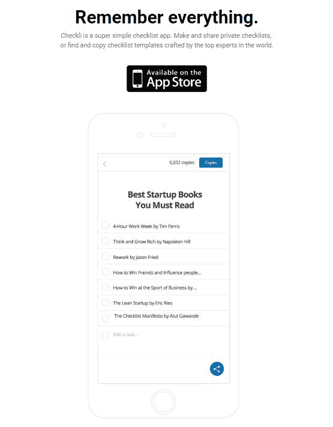

# 建立一个工具来帮助我集中注意力，以及它如何成为我的第三个生意

> 原文：<https://www.indiehackers.com/interview/building-a-tool-to-help-me-focus-and-how-it-became-my-third-business-a2f30aca3b>

## 你好！你的背景是什么，你在做什么？

我是马文·拉塞尔，芝加哥的一名企业家。我创办了两家初创公司，都被成功收购，最近的一家是数字营销机构的领先一代 SaaS[mysite auditor](https://mysiteauditor.com/)。在 24 个月内，MRR 的 4 万美元和 12%的增长率吸引了我无法拒绝的 7 位数的报价。我希望能够说自己是百万富翁，所以我接受了来自[最可靠资本](https://www.sureswiftcapital.com/)的交易。

今天，我在做 [Checkli](https://www.checkli.com) ，一个出于需要而诞生的激情项目，不知何故变成了第三号创业公司。它原本应该是一个简单的清单工具，帮助我整理混乱的大脑，但它变成了一个非常不同的东西，对世界各地成千上万的人来说非常有价值。

如果你认为 Checkli 只是另一个清单工具，请三思。Checkli 的与众不同之处在于三个独特的共享功能，它们将我们与其他清单工具区分开来:

1.  无需登录，您就可以免费协作完成一份清单。
2.  你可以在几分钟内发布清单，这通常比谷歌上的博客帖子排名更高。
3.  您可以分配和跟踪周期性的小组核对清单。

Checkli 一直是一个免费的工具，然而，在 2018 年，我们增加了我们的第一个付费功能，包括高级个性化选项和跟踪重复出现的团队清单。快进到 2019 年 1 月，Checkli 现在拥有:

*   每月 80，000 名访客(55，000 名唯一访客)
*   制作和分享的清单不到 100 万份
*   创建了 800 万个任务
*   制作了 134，000 多份清单
*   下载了 202，000 多份清单 pdf

只有 2000 美元的 MRR，距离我在 MySiteAuditor 的 40000 美元的 MRR 时代还有很长的路要走，但我认为我们走在正确的道路上。

 

## 是什么促使你开始使用 Checkli？

回到 2014 年，我的第一家创业公司被收购，我很快过渡到我的第二家创业公司，但与多动症和焦虑的终身斗争总是让我难以集中精力。我总是有无数的事情要做和想做。我的大脑一片混乱，我需要一些东西来帮助我集中注意力。

我放弃了开出的利他林和 Adderall，并发现了自己自制的药方:清单。清单是一种简单的方式来组织和记忆我头脑中的一切。我做的清单越多，焦虑感就越少。

当时，我发现在线清单工具无法平衡简单性和基本功能，所以我建立了自己的工具。我一点也不知道这最终会变成第三家创业公司。

## 构建最初的产品需要什么？

我不会说我是技术人员，但我可以忍受所有的技术术语。我知道美国和世界各地的开发成本，所以我直接去了 Elance(现在是 [Upwork](https://www.upwork.com) )找到了来自世界各地的成千上万的开发者，他们愿意花几百美元来开发一个更简单的清单工具。与此同时，我发现了一个非常适合我的项目的 10 美元域名，【Checkli.com[。(发音:“check-lee”)。](http://Checkli.com)

我很擅长 photoshop，所以我做了一些超级简单的东西，并让我从印度雇的一个开发人员花了不到 400 美元把它编码好。非常简单。您可以添加一个标题和任务，并保存唯一的 URL，以便以后使用清单。

总之，Checkli 的第一次迭代在大约 30 天内完成并运行，价格不到 500 美元。

最终，我注意到谷歌分析显示有几百人也在使用 Checkli。出于好奇，我使用了应用内调查工具 [Qualaroo](https://qualaroo.com) ，询问我的用户为什么喜欢使用 Checkli。这几乎是一致的——每个人都喜欢它的简单。然后我问我们如何能让 Checkli 做得更好，收到了数百条建议。我情不自禁地采取了行动。

当市场告诉你你的产品不是你想象的那样时，听着。不要争辩。不要反抗。听着。

TweetShare

这个时候，我的印度开发人员早就走了，所以我从中国雇了第二个开发人员。这位新开发人员带来了坏消息。后端一团糟，几乎不可能扩展和添加功能。这就是在一个以技术为导向的领域里不技术的坏处。你不知道你不知道什么。

我决定花大约 2000 美元重做整个网络应用程序，这样我就可以最终支付新功能的费用。那 2000 美元变成了 4000 美元，4000 美元变成了 6000 美元。我慢慢地对增加的成本、沟通问题和缺乏技术知识感到沮丧。

随着流量的增长，来自快乐用户的所有建议和功能请求也在增长。因此，我现在对 Checkli 有了新的看法。我希望它不同于所有其他的清单工具，所以我决定我需要一个芝加哥的本地开发人员来帮助我推出像发布和重复清单这样的功能。

2017 年，在芝加哥制作的[上，我用一个 99 美元的招聘广告，找到了一个当地的初级开发人员，他想成为一名企业家，在一家初创公司工作。我成立了 Checkli LLC，从出售上一家初创公司的所得中拿出 5 万美元，存入一个银行账户，以支付下一年我的新开发人员的费用。](https://www.builtinchicago.org/)

去比赛吧！

## 你们是如何吸引用户和壮大 Checkli 的？

我可能不是一个程序员，但我会把我自学的数字营销和搜索引擎优化技能与业内任何人竞争。在我的新开发人员的帮助下，我能够将我所有的 SEO 知识应用到网站上，并添加了交互式共享功能，这将使 Checkli 从所有其他 checklist 网站中脱颖而出。

我说过，我很擅长 SEO。几个月之内，Checkli 就在诸如“清单”、“列表制作人”、“免费清单制作人”等困难关键词上排名第一。然后我把我的 SEO 知识应用到我们免费发布的清单中。我们增加了搜索引擎友好的网址，特色图片，等等。经过几个月的调整，我们的许多会员发布的清单开始在谷歌上排名第一，并出现在谷歌的特色片段中。这使得每天都有成千上万的新访客访问我们会员发布的 Checkli 清单。

 

## 你的商业模式是什么，你是如何增加收入的？

李总是 100%自由。然而，在 2018 年，我们转换为免费增值 SaaS，提供两个付费升级选项，Checkli 个人和 Checkli 商业。

只需支付少量年费，Checkli Personal 就可以让您创建帐户、保存清单、设置任务提醒和个性化无限清单。另外， [Checkli Business](https://www.checkli.com/business) 让您邀请、分配和跟踪需要反复完成的重复性清单。还记得 Qualaroo 调查吗？这是我们得到的最佳建议之一。

这不仅是当前用户的一个很大的请求，而且不久前，CVS 的人力资源负责人找到我，问 Checkli 是否有一个可以在全球 10，000 家商店使用的重复清单功能。当市场告诉你你的产品不是你想象的那样时，听着。不要争辩。不要反抗。听着。

每个人每天都面临着巨大的障碍。成功企业家与其他人的区别在于，我们会越过、绕过或穿过巨大的障碍。

TweetShare

目前，我们使用 Stripe 接受支付，但我担心过期信用卡的流失。据我所知，Paypal 永远不会过期，所以我们一直在考虑将它作为一种支付方式。希望这将有助于减少流失。

我对其他企业家的建议是，迅速做起来，看看人们是否会为此买单。我最近的创业成功让我有点过于自信，我想我等了太久才添加付费功能。免费是好的，但是根据 DJ Quick 的说法，“如果不赚钱，它就没有意义。”

好消息是我们的开销几乎为零。我的初级开发人员停止拿工资，以换取公司一小部分股权。为了收支平衡，他兼职做少量的自由职业。

这是我过去一年学到的另一个宝贵的教训。如果你打算雇佣一个人在创业公司工作，雇佣一个志同道合的想在创业公司工作的企业家。不要雇用在过山车第一次下降时就奔向美国公司的人。

## 你未来的目标是什么？

我们的下一个大目标是推出新的 iOS 应用程序。我们有一些基本的启动和运行，但它需要重做。与上面的故事相同，只是一个 iOS 应用程序。想起我在雇佣创业者方面学到的经验，我找到了一个由移动应用开发者组成的本地团队，他们也是创业者，希望在一家真正有流量和用户的初创公司工作。他们看到了这些数字，理解了 Checkli 的潜力和愿景，并决定开发我们新的 iOS 应用程序，以换取股权。

我们新的 [iOS 应用](https://www.checkli.com/mobile)将于 2019 年 1 月发布。

 

## 你面临的最大挑战和克服的障碍是什么？如果你必须重新开始，你会做什么不同的事？

我最大的挑战是《T4》的功能蠕变。我一直在调整，添加和改变太多的方式。2019 年是让 Checkli 自己成长的时候了。

麻烦的是，网站永远不会结束。尽快建立并运行你的网站，因为它永远不会完美，也永远不会结束。特征蠕变就像上瘾一样，最好的治疗方法是承认你是个瘾君子。

## 有没有发现什么特别有帮助或者有优势的？

我不太喜欢看书，因为我很难集中注意力。然而，有一天我注意到有人在我的办公室里留下了一本鲜红色的书。我用眼角看到了它。我觉得它在发光。我可能错了。不管怎样，这是阿图尔·加万德的清单宣言。这是一本充满案例研究的书，详细介绍了从医疗保健到航空业的每个行业是如何在他们组织的几乎每个流程中纳入强制性清单的。简而言之，这本书的结论是，当今世界的信息量和技术含量已经远远超过了我们大脑的记忆能力，清单是大脑最终和最重要的插件。

令人惊讶的是，我实际上读了两遍这本书。我强烈推荐这本书给所有企业家或任何难以集中注意力的人。在阅读了 Checklist 宣言后的短短几个月，我发起了 Checkli。

## 对于刚刚起步的独立黑客，你有什么建议？

史蒂夫.乔布斯曾经说过的一句话一直在我脑海中挥之不去:"我确信，成功的企业家和不成功的企业家之间的一半区别在于纯粹的毅力。"

每个人每天都面临着巨大的障碍。成功企业家与其他人的区别在于，我们会越过、绕过或穿过巨大的障碍。我们从不找借口。我们从不放弃。我们想出办法继续前进。

## 我们可以去哪里了解更多？

了解更多信息的最佳方式是制作一份免费的清单，或者成为一名出版商(这是免费的)，分享有价值的清单来发展你的品牌。

*   做一个免费的清单:[checkli.com](https://www.checkli.com/)
*   成为清单发布者(免费):【checkli.com/publishing 
*   发展你的品牌:一篇关于[如何在谷歌](https://blog.checkli.com/featured-snippets/)将你发布的清单排名第一的文章

你可以在 Twitter [@marvinrussell](https://twitter.com/marvinrussell) 上关注和联系我。我一直在线。我很乐意回答下面的任何问题。

——[<picture id="ember5249363" class="user-avatar ember-view user-link__avatar"></picture>【马文】【罗素】](/marvinrussell?id=s2EaRmDSIbRsiaP8HiwmyV86Y612)【李的创始人

## 想像 Checkli 一样建立自己的事业吗？

你应该加入独立黑客社区！🤗

我们是几千名创始人，互相帮助建立有利可图的业务和副业。来分享你正在做的事情，并从你的同事那里获得反馈。

还没准备好开始使用你的产品吗？没问题。这个社区是一个认识人、学习和实践的好地方。随意[随便浏览](/)！

—[<picture id="ember5249368" class="user-avatar ember-view user-link__avatar"></picture>考特兰艾伦](/csallen?id=ibTLPyjwVebnZjMGKvz6ztarnuV2)，独立黑客创始人

46votes