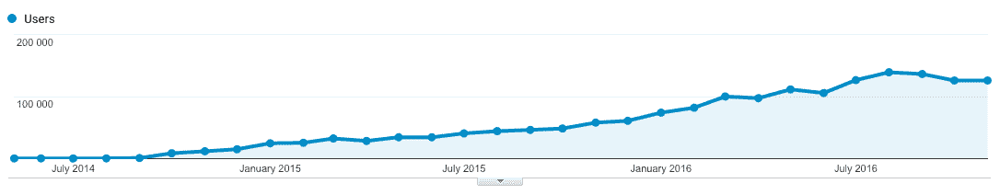

# 为分类广告建立一个聚合器，每个月带来 1000 美元的收入

> 原文：<https://www.indiehackers.com/interview/building-an-aggregator-for-classifieds-that-brings-in-1k-mo-f75471c590>

## 给我们介绍一下你自己吧！你在做什么？

我叫大卫，我创建了[价值森林](http://valueforest.co.za)，这是一个聚合器，让人们更容易在南非分类广告上找到最好的交易。任何购买二手车、手机、古董等的人都可以使用价值森林找到他们想要的东西，无论是用于业务还是个人用途。

截至 2016 年 11 月，Value Forest 每月有 13 万独立访客进行 20 万次搜索，每月收入约为 1100 美元。

## 是什么促使你开始使用价值森林？你最初的目标是什么？你是怎么想出这个主意的？

我开始的时候，我认为是最理想的方式，试着去挠自己的痒痒。作为一个寻找二手车或电子产品便宜货的大粉丝，我认为为所有主要的南非分类广告创建一个聚合器并找到便宜货将是一个不错的项目。

在构建了一个非常简单的版本后，我在当地论坛上发布了分享并获得了一些反馈。总的来说，反应相当积极。我在一家老牌公司做全职后端开发。而且还住在家里，所以我的开销相当低。

## 建立最初的网站需要什么？你是如何找到时间工作的，你的技术是什么样的？

因为我喜欢这个项目，所以我大部分时间都是在下班后的晚上和周末工作。谢天谢地，我真的不需要任何资金，因为我是唯一的开发者。我唯一的支出是服务器成本，非常小。

我从一些[数字海洋](https://m.do.co/c/784c62ff75ec)服务器和一个基本的 PHP/MySQL 栈开始。我最初没有过多考虑具体的功能，而是只关注核心功能。但是我也听取了早期用户的反馈。我采用了一种非常迭代的方法，用了几个月的时间来改进网站。

最初的版本每次搜索都非常慢，因为我是实时搜索每个分类广告网站，这显然不太实际。谢天谢地，我与一家大型电子商务网站的一位非常博学的首席技术官建立了联系，他给了我许多很棒的技术建议。其中一点就是使用 [Apache Solr](http://lucene.apache.org/solr) 。它基本上是一个数据库和全文搜索引擎。

我还使用了[VPS time](https://vpsdime.com/aff.php?aff=319)，它提供了一个很棒的 7 美元/月的高规格服务器来托管它。然后，我创建了基于 Python 的抓取器来抓取可用的网站或 API，并将这些结果输入 Solr。PHP 代码开始变得相当混乱，但一个朋友向我推荐了 Laravel PHP 框架，我用 Laravel 重写了网站的很大一部分以清理东西。

## 你为森林的成长和市场价值做了什么？你的商业模式是如何运作的？

最初，我通过我上面提到的当地论坛(具体来说， [myBroadband](https://mybroadband.co.za/news) 和 [Carbonite](http://carbonite.co.za) )以及一些口碑找到了用户。从那以后，我主要依靠 SEO 长尾流量。在某个阶段，我确实加入了 FbStart 计划，并使用提供的积分通过脸书广告公司做广告。

Value Forest 的收入主要来自两个来源:联盟收入和通过 Google Adsense 发布的广告。各占收入的 50%左右。

截至 2016 年 11 月，收入接近 1100 美元。我的收入是南非兰特，所以很难准确，因为汇率在过去两年里变化很大。

## 我看到许多创始人在从事“聚合”业务。这种方法有什么特殊的挑战吗？

是的，肯定有挑战。“抓取”通常有负面含义，为了简单起见，很多网站希望你不要这样做。有些人甚至将此纳入他们的条款和条件，在某些情况下，这可能会导致法律诉讼。例如: [Craigslist Inc .诉 3Taps Inc.](https://en.wikipedia.org/wiki/Craigslist_Inc._v._3Taps_Inc.)

这种关系之所以有趣，是因为分类广告行业的许多网站都从广告中获得收入。如果聚合器成功了，它将为这些网站带来大量的免费流量。由于聚合器不是终端，网站仍将获得广告收入，甚至可能更多。所以我认为一些网站对聚合器有着复杂的感情。理想情况下，聚合器应该获得许可。

抓取的另一个挑战是，随着网站改变它们的 HTML，抓取器必须更新，所以如果可以获得的话，每个网站的 API 或数据馈送通常是更好的。同样，根据我的经验，这很难做到。

本文提供了更多见解:[比较购物和数据重用的法律挑战和策略](http://web.mit.edu/smadnick/www/wp/2010-05.pdf)。

我受到一些大型航班聚合器的启发，比如 Momondo。我真的很喜欢他们将飞行数据整合在一起并使其变得有用的方式。我的目标和我开始时一样:帮助人们以一种方便和愉快的方式在分类广告上找到便宜货。

## 到目前为止，你学到的最大的教训是什么？如果你必须重新开始，你会做什么不同的事？

我对自己的进步很满意。我觉得每个旅程都略有不同，犯错是其中的一部分。听到别人的故事来激励自己是很棒的，但我相信你还是要自己犯错误，才能真正将它们内化。

按理说，我本可以现在就开始探索其他市场，我现在已经开始着手了。我也经常在是否充分利用时间和关注正确的优先事项之间挣扎。

## 在你的旅途中，什么对你最有帮助？你认为你最大的优点是什么？

事实上，我当时的老板对我很有帮助。他是一个企业家，他鼓励我继续做这个网站。此外，肯定有运气的成分——我没想到 SEO 会像现在这样好。当我开始的时候，我对它只有非常基本的了解。

我还参加了一个训练营，这个训练营催生了一个加速器项目，教授精益创业原则，并给我不断的建议和反馈。这很有帮助。

最后，我读了一些书，里面有很好的教训和建议，在这一路上帮助了我。[《每周 4 小时工作制》](http://amzn.to/2hrDGjv)是一篇有趣的文章，我很喜欢听蒂姆的播客中的几位嘉宾。我也喜欢杰森·弗里德和 DHH 的《T4》改编作品。我还必须提到埃里克·里斯的精益创业公司。

## 你对有抱负的独立黑客有什么建议？

我的建议大概和大多数“成功”的企业家会说的话差不多。装运它！logo 不需要完美，名字或者域名也不需要。采取精益迭代过程，尽量不要停留在瘫痪分析上。获得一个基本版本，并获得反馈。

此外，尽量不要过于依赖你对产品/服务的先入为主的想法。说起来容易做起来难！

## 我们可以去哪里了解更多？

查看[价值森林主页](http://www.valueforest.co.za)或在 Twitter 上关注[@价值森林](https://twitter.com/valueforest)。也可以在下面给我留言提问或者评论！

—[<picture id="ember5250573" class="user-avatar ember-view user-link__avatar"></picture>大卫·卡普兰](/DavidKaplan?id=value-forest-owner)，价值森林的创造者

## 想像价值森林一样建立自己的事业？

你应该加入独立黑客社区！🤗

我们是几千名创始人，互相帮助建立有利可图的业务和副业。来分享你正在做的事情，并从你的同事那里获得反馈。

还没准备好开始使用你的产品吗？没问题。这个社区是一个认识人、学习和实践的好地方。随意[随便浏览](/)！

——[<picture id="ember5250578" class="user-avatar ember-view user-link__avatar"></picture>柯特兰艾伦](/csallen?id=ibTLPyjwVebnZjMGKvz6ztarnuV2)，独立黑客创始人

6votes