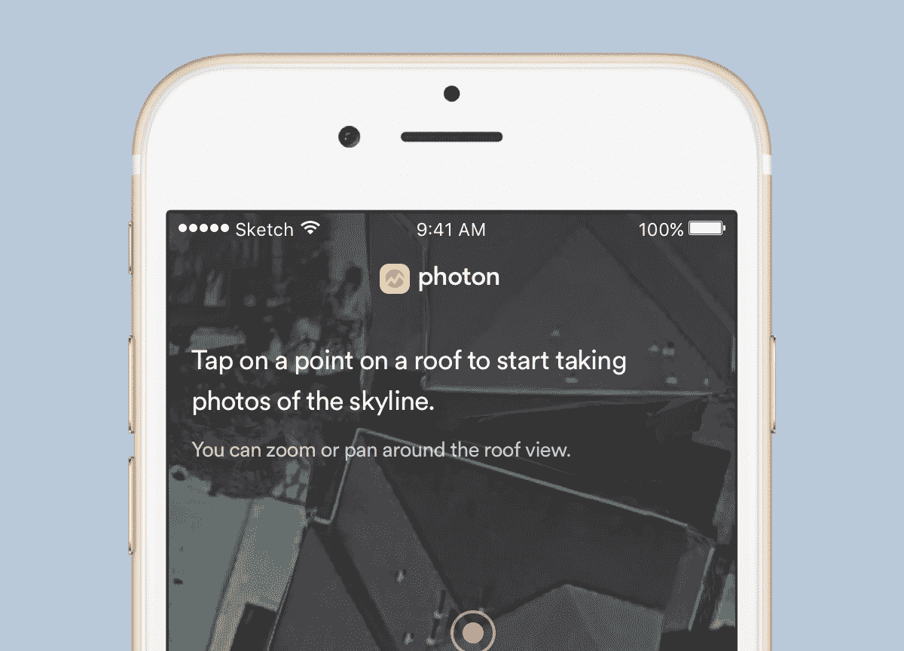
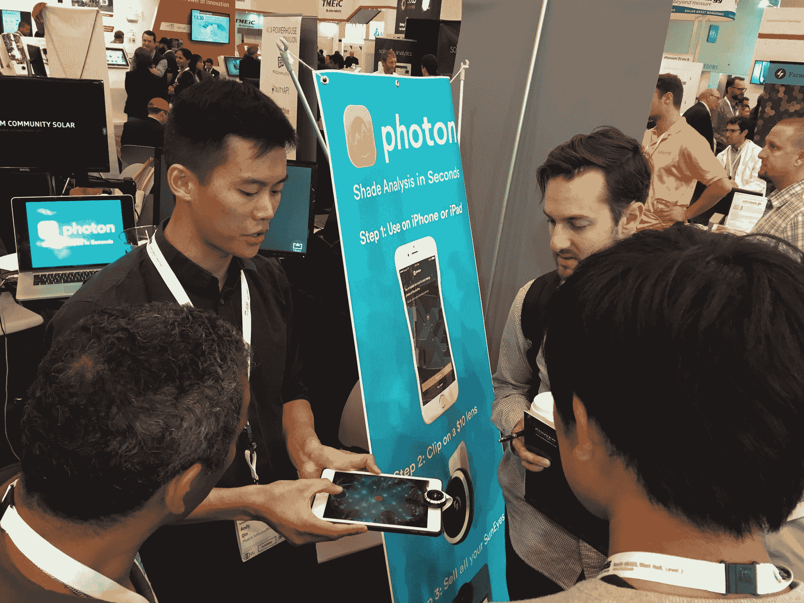

# 为太阳能行业开发一款应用，增长到每月 1000 美元

> 原文：<https://www.indiehackers.com/interview/building-an-app-for-the-solar-industry-growing-to-1-000-mo-8e9f6d12b4>

## 你好！你的背景是什么，你在做什么？

我是安迪·秦，软件工程师和清洁能源倡导者。光子是一个 iOS 应用程序，帮助太阳能安装人员测量太阳能电池板上的阴影损失。太阳能安装者(爬上屋顶的人)想知道周围树木和建筑物的阴影会如何影响他们太阳能电池板阵列的功率输出。他们还利用这些数据申请政府退税。因此，与其使用每台价值数千美元的传统测量设备(例如 [Solmetric SunEye](http://www.solmetric.com/buy210.html) )，为什么不使用你口袋里的超级计算机呢？

我和我的联合创始人[灿智](http://canzhiye.com)于 2016 年 7 月推出了光子。此后，11 家太阳能公司成为付费客户。我们最近还与该国最大的太阳能设备经销商 Soligent 合作。总之，我们每月的经常性收入约为 1，000 美元。

## 你是如何想到光子这个概念的？

我志愿通过一个名为 [SunWork](http://www.sunwork.org) 的非营利组织安装太阳能电池板，这时我的项目经理拿出一个 [Solmetric SunEye](http://www.solmetric.com/buy210.html) 。我了解到各地的太阳能安装者都依赖它们，尽管它们非常昂贵，而且固件经常崩溃。硬件方面，它们包括一个连接到电脑的摄像头，就像我的 iPhone 一样。唯一的不同是，我的 iPhone 没有这个软件，也没有鱼眼镜头摄像头。后者不成问题，因为自拍用的鱼眼镜头很便宜。前者是我的副业。

当时，我应该是在找一份全职工作。在加州大学伯克利分校完成本科教育之前，我还有大约 5 个月的时间。但你知道那种感觉吗，你对自己的项目如此着迷，以至于你只能做白日梦？那是我。唯一的目标是运送。我把这个项目看作是帮助我们轻松过渡到清洁能源生产的一个小方法。它比家庭作业和面试更重要。

 

## 构建和发布初始产品涉及哪些内容？

光子被 T2 发电站的第三批接受，这是一个位于奥克兰的可再生能源加速器。这对我们来说意义重大。我们在太阳能行业没有什么关系可言。他们为我们配备了一个网络，1 万美元的种子前期资金，以及 6 个月的办公空间。也许最重要的是，发电站给了我们全职研究光子所需的借口。没有分心的事，因为大学对我来说已经结束了，对我年轻的联合创始人灿智来说已经延期了。在启动加速器计划后，我们仅用了一个月的时间就推出了 V1。

决定什么功能进入 V1 是很棘手的，因为我们都不是太阳能安装者——我们的目标用户。事实上，我们俩都没有从事过非白领的工作。因此，为了补偿，我们在 [r/solar](https://www.reddit.com/r/solar) 上询问了太阳能安装者他们想要的用户调查。

为了进一步验证我们的市场，我们尝试对 Solmetric SunEye 进行逆向工程，然后在周末向当地太阳能公司展示我们的原型。巧合的是，那个月早些时候，我们采访的第一批公司之一的一名设计工程师告诉我们，他的任务是找到一种替代 Solmetric SunEye 的现代产品。他们很高兴成为 beta 测试者。

## 你用了哪些策略来增长光子和寻找客户？

我们为赢得客户所做的最有效的一件事就是参加太阳能行业的交易会。其中最大的一次是去年在旧金山莫斯康中心举行的 Intersolar 。在 Intersolar，你已经建立了像洛克希德·马丁和华为这样的巨头，他们在巨大而华丽的展位上展示，由几十名穿着整洁制服的员工操作，提供免费茶点。相比之下，我们有一张诙谐的海报和一台运行 [Photon](https://www.tryphoton.com) 的 iPad。感觉很像大卫和歌利亚:

那天无数演示中的一个。

但事实证明，这就是你需要得到一些兴趣。我们的第一批顾客来自我们在 Intersolar 吸引的那些小群体。我们还制作了一个简短的教程视频，这是太阳能安装人员使用的任何软件的表格:

[https://www.youtube.com/embed/mLEKSGFkGXs](https://www.youtube.com/embed/mLEKSGFkGXs)

由于我们的产品本质上是一个测量工具，最常被问到的问题是，“你的色度分析有多准确？”我们需要一个受人尊敬的第三方的认证，以表明我们的应用程序不是一个噱头。国家可再生能源实验室 NREL 通常会对像我们这样的商业产品进行认证。问题是获得 NREL 的批准可能需要几个月的时间，而我们正试图快速行动。

这里的解决方案是我们自己做。我们在 20 个不同的屋顶上对我们的产品进行了严格和诚实的测试。结果是我们自己出版了一份[白皮书](https://www.tryphoton.com/study)，并作为我们营销材料的一部分分发。作为软件工程师，我们在桌子上打字要比爬一个靠着陡峭屋顶的两层梯子舒服得多。但是当职责召唤时，我们回答:

“我们是怎么上来的？”

另一方面，我们最终被 NREL 的商业化援助项目所接受，所以他们的官方评估还在进行中。

## 你做了什么使你的收入增加到每月 1000 美元？

我们的收入来自两个来源:我们的固定用户和我们的分销合作伙伴。对于前者，我们在 Stripe 上运行订阅。它们让我们可以非常轻松地配置三个订阅计划:1 个月计划 34.99 美元，每月定期计划 29.99 美元，每年定期计划 299.99 美元。

我们与 Soligent 的合作伙伴关系要求我们为他们制造一款贴有白色标签的[光子](https://www.tryphoton.com)，带有他们的标志和品牌颜色，将于 2017 年 4 月推出。作为回报，他们向我们支付固定年费，将这个版本的应用分发给他们经常服务的数千家太阳能公司。这样我们就不用做销售了，Soligent 也有办法奖励他们的忠实客户。效果很好。

我们的商业模式很棘手，因为我们做不出真正的免费增值模式。该应用程序可以立即下载，但鱼眼镜头需要亚马逊几天才能发货。因此，我们能做的最好的事情就是让用户下载并体验 Photon，但在他们选择订阅之前，我们无法给他们完整的体验。因为每个订阅计划带来的收入超过了镜头的成本，所以我们在购买任何订阅计划时都免费运送镜头。这使我们的单位经济保持绿色。

## 你未来的目标是什么？

我想让 [Photon](https://www.tryphoton.com) 对我们的客户保持可靠和有用。我们路线图上最重要的事情是，当我们在 4 月份推出与 Soligent 的联合 iOS 应用程序时，我们的流量预计将大幅上升。因此，如果有几千个太阳能安装者同时向服务器发出大量请求，我们希望确保服务器能够及时响应所有这些请求。

## 你面临的最大挑战是什么？

我们艰难地认识到，虽然中小型太阳能公司需要光子，但大型太阳能公司不太感兴趣。

SolarCity、SunPower 和其他类似的公司正在投资完全远程的阴影分析技术。尽管光子等工具要求用户亲临现场，但未来能够从无人机或低空飞行的飞机捕捉的航空图像中获得非常接近的测量结果。这种转变意味着大型企业的成本降低了许多数量级，因为它们的管理费用很高。当时，我们的市场仅限于太阳能公司的长尾，这在总体上是有吸引力的，但实际上很难卖给他们。

有趣的是，当我们第一次评估完全远程阴影分析工具对我们业务的威胁时，我正在阅读 Clayton Christensen 的《创新者的困境》。一切都与克里斯滕森描述的模式有着惊人的相似之处，即最初成本较低但性能较差的新技术(远程阴影分析)有时会提高其性能，直到最终取代旧技术(现场阴影分析)。

## 你最大的优势是什么？有什么特别有用的吗？

太阳能行业急需软件工程人才。因为我们是一个敏捷的两人工程团队，我们可以像闪电一样响应功能请求。我和一个用户打电话，他要求一个功能，并问是否可以在未来 2 到 3 个月内完成。我们在一周内发布了该功能。我认为这说明了行业习惯的软件支持的质量。这使我们从竞争中脱颖而出。

我一直相信 Y Combinator 给创始人的箴言:要么与用户交流，要么开发产品。他们几年前在斯坦福大学的课程仍然是值得遵循的优秀原则的永恒资源。我发现 Emmet Shear 关于采访用户的演讲对我们特别有用。

## 对于刚刚起步的独立黑客，你有什么建议？

1.  **第一版可以比你想象的更简约。只有回想起来，我们才想出了不需要部署一行代码就可以发布的方法。例如，我们可以让用户用镜头拍照，然后通过电子邮件发给我们进行分析。不需要应用程序！**

2.  如果你还在头脑风暴，寻找网络效应。无论你是 Photon 的第一个用户，还是第一百万个用户，体验都差不多。我希望不是这样。如果你正在寻找一个项目，问问你自己第 n 个注册的用户将如何改善现有的 n - 1。

3.  **不要试图创办独角兽。**并不是每一家互联网企业都需要成为改变世界、有风险投资支持的头条新闻公司。在一轮成功的筹款后，我得到了让你的名字出现在新闻中的吸引力。但我对硅谷创业文化的最大批评是，创始人应该更努力地质疑他们是否真的需要机构资金。你的业务真的有吸引力*和*精益吗？我猜想，如果没有筹集到数百万美元，这里的许多科技企业可能会过得更好。现在，这些创始人肩负着投资者期望的重担，而他们或许并不需要这样做。

## 我们可以去哪里了解更多？

*   [www.tryphoton.com](https://www.tryphoton.com)
*   [@tryphoton](https://twitter.com/tryPhoton)
*   [@andylouisqin](https://twitter.com/andylouisqin)
*   [@canzhiye](https://twitter.com/canzhiye)
*   [秦](https://www.indiehackers.com/user/qin)论独立黑客。在下面的评论里问我任何问题！

——[<picture id="ember8182925" class="user-avatar ember-view user-link__avatar"></picture>安迪·秦](/qin?id=8sBJ4vgdXagHNiwDsxBiwQy7dii1)，光子的创造者

## 想像光子一样建立自己的事业？

你应该加入[独立黑客社区](/)！🤗

我们是几千名创始人，互相帮助建立有利可图的业务和副业。来分享你正在做的事情，并从你的同事那里获得反馈。

还没准备好开始使用你的产品吗？没问题。这个社区是一个认识人、学习和实践的好地方。随意[随便浏览](/)！

—[<picture id="ember8182930" class="user-avatar ember-view user-link__avatar"></picture>考特兰艾伦](/csallen?id=ibTLPyjwVebnZjMGKvz6ztarnuV2)，独立黑客创始人

4votes