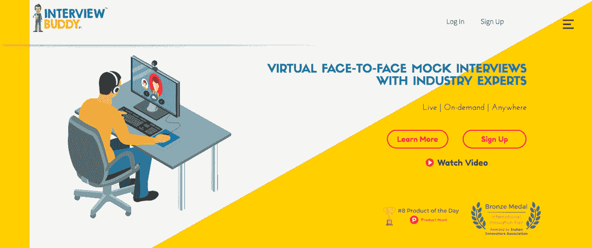
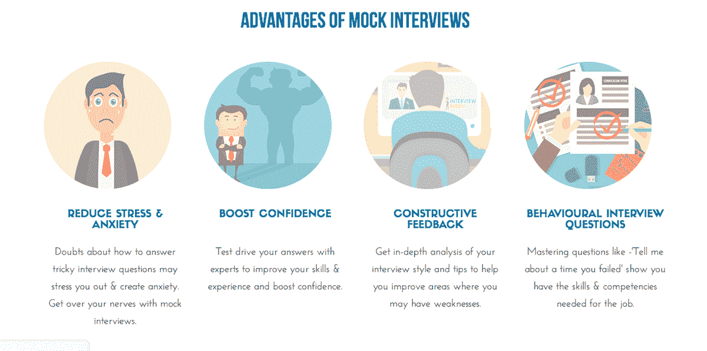
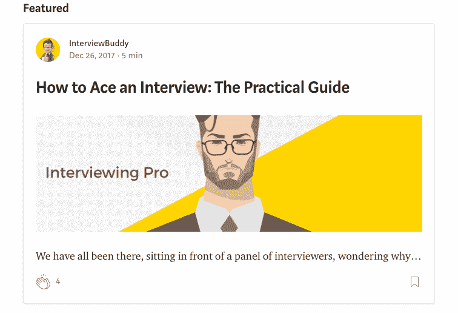
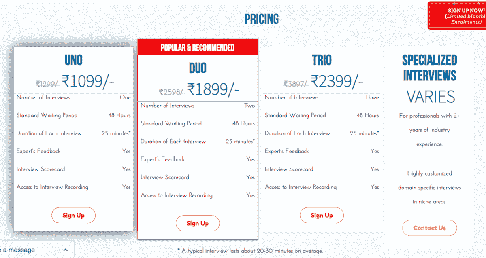

# 在没有商业经验的情况下打造获奖产品

> 原文：<https://www.indiehackers.com/interview/building-an-award-winning-product-with-no-previous-business-experience-63b1646b49>

## 你好！你的背景是什么，你在做什么？

你好，我叫 Ujwal Surampalli。本人有机械工程背景，但一直热爱编程。当我还在上大学的时候，我为几家博客公司工作，写一些东西，帮助他们提高搜索排名，尽管当时这更多的是一种爱好，而不是我认为是一种职业。我一直喜欢汽车，喜欢摆弄东西，喜欢弄清楚一切是如何工作的，所以毕业后，我决定去德国莱茵-瓦尔大学攻读机械工程硕士学位。

从那以后，我开始休假，全职工作于 [InterviewBuddy](https://www.interviewbuddy.in/) ，这是一项旨在帮助人们通过(通常令人紧张的)面试过程的服务。

在我的整个大学生涯中，我不得不经历许多轮面试来寻找潜在的工作，后来，为了进入一个硕士项目。经历了这一过程，我意识到对我的许多同学来说，这是一场多么艰难的斗争，尽管他们有资格证书。我认识的一些最聪明的人都很难回答基本的面试问题，因为他们很紧张或者没有做好准备。看到这里，我明白了，即使是最合格的候选人也需要练习和准备面试，因为如果你不能通过面试，资格就没有任何意义！

InterviewBuddy 通过提供可信且经验丰富的行业资源来简化面试练习过程，这些资源提供了有用的见解和改进技巧。

截至 2018 年 9 月，InterviewBuddy 每月收入 500 美元。

 

## 是什么促使你开始使用 InterviewBuddy？

在大学期间，我第一次参加 Wipro(一家印度 IT 公司)的校园招聘面试时，就有了 InterviewBuddy 的想法。我的面试官对我的简介和我在前几轮的表现印象深刻，所以他让我坐在他旁边，面试我的三个队友。我看到我的队友在回答简单、基本的问题时犹豫不决，并意识到即使是最合格的候选人也难以应对面试。

这让我很震惊，因为在那之前，我觉得我的队友几乎在所有方面都胜过我。我的每个同学都在全州工程入学考试中名列前茅，平均绩点为 8+分(满分为 10 分)。

当我后来开始在德国攻读硕士学位时，我清楚地意识到，面对面试对全世界的求职者来说都是一场噩梦。这些第一手的接触为 InterviewBuddy 奠定了基础。

## 构建最初的产品需要什么？

当我第一次开始认真做 InterviewBuddy 的时候，我不认为我完全理解这个项目会有多大。我开始建立一个平台，在那里我可以将候选人与他们所申请领域的专家以及一般的面试专家联系起来。起初，我在周末和学习间隙把编码作为一个兼职项目自己做，但很快意识到，以我现在的速度，我不可能把它做好。我考虑过使用软件服务提供商来开发付费产品，但是在做了一些研究之后，很明显我不可能以学生的预算负担得起。

拒绝是理所当然的，应该尽早接受(甚至拥抱)以避免未来的沮丧。

TweetShare

我后退一步，认真地进行了一番头脑风暴，看看我该如何前进。虽然作为一名学生基本上是什么阻止我完全投入到这个项目中，但我想到，对于一个不同类型的学生来说，这个项目实际上可能是一个惊人的机会。所以我开始接触印度科技大学的学生。在筛选潜在候选人时，我遇到了印度理工学院(印度的麻省理工学院)的一名学生，他似乎在技术方面很有天赋，拥有令人印象深刻的网站组合，所以我邀请他和他的朋友在 InterviewBuddy 实习。他们接受并建立了应用程序的 MVP，这对他们来说是一个获得知名度的好机会，对我来说也是一个巨大的推动，因为他们来自印度最受尊敬的技术大学之一。

MVP 是伟大的，但它仍然需要大量的工作来让它达到我想要的位置。在这一点上，我意识到我需要承诺——带来更多的人，并开始建立一个真正的团队。我把这个想法告诉了我的导师，他也在印度理工学院，他把我介绍给了一些同事和朋友，他们看到了 InterviewBuddy 的潜力，并有兴趣参与其中。所以我们要工作了！

## 你是如何吸引用户和发展面试伙伴的？

虽然我非常感激有一个由非常合格的技术工人组成的团队，但实际上没有人有任何营销或发展的经验。这就是我过去写博客的经验派上用场的地方。我知道如何制作内容，并熟悉搜索引擎优化(SEO)，所以我知道我们应该如何进行。

我认为，这真的取决于创始人是否能够热情有效地传达他们的想法和愿景，以说服其他人加入进来。如果你没有这种技能，尽你所能去提高它。

TweetShare

我们筹集了一笔小型天使基金，并将其用于提高平台的生存能力。我最后还招了一个人来明确地帮助我们进行营销。她刚从大学毕业，只有几个月的实习经验，但这仍然比团队中其他任何人带到市场营销桌上的经验都要早几年。最终，SEO 工作得到了回报。我们的大部分流量都是通过谷歌搜索获得的。

 

我们的主要用户是学生/应届毕业生和跳槽者。对于学生和毕业生来说，InterviewBuddy 帮助他们更好地准备他们的第一次面试和/或第一份工作。一开始就面试得更好会给你带来一份更好的工作，这只会对你有帮助。获得一份体面、高薪、符合你所有技能和教育资历的工作，有助于为加薪、升职和未来就业打下坚实的基础。投资准备和搞定你的前几次面试也能让你避免失业几个月，看着你的银行账户被榨干，而你却在努力破解面试密码。

对于跳槽者，我们关注基于行为的情况，因为他们可能进入的角色可能更依赖于候选人对角色的适合性和公司的工作文化。大多数换工作的人至少有几年的工作经验，他们希望扩大自己的职业生涯，要么为更大、更有声望的公司工作，要么晋升到更高的职位。这些基于行为的实践面试可以带来很大的不同，并帮助候选人在获得一份新的高级职位(通常是管理职位)时做好更充分的准备。

## 你的商业模式是什么，你是如何增加收入的？

InterviewBuddy 是一个基于云的视频面试平台，它将候选人与全球公司的顶级行业专家随时随地联系起来，以便在模拟真实工作面试但没有工作压力的环境中准备和练习面试。该平台可以在任何设备上运行，不需要下载软件或安装任何插件。

候选人可以选择面试的类型——人力资源或技术——然后从内置的在线日程安排中选择一个可用的时间。每位候选人都要填写一份个人资料，详细介绍他们的工作和教育经历，还要做一个简短的视频介绍。视频介绍是一个异步视频，候选人回答屏幕上显示的简单问题。每个专家在课程开始前都会对候选人的个人资料和视频介绍进行深入分析，每个课程都是个性化的，以适应候选人的要求和目标。

 

在实践面试之后，专家为候选人提供反馈。候选人还会收到一份全面的“面试表现报告”，其中包含候选人表现的不同指标以及改进其薄弱领域的提示。我们还有一个自动记录功能，可以自动记录每堂课，并在练习面试结束后提供。考生可以回放他们的练习环节，观看他们自己和专家。这一功能非常有帮助，因为候选人可以通过观看视频了解他们的特质以及他们如何展示，否则很难做到这一点。

该平台还有一个很好的资料库，里面有精心策划和手工制作的关于面试礼仪、求职建议和职业管理技巧的文章，供候选人浏览和准备。

我们有三种定价选择:

*   UNO 一次面试
*   双人——两次面试
*   三人组–三次面试

 

我认为我们的定价是公平的，不会在口袋里烧一个洞，而且这些价格对于有 0-2 年工作经验的候选人的人力资源和技术面试都是一样的。

除了我们的高级行业专家之外，我们的主要独特销售主张恰好提供不同领域的定制专业访谈。我们的用户来自美国、爱尔兰、哥斯达黎加、墨西哥、西班牙、德国、瑞士、荷兰、新加坡、印度尼西亚、马来西亚等国家。我们涵盖了多个行业的面试主题，包括技术、工程、银行/金融服务、政府服务、综合管理等。

我们还举办每月一次的竞赛，免费提供一些专家指导的实践面试，并为来自贫困家庭的学生提供免费课程。

## 你未来的目标是什么？

除了目前的 B2C 产品，我们刚刚在香港推出了我们的 B2B 产品—[interview buddy Pro](https://interviewbuddy.online/)—一个为企业客户提供招聘和人力资源活动的智能视频招聘平台。我们最近还被安得拉邦政府列为其大规模技能开发计划的技术合作伙伴。通过我们的解决方案，我们的目标是成为一个可靠的来源，为公司预先筛选特定领域的候选人，以有效和快速地招聘，同时帮助候选人更好地准备他们的工作面试。

## 你面临的最大挑战和克服的障碍是什么？如果你必须重新开始，你会做什么不同的事

作为一名学生，第一个大障碍是被认真对待。没有之前的创业经验，建立联系和建立现在的团队是一个挑战。同样，从顶级公司和初创公司获得精英行业专家，包括副总裁、首席执行官、招聘经理和技术招聘人员，也是一个艰难的过程。

我认为，这真的取决于创始人是否能够热情有效地传达他们的想法和愿景，以说服其他人加入进来。如果你没有这种技能，尽你所能去提高它。拒绝是理所当然的，应该尽早接受(甚至拥抱)以避免未来的沮丧。

 

## 我们可以去哪里了解更多？

查看[面试伙伴](https://www.interviewbuddy.in/)和[面试伙伴专业版](https://interviewbuddy.online/)！你也可以在推特 [@IntrvwBuddy](https://twitter.com/IntrvwBuddy) 上找到我。如果你有任何问题，欢迎在下面留言！

—[<picture id="ember7995652" class="user-avatar ember-view user-link__avatar"></picture>乌杰瓦尔·苏纳帕利](/InterviewBuddy?id=VkjE0ZJVQZOiw52yDW2aRJGAvLw2)《采访》创始人巴迪

## 想像 InterviewBuddy 一样建立自己的事业？

你应该加入[独立黑客社区](/)！🤗

我们是几千名创始人，互相帮助建立有利可图的业务和副业。来分享你正在做的事情，并从你的同事那里获得反馈。

还没准备好开始使用你的产品吗？没问题。这个社区是一个认识人、学习和实践的好地方。随意[随便浏览](/)！

—[<picture id="ember7995657" class="user-avatar ember-view user-link__avatar"></picture>考特兰艾伦](/csallen?id=ibTLPyjwVebnZjMGKvz6ztarnuV2)，独立黑客创始人

16votes