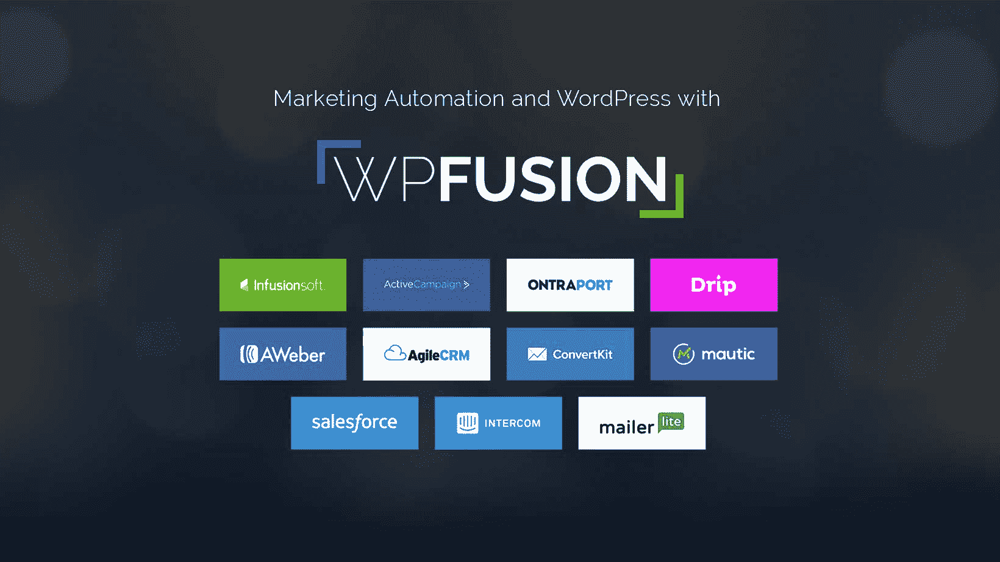
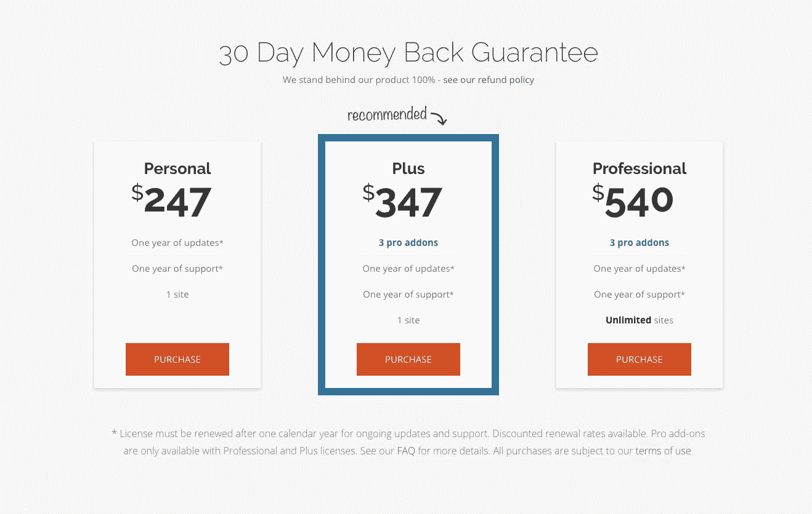
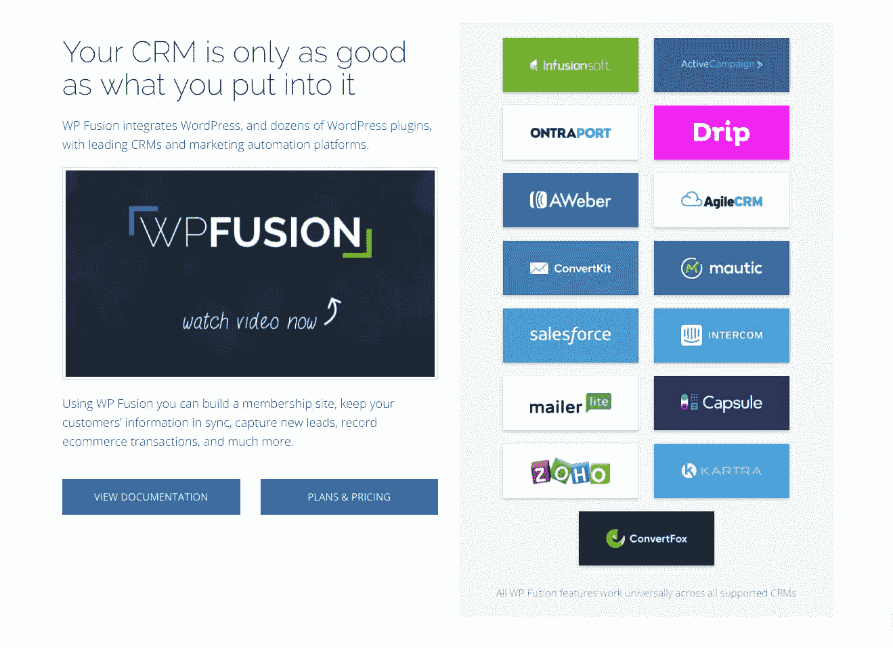

# 为 WordPress 建立和发展一个营销自动化工具

> 原文：<https://www.indiehackers.com/interview/building-and-growing-a-marketing-automation-tool-for-wordpress-e3ae028fce>

## 你好！你的背景是什么，你在做什么？

嗨！我叫杰克·阿图罗，是[非常好插件](https://verygoodplugins.com/)的创始人。我们的主要产品是 [WP Fusion](https://wpfusionplugin.com/) ，一个整合营销自动化系统和 WordPress 的插件。

营销自动化系统(例如 ActiveCampaign、Ontraport 和 Drip)是任何企业的基本工具，因为它们可以让您保存所有客户和联系人的数据库，对他们进行细分，发送电子邮件，并通常使营销过程自动化。当然，WordPress 是世界上最受欢迎的内容管理系统，为大约 25%的网站提供支持。但是，当你的客户和会员在使用你的 WordPress 网站时，没有真正的方法在你的营销中使用这些数据。这就是 WP Fusion 试图解决的问题。

三年多以前，我开始开发这个插件，现在我们每个月的经常性收入大约是 10，000 美元。

 

## 是什么促使你开始使用 WP Fusion？

像许多其他产品一样， [WP Fusion](https://wpfusionplugin.com/) 的出现是因为我找不到其他能满足我需要的东西。

我是一名自由开发人员，专门研究学习管理系统(LMS)和会员网站。我的一个客户有一个使用 UserPro 插件的会员网站，它可以创建全功能的前端用户资料和社区网站。他希望每个新用户注册都被发送到电子邮件营销和销售平台 Infusionsoft，作为新的联系记录。当时有一些插件提供了连接到 Infusionsoft 的完整会员平台，但没有一个插件可以在用户通过非附属软件注册时完成创建新联系人的简单工作。

我有一些使用 Infusionsoft API 的经验，所以我接手了这个项目，它工作得很好。我们将这些代码打包成插件，并出售。很快，那些没有使用 UserPro，但是想要相同功能的人开始接近我。例如，他们会希望他们的 WooCommerce 客户使用 Infusionsoft。

像许多其他产品一样，WP Fusion 的出现是因为我找不到其他任何可以满足我需要的东西。

TweetShare

随着它的规模开始扩大，我意识到这可能是一个非常棒的产品的潜力所在。我们也开始被问到，为什么我们只支持 Infusionsoft，而现在有这么多其他的客户关系管理(CRM)和营销自动化平台。因此，大约两年后，我重新编写了整个插件，这样它就可以完全模块化，我们可以很容易地添加新的 CRM 和新的插件集成。目标是让客户将“任何东西连接到任何东西”。

这就是我们今天的基本情况。这几乎就像一个众包项目——有人会写信来问我们是否可以让它与 ConvertFox(一种 CRM)一起工作，所以我们做到了。或者有人将使用我们以前没有合作过的会员平台，所以我们也将增加对它的支持。它只是继续有机增长。

## 构建最初的产品需要什么？

当我开始做这个的时候，我已经有了大约八年的 WordPress 开发经验，我对销售商业插件有一点了解，所以我有一点领先优势，知道将它推向市场需要什么。大约在 2015 年 1 月初，我勾画了一个核心功能的蓝图，以及其他需要的东西——比如许可系统、销售网站、支持渠道、脸书的存在。然后我坐下来编码。

最初的版本花了 61 个小时编码(我虔诚地在 Toggl 中跟踪一切)，销售网站又花了 23 个小时构建。

做点事情。不管它是什么，或者即使它是一个特别好的想法，但是停止计划，开始建立它。如果失败了，你至少会学到一些东西。

TweetShare

我所有的工作都是在晚上和周末进行的，只要有时间，我就会挤在我的老客户周围。我们的想法是将最低限度的可行产品推向市场，然后我们可以在此基础上进行改进。当时我想添加数百个功能，但我也知道如果我不在网上快速获得并出售某些东西，它可能会成为你永远工作的东西之一，没有人会使用。

第一个版本于 2015 年 2 月 2 日上市销售，因此仅用了一个多月的时间就创造出了最初的产品。到一月底的时候，我已经非常累了。

## 你们是如何吸引用户，壮大 WP Fusion 的？

尽管为互联网营销人员创造了一个产品，但我自己离营销人员是最远的。我通常只是尝试一些事情，看看什么是有效的。

我们并没有真的“发布”,但我确实开始浏览论坛，人们在那里表达了对类似产品的需求，并留下了网站链接。我还在 Infusionsoft 应用程序市场上建立了一个列表，一些人在那里找到了我们。

慢慢地，通过有机交通和口口相传，事情开始好转。前六个月，我们有 33 个客户，销售额为 4470 美元。在此期间，我们有 2966 个网站访客。一年后的同一时期(2016 年 1 月至 2016 年 6 月)，我们有 76 个客户，销售额为 20，970 美元，网站访问者为 4，024 人。这都是通过有机搜索和不断增长的社区意识，我们没有做任何付费广告或真正试图以任何有组织的方式推广它。

以下是我们历年的流量情况:

| 月 | 用户 |
| --- | --- |
| 2015 年 3 月 | 164 |
| 2016 年 3 月 | 557 |
| 2017 年 3 月 | 1780 |
| 2018 年 3 月 | 2064 |

进入 2017 年，我意识到我们在广告方面最大的资产是我们的客户群体。在很多方面，插件确实是围绕他们的需求设计的。所以我建立了一个联盟计划，带来了一些流量。我还创建了一个脸书小组，人们可以在这里分享建议和策略。它开始只是插件的一个支持小组，但我现在正试图将它发展成为任何试图利用 WordPress 营销自动化的人的资源。

对于 2018 年，我们开始通过在我们的产品领域引入具有营销专业知识的外部人士来组织一些适当的广告活动。我不喜欢试图向某人推销他们不需要的东西，但我认为很多人都在寻找像 WP Fusion 这样的解决方案，只是没有意识到它的存在。随着我们的不断发展，我们希望接触到这些人。

我的第一条建议是，你的客户是你最好的拥护者。毫无疑问，一个快乐的顾客是最好的广告形式。

这些天来，我投入支持的时间和投入开发的时间一样多。我将为 WordPress 的新用户设置插件，如果客户需要的话添加新功能，并尽一切努力确保我们的客户对他们的购买感到满意。

我的第一条建议是，你的客户是你最好的拥护者。毫无疑问，一个快乐的顾客是最好的广告形式。

TweetShare

这在许多方面产生了无法衡量的回报。有如此多的软件产品不太重视支持，我看到它们因此而遭受损失。

## 你的商业模式是什么，你是如何增加收入的？

WP Fusion 是开源软件，所以实际上是“免费”的。我们对支持和自动更新收费。因此，当你从我们的网站购买插件许可证时，你就购买了一年的支持和自动更新。一年后，您可以以 30%的折扣续订许可证，或者继续使用您当前的版本，但不再获得未来的更新。

我们提供三个价位:

*   单一站点“个人”许可证 247 美元
*   347 美元的单一网站“加”许可证，其中包括一些额外的插件，如废弃购物车跟踪和电子商务跟踪
*   “专业”许可证 540 美元，可以在无限数量的网站上使用

 

当我们第一次推出时，我们的价格大约是现在的一半。大约六个月后，我们将它们提高到了当前价格，以考虑到增加的功能和随后对客户价值的增加。我没有注意到随着价格的上涨销售有任何下降，当你看其他先进的 WordPress 插件如 WooCommerce 订阅或 Gravity Forms 时，我认为当前的价格是有竞争力的。

一年多以前，我们从发送过期许可证的付款续订提醒转变为默认情况下让人们自动定期付费(使用[轻松数字下载定期付款](https://easydigitaldownloads.com/downloads/recurring-payments/))。我注意到，自该协议生效以来，续订率有所提高，因为我认为保持许可证有效更容易，以防万一您需要支持。当需要手动支付来更新时，人们通常会让它失效。

虽然变化很大，但我们约 65%的收入来自新销售，35%来自许可证续订。我们提供 Stripe 和 PayPal 两种支付方式，其中约 25%的销售额来自 PayPal，其余来自 Stripe。

我们的花费很少。我去年接了一个“实习生”，是我一个朋友的朋友，对编程一窍不通，但是想学。他已经为非常好的插件工作了一年，实际上已经变成了一个非常好的程序员。所以我们有一些劳动力成本。除此之外，还有托管费用，我们必须为我们在自己的网站上运行的各种插件保持有效的许可证。

| 四分之一 | 收入 |
| --- | --- |
| Q1 15 年 | 787 |
| Q2 15 年 | 3683 |
| 2015 年第三季度 | 6020 |
| 2015 年第四季度 | 8088 |
| Q1 16 年 | 8070 |
| Q2 16 年 | 12900 |
| 2016 年第三季度 | 8711 |
| 2016 年第四季度 | 12603 |
| Q1 17 年 | 16263 |
| Q2 17 年 | 23920 |
| 2017 年第三季度 | 26374 |
| 2017 年第四季度 | 24710 |
| Q1 18 年 | 29080 |

## 你未来的目标是什么？

当然，我想继续开发这个产品，同时包括对更多 CRM 系统的支持，以尝试和接触更多的客户。更重要的是，我希望我们的网站和脸书社区成长为一个真正的资源，供使用 WordPress 营销自动化工具的人们使用。这将包括不再仅仅写技术文档，而是写更多关于留住客户、建立会员网站、吸引学生等方面的策略。

我目前正在探索如何最好地做到这一点的几个选项，因为我的时间已经够紧张了，而且我不是这些领域的专家。我正在考虑与一家可以制作文章和视频内容的公司合作，也可以为 WP Fusion 客户提供实施咨询。WP Fusion 允许你做很多事情，但为你的会员或 LMS 网站选择插件、主题、主机等的正确组合涉及很多变量——我认为我们有独特的定位来帮助人们导航这个过程。

在 WP Fusion 之外，我还试图拓展到其他项目。我们现在有几个人在为[非常好的插件](https://verygoodplugins.com/)工作，在那里我们为其他公司或开发者定制插件。我目前还在开发一个新产品，[致命错误通知](https://fatalerrornotify.com/)，当你的 WordPress 站点出现致命错误时，它会提醒你。

我们的目标是使我们的收入来源多样化一点，这样我就可以把更多的开发人员带入我们的生态系统，我们都可以从项目中包含多个视角的组合创造力中受益。

## 你面临的最大挑战和克服的障碍是什么？如果你必须重新开始，你会做什么不同的事？

没有任何可怕的失误，但有一些事情可以做得更好。

一个突出的问题是，我早就知道我最终会需要帮助，所以我尝试了几次聘请远程开发人员或代理来处理一些开发任务或支持票。问题是我很讲究做事的方式，不太会授权。我有一个开发人员为我工作了三个月，要么他写的代码不符合我的标准，要么我必须花很多时间来指导他，如果我自己来做会更快。雇佣一个“合格的”全职开发人员也是非常昂贵的。我花光了我所有的积蓄，当他甚至连最基本的任务都做不了的时候，我不得不让他走。

 

当我的朋友(Stan)找我学习编程时，我想这可能是一个尝试不同事物的好机会。因为这基本上是一次实习，所以我的花费很低(一份津贴，外加每天的午餐)。当然，和一个从未见过 PHP 的人一起工作是一个缓慢的过程。但是因为我能够从一开始就训练他使用我的标准和方法，所以没有任何“不学习”的坏习惯。

这显然不会在每个行业都行得通，也不是每个人都如此渴望学习，但在这种情况下，它真的很好。现在，我可以放心地向 Stan 分配新功能请求，并且知道它会按照我的方式完成，如果他遇到任何问题，他也不会害怕寻求帮助。此外，现在他是一个完全独立于位置的 PHP 开发人员，并在非常好的插件之外开发自己的客户端。所以这是一个互利的安排，创造了一个真正愉快的合作环境。

## 有没有发现什么特别有帮助或者有优势的？

当我还在为客户工作的时候，皮平·威廉姆森对我来说是一个巨大的鼓舞。他也在这里接受了关于独立黑客的采访。通过阅读他的博客文章和观察 Easy Digital Downloads 的成长，我发现，如果我能找到一个没有解决的问题，并为它创造一个解决方案，它就能成为一项真正的业务。所以我把这个想法放在脑后几年，等待合适的机会出现，然后 WP Fusion 的想法出现了。

多年前，在我成为企业家之前，我也读过纳西姆·尼古拉斯·塔勒布的《黑天鹅》，它真正塑造了我看待商业的方式。简而言之,“黑天鹅”是一个完全出乎意料和不可预测的事件，会产生彻底的变化。作为一名企业家，你想把自己置身于一个“黑天鹅积极”的环境中，也就是说，一个随机事件会让你受益，而不是让你退步。

作为一名企业家，你想让自己置身于一个随机事件对你有利而不是阻碍你的环境中。

TweetShare

所以当我考虑一个商业想法时，我总是想，“当那个*黑天鹅*出现时会发生什么？”例如，我可以用大量的风险资本来建立这个企业，但是可能会发生意想不到的事情，导致资金一下子被拿走。我认为 WP Fusion 是“黑天鹅积极的”:我们有好的几个月和坏的几个月，但不会出现我们所有的客户一夜之间消失的情况。另一方面，一些摇滚明星互联网营销人员或主要博客可以找到 WP Fusion 并开始推广它，我们的销售额可以在第二天增加 100 倍。

这给了我一个适用于我所做的每一件事的哲学——尽量减少潜在的负面影响，最大化潜在的正面影响。我认为这对塑造我的公司帮助很大。我们没有任何债务、资产或负债，所以我们不太容易受到负面事件的影响，并完全准备好利用正面事件。

## 对于刚刚起步的独立黑客，你有什么建议？

几乎在每一次采访中都有人这么说，但是:**只管做事情**。不管它是什么，或者即使它是一个特别好的想法，但是停止计划，开始建立它。如果失败了，你至少会学到一些东西。

我在 WordPress 空间内外经历了几十个更小的冒险。一些成功了，大多数失败了。但每一次都拓展了我的技能，更重要的是，让我更好地应对失败并快速前进。

我将再次提到[致命错误通知](https://fatalerrornotify.com/)作为例子。我不知道它是否会在商业上成功。我只是有一种感觉，好像是这样的。所以我花了大约 50 个小时来开发它，并把它发布出去。现在至少它有了起飞的机会，这比只是我头脑中的一个想法要好得多。

## 我们可以去哪里了解更多？

我在网上的“门户”在 verygoodplugins.com。如果你对利用 WordPress 的营销自动化感兴趣，一定要看看 [WP Fusion](https://wpfusionplugin.com/) 。

——[<picture id="ember5287822" class="user-avatar ember-view user-link__avatar"></picture>杰克·阿图罗](/verygoodplugins?id=2Lkd20tn2BU8btVT50xKm2vgDWk1)，WP Fusion 创始人

## 想像 WP Fusion 一样建立自己的事业？

你应该加入独立黑客社区！🤗

我们是几千名创始人，互相帮助建立有利可图的业务和副业。来分享你正在做的事情，并从你的同事那里获得反馈。

还没准备好开始使用你的产品吗？没问题。这个社区是一个认识人、学习和实践的好地方。随意[随便浏览](/)！

——[<picture id="ember5287827" class="user-avatar ember-view user-link__avatar"></picture>柯特兰艾伦](/csallen?id=ibTLPyjwVebnZjMGKvz6ztarnuV2)，独立黑客创始人

16votes