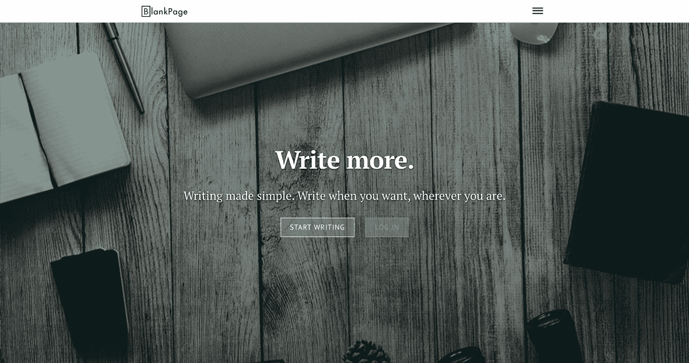
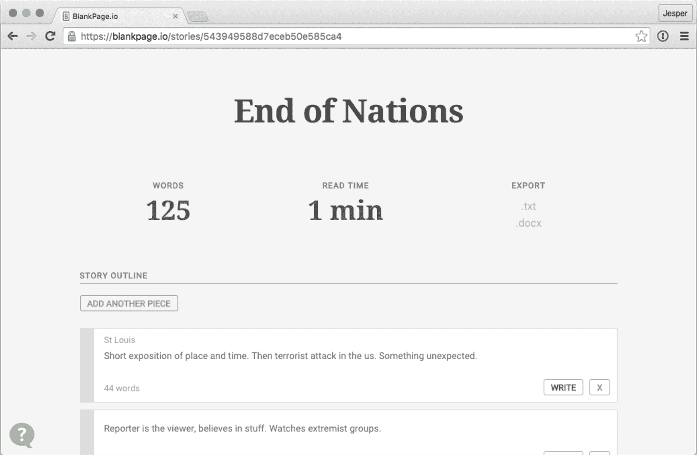

# 建立和发展一个激励作家写作的工具

> 原文：<https://www.indiehackers.com/interview/building-and-growing-a-tool-that-motivates-writers-to-write-6ae655a1cc>

## 你好！你的背景是什么，你在做什么？

嗨，我是杰伊——杰斯珀的简称。我是一名自由职业者，来自瑞典斯德哥尔摩的 UX 设计师和前端开发人员。我十几岁时开始制作网站，并尝试了几年视频游戏设计。大约在 2010 年，当我在代理公司和创业公司之间穿梭时，网络应用成了我的激情所在。

今天，我关注的是 BlankPage，这是一个写作工具和激励服务，帮助有抱负的作家完成他们的初稿。它最初是一个帮助朋友写更多东西的项目。我认为我在游戏设计和动机心理学方面的经验可能有用。的确是。他仍然没有完成他的手稿，但是许多其他人已经完成了。

用 BlankPage 写作的人是一群令人惊讶的人，通常是那些已经为自己创造了事业，现在正腾出时间写作的人。而且女性比男性多，所以我不是在打造传统的科技产品。BlankPage 是一个基本的写作体验，其主要目标是帮助人们建立写作的习惯。

到目前为止，BlankPage 已经帮助了超过 15，000 名作家，他们每周写的作品相当于两本完整的小说。

 

## 是什么促使你开始使用 BlankPage？

我有个朋友经常给我们讲这些神奇的故事。他总是想出新的世界和奇妙的场景。但是他从来没有抽出时间把它们写下来。他一直在说写不出东西的挫败感。

最终，我开始把它当成一个设计挑战:我能把写作的艰辛变成一种愉快的经历吗？

最大的理解只有来自于把自己完全沉浸在问题中。

TweetShare

当时我是一名网站开发人员，所以一个周末我坐下来尝试了一些设计。当我有了一个原型并开始运行时，我意识到市场上没有任何其他类似的产品。

慢慢地，随着越来越多的用户开始写作，我开始投入更多的时间来充实它。三年后，我们有很多竞争对手，但也有成千上万的作家。

从一开始，我的目标就是经营一家盈利的企业，支付我的成本，或许还能买得起一台新的 iPad。但是 [BlankPage](https://www.blankpage.io) 在最初的六个月里就超出了它的成本。

从那以后，我把目光放在了专门靠 BlankPage 谋生上。这被证明是更具挑战性的，我仍然没有完全达到。

## 构建最初的产品需要什么？

我想我花了两年时间构建了第一个版本。演示花了我一个周末的时间，但是我太兴奋了，以至于我选择了用所有的新技术来建造一些新的东西…大错特错。最后我在后端用了 Node.js 和 MongoDB，在前端用了半熟悉的 Backbone.js。

所以我花了几个月的时间努力学习新技术，同时试图快速迭代产品。我基本上陷入了[沉没成本谬误](http://www.lifehack.org/articles/communication/how-the-sunk-cost-fallacy-makes-you-act-stupid.html)中，并不断让自己更深地陷入其中。

我是自举，对项目的商业方面不太感兴趣，所以我花了很长时间才意识到，所有这些时间比支付给另一个开发人员要昂贵得多。

每个人的时间都比金钱短。当我意识到我的错误时，这个产品对我来说太远了，以至于我无法重写一个更合理的技术栈。相反，我缩减了功能，并接受了基于相同技术的客户工作。这帮助我学得更快。

这需要几个月的漫漫长夜和周末。但是产品起作用了，事情开始向我希望的方向发展。所以我想我是通过努力工作来寻找运气的。

现在，我确实毁了一段感情，换了几次工作，所以这不是一个顺利的发展过程，而是一系列的冲刺和崩溃。我本可以从一开始就更有策略地避免这种情况。

如果没有来自 [Thord Daniel Hedengren](http://tdh.se) 和[Patrik thunstrm](https://soundcloud.com/magebarf)的指导，我想我不会成功，他们对产品战略、业务和发展的不断讨论给了我巨大的帮助。

## 你是如何吸引用户并发展 BlankPage 的？

[空白页面](https://www.blankpage.io)出现在[产品搜索](https://www.producthunt.com/posts/blankpage)的首页。这只是运气。我在 Twitter 上认识的一个荷兰设计师喜欢我正在做的事情，并在测试版中追捕我。所以当我第一次听说 Product Hunt 的时候，BlankPage 在头版排名第二，领先于 Scrivener 和 Ulysses 等产品。

我记得我在去密苏里看望我哥哥的飞机上，完成了订阅程序。当我下飞机时，我会收到来自产品搜索的大量流量通知。我紧急起飞。然后，我不得不在周末的剩余时间里修复我计划在发布前修复的错误。有时候，你必须把事情推出来。

从那以后，我买了一些广告，和 AppSumo 一起做了一些活动，但主要是靠口碑增长。SEO 帮助人们找到 BlankPage，但我相信大多数努力养成写作习惯的人根本不知道有这样的服务。保持动力是一个很老的问题。但是让你保持动力的服务是相当新颖的。

所有的旧策略都非常有效，我们只是不写博客，因为它们不再是新的了。

TweetShare

因为我们帮助人们写作，所以每年 11 月我们还会收到来自全国小说写作月的额外鼓励。大约有 50 万人参加，从 10 月到 11 月，他们在互联网上寻找动力。每年都有几千名作家加入我们，仅仅是为了 NaNoWriMo。

| 月 | 客户 |
| --- | --- |
| '13-'14 | 12253 |
| '14-'15 | 62221 |
| '15-'16 | 125924 |
| '16-'17 | 122476 |

注:每年 10 月 1 日开始。2016-2017 年还剩一个多月。

我们尝试了各种广告和活动。但作为技术人员，我认为我们经常跳到下一件大事上，因为那是其他人都在谈论的。我们往往会忘记所有的旧策略都非常有效，我们只是不写博客，因为它们不再是新的*。我们两个主要的流量来源是 SEO 和让我们的用户分享他们的进展。*

 *## 你的商业模式是什么，你是如何增加收入的？

当我们开始的时候，我们的想法是让人们付费进入。基本上是付费墙。我的理论是，如果你在游戏中有皮肤，你会更有可能致力于写作。那没用。

虽然确实有一些人注册了，但转化的流量很少。现在 [BlankPage](https://www.blankpage.io) 是一款经典的 SaaS。在 7 天免费试用后，您可以按月或按年订阅。我们尝试了一个免费增值模式，但结果是动机和免费增值真的不能一起工作。这实际上为作家增加了另一个障碍。

我们的成本随着我们存储的用户数量和作品数量线性增长。我们的收入经历了很多起伏。因此，我有过利润率和盈利能力的巅峰时期，也有过亏损的月份。

我认为商业模式的清晰是它成功的原因。每个人都理解一个订阅。他们知道他们在支付什么，他们知道他们在支付什么。你的商业模式变得太有创造性是一个不好的信号。通常只是担心你的产品不够好。尽可能简单地为你的产品收费。人们会为对他们有价值的东西付费。

## 你未来的目标是什么，你打算如何实现它们？

我有一个短期目标——能够专门在 BlankPage 上工作——还有一个长期目标——找人在 BlankPage 上写今年最畅销的小说。

想想这对作者、对我、对产品意味着什么。如果 BlankPage 只是帮助一个苦苦挣扎的作家完成了一些伟大的作品，那将是巨大的。JK 罗琳在她的孩子睡着的时候努力找时间写哈利波特。E.L .詹姆斯没打算完成《五十度灰》。现在你可能喜欢也可能不喜欢这些书，但它们对世界的影响是无可辩驳的。

BlankPage 前面还有很多挣扎。从技术上来说，处理文本并不容易——有太多的边缘情况。竞争日益激烈。我仍然需要时间来添加自发布以来一直在等待的功能！但是从商业和设计的角度来看，我们也正在进入一个非常有趣的位置。所以我认为未来将会非常激动人心。

## 你面临的最大挑战是什么？你克服的障碍？

BlankPage 面临的最大挑战一直是文本。在当前的技术下，文本很难处理。没有任何真正的标准，字体不支持每种语言，存储和处理文本很棘手，导出也很困难，因为不同的文档格式使用各自的布局技术。

对每个产品来说，专注于对产品和作者来说真正重要的东西是一场斗争。开始处理让你烦恼的细节和事情很容易，但实际市场并不关心这些。

当我应该为我的用户群写更好的销售页面和指导材料的时候，我在 UI 设计上花了太多的时间。基础比世界上所有的花里胡哨重要得多。

 

对我来说，另一个重要的教训是，如果我把更多的时间放在我的前端从 [Backbone.js](http://backbonejs.org/) 切换到 [React](https://facebook.github.io/react/) 上，我可以节省数百个小时和数千美元。即使是很小的选择也需要与企业的发展方向保持战略一致。随着时间的推移，专注于对用户的长期影响总是比现在灭火和调整设计更有利可图。

## 你最大的优势是什么？有什么特别有用的吗？

从第一天起就有一个出版作家作为顾问。如果没有一个真正以写作为生的人来激发创意， [BlankPage](https://www.blankpage.io) 永远不会成为现在这样的焦点产品。我们的许多竞争对手显然没有这种反馈回路——他们不断为“厨房水槽”产品添加功能。

带着动力工作并在学术上研究它也是一个很大的优势。我已经能够准确地跟踪一个改变是否有帮助，而不会迷失在虚荣的衡量标准中。

也就是说，热爱阅读和写作可能是最关键的因素。我不认为你能为别人开发一个你自己都不会用的产品。最大的理解只有来自于把自己完全沉浸在问题中。

## 对于刚刚起步的独立黑客，你有什么建议？

花时间去了解你的市场。在网上和他们一起玩。从他们的角度了解问题所在，然后制定解决方案。

找到最快的方法来交付解决问题的东西，并快速迭代。没有必要从完全的 SaaS 开始。制作电子书或举办研讨会对于验证你对市场的想法同样有效，如果不是更好的话。

赢的不是第一个行动的人，而是学得最快的人。

我开始把它当成一个设计挑战:我能把写作的艰辛变成一种愉快的经历吗？

TweetShare

如果你还没有听过，雷德·霍夫曼的播客系列[规模大师](https://www.entrepreneur.com/topic/masters-of-scale)是惊人的，既是灵感的来源，也是制造产品时可能出错的实用技巧的来源。

如果你对动机或让事情变得有趣感兴趣，没有比拉斐尔·科斯特的惊人的书[有趣的理论](https://www.amazon.com/gp/product/1449363210/ref=as_li_tl?ie=UTF8&camp=1789&creative=9325&creativeASIN=1449363210&linkCode=as2&tag=jesperbylund-20&linkId=b090ca2b38db91556296cb54137b73eb)更好的学习方法了。买下来，3 小时看完，永远爱。我想我拥有 4 本，并且已经送出了 10 本左右。

## 我们可以去哪里了解更多？

我在 JesperBylund.com 的[写关于生活和设计的博客。你也可以在我们的](http://jesperbylund.com)[博客](https://www.blankpage.io/blog)上关注 BlankPage 上发生的事情。如果你想联系的话，我更喜欢 Twitter，但是我很乐意在评论中回答任何相关的问题，这样每个人都可以了解背景。

—[<picture id="ember8181832" class="user-avatar ember-view user-link__avatar"></picture>Jesper by Lund](/JesperBylund?id=r11Q0dU0KXVayKdBadP8EF2Qdmu1)，BlankPage 的创建者

## 想像 BlankPage 一样建立自己的事业？

你应该加入独立黑客社区！🤗

我们是几千名创始人，互相帮助建立有利可图的业务和副业。来分享你正在做的事情，并从你的同事那里获得反馈。

还没准备好开始使用你的产品吗？没问题。这个社区是一个认识人、学习和实践的好地方。随意[随便浏览](/)！

——[<picture id="ember8181837" class="user-avatar ember-view user-link__avatar"></picture>考特兰艾伦](/csallen?id=ibTLPyjwVebnZjMGKvz6ztarnuV2)，独立黑客创始人

8votes*