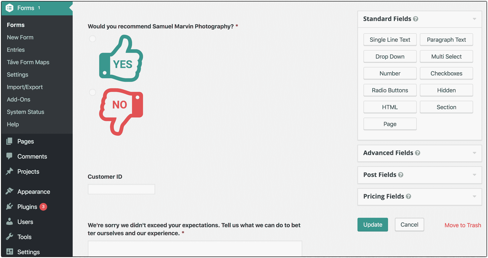
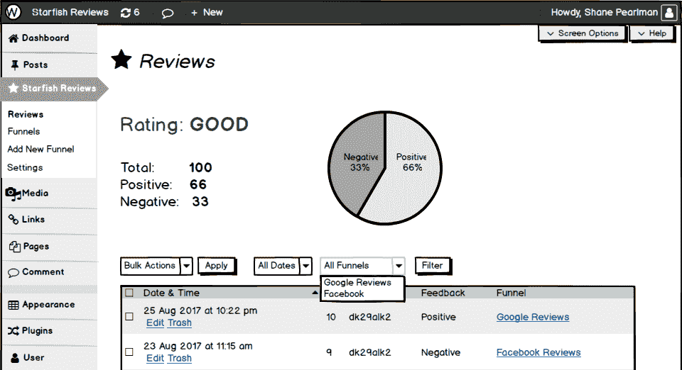
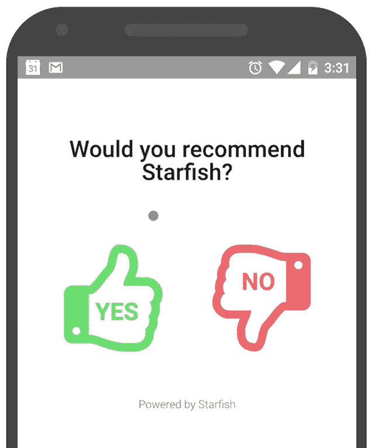
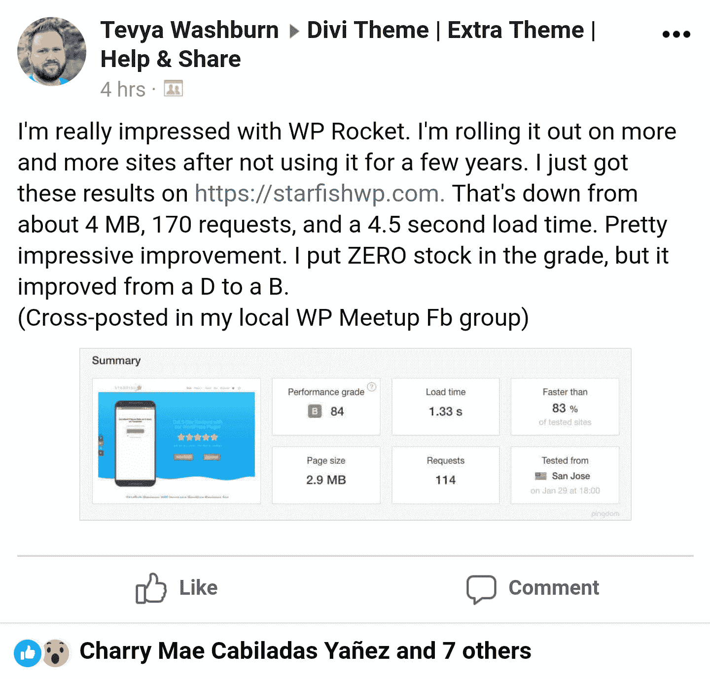

# 建立和发展一个 WordPress 插件来管理在线声誉

> 原文：<https://www.indiehackers.com/interview/building-and-growing-a-wordpress-plugin-for-managing-online-reputation-b4ecbc116d>

## 你好！你的背景是什么，你在做什么？

我是特维亚·沃什伯恩。我在爱达荷州城镇边缘的一个农场长大。我喜欢骑马。当天气太冷或者我被太阳晒得太累的时候，我会进去摆弄电脑。我自学了 Photoshop 和网站设计。后来，我通过做自由网页设计和视频工作，支付了我大学历史学位的大部分费用。

我在 2008 年创建了 WordPress，几年后，我把自己的 WP 自由职业变成了合法的生意，为人们设计、建设和管理 WordPress 网站。这项业务现在叫做 [WordXpress](https://wordx.press/?utm_source=indiehackers_interview&utm_medium=article) ，以前叫做 Fiddler Online。

## 是什么激励你开始做海星评论？

我们的许多 WordXpress 会员都是小型本地企业。我们会收到他们关于提高在线评分和评论的问题。但是这些在线“声誉管理”公司的最便宜的套餐每月收费 300 美元。这对我们大多数成员来说太多了。

其中一家公司的销售人员解释说，他们的核心是一个简单的登录页面，上面有一个简单的是/否问题，询问你是否喜欢这项业务。然后，他们的客户可以通过短信或电子邮件将该页面发送给客户，并寻求一些反馈。如果他们回答“是”，那么它会要求他们对谷歌我的业务、脸书、Yelp、猫途鹰等进行正面评价。如果他们表示“否”, it 将询问他们如何改进并获取该信息以供内部审查。我想，“哼！我可以做到。”

当然，这些公司有一个完整的仪表板，基于从所有这些网站收集的评论进行分析，加上短信集成，用于发送页面链接等。但就其本质而言，真正的价值只是简单的登录页面，以过滤那些有好事情要说的人和那些有坏事情要说的人。

直到几个月后，当我们的一个成员发给我这些评论“登陆页面”(或者我们现在称之为“漏斗”)的链接时，我才开始思考我的想法。他的一个供应商发来了链接以获得他的反馈。他问我是否可以在他的网站上添加类似的内容。我说“当然”我搜索了一下，看看是否有 WordPress 插件已经在这么做了。我很惊讶我找不到一个。所以我用一些 CSS 将相同的功能构建到我们在 [Gravity Forms](https://gravityforms.com) 上的原型中。我没有写一行代码来构建它。这是重力形式的原始原型的截图:

 

在接下来的 6 个月里，他开始将该页面发送给他的客户，并在他的谷歌列表中添加了 100 多篇四星和五星评论！在他开始使用它后不久，我看着这些数字，心想，“我们应该把它作为追加销售提供给我们的其他会员。”在每个站点上复制原型解决方案会有点耗时。合理的解决方案是构建一个更容易部署的插件。当然，下一个心理步骤是，“让我们卖了它！”[海星点评](https://starfishwp.com/?utm_source=indiehackers_interview&utm_medium=article)就是这样诞生的。

## 构建最初的产品需要什么？

随着原型的建立和概念的验证，我和 Anas bin Mukim 聊了聊，他是一位和我共事多年的开发人员。2017 年 8 月，我向他提供了 20%的收入分成安排，与我合作将其打造为 WordPress 插件。我估计大约有 50%的预算用于网站和托管，营销，SaaS 服务，如帮助 Scout 提供支持，WordPress 和 WooCommerce 插件，联盟支出等。

完成最低限度的可行产品只是第一步。然后真正的工作开始了。

TweetShare

然后是 10%的商业费用、汇率和杂项缓冲。剩下 40%时，我们每个人可以得到 20%的时间和努力的回报。Anas 会写代码，我会设计用户界面，做市场营销，等等。阿纳斯对此很兴奋，并准备马上开始。这种安排对于一个自举项目来说是完美的，因为他将根据实际销售额获得报酬，而不是我必须按小时支付他。到目前为止，一切都很顺利，数字看起来也很正确。

我是精益创业公司*的忠实粉丝，所以我为插件设计了最基本的可行产品特性。它基本上就是我在 Gravity Forms 上原型化的所有东西，建立在 WordPress 的自定义帖子类型上。*

 *主要的区别是我们所谓的“漏斗”,就是那些简单的登录页面，上面有是/否的问题。在插件中，您可以创建多个漏斗，将它们带到不同的审阅目的地或用于跟踪目的。我包括了一些用 Balsamiq 制作的线框模型。然后阿纳斯开始工作。他构建了 1.0 版本，不久又构建了 1.1 版本。然后我们在几个不同版本的 PHP 和 WordPress 的 alpha 版本上测试了它。我们还测试了 Gutenberg 插件，以确保它在 WP 5.0 接近完成时能够正常工作。

 

大约在同一时间，我让达菲娜，一个我过去合作过的标志设计师，为我们设计了一个标志。我也请我在 WordXpress 的设计师之一 Roge 开始设计这个网站。因此，我们实现的大部分支出归结为支付 da fina 60 美元购买初始徽标版本，购买 [WooCommerce API Manager](https://woocommerce.com/products/woocommerce-api-manager/) 插件来管理许可和自动更新，以及一些其他小插件和服务，我们用来使网站按照我们想要的方式工作。从 WooCommerce 出售其扩展的时候起，我就有了 [WooCommerce 订阅](https://woocommerce.com/products/woocommerce-subscriptions/)的终身许可，所以我不必为此付费。Roge 的时间和他在 WordXpress 的工作以及我们的托管费都算在一起了。我们获得了 WordXpress 的帮助，但添加另一个邮箱不需要额外的成本。所以我们海星特有的总成本可能只有 400 美元，假设我和安娜花费的时间价值为 0 美元。

我想到黑色星期五可能是推出这个的好时机。感恩节那天，我们在华盛顿州的斯波坎市拜访吉尔的父母。我们有完整的 MVP 版本的插件和一个基本完成的网站和平台来销售和管理许可证。所以在感恩节的前两天，我去了当地的图书馆，把自己锁在房间里整整 14 个小时！我敲定了网站的所有设计和功能，达到了我满意的程度。

我可能已经超越了 MVP 的范畴。作为一名设计师，我会纠结于设计的小细节，确保一切都设置好并正常运行。其中包括演示插件如何工作的动画，MailPoet 上的时事通讯系统设置(目前)，以及一些代码片段和大量 CSS，以使 WooCommerce My Account 和 Checkout 页面简单而流畅。我还将 WordXpress 博客上的一些帖子转移到了 Starfish 上，因为它们当时似乎更适合放在那里。那是另一个错误。转向关注管理而不是设计的 WordXpress，使得这些在 WordXpress 上更加相关。这是一个我无法预见的错误，因为当时我还没有决定将 Fiddler Online 转到 WordXpress。

 

## 你是如何吸引用户和增长海星评论的？

我推出了一个特殊的“黑色星期五+启动”交易，终身许可和站长(无限)许可的价格为 99 美元。然后我联系了几家列出 WordPress 交易的网站，询问他们是否可以列出我们的交易。这是美国感恩节的前一天晚上。我认为实际上只有两三个网站列出了交易。我通过一些社交媒体渠道分享了出来。它从几个脸书团体那里获得了最多的关注。

总之，这足以在感恩节前后的一周内获得约 300 次访问。这导致了 5 个了不起的人购买我们的网站管理员许可证！这证明了人们对我们提供的东西感兴趣并愿意付钱。这是令人兴奋的东西。然后我生病了....

在从斯波坎开车回家的路上，我注意到我的喉咙发痒。第二天我生病了。这是我得过的最奇怪的病。我从来没有真的觉得很不舒服。我的喉咙有点不适，我的身体感觉比正常情况下弱。但总的来说，我过得还不错。然而，我会在早上小睡一会儿，因为我觉得太累了，不能工作，会睡 6 或 7 个小时！然后我会在几个小时后回去睡觉，一晚上睡 14 个多小时！我醒来时总是感觉相对较好，但在我太累之前不能做太多事情，我会回去睡觉。这种情况持续了一个多星期，我才摆脱出来。

比你想的更多地营销，在你的产品仍然感觉太简单或太原始而无法展示时出货，阅读或听伟大的书籍、播客和文章。

TweetShare

这显然阻碍了我，我无法利用我们可能从黑色星期五发布会上获得的任何势头。在我能够再次专注于海星之前，我还必须赶上我们主要网站业务的工作进度。

那时已经是圣诞节了，我只是觉得做更多的事情不是时候。所以到了 1 月底，我们才能够再次推进。但这确实给了我们一些时间去做一些其他的事情。例如，我能够让插件[插件评论](https://wordpress.org/plugins/plugin-reviews/)(一个在你的 WP 网站上显示你的插件的 WordPress.org 评论的插件)的所有者允许我们接管那个插件并更新和修复它。它已经有一段时间没有更新了，不能正常工作。它在某种程度上与海星评论保持一致，也有助于让我们对 WP.org 有所了解，尽管我们还没有完成海星评论的免费版本。

对我们来说，这还是非常早期的阶段，从生病到计划新的一年，我没有太多的时间。由于只有少数人在 11 月和 12 月购买了终身交易的插件，我们决定提供更长时间的终身交易。我们再次将网站管理员许可定价为 99 美元，并将其作为“2018 年开始”交易进行推广。我在博客上发布了这件事，然后我们在一月中旬在社交媒体上分享了这件事。没发生什么。一个人买了，仅此而已。这给我们带来了 8 个客户和 792 美元的销售额。不坏，但不伟大。

月底，随着终身交易的结束，我在网站上安装了 [WP Rocket](https://wp-rocket.me) ，并对正确配置后的速度提升印象深刻。我在脸书一个为使用 [Divi](https://www.elegantthemes.com/gallery/divi/) 主题的人设立的群组上发布了这个消息，因为我们的网站也使用了这个主题。这获得了一些流量和关注，我相信有一些人购买了它。

Josh Rohrback，这个团队的一员，经营着 [Magi 网页设计](https://www.magiwebdesign.com/)，看到了这个帖子。他也是“终生科技交易粉丝”组织的成员。他在那里提到了我们的交易，我几乎立刻就开始在电子邮件中收到新订单通知！实际上，我不得不看分析学之类的东西来拼凑所发生的事情。一旦它在那个群体中被分享，它就开始以我投入的最少的曝光率和努力卖得相当快。从 1 月 24 日到 2 月 3 日交易结束，又有 30 人购买了终身交易，总销售额为 3613 美元！

 

我们真的很幸运，Josh 看到了那个帖子，并在一个更关注这类交易的小组中分享了它。但是，如果你有一种产品或服务，你愿意以终身许可的方式出售，那么这样的一个团体可能会很棒。我的猜测是，我们能够以比在这些交易网站上更高的价格出售它。

我最近读到了 lemlist 在 AppSumo 上的经历，我觉得这对于我们这样的企业来说不是一个好的模式。我真的很想听听六个月或一年前与 AppSumo 达成交易的公司的意见。我想知道他们是否有任何可量化的证据表明，所有这些“曝光”导致了交易结束后的重复销售。

回到我们的故事，对于这样一个年轻的产品，我们获得了许多优秀的用户和一些稳定的收入。更重要的是，我们获得了足够多的新用户，开始与他们交谈并创建一个社区。

## 你的商业模式是什么，你如何销售你的产品？

我们的模型与大多数高级 WordPress 插件的单一购买模型非常相似。在写这篇文章的时候，你可以以每年 99 美元的价格购买我们的网站管理员许可证，或者以每年 39 美元的价格购买我们的营业执照。站长是无限的渠道，可以在无限的网站上激活。营业执照适用于一个站点，外加一个暂存或开发站点。

当我在我购买的主站点之外的地方测试一个高级插件时，我不能自动更新它，这让我很沮丧，所以我觉得这是一个好的解决方案。自从终身交易结束后，我们一直在收取这些价格，并有另外 23 人购买了我们的年度模型。其中两家公司在 14 天的宽限期内执行了我们的“无问题”退款政策。我们假设其中一些来自于在 WordPress.org 上使用我们的插件的免费版本，名为 [Starfish Reviews Lite](https://wordpress.org/plugins/starfish-reviews/) ，尽管我们正在为此进行更好的跟踪。

重要的是不要低估你自己或你的产品。

TweetShare

随着我们增加主要功能，我们计划提高价格。当我们把这个插件建成像我对它的设想一样的东西时，价格可能会超过 300 美元/年，但这需要一段时间(和大量的工作)。当公司给予这些超级大的折扣时，我感到不受重视，但它们“只针对新客户”在我看来，这是不道德的，至少是对那些让他们继续做生意的长期客户的一记耳光。因此，我们所有的成员将[保持他们在](https://starfishwp.com/why-you-should-buy-starfish-reviews-right-away-our-plan-for-starfish-reviews-pricing/?utm_source=indiehackers_interview&utm_medium=article)购买的价格，无论我们增加多少更棒的功能，或者我们从他们购买时的价格提高多少。我们感谢他们帮助我们起步，并与我们长期合作。

正如我提到的，我们使用 WooCommerce 来管理整个项目。我们在 WooCommerce 订阅上设置了许可证作为年度订阅。我决定同时提供 Stripe 和 PayPal 选项。我真的不是 PayPal 的粉丝，但许多在线营销人员、网站管理员和自由职业者(我们的目标市场)像使用商业支票账户一样使用他们的 PayPal 账户。因此，我将它作为一个选项，并将 Stripe 作为我们的默认选项。

## 你未来的目标是什么？

自从我们的终身交易结束以来，收入已经放缓，你可能已经从数字中猜到了，但我们仍然每隔几天就有销售额。我们一直专注于改进插件，并建立一些线索捕捉和销售渠道。

我们正在与一个 WordPress 社区达成协议，为他们的成员提供一些特殊的价格。根据进展情况，我们可能会对其他社区或团体采取类似的做法。

我们还致力于发布与声誉管理、评级和评论、WordPress 营销等相关的新内容和工具。希望，结合一些帖子，播客采访，以及更多我已经排队，将有助于提高我们的流量。我们可能还会修改一些 AdWords 和/或脸书广告。

人们似乎理解海星评论的价值，以及一旦他们看到它，它对帮助他们进行在线评论营销是一个多么伟大的工具。所以我们目标的很大一部分就是增加我们的流量和曝光率。然而，最重要的目标是销售。

我们需要更多的人购买插件，使用它，给我们反馈，加入我们的社区，并传播消息。我们的目标是全年建立我提到的营销努力，通过可持续的努力(即*而不是*“特别”促销)在 12 月，并从那里开始增长。这应该意味着可持续的约 4k 美元/月的销售额，并在 2019 年全年保持增长。那时我们会设定新的目标。

另一个目标是继续快速迭代插件本身。我们看到了那些每月 300 美元的 SaaS 公司提供的许多功能的巨大潜力。我们还没有为特性设定具体的目标，但是尝试每两个月发布至少一个更新，至少有一个重要的新特性。到目前为止，我们做得甚至比这更好。激动人心的事情来了！

## 你面临的最大挑战和克服的障碍是什么，你对未来有什么期待？

因为我已经引导另一个企业走向成功，在这个过程中失败了很多次，我觉得这一次我犯的错误少多了...至少到目前为止。我已经说过在网站设计和设置上做的比 MVP 更多是错误的。我也不应该把文章从我们的 WordXpress 博客转移到海星的。

另一个错误是决定通过我们的 WordXpress Stripe 和 PayPal 账户处理所有海星的东西。我告诉自己“最简单的是最好的！只是出货。”这可能是 95%情况下正确的答案和态度。

然而，在这种情况下，它最终导致了一些麻烦。这个问题有两个部分。一个是我们簿记的潜在混乱。如果所有事情都通过独立的商业账户进行，那就简单多了。然而，主要的问题是可能会向海星买家发送付款确认电子邮件，因为上面有 WordXpress 品牌，所以会令人困惑。

我们最近开始使用 [ChargeDesk](https://chargedesk.com/) 来处理催款、收据，并允许我们轻松地从我们的 WordXpress 成员那里获得最新的支付信息。ChargeDesk 有过滤的方法，但是没有一种方法能始终适用于我们的设置。由于 WordXpress 很少使用，我最终将 PayPal 账户改为海星专用，然后为海星创建了一个新的 Stripe 账户。

我与[pro press](https://prospress.com/)团队和 Stripe 合作，以确保我可以将现有客户和支付方式转移到一个新的 Stripe 账户，然后在 WooCommerce 订阅中重新连接他们，以便订阅可以顺利进行。既然这两个品牌有不同的帐户，ChargeDesk 允许我们将它们都连接到我们的 ChargeDesk 帐户中，但在不同的组织下。因此，现在我们为 WordXpress 交易推出了品牌化的自动催款电子邮件、收据等。所有这些都是由海星上的 WooCommerce 处理的。然而，我仍然可以看到两个品牌的会员的所有收费信息。

挑战已经过去，我们最大的挑战是我的时间。我和我的团队正在运行[WordPress](https://wordx.press/?utm_source=indiehackers_interview&utm_medium=article)，并试图融入这个品牌和商业模式。因为这是现在支付账单的方式，所以很难分配时间和资源给海星。我也是一个丈夫，3.5 个孩子的父亲(一个在路上)，并在我的教堂服务。这就是为什么我们本该在斯波坎度假的时候，我不得不连续工作两天，每天 14 小时。

不过，我真的很喜欢在 Starfish 上工作，并热衷于帮助小企业、WordPress 网站管理员和在线营销人员在评级和评论管理方面做好事。所以我尽可能抽出时间来为插件提供支持，努力改进它，为博客制作内容，学习和实施更好的营销技巧，并只是简单地讲述我们的故事。

我们可能遇到的其他路障或障碍可能包括古腾堡和竞争。WordPress 中的 Gutenberg 编辑器是[我对](https://wptavern.com/why-gutenberg-and-why-now)感到非常兴奋。这将需要我们做一些工作，但我们肯定会在未来的插件中添加一个“Gutenblock”。我们也可能重组插件的大部分界面，以便在某个时候在 Gutenberg/React 上运行。

许多挑战就像古腾堡提出的那样:这完全是一个视角问题。如果我们专注于改变和所有的艰苦工作，很容易对古腾堡感到沮丧。但是我们选择欢迎和拥抱它，把它作为一个改进我们插件和支持 WordPress 未来的机会。从这个角度来看，这似乎根本不是问题。

 

竞争会让人感到害怕，尤其是当你第一次进入利基市场的时候。我是一个思想丰富的人，我相信海星评论和其他想要与之竞争的 WP 插件有足够的空间。也许有人会读这篇关于独立黑客的采访，并认为“我可以建立它”，就像我一样。到目前为止，我仍然有点惊讶我们是这个领域的第一个也是唯一的产品。当其他人开发了一个直接竞争的插件时，那也将是一个挑战。想要在 WordPress 上添加评论管理插件的人会有比海星评论更多的选择。

我是一个好胜的人，所以我想保持领先，保持我们现在的领先优势。但是如果它碰巧是 WordPress 或声誉管理领域的一家成熟公司，它们很容易成为更受欢迎的解决方案。他们将有资源快速构建类似的功能并进行营销，以赶上我们。此外，他们将拥有品牌知名度和追随者，并在一开始就有大量曝光。

如果发生这种情况，我们将不得不接受第二的位置，至少目前如此。然而，这并不意味着我们不能达到我们的目标。正如我所说，这个市场是巨大的。我希望我们的竞争对手是另一个独立的黑客类型，独自工作，或者和我们这样的小团队一起工作。然后我们就可以在一个更公平的环境下进行真正的友好竞争了！

## 有没有发现什么特别有帮助或者有优势的？

正如我提到的，我真的很喜欢精益创业公司。大本营的人所写的《T2》《T3》《T4》《T5》这本书也是无价之宝。关于如何工作和经营一家公司，尤其是一家分布式公司，有很多伟大的原则。我喜欢他们的公司和处理事情的方式，尽管我不使用 Basecamp。我想那本书我已经读了三遍了。

Greg McKeown 的 [*本质主义*](https://gregmckeown.com/book/) 我怎么推荐都不够。这是一本影响你生活方方面面的书。我也读了三遍。我试图在我的工作和个人生活中使用本质主义原则。这个太棒了，我一直在用 Audible 的“give”功能把它送给人们。我做得太多了，Audible 不再允许我“放弃”这个头衔了😆。

山姆·卡彭特的 [*工作系统*](https://www.workthesystem.com/) 也值得一提。它改变了我在业务中对文档和系统的整个方法。它帮助我建立了一个经营和工作都充满乐趣的企业。

我现在也爱上了[帮星探](https://www.helpscout.net/)。我经历了一个漫长的研究过程，最终决定选择它而不是其他几个。从一开始，它就吸引了我的注意，因为它非常简单。

最初，我认为我想要一个实时聊天选项，但它没有(尽管他们现在即将推出一个)。然而，我读了一篇来自一家公司的文章，该公司从实时聊天支持系统转移到帮助 Scout，他们指出了两件我从未想到的事情:a)聊天支持通常较慢。这是因为它是“同步的”，所以人们在回复中花的心思更少，导致谈话时间更长，如果他们分心或需要尝试什么，支持者必须等待。因此，它通常比电子邮件支持的时间成本高得多，b)如果你的网站有聊天功能，你就设定了你“现在”有空的预期，当没人有空的时候会让人们失望。

 

我经常有后一种经历。我点击聊天式的小图标，想着“我只要问他们一个简单的问题，然后就可以走了。”然后，在提交我的问题 30 秒后，它说他们没空，并要求我发电子邮件跟进。我感到失望！所以这两点对我来说是正确的，我不想给我们的用户这种体验。

这使得选择帮助侦察员变得很容易。我们真的很喜欢它，尽管在实现它的过程中遇到了一些障碍。如果我可以改变它的一件事，那就是添加原生的 [Asana](https://app.asana.com/) (我们的项目和任务管理应用)集成，将来自 Help Scout 的笔记同步到 Asana 作为评论，反之亦然。目前这两者之间还没有直接的整合。

## 对于刚刚起步的独立黑客，你有什么建议？

1.  任何人能做的最好的事情就是创建一个新的业务，特别是如果它是基于一个软件产品的话，就是把它运出去！我知道很多人这么说，但这是真的。在我看来，大多数新企业大约 20%是产品，80%是营销。对我来说，和许多人一样，营销才是最难的部分。因此，完成一个最低限度的可行产品只是第一步。然后真正的工作开始了。我发现我比其他人更喜欢营销的某些部分，比如制作内容。所以把不太愉快的事情夹在我喜欢的事情中间会有很大帮助。找人替你做这件事也是解决这个问题的好方法！

2.  重要的是不要低估你自己或你的产品。许多企业失败是因为生产、支持、销售、营销等的全部成本。没有被考虑在内。有些人可能会看着我们的插件想，“这并不复杂！你想要 99 美元一年？！每份拷贝几乎不花你一分钱。”我的回答是，“你说得对，这并不复杂。还没有。但当你购买它时，你不只是在购买软件，你是在购买我和我的团队(他们在这方面非常棒)的支持，你是在购买我们正在努力添加的所有未来功能。”此外，我可以指出，如果他们以每月 20 美元的价格转售给他们的客户，只需要一个客户就可以使其成为有利可图的投资。所以，从大处着眼，根据产品提供的价值来销售你的产品，而不是你认为它需要多少功能或竞争。

3.  阅读伟大的书籍，就像我上面提到的那些。此外，阅读和聆听鼓励、教育和激励你的媒体，就像独立黑客一样。但是，不要把所有的时间都花在做那些事情上！人们很容易陷入当今可用信息的洪流中，而不去执行你的产品。如果你的产品是你的激情所在，那么你也很容易沉迷于你的产品，而不是营销它。找到一个适合你的平衡点，但要确保消费是少数！总是比你想的更多地营销，在你的产品仍然感觉太简单或太原始而无法展示时出货，阅读或听伟大的书籍、播客和文章(按此顺序)来填补空白。

## 我们可以去哪里了解更多？

可以在 Twitter 关注海星: [@starfishwp](https://twitter.com/starfishwp) ，或者我是 [@tevyaw](https://twitter.com/tevyaw) 。我们的[博客](https://starfishwp.com/blog/?utm_source=indiehackers_interview&utm_medium=article)是关于我们公司、插件和评论营销技巧的一个很好的来源。随时问我任何事情。我试着公开我的生活和我的生意。

—[<picture id="ember8089751" class="user-avatar ember-view user-link__avatar"></picture>泰维亚沃什伯恩](/tevya?id=5fy7Sj9BhzOrJ1pwEyUveh2SJzP2)【海星创始人点评

## 想像海星点评一样建立自己的事业？

你应该加入[独立黑客社区](/)！🤗

我们是几千名创始人，互相帮助建立有利可图的业务和副业。来分享你正在做的事情，并从你的同事那里获得反馈。

还没准备好开始使用你的产品吗？没问题。这个社区是一个认识人、学习和实践的好地方。随意[随便浏览](/)！

—[<picture id="ember8089756" class="user-avatar ember-view user-link__avatar"></picture>考特兰艾伦](/csallen?id=ibTLPyjwVebnZjMGKvz6ztarnuV2)，独立黑客创始人

13votes*