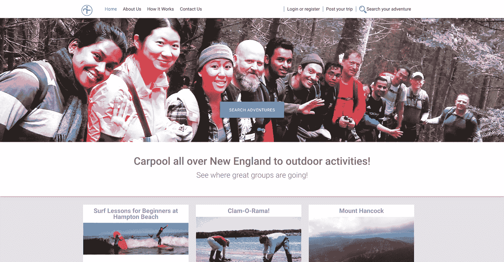
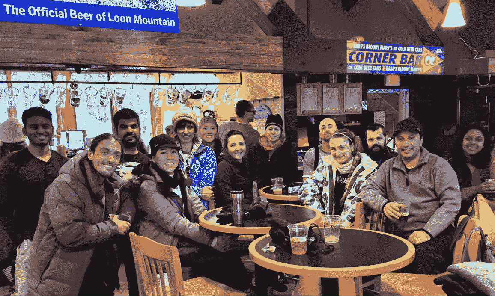
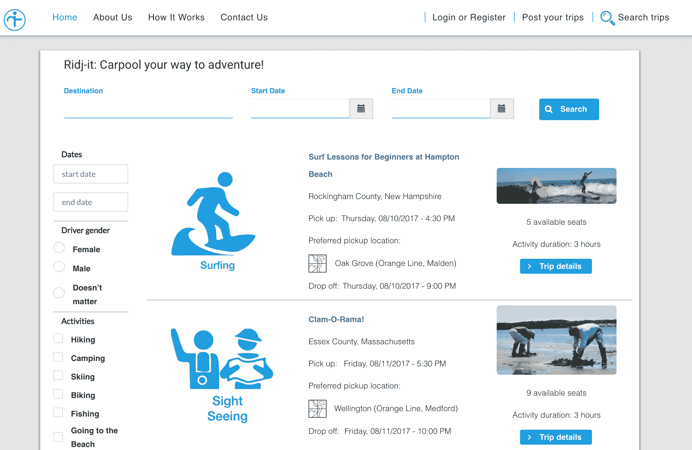

# 建立和发展创新的拼车业务

> 原文：<https://www.indiehackers.com/interview/building-and-growing-an-innovative-carpool-business-b9839a5d6d>

## 你好！你的背景是什么，你在做什么？

我们是 Rik Ganguly 和 Ari Iaccarino，Ridj-it 是一个基于活动的拼车平台。

我们的用户主要是都市人，他们热衷于通过徒步旅行、皮划艇、划船、滑雪、爬山和其他伟大的冒险活动来丰富他们的城市生活。通过拼车，我们以低廉的价格将城市与户外连接起来，同时通过弥合小企业与客户之间的距离和认知差距，为小企业带来了数千美元的收入。

Rik 负责医疗保健分析，Ari 是 ESL 的大学和公立学校教育工作者。我们两人的背景都有助于深入参与社区健康和教育，Ridj-这是我们哲学和政治立场的一种表达，即每个人都应该能够以负担得起的方式获得户外活动和学习体验。

我们通过利用现有文化来盈利，同时创造一种新的文化，让城市居民可以说，“哦，是的，我想做一些冒险的事情，”然后来 Ridj-it。该公司继续扩大我们的冒险家基础和希望成为该平台一部分的小企业群体。

 

## 是什么促使你开始使用 Ridj-it？

像任何好的企业一样， [Ridj-it](https://www.ridj-it.com) 诞生于我们的需求。瑞克有一辆车，但是没有人陪他去远足，而阿里没有车，他准备去山里。幸运的是，我们在大学时是朋友，在 Ari 搬到波士顿后我们联系上了，但我们每个人都有其他熟人遭遇了同样的情况。

一天，当我们一起在弗兰科尼亚岭徒步八小时到达终点时，阿里说，“嘿，这里有什么交通服务可以把人们从波士顿接回来吗？”

瑞克沉默了一会儿。然后他抬起头回应道:“不，没有。但是我们应该让它发生。”

它诞生了。我们根据我们的弗兰科尼亚山脊之旅给它命名，这是由三座山连接起来的集合，你猜对了，是一座山脊！我们也希望这样做——把人们联系起来。

## 构建最初的产品需要什么？

最初我们认为专业货车是我们希望运送人们的机制，我们甚至没有考虑拼车的想法。

经过一番研究(我们联系了多家提供定制案例的公司，以确定价格)，我们发现成本会自动被禁止。我们也不认为我们可以保证这些企业有足够的活动来保证一条路线。我们看到纽约市或华盛顿特区的许多户外旅行实体通过面包车或公交车为户外探险提供交通工具，但对于技术和其他专业工作以外的人来说，价格高得令人难以置信。

因此，我们在波士顿大学和其他社会团体进行了调查，以了解人们的价格点，我们选定了一种模式，例如，你可以花 21 美元报名参加五小时的往返旅行，从而有足够的时间进行娱乐和活动，如徒步旅行。(剧透提醒:后来，在提供了几百趟之后，我们会验证这个价格。很多人问:“你是怎么赚钱的？”我们对此感觉很好，因为我们确实在赚钱，同时为高薪职业之外的成员创造了负担得起的体验。)

现状并不包括没有车的人、有色人种或新来者。

TweetShare

以真正的企业家方式，我们在完全没有外部资金的情况下开始了 Ridj-it，并将继续这样做。没有投资资本、贷款或家庭经济援助。此外，我们都在做全职工作，还在偿还学生贷款、房租和所有其他单调乏味的日常开支。

然而，最近到了一个地步，Ari 不得不辞去他在马萨诸塞州切尔西的一所贫困中学教 [ESL](https://en.wikipedia.org/wiki/English_as_a_second_or_foreign_language) 的工作，这样他就可以全职工作在 Ridj-it 上，而 Rik 继续做着忙碌的工作，在工作和 Ridj-it 之间平衡他苛刻的职业义务。

## 你是如何吸引用户并发展 Ridj-it 的？

幸运的是，我们卑微的开始需要很少甚至没有钱，这结合以下两个重要问题导致了我们的 MVP 和最大的增长黑客:

1.  我们如何利用现有的拼车文化？
2.  我们如何创造*新的*拼车文化？

像优步和 Airbnb 这样的公司已经创造了许多新文化，但我们还没有到那个地步，所以我们决定接触 Meetup.com 集团、大学和英语语言学校，以利用潜在的现有文化。

不用说，所有人都拒绝了我们，我们只接到了一个从未跟进的大学的电话。我们遇到了两个问题:第一个是学校已经有了自己的活动办公室。第二个问题是，许多 Meetup 团体已经有了自己的文化，其中大多数是中年人，他们很大程度上怀疑一家公司试图帮助城市人参加同样的 Meetup 活动来赚钱。

所有人都拒绝了我们，我们只接到了一个从未跟进的大学的电话。

TweetShare

黑客攻击来了:我们花了 86 美元创建了自己的 Meetup 群，并使用了免费的 supersaas.com 日历。大约一年后，我们的聚会有了 5000 名成员。我们的客户获取成本几乎为零，通过那里的社交平台，我们已经能够将我们的成员引导到 Ridj-it 的网站。

除了这个 Meetup 小组，我们还与[大波士顿会议和旅游局](https://www.bostonusa.com/)建立了合作关系，我们在 [EventBrite](https://www.eventbrite.com/) 、 [Bostinno](https://www.americaninno.com/boston/) 和其他 Meetup 小组上进行广播。我们还通过口碑传播，这让我们为哈佛法学院开发了一个定制的郊游。

Ridj-it 网站现在有超过 400 名用户，其中大多数是女性，而且大部分是非白人，大约 30%的冒险者为我们的大部分活动做出了贡献。在过去的一年中，我们已经减少了 800 多辆汽车上路，并且我们已经将我们的社区与 30 多家当地和地区企业联系起来。

 

就网站流量而言，只有 800 名活跃用户，我们会第一个说我们的网站需要大量的工作。这就是为什么我们对服务本身的质量充满信心——当一个破旧的网站仍然带来流量时，你知道你在做正确的事情。

随着 Ridj-it 的发展，我们逐渐意识到，在某个时候，我们将无法再为公司自筹资金。这在很大程度上通过我们最近对另一位创始人亚历克斯·尼基丁的入职培训得以体现。我们正在利用他在开发方面的专业知识，以及他与俄罗斯的关系和我们目前从那里招聘的专业开发人员的财富。

这项工作正在进行，我们现在正在寻找资金，这样我们三个人就可以将我们的时间和精力投入到一项服务中，我们真的认为这项服务不仅会改变户外行业的游戏规则，还会改变公共交通以外任何寻求增加和多样化客户群的场所。

## 你的商业模式是什么，你是如何增加收入的？

[Ridj-it](https://www.ridj-it.com) 的业务模式随着公司的发展而不断变化和增长，但基本的收入渠道来自拼车费(由波士顿地铁 T 站到目的地的距离以及车上的乘客数量决定)和商务购票服务费(如果适用)。

司机也支付押金以减少他们退出的可能性。(如果他们来开车，费用会退还。)我们发现，这不仅能有效减少失约，还能在乘客不得不租车的情况下为这些行程提供补贴。

此外，与要求商家提供大幅折扣以宣传自己的 Groupon 不同，我们对人们使用我们的服务和拼车只需要很少的激励。我们没有要求企业在我们的营销渠道上突出自己，我们也不确定这种收入是否可行。

 

与滑雪场和其他户外实体一样，我们的收入取决于天气。天空越好，收入越高。但我们的一小部分用户群将继续拼车到户外，即使是在零度以下。

ridj-它无法控制我们用户的实际活动，因为我们只把冒险者联系在一起。但我们希望发展一种文化，让更多的人觉得有权利带着合适的装备出门。

与俄罗斯这样的国家相比(阿里曾在西伯利亚低地呆过)，我们的公民真的没有准备好长时间呆在户外，因为我们没有合适的装备。我们 Ridj-it 认为这是与服装和装备相关业务合作的一个很好的方式，我们也希望在不久的将来看到它成为一个收入来源。

## 你未来的目标是什么？

Ridj-it 的下一年目标各不相同。

除了波士顿，我们的第二个城市将是华盛顿特区，华盛顿已经有了与陌生人拼车的文化(除了优步和 Lyft)。西弗吉尼亚的谢南多厄山谷到华盛顿特区的距离大约相当于新罕布什尔州的白山到波士顿的距离。

此外，我们希望将我们的服务带给与波士顿相似的人口群体:多样化的大学后专业人士，他们寻求通过户外活动来补充他们的城市生活。我们需要为华盛顿特区做的唯一平台改变就是将他们的交通系统整合到我们的网站上。除此之外，所有的组件都是为了使这个企业具有可伸缩性。

进一步的目标是扩大使用我们平台的企业和非营利组织的名单。目前，我们的模式让社区中的一些人感到困扰，因为我们正在将户外拼车货币化，而传统上人们并没有为此付费。

我们的司机都是普通人，不是职业司机。他们无论如何都会去目的地。

TweetShare

不幸的是，现状并不包括那些没有车的人、有色人种或新来的人，我们的目标是说服非营利组织和其他俱乐部，如阿巴拉契亚山脉俱乐部，与我们合作只会增加他们在这些组织中没有面孔的社区中的曝光率。大多数企业已经明白这一点，并愿意合作扩大和多样化他们的客户群，但非营利组织更难说服。

Ridj-it 经历了整体活动的急剧增长——用户数量、目的地的数量和类型等。——我们希望继续这些趋势。我们在帮助更多的人走出城市和我们赚的钱之间建立了联系，所以收入的增加意味着我们正在实现让更多的人走出城市的使命。

因为我们相信我们的使命超越了收入，进入了公共健康、福祉和社区发展的领域，所以我们希望看到 Ridj-it 的宣传有所增加。老实说，我们的基础平台并不复杂。(也就是说，建立鼓励用户在服务上合作行为的条件非常复杂，我们期待着优化这一点并分享更多相关信息。)

## 你面临的最大挑战和克服的障碍是什么？

我们将面临的一个挑战是政府监管。优步和 Lyft 在点燃运输行业许多人的怒火方面做了令人难以置信的工作，Ridj-it 继续做的是教育人们，我们的司机是普通人，而不是职业司机。他们无论如何都会去目的地。

但从长远来看，只要公司愿意收取合理的价格，我们还是期待与巴士公司建立航线。

## 有没有发现什么特别有帮助或者有优势的？

我们发现一些资源非常有用。

初露头角的创业者尤其应该为创业者寻求无偿法律服务。这些通常可以在学院和大学找到，但即使他们提到他们对更广泛的社区开放，他们也倾向于当前注册的学生，不一定会与你合作。

这就是我们的遭遇。[波士顿大学创业和知识产权法律诊所](http://sites.bu.edu/elawclinic/)拒绝帮助我们，因为我们不是在校生(尽管我们俩都是应届毕业生)。相反，那里的首席律师把我们交给了另一位税务律师。这可能是我们收到的最好的拒绝，因为这位新律师帮助我们制定了 LLC 申请、运营协议以及其他法律和财务机制。他的工作使我们受益匪浅。

优步和 Lyft 做了令人难以置信的工作，点燃了运输行业许多人的怒火。

TweetShare

我们也使用[新叶法律](http://www.newleaflegal.com/)的服务，在那里他们给了我们难以置信的指导，来处理与维持像我们这样的企业相关的法律问题。他们的收费方式对初创公司来说更实惠:他们按文件收费，而不是按小时收费。

最后，[波士顿大学 Buzz 实验室](http://questromworld.bu.edu/entrepreneurship/buzzlab/welcome/)设立了周末研讨会，邪恶诚实的天使投资者从一开始就挑战我们的收入模式，并继续激励我们成为真正的科技公司，而不是另一个旅游规划实体。

简而言之，向你当地的大学寻求免费或低价的资源。

## 我们可以去哪里了解更多？

老实说，我们有太多的话要说，所以我们邀请感兴趣的读者在下面提问，这样我们就可以告诉你更多关于 Ridj-it 和我们作为崭露头角的企业家的经历。见鬼，你甚至可以说出你的担忧和建议！我们是来为社区服务的，所以我们想听听每个人的意见。您还可以通过以下链接了解我们的更多信息:

*   ridj-it.com
*   youtube.com/watch?v=tXhPqXkeZgw&t = 3s
*   [facebook.com/ridjit](https://www.facebook.com/ridjit)
*   [instagram.com/ridj_it](https://www.instagram.com/ridj_it)

—[<picture id="ember8167653" class="user-avatar ember-view user-link__avatar"></picture>Ridj _ it](/Ridj_it?id=XVz4Xu9sPbOMs0J7TzSASgsBKGA2)，Ridj-it 的创建者

## 想像 Ridj-it 一样建立自己的事业吗？

你应该加入[独立黑客社区](/)！🤗

我们是几千名创始人，互相帮助建立有利可图的业务和副业。来分享你正在做的事情，并从你的同事那里获得反馈。

还没准备好开始使用你的产品吗？没问题。这个社区是一个认识人、学习和实践的好地方。随意[随便浏览](/)！

—[<picture id="ember8167658" class="user-avatar ember-view user-link__avatar"></picture>考特兰艾伦](/csallen?id=ibTLPyjwVebnZjMGKvz6ztarnuV2)，独立黑客创始人

7votes