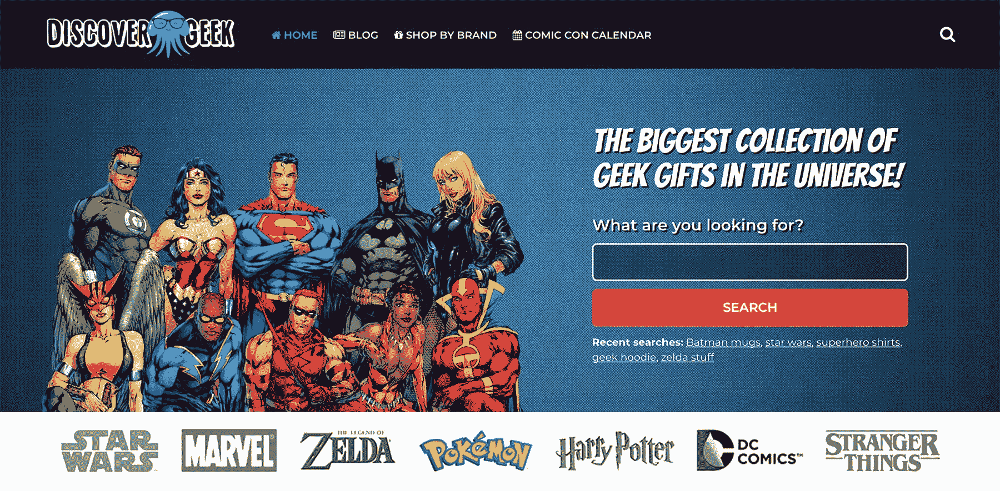
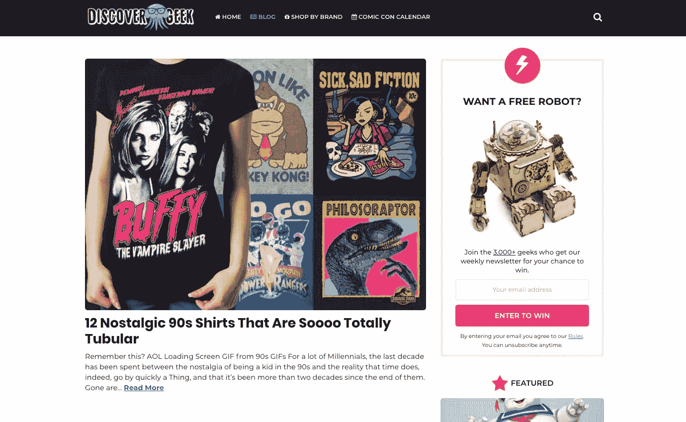
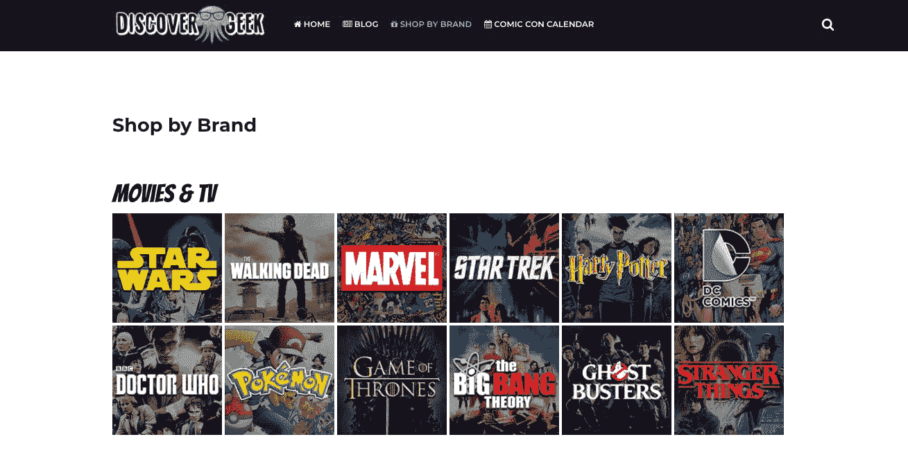

# 建立并推出极客商品搜索引擎

> 原文：<https://www.indiehackers.com/interview/building-and-launching-a-search-engine-for-geek-merchandise-87ab4345b6>

## 你好！你的背景是什么，你在做什么？

嘿，我叫蒂姆·奥斯特布尔，我和我的妻子弗里德里克(王丽嘉)共同创立了 DiscoverGeek.com。

王丽嘉和我都在德国出生和长大。2013 年，我们决定搬到美国去获得学士学位。我有一个“分类”的技术背景，来自一所侧重于技术的高中，有几年的网站/移动应用开发经验。在大学期间，我们尝试了不同的商业理念，从个性化的儿童书籍到在线 t 恤商店。我们并没有因为这些想法而大获成功，但是利润已经足够在经济上支持我们了。

然而，我们现在知道，我们对创业之旅比对实际业务更有激情。我们一起决定，DiscoverGeek 可能是一个将我们的电子商务体验与我们深深热爱的利基相结合的好方法。

从本质上来说， [DiscoverGeek](https://www.discovergeek.com/) 是一个搜索极客商品的搜索引擎。我们从各个地方挑选产品，而且都是手工挑选的。只有一个简单的规则，如果我们认为产品很臭，我们不会列出它。幸运的是，人们似乎真的很喜欢这个概念。我们于 2017 年 5 月开始在该网站上工作，平均每月 930 美元。

 

## 是什么促使你开始使用 DiscoverGeek？

在大师们大肆宣传按需印刷和“用衬衫在 14 天内致富”之类的东西之前，我们经营着 [OtziShirts](https://www.otzishirts.com/) ，一家出售有趣 t 恤的在线商店。OtziShirts 做得很好，有许多快乐的回头客，但我们无法真正认同这项业务。作为铁杆极客，我们考虑过从《星球大战》、《辐射》和《死侍》等特许经营店获得 t 恤设计许可的方法，但结果证明这很昂贵(非常昂贵)。在你的领域中有“衬衫”这个词也不能让你扩展产品类别…经验教训。

我们后退一步，决定从头开始。这一次，我们将创建一个平台，让我们展示所有我们喜欢的产品，而无需获得许可。

王丽嘉和我考虑了不同的概念，但最终决定了一个简单的搜索引擎。我们总是很难为对方找到极客礼物，并开始所有这些“如果……不是很好吗？”的问题，最终导致“如果我们能为极客产品创建某种搜索引擎，不是很好吗？”

## 构建最初的产品需要什么？

来自电子商务背景，我们知道圣诞节将是我们的黄金时间。已经是五月了，我们制定了一个简单的六个月计划，试图赶上假期。如果我们能成功，我们认为在第一年的 11 月和 12 月至少能赚 1000 美元。

当我说这个计划很简单时，我的意思是它真的很简单，餐巾大小很简单。

1.  技术:建立网站和创建基本的搜索功能
2.  内容:挑选和添加产品
3.  营销:让访问者访问网站

**科技**

我不可能有时间从头开始建造一切。在决定使用 WordPress 之前，我们考察了不同的内容管理系统。我相对熟悉 PHP(编写 WordPress 的编程语言)，王丽嘉可以马上从内容开始，我们两人过去都使用过 WordPress，所以这是显而易见的。当王丽嘉专注于内容和产品质量时，我和一个朋友开始研究搜索引擎。(谢谢 Jan Koch！)

**内容**

因为我们想尽快扩大产品数量，王丽嘉很难独自满足内容需求。经过一番寻找，我们找到了艾玛，一位来自英国的了不起的作家。艾玛现在写我们所有的博客帖子。如果你喜欢极客的东西，她的帖子真的值得一读。

**营销**

我们刚刚选择了两个交通频道，并同意在最初的六个月里坚持使用它们。我们认为付费广告太贵了，所以我们决定使用 SEO 和 Pinterest。那时，我们对任何一个渠道都没有明确的战略，也不知道我们的选择是否正确。我们唯一确定的是，我们不想每周都跑来跑去测试新的“方法”。

同时致力于技术和内容的一个好处是我们都不必等待对方。我们在各个方面都取得了进展，这帮助我们实现了访客数量和收入的大幅增长。

 

## 你是如何吸引用户并发展 DiscoverGeek 的？

我不认为坚持我们已经承诺的东西会有这么难。外面有那么多闪亮的东西。我被脸书的广告专家盯上了，他们想教我如何每天做广告。Vaynerchukian 企业家色情对我大喊大叫，因为我没有在 Snapchat，Youtube 和下一次大的社会革命上全力以赴。外面是一片丛林！

当我们开始使用 DiscoverGeek 时，王丽嘉在 Pinterest 上投入了一些时间。我们俩都没用过这个平台，过了几个星期才看到任何结果。她的策略很简单:

1.  为每个专营权创建一个董事会(如塞尔达，吃豆人，…)
2.  添加一个漂亮的主图片，展示一些顶级产品
3.  添加该特许经营的所有产品
4.  给每个产品一个独特的描述+关键词
5.  在组的主映像上运行升级的大头针
6.  利润

在持续这样做了大约两个月后，我们认为所涉及的工作量对我们来说太大了。将 Pinterest 的转化率与谷歌进行比较也无助于保持我们的积极性。对我们来说，Pinterest 转化了谷歌 1/4 的流量。最后，我们决定减少在这个平台上花费的时间。

同时致力于技术和内容的一个好处是我们都不必等待对方。

TweetShare

尽管我们决定让谷歌成为我们的主要关注渠道之一，但我们知道电子商务和搜索引擎优化经常不能很好地合作。许多产品通常意味着非常单薄和重复的内容，对人类读者来说基本上没有价值。然而，我们需要大量的产品来填充搜索引擎。

基于我们的关键词分析，我们得出结论，与其尝试对单个产品进行排名，不如关注特许经营+类别帖子更有意义。Listicles 非常适合，并提供了一些优势。首先，内容创建变得更加容易，因为产品的多样性有助于避免重复内容。第二，内容的多样性让读者更感兴趣。第三，我们认为谷歌总是更喜欢精心编写的长篇内容，而不是两到三句话的产品描述。为了得到一个想法，你可以看看我们的[天文礼物](https://www.discovergeek.com/53-astronomy-gifts-for-space-lovers/)或[奇怪的东西商品](https://www.discovergeek.com/stranger-things-merchandise-to-tide-you-over-til-season-2/)文章。

一开始，我们专注于竞争非常低、每月搜索量约为 1000 次的关键词(基于[谷歌的关键词规划器](https://adwords.google.com/home/tools/keyword-planner))。我们在谷歌中对其中几个关键词的排名上升相对较快，大约两个月后，我们开始看到一些初步结果。那时，艾玛每 48 小时就要写一篇博文。大约四个月后，我们看到了一些早期的成功，并决定逐步尝试对我们认为会有点困难的关键词进行排名。

| 月 | 游客 |
| --- | --- |
| 六月 | 826 |
| 七月 | 1331 |
| 八月 | 2652 |
| 九月 | 4605 |
| 十月 | 8239 |
| 十一月 | 16438 |
| 十二月 | 18140 |

## 你的商业模式是什么，你是如何增加收入的？

DiscoverGeek 通过附属链接赚钱。我们合作的每一个网站都会从我们向客户发送的销售额中提成。他们是购买我们推荐的产品还是购买不同的产品并不重要。我们的分成总是取决于加盟合作伙伴，通常在销售额的 4%-20%之间。

我们在 7 月份产生了最初的一些转化，但没有什么值得谈论的。八月是我们第一个突破三位数的月份，这种感觉太棒了。直到此时，我们仍然怀疑我们是否在正确的轨道上，但当九月到来，我们看到数字上升，我们的动力暴涨。

归根结底，这是一致性的问题。SEO 就像马拉松，不是短跑。

TweetShare

从那以后，我们看到了稳定的增长，并在 12 月份结束了我们最好的一个月(如预期的那样)，收入为 2，712 美元。我们希望在圣诞节期间达到 1000 美元，并且非常兴奋地看到 11 月/12 月的总收入几乎是我们目标的四倍。

归根结底，这是一致性的问题。当你创造了大量内容，却看不到流量/收入的立即增长时，这真的很伤人。SEO 就像马拉松，不是短跑。只是在谷歌的职位上升需要时间。现实一点，把你的时间线从几天/几周调整到几个月。

| 月 | 收入 |
| --- | --- |
| 八月 | 146 |
| 九月 | 253 |
| 十月 | 350 |
| 十一月 | 1197 |
| 十二月 | 2712 |

## 你未来的目标是什么？

有许多小目标，但我们在 2018 年有三个主要目标。

我们的首要目标是继续增长。我们仍在大量投资新内容，并不断扩大我们的特色产品数量。依赖单一的流量获取渠道通常不是一个好主意。出于这个原因，我们目前正在测试一些不同的想法，以在社交媒体和其他平台上扩展品牌。我们也在考虑在我们的个人 instagram 账户而不是“公司”账户上推送内容，王丽嘉已经取得了一些小小的成功。

另一个目标是通过在 DiscoverGeek 上增加商店来增加我们的利润。我们相信，我们处于一个非常有利的位置，可以开始在我们自己的商店里提供一些产品。过去的六个月向我们展示了一些销售惊人的产品，当你试图决定从哪些产品入手时，这是非常好的。

我们的第三个也是最后一个目标是将我们的内容扩展到新的类别。产品目录很好，但是受欢迎的特许经营数量有限。迟早我们会耗尽创意，所以我们必须测试其他内容。我们将会测试不同的角度，但是你已经可以通过查看我们的[动漫展地图](https://www.discovergeek.com/170-us-comic-cons-2017-2018/)或者[蝙蝠侠大战小狗](https://www.discovergeek.com/batman-vs-puppies-us-states-map/)文章得到一个想法。

 

## 你面临的最大挑战和克服的障碍是什么？

当我们创建 DiscoverGeek 时，我们的主要关注领域(挑选产品、生成内容和创建搜索体验)并不同步。王丽嘉挑选产品，艾玛写文章，我填充搜索引擎。这是一个巨大的时间杀手，我们很快意识到三个人在做一个人的工作。

有了这种认识，我决定回到绘图板，改变我们后端的工作方式，这将是一个好主意。我们现在有多种方式，而不是手动将产品添加到搜索中。产品仍然可以单独添加或导入，但我们也会自动从 Emma 的博客文章中提取所有产品。

另一个问题是决定我们将如何排列产品。刚开始的时候，除了自己的品味好坏之外，没有什么真知灼见。点击产品是有帮助的，但作为一个年轻的网站，你可能不会产生足够的数据来看到真正的趋势。

一个有用的方法是查看我们链接到的产品页面的指标。你通常看不到任何销售数据，但有一些公共指标可以让你很好地了解人们对商品的看法。大家分享吗？链接到它？你明白了。:-)

找到好的团队成员真的很难。找到一个符合你的品牌的声音和精神的作家几乎是不可能的。无论用什么标准衡量，王丽嘉和我都是慢得可怕的作家。我们知道，我们需要找到一个可以帮助我们每天制作高质量内容的人。

幸运的是，Fiverr 来救我们了…开个玩笑，*辛巴，你千万不要去那里。*

玩笑归玩笑，我们几乎搜索了所有能想到的平台。包括但不限于 Freelancer.com、Reddit、Textbroker、一些本地网站等等。最后，我们支付了 20 多份试验品的费用，直到我们找到了艾玛。我希望我有更好的建议，而不是真的花时间去采访人和做测试文章，但我没有。

## 有没有发现什么特别有帮助或者有优势的？

我认为在日常运作中，做你非常热爱的事情对**帮助很大。当你不得不做单调乏味的任务时，你的新网站赚不了多少钱，增长速度也比预期的慢。从事你真正感兴趣的事情真的很有帮助。**

即使 DiscoverGeek 不是某种支付我们所有账单的病毒现象，即使我们只是自己浏览产品，它对我们两个来说仍然有很多乐趣。

我认为在日常运作中，做你非常热爱的事情对**有很大帮助。当你不得不做繁琐的任务时，你的新网站赚不了多少钱，增长比预期的要慢。**

TweetShare

令我们惊讶的是，没有多少夫妻团队。显然，这可能不是对每个人都有效，但是和你的配偶一起工作真的很棒。如果你的伴侣和你同路，你们两个都能理解为什么对方会工作到很晚，很生气，或者需要休息。当你的伴侣回家时，你不必再确保看起来你真的在工作。；-)

总的来说，我认为一个重要的习惯是非常有条理。嘿！毕竟我们是德国人——我们生来手中就拿着活页夹和盒子。当你醒来的时候，知道你应该做什么和你想完成什么是很棒的。我们正在使用 NirvanaHQ，但老实说，任何可靠/先进的待办事项经理可能都会做得一样好。

## 对于刚刚起步的独立黑客，你有什么建议？

耐心。大多数人不会马上为一个新项目带来大量的流量/收入，除非他们有非常雄厚的资金。没有看到立竿见影的效果就不要太快放弃。如果你关注的是有机交通，这一点尤其正确。

为你自己和你的团队设定可达到的目标。我们的圣诞目标不是 1000 美元，而是 1 万美元，甚至 10 万美元。但是这现实吗？如果你的目标太高，你会很快变得沮丧。无论如何，向月亮射击，我们都想成为百万富翁，但是让我们先把我们的项目做到 100 美元/月，然后 200 美元/月…

不要生病。许多企业家，尤其是那些致力于他们的第一个想法的企业家，陷入了严重的分析瘫痪。常见的症状包括研究各种竞争对手、营销方法和客户角色，但实际上没有做任何笔记。做研究很棒，但是给自己设定一个时间限制，一定要做笔记。顺便说一下，这可能会令人失望，但可能不会有一篇文章/论坛/策划使你的业务成功。停止过度思考。

限制你接触创业色情。你很可能不会通过听[填写大师姓名]来学习任何可以应用到你的业务中的可操作的东西。你可能正在听[填入古鲁名字]，因为它让你感觉很好。他们经常分享许多“你也能做到”的废话，这些废话激励了你几秒钟，但却让你没有任何可以应用到自己业务中的真正建议。这里有一些动机，没有什么不好，只是不要让自己相信，通过听这些发言者，你是把工作纳入你的业务。如果你不想特许经营麦当劳，你的企业可能有自己的一套规则，这将使它成功。用我们这一代最进步的思想家之一的话说，“去做吧！”希亚·拉博夫

## 我们可以去哪里了解更多？

*   我们的网站:[DiscoverGeek.com](https://www.discovergeek.com/)
*   我的个人博客:【TimOsterbuhr.com 
*   rikas insta gram:[rikaposts](https://www.instagram.com/rikaposts/)

感谢阅读。如果您有任何问题或意见，请随时联系我们。我们希望收到您的来信。

—[<picture id="ember7997118" class="user-avatar ember-view user-link__avatar"></picture>蒂姆·奥斯特布尔](/TimOsterbuhr?id=3VWfQUwybrdhJiNIPMsh6UyzJNi2)【DiscoverGeek】创始人

## 想像 DiscoverGeek 一样建立自己的事业？

你应该加入独立黑客社区！🤗

我们是几千名创始人，互相帮助建立有利可图的业务和副业。来分享你正在做的事情，并从你的同事那里获得反馈。

还没准备好开始使用你的产品吗？没问题。这个社区是一个认识人、学习和实践的好地方。随意[随便浏览](/)！

——[<picture id="ember7997123" class="user-avatar ember-view user-link__avatar"></picture>柯特兰艾伦](/csallen?id=ibTLPyjwVebnZjMGKvz6ztarnuV2)，独立黑客创始人

10votes