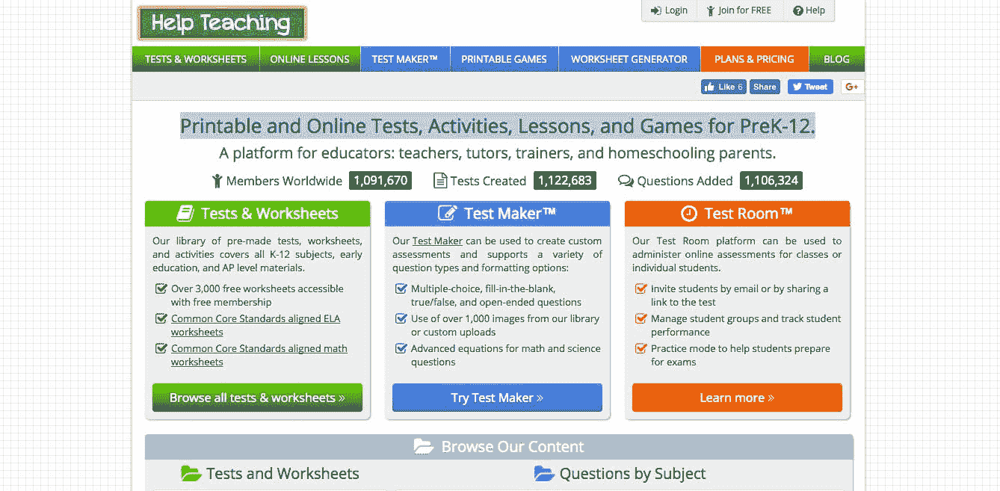
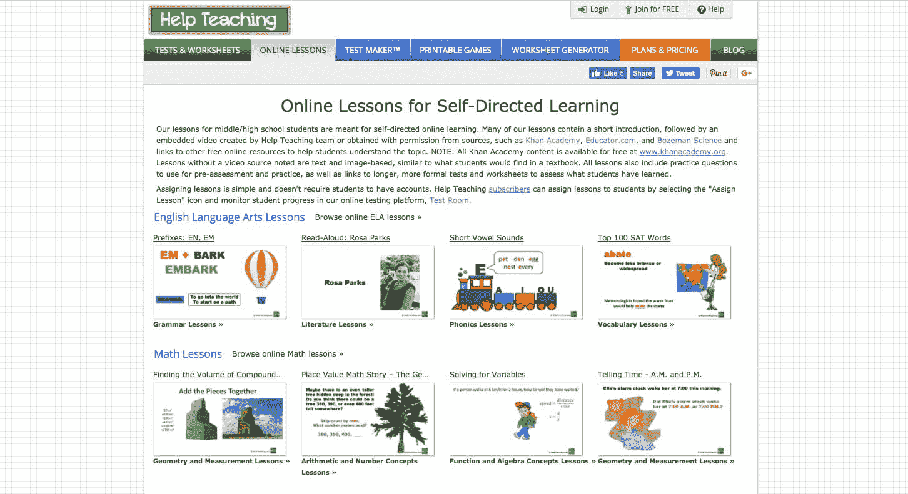

# 建立、发展和销售教育技术业务

> 原文：<https://www.indiehackers.com/interview/building-growing-and-selling-an-education-technology-business-e635944c15>

## 你好！你的背景是什么，你在做什么？

你好，我是莉莉娅·托夫宾。当我在 2005 年开始一个副业项目，也就是后来的 HelpTeaching.com 时，我是一名全职的网络开发人员。但后来我进入了一个管理职位，并在这个职位上干了几年，然后在 2013 年辞职，专门从事 HelpTeaching.com 的工作。

HelpTeaching.com 是一个教育技术产品，为教育工作者、教师和家长提供工具和资源。在 2016 年被 [SureSwift Capital](https://www.sureswiftcapital.com/) (SSC)收购之前，它的年收入超过 30 万美元。自从出售后，我一直是 SSC 的顾问，很荣幸能与其他一些咨询/建议 SSC 离职的创始人见面并共事。

 

## 是什么促使你开始接触 HelpTeaching.com？

我和我的朋友在一家初创公司工作，经常谈论一起开始一个兼职项目，所以当他的阿姨提出最初的想法时，我被邀请作为第二名开发人员加入团队，我的重点是前端。

我们都得到了平等的股份，并自己承担了最初几年的费用。

## 构建最初的产品需要什么？

最初的产品花了将近两年的时间来打造，而且功能相当有限。它是完全免费的，直到一年或更久以后，平台上才有订阅支持。最初的支付是谷歌结账，随后是贝宝快速结账，集成最少。在我们推出后的第一年，我们通过 Google AdSense 在网站上投放广告，但没有赚到多少钱。

我想如果我能更快地与客户交流，我会更快地改变产品，但是这个功能对开发者来说并不自然。

TweetShare

我们自己不得不在家人的帮助下为这个平台植入一些内容。早期的增长非常缓慢，五年后我们开始失去动力，没有人愿意在我领导的市场营销上投入更多。2011 年，我买下了两位最初的联合创始人的股份，并引入了一位新的技术合作伙伴，来领导我有着宏伟计划的平台的进一步开发。

## 你是如何吸引用户和发展 HelpTeaching.com 的？

与新合作伙伴一起，我们做出了三个推动增长的重大决策:

1.  我们将该平台从一个描述单一用途软件(TestDesigner.com)的短语重新命名为一个更通用的名称，使我们能够成长为一个多功能门户网站(【HelpTeaching.com】)。
2.  我们添加了额外的工具和特性来补充原始软件。
3.  我们聘请了内容专家来管理一个巨大的未使用的用户生成内容数据库，并创建一个免费的流行内容库来推动有机流量。

这一切都代表了产品和平台的一个主要支点，允许原始产品没有定位的进一步增长。收购后，我自己也在做客户服务，我们根据客户的要求和调查开发产品。

一些有助于推动收入增长的策略包括:

1.  对现有客户进行调查，以确定能够证明更高订阅价格合理性的新功能，并据此执行。这也有助于在两年内将流失率从 25%降至 10%。
2.  提供免费内容来刺激 SEO，并将我们的电子邮件列表扩大到 30 万以上的订户。发送内容更新的每月简讯推动了一些销售，我们能够根据该列表销售一些赞助，以使收入来源多样化。
3.  投资优质内容让我们有理由提高订阅价格并提高转化率。这也引起了一些教育技术创业公司的兴趣，我们能够许可我们的内容来支付进一步的开发工作。
4.  每年提高价格，用 30 天退款保证取代免费试用，以及取消低价计划有助于减少计划和支持工作之间的混乱。

这些策略让我们的收入在出售业务前连续三年每年增长超过 100%。

【2011 年至 2015 年的收入:

我强烈建议 solo tech 的创始人认真审视一下他们的软件解决方案，看看他们开发的工具是否能在补充服务/功能方面更加有用，并调查他们的客户，以指导产品开发工作。此外，还要考虑不同的定价结构、新的收购渠道和收入多样化的机会。

## 你未来的目标是什么？

我和我的合伙人卖掉 HelpTeaching.com[的原因之一是开始在另一个副业项目上投入更多时间。我们建立了一个内部电子邮件营销平台，我们希望将其打包成一个独立的产品。BigMailer.io 已经进行了一年多的私人测试，现在已经上线几个月了。这是一个在竞争激烈的领域中雄心勃勃的产品(从技术架构的角度来看),所以我和我的合作伙伴有自己的工作要做。](https://www.helpteaching.com)

## 你面临的最大挑战和克服的障碍是什么？

最初的创始人团队从未正式定义企业的角色和责任，因此最终这成为一个紧张点。共同创始人协议是必须的。

我也永远不会将我拥有的任何早期企业的支持职能外包出去——创始人需要这样做来了解他们产品的弱点。我想如果我能更快地与客户交流，我会更快地改变产品，但是这个功能对开发者来说并不自然。

最后，最初的创始人团队讨论了改变最初的产品名称，我们知道这是软弱的，但我们从未向前推进。我建议创始人不要犹豫重新命名，因为只要你能为它找到一个好的(或至少更好的)域名，这真的不是什么大不了的事情。我建议在 [NameJet](http://www.namejet.com/) 上搜索合适的(即将到期的)域名——你可能会在那里找到你的宝贝。

 

## 有没有发现什么特别有帮助或者有优势的？

我与业务的主题专家(SME)相去甚远；我只是一个自学了一些商业技能的开发人员。这个责任总是落在最初的创始人之一身上。

在最初的创始人被买断后，我不得不学习很多关于空间、竞争对手和客户的知识，以便确定支点和扩张机会。除非产品/软件在本质上是非常技术性的，否则与对行业和空间有很好理解的中小企业合作会有巨大的价值。如果没有中小企业，你必须做好准备，并愿意自己学习很多东西。

## 对于刚刚起步的独立黑客，你有什么建议？

1.  永远不要单干，或者至少在你设法取得一些进展(比如，建立你的 MVP)时，尝试引入一个伙伴。你精疲力尽，生活事件发生，所以你需要有人依靠，保持动力。
2.  如果你是一个开发者，考虑与中小企业合作。他们不必在早期就成为商业大师；他们需要指导你的初始产品开发。你可以在以后发展自己的商业/营销技能，或者引入一个拥有你所缺少的技能的新伙伴。也就是说，我知道很多成功的企业都是由单枪匹马的创始人建立的，拥有 7 位数的退出率，所以成功是可能的，但更难实现。
3.  不要害怕与你的早期客户互动，也不要在早年将这一职能委托给任何人。

## 我们可以去哪里了解更多？

我是 IH 社区的新成员，但期待分享我的经验、工具和资源的链接或信息。如果有人想了解更多关于 [BigMailer.io](https://www.bigmailer.io/) ，电子邮件营销工具，或者我销售[HelpTeaching.com](https://www.helpteaching.com)的经验，请在下面提出你的问题。乐意在[推特](https://twitter.com/webbie)上连接。

——[<picture id="ember8080532" class="user-avatar ember-view user-link__avatar"></picture>Lilia tov bin](/webbie?id=40cpqTR6rHV0HVqOrvI30phClA93)，【HelpTeaching.com】联合创始人

## 想像 HelpTeaching.com 一样建立自己的事业吗？

你应该加入独立黑客社区！🤗

我们是几千名创始人，互相帮助建立有利可图的业务和副业。来分享你正在做的事情，并从你的同事那里获得反馈。

还没准备好开始使用你的产品吗？没问题。这个社区是一个认识人、学习和实践的好地方。随意[随便浏览](/)！

——[<picture id="ember8080537" class="user-avatar ember-view user-link__avatar"></picture>柯特兰艾伦](/csallen?id=ibTLPyjwVebnZjMGKvz6ztarnuV2)，独立黑客创始人

13votes