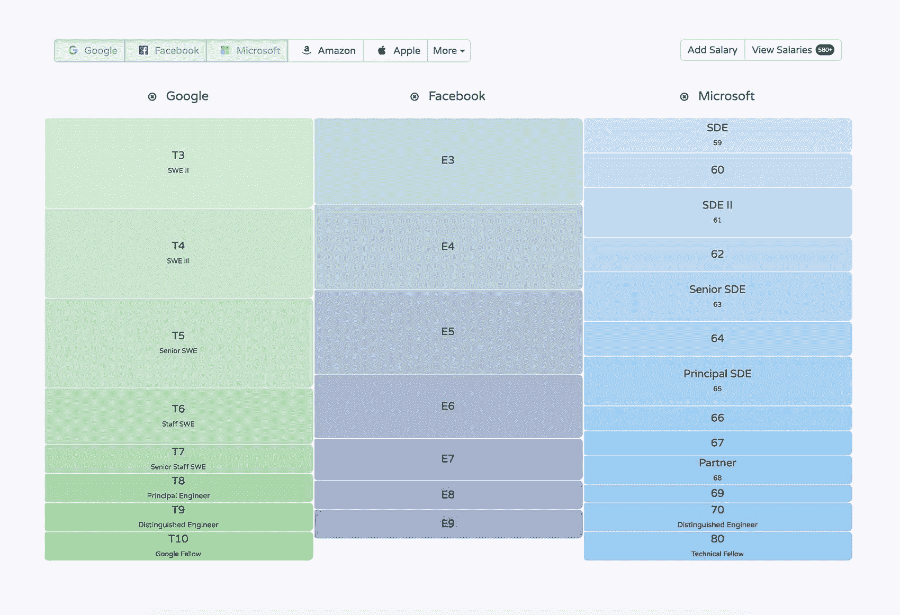
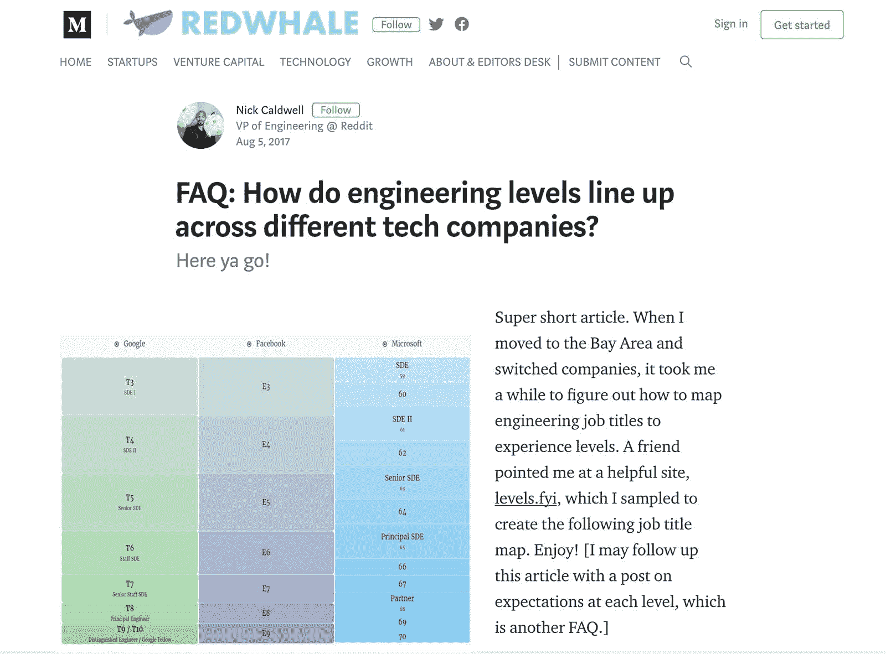
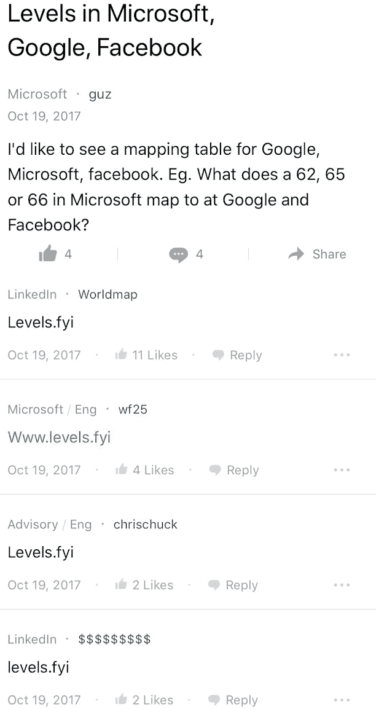
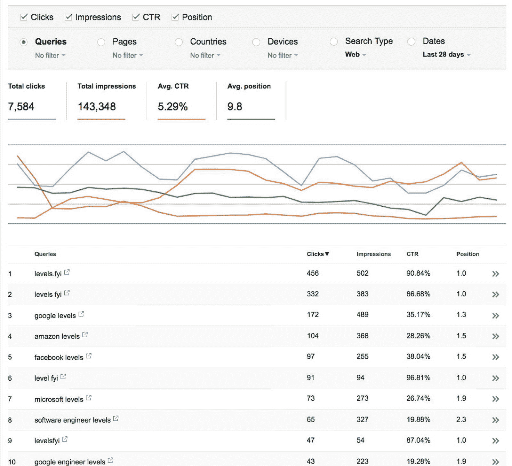
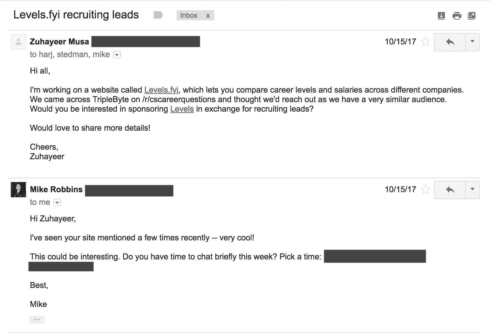

# 在咖啡店建立关卡，并逐渐盈利

> 原文：<https://www.indiehackers.com/interview/building-levels-fyi-in-coffee-shops-and-growing-to-profitability-da7a4f5d63>

## 你好！你的背景是什么，你在做什么？

嗨！我叫 Zuhayeer Musa，Zaheer Mohiuddin 和我一起建立了一个网站，允许人们比较不同公司的职业阶梯。我和 Zaheer 的相遇其实是一个有趣的故事——一个共同的朋友将我们联系在一起，因为我们的名字听起来很相似，而且都喜欢从事随机项目。

我是加州大学伯克利分校的应届毕业生🐻在 [Levels.fyi](http://levels.fyi) 之前，我做过一些兼职项目，比如 [RapBits](http://rapbits.com/video/ad.mp4) ，这是一种在对话中发送 rap 声音剪辑的方式，我还帮助在加州大学开设了一门名为[“构建未来”](http://thefuture.build)的创业课程。Zaheer 目前在亚马逊 AWS 团队工作。在此之前，他建立了一个名为 TagsForLikes 的哈希标签网站，在那里他服务了数百万用户，并在大学期间赚了六位数。

我们最初构建了 [Levels.fyi](http://levels.fyi) 作为一个简单的可视化工具，供人们比较大公司的职业水平。我们的希望是让求职者在找工作时更容易确定合适的职位，并让人力资源部门更容易将外部候选人与空缺职位匹配起来。很快，我们开始收到电子邮件，要求我们扩展到其他公司，不同类型的职业轨迹，甚至包括更详细的信息，如工资。我们意识到，求职者和招聘人员需要就业市场有更大的透明度，而我们在促进这一点上处于独特的地位。

大约一年前开始的一个简单的副业项目现在让我们每月大约赚 5000 美元！

 

## 是什么促使你开始学习 Levels.fyi？构建最初的产品需要什么？

如果你有问题，很可能别人也有。

一年前，我和 Zaheer 聊到我大学毕业后要做什么。我在寻找要申请的公司，并刚刚加入了一个名为 [Blind](https://www.teamblind.com/) 的应用程序(一个匿名的社区论坛，用于讨论工作场所)。Zaheer 正在找新工作，他抱怨说比较不同公司的职位有多难。当我们浏览 Blind 时，我们注意到了几个相同类型的问题，比如“微软的一个高级 SDE/63 级可以被安排在谷歌的什么级别？”

经过进一步挖掘，我们在网上发现了类似的问题，并意识到必须有一种更简单的方法来将工程职称与经验水平对应起来。这让我们感到有一个相当大的信息差距，而 Zaheer 的烦恼实际上是一个机会。

如果你有问题，很可能别人也有。

TweetShare

我们着手解决这一问题，并建立了一个简单的静态 HTML 网站，对顶级科技公司的级别进行了细分。为了得到这个分类，我们在论坛和问答网站上寻找平衡信息，并向朋友们询问他们公司的平衡指南。我们选择 Google Forms/Spreadsheets 作为我们的“后端”,允许用户提交水平信息，而我们只需付出相对较少的努力。这节省了我们的时间和精力，让我们可以专注于最初的最低可行产品的核心用户体验。

迄今为止，[levels . FYI](http://levels.fyi)100%由静态托管在 AWS S3 上的标准 HTML、JS 和 CSS 提供支持。凭借我们提供的所有功能(薪资/水平提交、通过 Crisp 的直接聊天等)，我们仍然能够保持超级精益！我们一年的开销还不到一杯咖啡，而且不存在通常与构建盈利产品相关的基础设施开销。

## 你是如何吸引用户和发展水平的？

我们通过在盲人论坛和其他有网站链接的问答论坛上回答相关问题，将流量播种到[等级。仅供参考](http://levels.fyi)。此外，我们将收到的大量招聘人员电子邮件转化为在招聘人员社区传播信息的机会。几天之内，社区开始自己分享网站——这时候我们知道我们真的找到了一些东西。在经历了短暂的游击营销后，看到我们的网站被网络上的一大群在线社区选中，真是令人兴奋不已。通过解决一个真实的问题，我们有了许多满意的观众，他们自愿把这个网站作为一个有价值的信息来源来分享。

  

其他盲人用户开始链接到[关卡。这是一支非常棒的四人团队。我们也有一些人发推文说:](http://levels.fyi)

*   本(男子名)🐟兰伯特(@BenEncodes): *如果你的一些粉丝没有看过，这里有一个方便的网站，试图比较一些大型科技公司的资历水平[2017 年 12 月 27 日](https://twitter.com/BenEncodes/status/946144003329638400?ref_src=twsrc%5Etfw)*

*   fuzzygroup (@fuzzygroup): *非常酷的比较不同公司职业水平的工具。完美实现。[2018 年 4 月 25 日](https://twitter.com/fuzzygroup/status/988974954942169089?ref_src=twsrc%5Etfw)*

*   总产量👔史密斯(@tsmith): *比较不同公司水平的有趣网站。[2018 年 3 月 7 日](https://twitter.com/tsmith/status/971289634973061121?ref_src=twsrc%5Etfw)*

由于有来自其他网站的反向链接，我们决定添加一些元标签来提高搜索结果的性能。我们简要地看了一下 Google Trends 中关于职业平衡的一些最常被查询的搜索，并把它添加到我们的页面中。很快，我们的结果出现在任何科技公司相关查询的顶部。

使用谷歌搜索控制台，我们能够确定哪些查询给我们的网站带来了最多的流量，这使我们能够优化元标签。这大大提高了我们的流量，随着越来越多的人在网络的不同部分链接到 [Levels.fyi](http://levels.fyi) ，我们的相关性只会变得更强。

以下是我们在谷歌搜索控制台中搜索次数最多的一些查询:

 

## 你的商业模式是什么，你是如何增加收入的？

一旦我们有了大量的固定用户，我们决定联系一些潜在的合作伙伴来帮助网站盈利。我们认为，由于我们的流量是由技术领域的专业人士(在一定程度上，他们可能正在寻求跳槽)组成的高度策划的受众，我们可以向寻求招聘的技术公司提供高质量的招聘线索。

我们听说了一家名为 [Triplebyte](https://triplebyte.com/a/OCT5OUw/indie) 的公司，它帮助候选人获得顶级科技公司的邀请，我们通过一封冷冰冰的电子邮件与他们取得了联系。他们很快做出了回应，并提出了与我们合作的想法，我们同意为通过我们的介绍而被雇佣的每一个人收取佣金。虽然这种安排不会给我们带来稳定的收入，但它让我们能够将自己的目标与广告客户的目标保持一致。

## 你未来的目标是什么？

根据用户的反馈，我们意识到公司的求职者和招聘人员需要更多的透明度。虽然我们一开始只是平衡信息，但我们认为，通过简单地提供对相关信息的开放访问，有很大的机会来改善个人的职业轨迹。职业水平指南、薪资信息、角色期望和职业发展战略都是我们看到的用户需要了解更多的领域，我们的使命是以每个人都能理解和受益的方式获取和传播这些信息。

坚持是任何伟大事业的关键。

TweetShare

我们现在正在考虑的一个想法是一个预计薪酬计算器。它会考虑你目前的水平、薪水和公司，并给你一个未来 X 年内你在某一特定领域的预期总薪酬的预测。

最终，我们希望成为任何寻找职业转换或工作转型的人的首选网站。我们还有很长的路要走，但我们正在采取措施，让人们获得做出重大职业决策所需的信息。

## 你面临的最大挑战是什么？

我们面临的最大挑战之一是获取准确的数据。偶尔，我们会收到用户和论坛帖子的通知，说我们对某些公司的评分已经取消，我们必须进行编辑或重新调整。

由于这个问题的本质，我们没有最准确的数据来开始，但它对用户来说仍然是有价值的，并且是启动这个项目所必需的。随着我们收到越来越多的提交，我们能够更精确地估计。

## 有没有发现什么特别有帮助或者有优势的？

我想我们后来意识到的一件事是，我们选择的领域非常吸引人，容易记住( [Levels.fyi](http://levels.fyi) )。当我们第一次购买它时，我们并没有真正考虑到这个域名会使它更容易通过口头传播，或者它会对我们的 SEO 有多大帮助。一个简单易记的域名会让人们更容易访问你的网站并传播给其他人。

## 对于刚刚起步的独立黑客，你有什么建议？

我们已经在[水平上努力了大约一年。顺便说一句](http://levels.fyi)，我们相信坚持是任何伟大事业的关键。如果你坚持不懈，每天一点点工作可以积累成大事。我们也相信从简单开始是好的。无论你在做什么，你都可以把它归结为一些核心元素，并围绕这些核心元素进行构建。在我们与[关卡的旅程中，参考消息](http://levels.fyi)，我们非常幸运，但我们也意识到，意外之喜只青睐那些勇于尝试的人。所以出去做点什么吧！

不要害怕接触别人。这就是让我们从零美元走向盈利的交易:

 

## 我们可以去哪里了解更多？

帮助我们使求职过程更加透明，[在此添加您的公司级别](http://levels.fyi/create.html)和[在此添加您的匿名薪资申请](https://goo.gl/forms/Lu4UO2gDWZP5gfaS2)。

我们也希望听到任何其他反馈——联系 [【电子邮件保护】](/cdn-cgi/l/email-protection#355d5059595a755950435059461b534c5c) 或在下面留下评论！:)

—[<picture id="ember8114941" class="user-avatar ember-view user-link__avatar"></picture>祖哈耶穆萨](/zzz?id=LlKHyjsBZXc1fSrqvygy9tR6xWI2)，Levels.fyi 创始人

## 想像 Levels.fyi 一样建立自己的企业？

你应该加入独立黑客社区！🤗

我们是几千名创始人，互相帮助建立有利可图的业务和副业。来分享你正在做的事情，并从你的同事那里获得反馈。

还没准备好开始使用你的产品吗？没问题。这个社区是一个认识人、学习和实践的好地方。随意[随便浏览](/)！

——[<picture id="ember8114946" class="user-avatar ember-view user-link__avatar"></picture>柯特兰艾伦](/csallen?id=ibTLPyjwVebnZjMGKvz6ztarnuV2)，独立黑客创始人

51votes