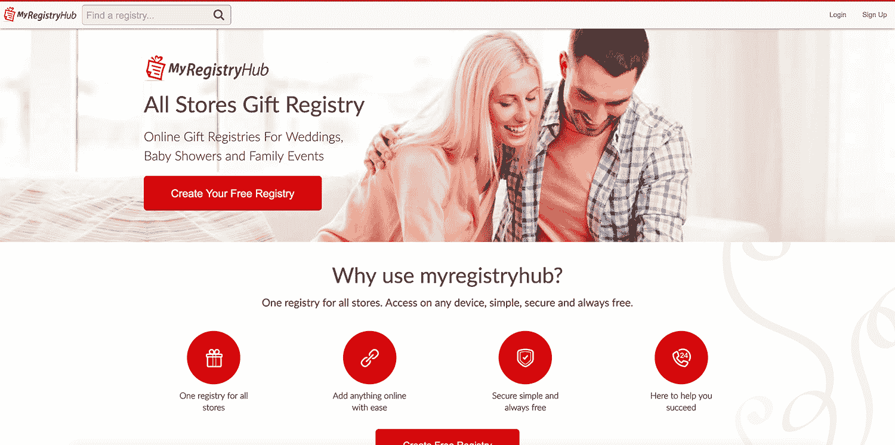
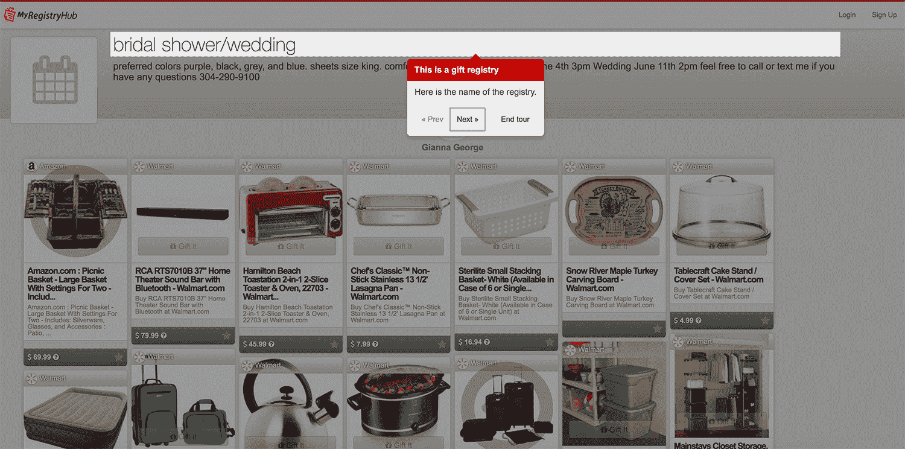

# 从零开始建立我的礼物注册方项目到 150 美元/月

> 原文：<https://www.indiehackers.com/interview/building-my-gift-registry-side-project-from-scratch-to-150-mo-be3252f674>

## 你好。你的背景是什么，Go 注册中心是什么？

我叫巴斯。我在荷兰长大，在游历了欧洲和非洲之后，我继续在密尔沃基上大学。大学毕业后，我在威斯康星奶酪市场找了份工作，在那里我从事电子商务网站的工作，并接触到了 PHP 编程。从那时起——现在已经超过 11 年了——我从未真正停止过专业和业余的发展和建设。目前我是 Target 的 Java 开发人员。

[Go Registry Hub](https://www.myregistryhub.com) 是一个开放的在线[礼物注册表](https://www.myregistryhub.com)用于各种活动类型。我的目标是让它比竞争对手的产品更容易使用，并且对手机友好/反应灵敏。我们的客人可以通过使用集成的亚马逊搜索添加其他人添加的内容来创建注册表，或者通过使用 bookmarklet 在线添加任何内容。该平台主要由女性使用，热门类别包括乔迁活动和婴儿送礼会。

目前我们有大约 2000 名成员，由于持续的 A/B 测试，越来越多的人变得活跃起来。收入仍然相当有限，每月大约 150 美元。

 

## 你创建 Go 注册中心的动机是什么？你是怎么想出这个主意的？

大约 3 年前，出于兴趣，我开始构建我的第三个开发框架。在某个时候，我开始对构建一个礼物注册解决方案感兴趣，主要是因为它看起来像一个有趣的挑战。我和妻子四处寻找相关的域名，她投票给 myregistryhub.com 的[而不是 digstack.com 的](https://www.myregistryhub.com)，这是我的选择。我还想着换呢:-)

开发是基于名为“werock”的本土开发框架完成的。这使我能够创建/支持任何允许优雅地实现新特性的开发模式。自然，这种“混账 it build it”的方法也伴随着挑战，但是框架的持续发展会在这个过程中不断带来回报。

动机是一个由有能力的人组成的小团体(家人和朋友)可以创造出非凡的东西。至少这是我想通过这个项目来证明的。我不断地试图在过于认真(而忘了玩耍)和试图不断取得真正的进步之间找到一条平衡。“werock”平台内置了 A/B 测试功能，我用它来确保任何重构或新功能都有助于客人更深入地参与平台。

主要的挑战是时间:我在 Target 做 Java 开发人员，除了照顾我的两个小女儿之外，我还在全职工作之外从事这个项目。

## 你是如何管理在 Go Registry Hub 上工作的时间的？你投入了什么资金？

我在 2015 年开始从事 [Go 注册中心](https://www.myregistryhub.com)的工作。在过去的夏天，由于一个大的改造项目，我无法投入足够的精力。在过去的两个月里，我又重新拾起了开发，并把事情提高了一个档次。我不断地从朋友和家人那里寻求反馈，并且能够不断地重新安排要做的工作的优先顺序。最近，我每周在这个项目上工作大约 15 个小时——大部分是工作日的晚上。我尽量在晚上 11 点前关闭笔记本电脑，这样我就不会太烦了:-)

关于预算，目前为止还没怎么花。我用 [99designs](http://ninetyninedesigns.7eer.net/c/342239/185967/3172) 做 logo 和登陆页面设计。加上我从几个朋友那里得到的帮助，我总共花了大约 1500 美元。

## 你是如何构建你的自定义框架“werock”的？你的技术是什么？

它是用 PHP 7、APCu、Memcached、MariaDB 和 Apache 2 在后端构建的；和前端的自举。虽然开发是从 PHP 5.6 开始的，但是随着 PHP7 的发布，我能够做出很多很棒的性能更新。主机由数字海洋提供，否则我用 Cloudflare。

我正在使用 Ionic 框架开发一个移动应用程序。我玩得很开心！然而，要做的事情太多了，我很难在合理的时间内完成它。

## 你是如何发展 Go 注册中心的？你的商业模式是什么，你的流量从哪里来？

我们的商业模式非常简单。我们试图用一个漂亮的用户界面和一个移动友好的平台来创建和管理礼物注册，以此来取悦我们的客人。一旦客人创建了礼物注册并与家人和朋友分享，我们的平台就会引入新用户。每次客人或访客进入礼品登记处并通过链接找到供应商时，我们都会尽可能添加我们的推荐 ID。购买礼物后，我们可以收取佣金。这不会干扰用户体验，我们承诺不使用任何类型的破坏性广告来创收。

目前，我们每天有 200-1200 次互动，每天购买 3-20 件礼物。这是针对 2000 名用户的，其中只有新用户正在以很高的速度转化为活跃用户，这是由于随着时间的推移对网站进行了改进。

一旦我开始正确地使用[inspectlet.com](http://inspectlet.com)，事情真的开始变得好了很多。在一个电子表格中，我记录了大约 150 个会话，并记录了痛点或改进的想法。稍后，想法或痛点可以正常化。电子表格被设置为对相似主题的出现次数进行计数，这创建了需要改进的领域的优先列表。然后我加上一个技术难度的估计。

结合技术难度和优先级给我一个工作优先级列表。然后，使用我的“werock”框架的内置 A/B 测试功能来测试每个更改。只有当实验显示有改进时，我们才实施改变。然后我们重复这个过程。

 

## 你未来的目标是什么？你认为未来会有什么大的挑战吗？

用户保持率还没有达到我们想要的水平，而且有无数的机会来有机地获取访问者。我很想推出移动应用，并不断迭代和测试，以确保我们不断改进。

在某种程度上，最终目标是建立一个有意义的公司和品牌，能够回馈社区。就我个人而言，我希望这个项目能为我的家人提供更多的时间和能力去旅行。

## 到目前为止，你学到的最大的教训是什么？如果你必须重新开始，你会做什么不同的事？

总是测试任何变化。尽管收集数据肯定需要更多的开发工作和时间，但避免功能/用户界面中的错误是值得的，这些错误会降低用户参与度。

我对有抱负的独立黑客的建议是做同样的事情，并测试你的假设。在全身心投入一个新的想法或功能之前，看看你能做些什么来测试你的访问者如何在没有完全构建它的情况下参与进来。一旦你得到积极的反馈，然后投入你的时间和精力去建立它。

一个具体的例子:我在添加礼物时添加了一个“继续寻找”的提示，这样用户可以继续搜索，而不必在浏览礼物时再次点击“添加礼物”。我已经进行了几次实验，但每次参与度都下降了 20%左右。对我来说，这是违反直觉的，但是因为更改已经过测试，所以我们现在回滚到以前的状态。回到制图板！

## 在你的旅途中，什么对你最有帮助？你认为你最大的优点是什么？

我认为使用自主开发的框架是一个很大的优势。经过一段时间的投入，我现在能够非常快速地迭代，并且很少出现问题(回归等)。

在开发自己的产品时，很难理清思路——这就像和自己打扑克一样。偶尔休息一段时间是非常重要的，可以创造一些距离来更清楚地看到下一步该做什么。

我最大的优势是能够相对较快地完成前端和后端开发。这样，我推出新功能就没什么障碍了。

## 我们可以去哪里了解更多？

查看位于 MyRegistryHub.com 的[站点。](https://www.myregistryhub.com)

还有，欢迎在下面留下评论或问题！

——[<picture id="ember5222001" class="user-avatar ember-view user-link__avatar"></picture>巴斯库伊斯](/Baskuis?id=Bsn1jAdRRaSxOIFxpVQZes1mnZr1)，围棋注册中心创建者

## 想像 Go Registry Hub 一样建立自己的企业？

你应该加入[独立黑客社区](/)！🤗

我们是几千名创始人，互相帮助建立有利可图的业务和副业。来分享你正在做的事情，并从你的同事那里获得反馈。

还没准备好开始使用你的产品吗？没问题。这个社区是一个认识人、学习和实践的好地方。随意[随便浏览](/)！

——[<picture id="ember5222006" class="user-avatar ember-view user-link__avatar"></picture>考特兰艾伦](/csallen?id=ibTLPyjwVebnZjMGKvz6ztarnuV2)，独立黑客创始人

4votes