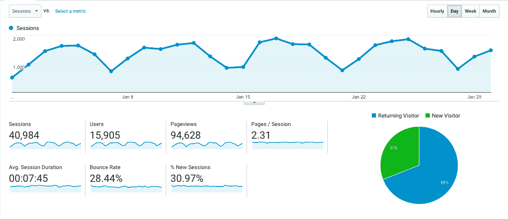
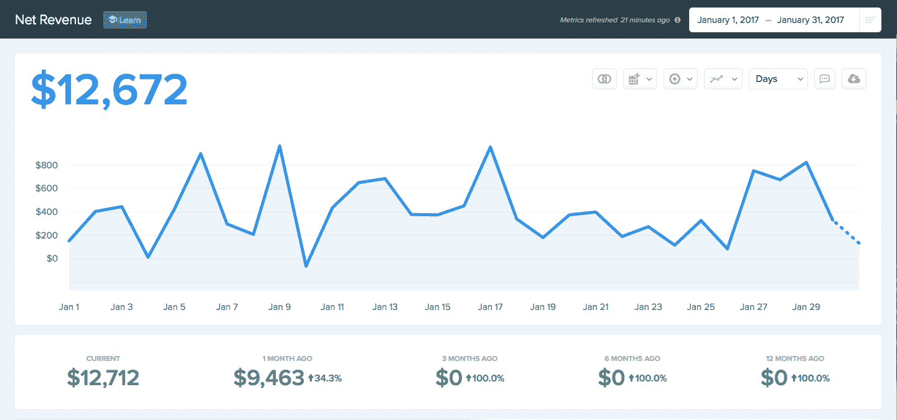

# 利用市场趋势赢得 15，000 名用户和每月 12，000 美元

> 原文：<https://www.indiehackers.com/interview/capitalizing-on-market-trends-to-gain-15-000-users-and-12k-mo-c8ab1e2cfa>

## 你好！告诉我们关于你自己和你正在做的事情。

大家好，我是乔希·尼尔森，在过去的三年里，我和家人一边工作一边环游世界，建造 Zencastr。我们在澳大利亚、新西兰、泰国、马来西亚和美国呆过。

Zencastr 是一个基于网络的工具，可以帮助播客轻松地以录音室质量录制他们的嘉宾。它被想要最好质量录音的播客使用。在 Zencastr 之前，大多数播客使用 Skype 通话记录器来捕捉他们的音频。质量不是很好，因为它只在主持人的电脑上录制，因此 Skype 压缩失真扭曲了音频。

使用 Zencastr，您只需向您的客人发送一个链接，他们将在本地以录音室质量录制。然后把曲目上传到你的云硬盘进行后期制作。

早在 11 月份，我就推出了 beta 版，并开始收取额外费用。到目前为止，我每月收入约为 12，000 美元。

## 是什么促使你开始使用 Zencastr？你最初的目标是什么？你是怎么想出这个主意的？

在开发 [Zencastr](https://zencastr.com) 之前，我试图建立一个基于浏览器的 DAW(数字音频工作站)。这是一个过于雄心勃勃的项目，但做起来真的很有趣。后来，我发现我们即将有一个孩子，我不得不更加认真地寻找一条通往财务成功的清晰道路。

我需要找到一个更可行、更专注的项目。有人向我提到播客在录制节目和收集音频时遇到了问题。我想我可能能够利用我在以前的项目中学到的一些技能来构建一些东西来解决这个问题。此外，当浏览器开始允许开发人员访问麦克风和处理音频时，这是正确的。

浏览器中的这项新技术创造了前所未有的机会，所以我决定尝试一下。我原以为只需要几个月就能建成，但我错了！

不管是好是坏，我真的没有花那么多时间在验证上。我有几个朋友是播客，我问他们是否有这个问题，如果我解决了这个问题，对他们有什么价值。他们说是的，他们会每月支付 20 美元。这就是我如何想出我目前用于专业计划的定价。

我不想必须处理筹集资金或寻找联合创始人的问题，所以我决定作为一个单独的创始人来启动公司。我每周做 20-30 个小时的 web 开发承包，其余的时间都用来开发 Zencastr。

## 构建最初的产品需要什么？离你准备好发布测试版还有多久？

大概花了 7 个月推出公测。为了让 MVP 出局，我尽可能地走捷径。我在浏览器中处理所有的音频处理和编码，并使用每个用户的 Dropbox 帐户来存储音频文件。

这使得我的服务器代码复杂度和成本非常低。它所做的只是服务于应用程序代码并处理一些 websocket 消息。后端使用 Node.js、Koa.js、MongoDB 编写。前端使用 Backbone.js，Web Audio API，WebRTC。

最初，测试版只处理本地录音。您仍然需要使用 Skype 或 Hangouts 来方便 VoIP 通话。现在这一切都在 Zencastr 中处理，不需要第三方服务。

我现在还提供后期制作服务，通过混合和均衡音频来准备发布音频。另一个节省时间的决定是将这项工作外包给 [Auphonic](http://auphonic.com) 。他们做得很好，我的用户对结果非常满意。

## 你用过哪些营销策略？在过去的两年里，你们是如何吸引用户和壮大 Zencastr 的？

我是一个糟糕的营销人员。我实际上根本没做什么。我做了一些采访，并出现在各地的播客上，但几乎我所有的用户都是通过口耳相传而来的。幸运的是 [Zencastr](https://zencastr.com) 解决了一个真正的痛点，播客是伟大的营销者，他们帮助传播消息。

建立用户基础的最好的事情之一是，在我开始收费之前，我的服务完全免费两年。我还是因为这个原因保持了一个很自由的自由计划。我希望 Zencastr 成为录制播客的地方，这样我就不会拒绝任何人。我还构建了应用程序，这样免费用户几乎不用花我一分钱。我只有一台制作服务器，音频存储在用户自己的 Dropbox 帐户上。

我目前有 15，000 名注册用户，并且这个数字每天增长 50-80。到目前为止，通过这项服务已经录制了大约 50，000 小时的音频，每天大约有 500-700 个新的录音。

## 你的商业模式是如何运作的？你的营收背后有什么故事？

在免费运行这项服务两年后，我终于决定我已经接近可以收费了，于是我放弃了所有的副业，完全专注于 Zencastr。花了大约六个多月的时间解决了所有的问题，并整合了一个计费系统。

回想起来，我本可以更早开始充电，但当时我并没有做好准备。活到老学到老。

有趣的是，测试期间的大部分高级用户并没有像我预期的那样转化为付费用户。他们是这款应用的优秀推广者，我不想失去这一点，所以我给了他们很多人一些免费积分来继续帮助推广这项服务。看来回报还不错。我正致力于一个更官方的联盟计划，以帮助更多地利用这一点。

我通过两种方式赚钱:专业计划用户的订阅和免费计划用户的一次性付款，这些用户希望通过后期制作服务自动混合和调整他们的音频。很简单。

我从免费用户那里获得的收入很少——每月不到 1000 美元。其余的来自每月和每年的专业计划订阅。

运行基础设施和周边服务的基本费用约为每月 1500 美元。我刚刚雇佣了我们的第一个员工，这显然会增加一点运营成本。

## 你未来的目标是什么，你打算如何实现它们？

播客领域还有很多其他需求。因为在创建阶段的最开始，我的应用程序就有用户，所以我很容易提供其他后续服务:托管、发布、广告等。我不确定我是否会走那条路，但有可能。

目前，我完全专注于完善现有产品，为规模化做更好的准备。我希望聘请一些开发帮助，因为它变得有点难以处理支持请求，业务发展，错误修复等。全靠我自己。

如果您是对 Web Audio / WebRTC 感兴趣的开发人员，并且不需要花费太多的成本，请随时联系我们；)

## 你在 Zencastr 遇到的最大挑战是什么？如果你必须重新开始，你会做什么不同的事？

最大的挑战是让这该死的东西在所有不同类型的系统上都能很好地工作。此外，浏览器供应商正在积极开发和改变 Web Audio 和 WebRTC 的特性。跟上这一切让我保持警觉。向 Firefox 和 Chrome 的开发人员大声疾呼，让这种应用成为可能。在过去的几年里取得了如此大的进步。

另一个巨大的挑战是独自工作时保持高效率。如果周围没有其他人，真的很容易失去动力。幸运的是，从我的用户那里收到电子邮件让我大部分时间都有动力去修复 bug 并继续添加所需的功能。

最后但同样重要的是，我的家人。我的妻子从一开始就非常支持我，我真的相信如果没有她在那里帮我度过艰难的时光，我可能已经放弃了。我女儿是一个持续的激励者。为他们争取财务自由的愿望真的帮助我保持专注。

我也用 Trello 来管理需要完成的任务。我强迫自己每天至少完成一个。一旦我进入状态，我通常会做更多的事情，但是如果你保持小目标，开始会更容易。

## 到目前为止，你认为你最大的优势是什么？

我的优势在于，在解决方案在技术上变得可行之后，我是这个领域的先行者。技术变革之后，市场上出现了真空。这是出击的好时机。

此外，当我在建立 Zencastr 时，像 Serial 这样的播客变得非常流行，并在播客领域带来了某种复兴。真是狗屎运。

## 对于刚刚起步的独立黑客，你有什么建议？

如果你刚刚开始，我认为最好的建议是现在就开始。你可能会失败几次，但这些都是学习经验，下次会更好地帮助你。你只能从阅读关于他人成功的书籍中获得这么多。你需要通过反复试验来发展自己的直觉，知道什么可行，什么不可行。

如果你让他们挡了你的路，有成百上千的理由去拖延。不需要融资，不需要联合创始人，不需要辞职。你现在确实需要开始了。

尽管如此，我还是发现了一些鼓舞人心的书:

*   [史蒂夫·乔布斯](http://amzn.to/2jia1ei)——沃尔特·伊萨克森
*   [开发商营销](https://devmarketing.xyz/)——贾斯廷·杰克逊
*   4 小时工作制——蒂姆·费里斯
*   从小处着手，保持小规模:一个开发者的创业指南
*   [顿悟的四个步骤](http://amzn.to/2k4V8t9)——史蒂夫·布兰克
*   艾伦·沃茨的作品

## 我们可以去哪里了解更多？

*   网址:[zencastr.com](https://zencastr.com)
*   邮件: [【邮件受保护】](/cdn-cgi/l/email-protection#abc1c4d8c3ebd1cec5c8cad8dfd985c8c4c6)
*   推特: [@zencastr](https://twitter.com/zencastr) 和 [@joshontheweb](https://twitter.com/joshontheweb)

我会关注下面的评论，并尝试回答任何问题。

—[<picture id="ember5266307" class="user-avatar ember-view user-link__avatar"></picture>joshontheweb](/joshontheweb?id=LnjkrkKaOzdfrGhKNNNW4PXTRRn2)，《Zencastr》的创作者

## 想像 Zencastr 一样建立自己的事业？

你应该加入独立黑客社区！🤗

我们是几千名创始人，互相帮助建立有利可图的业务和副业。来分享你正在做的事情，并从你的同事那里获得反馈。

还没准备好开始使用你的产品吗？没问题。这个社区是一个认识人、学习和实践的好地方。随意[随便浏览](/)！

——[<picture id="ember5266312" class="user-avatar ember-view user-link__avatar"></picture>柯特兰艾伦](/csallen?id=ibTLPyjwVebnZjMGKvz6ztarnuV2)，独立黑客创始人

8votes