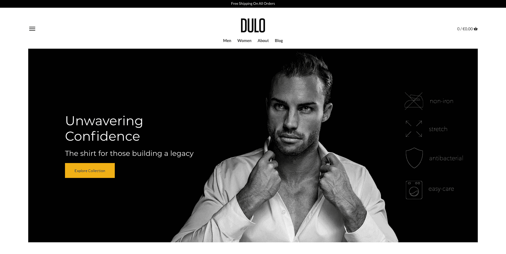
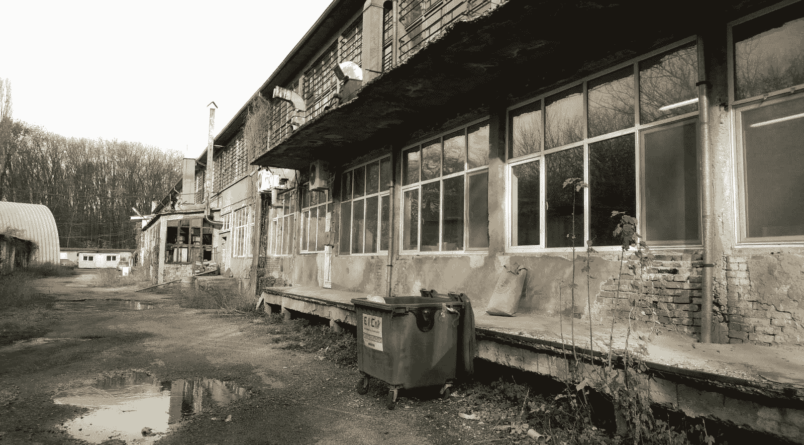
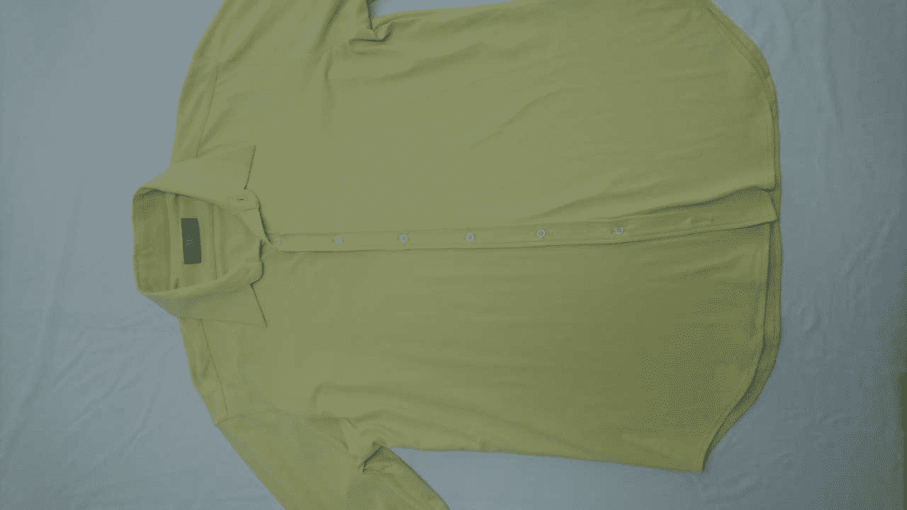
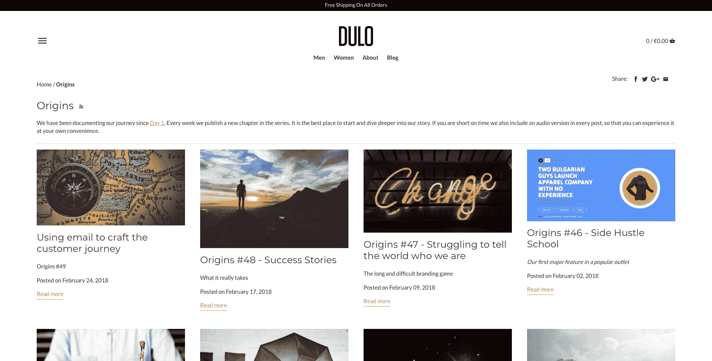
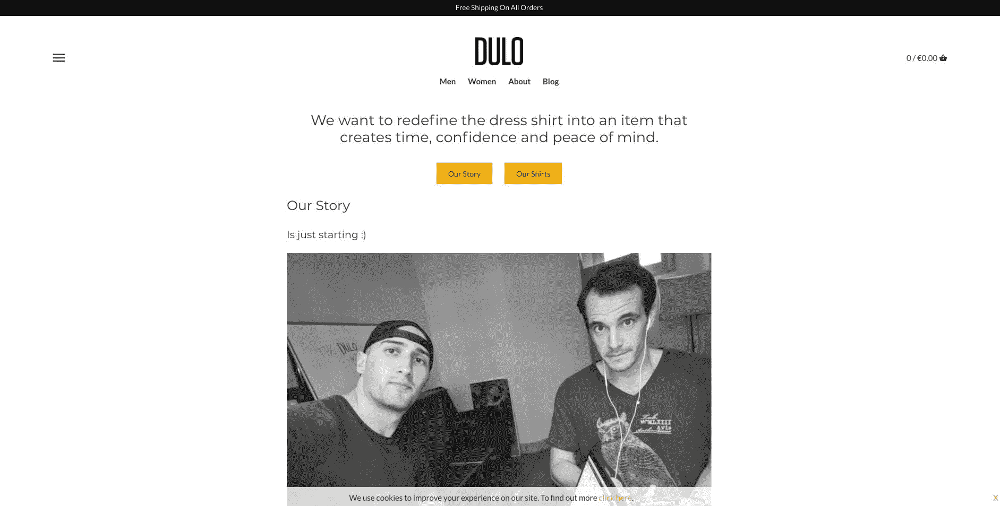

# 利用新技术将我们的服装业务增长到每月 1000 美元

> 原文：<https://www.indiehackers.com/interview/capitalizing-on-new-tech-to-grow-our-apparel-business-to-1-000-mo-86eeb8e62d>

## 你好！你的背景是什么，你在做什么？

嘿，我是朱利安。我来自保加利亚，目前住在荷兰的阿姆斯特丹。我是 DULO T1 团队的一员，我们用高性能面料制作礼服衬衫，传递时间、信心和内心的平静。我们的目标是通过使用现代材料来消除打理礼服衬衫时的摩擦。目前的免烫衬衫是默认的 100%纯棉衬衫，经过化学处理，可以洗掉。

DULO 衬衫是永恒的:

*   四向拉伸
*   免烫抗皱
*   可机洗的
*   抗菌(银离子处理)
*   负责任的欧洲制造

这家公司完全是自力更生、自负盈亏的。我和[马林](https://twitter.com/maringerov)各占一半，马林是我的高中同学，后来成了同事。我有点认识这家伙。我们在保加利亚有一句谚语(翻译得不是很好，但你会明白的):“已知的魔鬼是半个魔鬼。”因此，和马林一起跳下去似乎是个好主意，幸运的是，现在仍然如此。；)

在过去的一年半时间里，我们都在阿姆斯特丹工作，白天是全职程序员，早上、晚上和周末都在 DULO 上工作。

2017 年 11 月，在产品开发大约一年后，我们推出了我们的[网络商店](https://weardulo.com/)，并在头三个月的运营中赚了大约 3000 美元。

 

## 是什么促使你开始使用 DULO？

我一直喜欢多穿礼服衬衫的想法，但我买的每一件衣服通常只穿几次。最终，我不得不在早上或周末安排时间熨衬衫的事实打破了我的热情，让我回归到一个更实用(也就是不太正式)的衣柜。

我们知道美国有一些公司用运动面料制作礼服衬衫，对此很感兴趣，但由于进口关税和运输成本，我们最终没有购买。但是价值主张(使用现代技术将时尚与便利结合起来)留在了我们的脑海里。

在回保加利亚的一次旅行中，马林参加了一个关于当地一家生产和销售 T 恤衫的公司的介绍会。我们以前没有任何与服装生产相关的经验，但这让他想到了我们来自保加利亚，在裁缝专业知识和传统方面的优势。这种认识，加上制造我们自己一直想要的产品的动机，体现在一个想法中，即利用我们家乡的优势，努力生产这种产品。

这些年来，我们多次讨论过自己创业，但出于某种原因，当马林说出这个想法时，我立刻产生了强烈的共鸣。我能看到这种产品的好处，知道这个领域有公司在成长(证明有市场)，我们有找到合作伙伴并利用他们专业知识的潜在优势。理论上是有道理的。

赌上你的优势，创造一个你可以信任他人来弥补你的弱点的环境。

TweetShare

我们不仅看到了运动行业从棉质面料向高性能面料的转变，而且我们预测(现在仍然预测)这将成为休闲和正装的趋势，因此我们对这一产品类别充满信心。

## 构建最初的产品需要什么？

一旦我们决定启动这个想法，我们就开始编制一份我们可以联系的公司名单，询问他们是否能够为我们创造产品。这是一个非常奇怪的开始，因为我们甚至不知道我们在找谁或什么。我们需要找到布料本身，还是需要和普通棉衬衫的制造商谈谈？或者是能兼顾两者的人？

名单上的许多公司都没有网站，所以我们决定筛选那些有网站的公司，询问他们是否可以用运动材料生产礼服衬衫。我们接触的几乎所有公司都不知道我们在谈论什么，有几个公司说，“也许吧。”但是考虑到我们也没有太多的线索，我们决定在家里预约一些时间。然后我们计划了旅行，并开始和那些有希望提供更多关于这是否是一个可行的商业想法的人交谈。

我们交谈过的大多数公司对我们试图做的事情有点困惑，但我们的交谈开始让我们熟悉这个行业，我们开始找到一些答案。只有一家公司脱颖而出(他们有一个合适的办公室，而不是大篷车或出租公寓)，他们对这个想法很感兴趣，并表示他们可以制作我们正在寻找的样品。我们没有任何其他选择，所以我们决定握手言和，研究一个样本，看看情况如何，然后从那里开始。

 Our very first meeting looking for a manufacturing partner was in the white caravan at the back

快进几个月。我们开会检查[样品](https://weardulo.com/blogs/origins/origins-10-meet-the-samples)，最终看到实物产品，我们非常兴奋。除了令人震惊的黄色之外，这种布料看起来很棒，具有我们想要的确切特性。它摸起来甚至比棉花还柔软。

我们根据个人喜好对试衣做了一些调整，并决定制作几轮原型，我们可以自己测试，也可以分发给朋友和家人进行测试。经过大约三轮的改进——主要是为了合身，因为我们对面料很有信心——我们决定生产我们的第一个系列，有六种纯色，男女款都有。

 For some reason the fabric mill had the sample fabric available in yellow

## 你们是如何吸引用户，壮大 DULO 的？

[记录](https://weardulo.com/pages/origins)我们的旅程帮助我们在发布前和发布时拥有一小部分观众。此外，跟随我们旅程的一些人收到了样品，并期待从第一个官方系列中购买，这对我们来说是一个非常重要的数据点。尽管我们自己对最终产品非常满意，但它让我们放心，在测试了原型之后，其他人也喜欢它。

自推出以来，我们主要通过口碑销售，脸书广告背后有少量预算，主要用于测试目的。我们还在[音频](https://soundcloud.com/weardulo)、[视频](https://www.youtube.com/channel/UCnk0wNZj1D5HnzvAwIAGuEw/videos)和[文本](https://medium.com/the-needle)中创建了许多内容，并且还在 Medium、Quora、IH 和 Instagram 上积极地与其他人合作。

我们仍处于数字营销的测试阶段，但通过一次一个人来思考整个过程，我们真的发现了价值。每天，坚持不懈地与人们谈论我们是谁，我们在做什么，让世界了解我们。

我们已经看到了成功的早期迹象，我们的故事并不典型:两个程序员创办了一家服装公司。这是一个有趣的叙事角度，我们试图用它来创造对杜洛的兴趣。

## 你的商业模式是什么，你是如何增加收入的？

我们的服装产品利润低于行业标准，主要是因为数量少(制造商仍按样品价格向我们收费),而且我们使用的技术面料比普通混纺棉要贵。我们所有的收入都来自网上商店的直接销售，剩余的利润将重新投资到业务中，既用于市场营销，也用于资助下一个系列。

仍然有一份全职工作让我们有耐心，不去想利润和支付自己。

TweetShare

目前，我们是一个直接面向消费者的品牌:所有交易都在 weardulo.com 进行。考虑到时间和资金的限制，我们不太热衷于开店，但我们可能会考虑将我们的产品放在更多的利基概念店中。更像是一个科技环境，而不是普通的服装环境。

仍然有一份全职工作让我们有耐心，不去想利润和支付自己。我们希望能够将所有的收益再投资到打造一个伟大的产品和创建一个促进和鼓励创业的品牌上。

## 你未来的目标是什么？

第一个目标是在 2018 年夏末销售我们的第一个系列(约 700 件衬衫),同时开始准备第二个系列，利用我们所有的知识来不断改进我们最初的产品和价值主张。

我们还在考虑做一个 Indiegogo 或 Kickstarter 众筹活动，因为我们的初始库存即将耗尽，以便生产更大的第二个系列。

 

## 你面临的最大挑战和克服的障碍是什么？如果你必须重新开始，你会做什么不同的事？

一开始，我们确信的一件事是我们有一个产品。行业平均退货率为 30%，我们还没有收到任何退货(尽管我们还没有大批量发货——到目前为止大约发货了 70 件衬衫)。这是一直以来的计划:拥有一个非常非常坚实的业务核心，也就是产品本身。

话虽如此，在技术上处于有利地位，现在我们需要专注于学习如何建立一个品牌，并利用现代平台来做到这一点。

开始时，我们用一种非常普通的语调和每个人说话，因此不和任何人说话。我们将努力寻找自己独特的角度，拥有它，并围绕它创造内容。我们开始走得很宽，在许多平台上，没有任何深度。

许多测试人员和接触过实物产品的人回来订购了 3、4、5 件衬衫。我们最大的挑战是将这种成功从物理环境转化为数字环境。换句话说，我们将专注于如何在我们的网站上展示和传达这种感觉。

这也是一种新的产品类别，因此我们需要宣传使用高级面料制作经典礼服衬衫的好处，并展示可能的环境效益信息(当良好的制造流程到位时)。

## 有没有发现什么特别有帮助或者有优势的？

记录我们的旅程是一个巨大的胜利。它创造了一个对我们所做的事情感兴趣的额外人群，以及一个我们可以用于内容营销的巨大内容支柱。

我们还非常幸运地拥有我们的制造合作伙伴。质量标准、专业知识和创新眼光弥补了我们之前行业知识和经验的不足(尽管我们正在学习！)很好。

我很受人们的启发，尤其是创始人。下面是我在建造 DULO 时所敬仰的一些人。

*   来自[大本营](https://basecamp.com/)的杰森和[大卫](https://twitter.com/dhh)。以常识经营自我维持业务的杰出范例，以人为本，不一定只追求增长。
*   瑞安·卡森和[树屋](https://teamtreehouse.com/)。这是一项了不起的任务，它帮助我获得了第一份编程工作，我们为 Ryan 成为我们的第一批客户而感到特别自豪。
*   加里·维纳查克是我们寻求营销和品牌战略以及实用商业建议的人。
*   巴塔哥尼亚公司的首席执行官芮伟航·舒伊纳德以及该公司对制造和生产的思考方式是一个巨大的启发，我们希望在生产产品时牢记在心，并以负责任的方式进行生产。

## 对于刚刚起步的独立黑客，你有什么建议？

做是无可替代的。我一直处于蒂姆·费里斯的狂欢聆听模式，但在某些时候，橡胶需要上路，你需要弄脏你的手。否则只是生产性拖延。

我花了一个周末的时间来试验脸书的广告，这比我前几个月读文章和听播客学到了更多。

非常重视产品，但不要太重视内容。你的产品或服务是你业务的核心。尽可能做到最好。至于内容，另一方面——不要为了追求完美而削弱自己。运送它，移动它，邮寄它。都只是数据点和帮助你提高的教训。

做是无可替代的。

TweetShare

不要害怕进入一个你一无所知的行业/领域。如果你有想法、愿景和纪律去执行它，那么依靠你的伙伴，和那些称赞你的技能的人建立关系。赌上你的优势，创造一个你可以信任他人来弥补你的弱点的环境。

我们有时会被制作内容冲昏头脑，但与他人的内容互动并建立一对一的关系同样有价值，如果不是更多的话。

如果你有联合创始人，相信他。独自创业很难。完全信任你的队友。如果你没有感觉到，那就早点解决。

## 我们可以去哪里了解更多？

关于我们如何开始 DULO 的音频介绍，请查看我们在 [Side Hustle School](https://sidehustleschool.com/episode/383/) 上的专题。

我们从第一天开始就记录了我们的旅程，所以来看看我们的[起源系列](https://weardulo.com/blogs/origins)。我们每周发布一次更新，分享我们在发展业务过程中的经验和教训。你可以[在这里](https://weardulo.com/pages/origins)注册订阅我们的时事通讯。

我们有一个[播客](https://weardulo.com/blogs/the-dulo-show)，在这里我们可以和其他小企业主交流。我们很乐意让你上场。如果你正在建立一个企业或个人品牌，请给我们写信。

 

我们的[视频博客](https://www.youtube.com/watch?v=784_91has8o&list=PLkbellABjPjULjohHD93GiekEdCRQBARt)在 YouTube 上结束了。我们很快会再次认真对待它。

如需每日更新和动态报道，请在 [Instagram](https://www.instagram.com/weardulo/) 上关注我们。

我们是 IH 社区和每个致力于自己事业的人的忠实粉丝。这是我们希望通过构建和记录我们的流程来宣传的信息。所以。在我们的网站上随意使用代码“INDIEHACKERS ”,购买任何商品可享受 15 欧元的优惠。我们在世界范围内免费送货。

我们从问题中获取信息。下面请掉一些！

—[<picture id="ember5248631" class="user-avatar ember-view user-link__avatar"></picture>朱利安·萨马尔吉耶夫](/JulianSamarjiev?id=M4aQ0B224hYYWIGRwA44syxqSTr2)，杜洛的联合创始人

## 想像杜洛一样建立自己的事业？

你应该加入[独立黑客社区](/)！🤗

我们是几千名创始人，互相帮助建立有利可图的业务和副业。来分享你正在做的事情，并从你的同事那里获得反馈。

还没准备好开始使用你的产品吗？没问题。这个社区是一个认识人、学习和实践的好地方。随意[随便浏览](/)！

—[<picture id="ember5248636" class="user-avatar ember-view user-link__avatar"></picture>考特兰艾伦](/csallen?id=ibTLPyjwVebnZjMGKvz6ztarnuV2)，独立黑客创始人

16votes