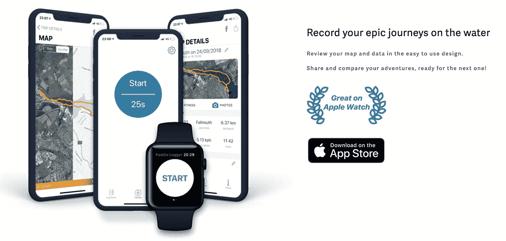
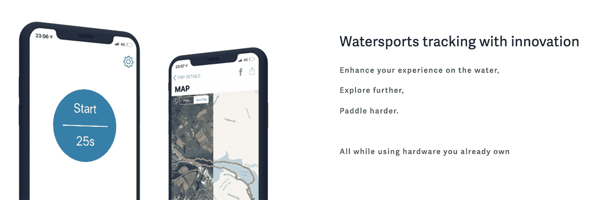
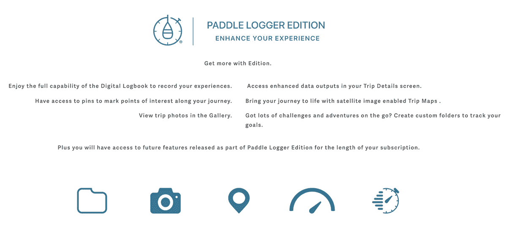

# 改变商业模式，寻求可持续发展

> 原文：<https://www.indiehackers.com/interview/changing-business-models-to-find-sustainable-growth-dd465a1b2d>

## 你好！你的背景是什么，你在做什么？

大家好，我叫大卫，是埃克塞特大学的一名活跃的企业家和企业教育家。我的一项业务叫做[桨式伐木机](https://paddlelogger.com/)。

值得注意的是，我没有编码或开发背景，我的职业道路是多种多样的。我最初是一名专门研究遥感的学术研究人员；这包括测量湖床地形，并使用无人机、飞机和卫星创建数据收集方法。我选择这个职业是因为我喜欢在湖泊和海洋环境中工作。现在我在一所大学工作，在那里我帮助学生将他们的商业想法变成现实。

工作之余，我热衷于站着划桨。我决定开始桨记录器纯粹出于沮丧，因为没有一个移动 GNSS 跟踪产品在那里为我们划桨。事实证明，我不是唯一有这种感觉的人；现在，世界各地有一个庞大的划桨者社区，使用划桨记录器来跟踪他们在水上的旅程。

该应用的核心是一个追踪器和数字日志，专为划桨者打造。我们将用户界面保持得非常简单和实用，以确保人们能够专注于一次史诗般的水上冒险。我们只是通过展示他们走了多远，多快，去了哪里来支持他们的冒险。

我们有机地发展了这款应用，最初是作为一种辅助手段。在过去的 18 个月里，它真的繁荣起来了；我们每月挣不到 2，000 美元。但在一个相对小众的市场运营时，这种增长是不可持续的。我们决定通过构建新功能和转向免费增值模式来扩大规模。Paddle Logger 现在免费提供有限的功能集，并提供不同级别的付费订阅选项。

 

## 是什么促使你开始使用桨式记录器？

挫败感。没有人足够关心划桨者(至少没有骑自行车的人那么关心)，以至于在制造产品时没有考虑到我们。于是我勾画了一些想法，向一个不会划水的朋友提及，并问我是否应该尝试一下。他的意见是，“为什么不呢？只有看到别人这么做，你才会后悔。”我认为所有的企业家都会认同这一点。

他把我介绍给了他的一个软件开发朋友，我们开始讨论这个想法以及如何构建一个 MVP。从那以后，我尽可能多地自学设计，如何做市场调查等等。我把编码任务交给了更有知识的人。由于这只是一个兼职项目，我最初认为这将使我快速赚钱，并提供一些额外的啤酒钱。我错了多少，我学到了多少。

六个月后，我们向市场推出了 MMP。这是一个超级简单的版本，基本上是付费试用。当用户注册我们的简单产品时，他们开始要求特定的功能，所以我们构建了它们。通过与早期采用者的不断沟通，我们的产品开发受到了市场的影响。我开始意识到这里有一个真正的市场，不仅是在单人划水，还有其他水上运动。

培养这种稳定的用户基础，相信并成为桨式记录器的一个重要组成部分非常有帮助，尤其是当事情运行得不那么顺利的时候。

## 构建最初的产品需要什么？

我的积蓄和整个夏天。或者至少计划是这样的。总而言之，从构思到发布我们的第一个版本大约花了六个月的时间。我自己做所有的事情(除了编码是唯一的支出)。我很幸运地被介绍给一个独立的开发人员，他不仅帮助我开发产品，还教会了我很多关于这个行业的知识。另一方面，我不得不做学生，这很好。反正我大部分时间都是在沙滩上度过的！

我不得不从基础开始自学 UI/UX 设计，这花费了比预期更长的时间。我必须熟悉苹果的架构，并学习如何使用一种新的设计工具:草图。推出初始产品所需的其他技能(如销售和营销)是在工作中和参与社区中学习到的。

社区是划桨伐木工的关键。我们一致认为 v1 的发布必须超级简单和超级稳定，因为我们希望允许用户反馈来驱动更复杂功能的构建。我们有一个功能“命中列表”，我们希望打掉，但该列表会定期改变，因为用户提出了许多不同的功能。我们发布了这些标记为“包”的更新例如,“速度包”包含了更多关于桨数据的信息。

我们的信念一直是，设计应该是平衡的，强大的功能，可以在有限的用户交互下存在。没有人想把他们价值 1000 美元的手机扔进水里，但是很多人会去海边逃避，远离他们永远联系在一起的生活。因此，从设计的角度来看，我们总是在问，我们如何才能提供一种无摩擦、高效的体验，让用户带上他们的设备，开始一次旅行，然后完全忘记它，直到他们回到陆地。即使是现在，我们开发的每个功能都要经历这个过程。简单是用户的关键，也是一个美丽的设计。

 

## 你的商业模式是什么，你是如何增加收入的？

我们最近改变了我们的商业模式。我们提供桨式记录器，作为预先支付的一次性费用服务。随着我们功能列表的增加，前期成本也在增加。

在我们 2018 年的高峰期，我们达到了 2000 多美元/月。但是由于新功能的技术要求，我们决定转向基于订阅的模式。现在，我们提供了一个免费的桨式记录器的有限版本，并提供了一个付费选项来访问其他高级功能。我们将为更多功能发布另一个订阅级别(以不同的价格)。将有一个顶层版本，允许用户访问我们曾经建立的每一个特性和功能。最初，我们希望转向基于订阅的方式，以便更好地构建新功能；但这种模式也确保了业务的可持续性，确保我们能够继续为当前的用户群提供支持。

我们已经授予所有预先购买桨式记录器的用户创始人身份。他们在我们困难的时候支持我们，然后让他们立即再次付款似乎是错误的做法。就我个人而言，我经历过这样的客户场景:公司刚刚删除了对他们旧版本的支持，或者重新开始一个新版本，而没有考虑带他们的客户一起踏上旅程。

在阅读本文时，你可能会注意到一个共同的主题，即桨式记录器社区的重要性——我们对他们保持忠诚，就像我们希望他们对我们一样。

 

目前，我们每月的营业额约为 1，000 美元，但这个数字还在增长。我们的目标是在未来六到九个月内回到我们的位置(在我们 2018 年的巅峰)，特别是当我们进入赛季开始时。划船运动是季节性的，在温暖的天气里，水上运动的人比寒冷的时候多。因此(作为一家北半球公司)，我们注意到冬季月份(10 月至 1 月)的销量下降。从 2018 年到 2019 年，我们真正专注于澳大利亚市场，并试图使其与全年的月营业额保持一致。

## 你未来的目标是什么？

在不久的将来，我们将推出一些新功能和订阅级别。我们认识到需要吸引新用户，同时提高应用内从免费订阅到付费订阅的转化率。我们的目标是在下一个财政年度结束时将收入增加 10 倍。这将使我们能够继续维持业务，并在下一年实现更快的增长。

我们听说应用程序“引爆点”有 100 万用户；这对我们提出了一个有趣的挑战。我们经营的是一个利基水上运动/健康和健身市场，所以要达到这个神奇的数字，我们需要在市场上占据非常非常大的优势。这可能需要很大的营销预算，而作为一家小公司，我们不一定有。因此，我们打算通过更有创意的营销来应对获取用户的挑战。

以前去过的人通常很乐意提供建议。我总是问问题，并在我能帮助别人的地方把问题解决掉。

TweetShare

## 你面临的最大挑战和克服的障碍是什么？如果你必须重新开始，你会做什么不同的事？

这是我的第一个创业项目，也是我第一次花时间认真去做的项目。一开始，我对创业的了解和对行业本身及其运作方式的了解一样多。

如果让我重新开始，我会更有效率地做每一件事，更快地创新，更好地向新用户和整个行业推销自己和公司。最近，我参与创立了一个全新的品牌，并在一年多一点的时间里，以不到 1000 美元的预算，将最终产品推向了市场。我利用从创建桨式记录器中学到的技能来建立这个新品牌。

不得不说，任何创业之旅都有起有落。一个特别的低谷是当应用程序经历了一段不稳定的时期，并且持续了一段时间。我当时正在处理大量的客户投诉，这些投诉有时非常激烈。我们最终设定了一个严格的截止日期，如果我们没有开始看到隧道尽头的曙光，就关闭商店(或者至少我是这么想的)。那将是一个巨大的错误。

不到一年后，我们进入了财务上最成功的增长期，并获得了许多新功能的项目资助。这是一堂关于适应力的真实的课；我意识到有时候为了让一个项目成功，需要很大的毅力。

## 有没有发现什么特别有帮助或者有优势的？

与人交流。我发现企业家的世界非常开放。以前去过的人通常很乐意提供建议。最糟糕的情况是他们忽视你或者拒绝你。我自己总是问问题，并在我能帮助别人的地方提出问题。

我们的市场是独特的。当站立式桨板运动作为入门级桨板运动真正开始腾飞时，我们推出了这项运动。我们看到了这种潜力的增长，因为度假的人们在度假村玩桨板，然后成为常规的划桨者。很大一部分划桨者会参加大众参与活动(而且这一数字还在增长)。我们离将其视为奥运会项目不远了。因为我也是一个超级市场，所以这是一个我很容易认同和进入的市场。但是我们的总市场是针对*所有*桨式运动的，这在世界范围内是相当大的。

作为一名企业家，对我帮助最大的事情之一是我几年前参加的 [SETsquared 项目](https://www.setsquared.co.uk/)。在这三天的空间技术课程中，我的生意的每个方面都受到了挑战。我对品牌建设有了全新的认识。在了解了[黄金圈(Simon Sinek)](https://www.ted.com/talks/simon_sinek_how_great_leaders_inspire_action?language=en) 的概念以及品牌如何成功利用这一概念后，我将这些知识应用于桨式伐木机，包括我们如何做生意和营销自己。

不要问，不要得到。

TweetShare

## 对于刚刚起步的独立黑客，你有什么建议？

1.  不要问，不要得到。
2.  找到你的**为什么。**
3.  与人交谈。获取意见和建议。
4.  把你的想法放在一边，先成为问题的专家。
5.  对改变你的解决方案以更好地适应问题持开放态度。

如果你刚刚开始构思，我推荐 [Strategyzer，一个商业模型画布](https://www.strategyzer.com/)。这是一个快速的方法来创建一个计划，以测试你的解决方案和市场的假设。

## 我们可以去哪里了解更多？

你可以在 https://paddlelogger.com/的[找到更多关于桨式记录器的信息，或者直接去应用商店下载](http://www.paddlelogger.com/)[桨式记录器](https://itunes.apple.com/gb/app/paddle-logger/id955311911)，帮助我们达到一百万用户！在 Instagram [@paddlelogger](https://www.instagram.com/paddlelogger/) 上找到我们，你可以找到我的冒险经历和我其他业务的链接 [@pldave](https://www.instagram.com/pldave/) 。

感谢您的阅读，如果您对我上面列出的任何问题或一般提示有任何建议或意见，我们很乐意收到您的来信！

——[<picture id="ember5251841" class="user-avatar ember-view user-link__avatar"></picture>大卫·沃克](/PlDave?id=Z7aiz1TARvPYFTaX51xaCjCwn2C3)，桨式记录器的创始人

## 想像桨伐木工一样建立自己的事业吗？

你应该加入[独立黑客社区](/)！🤗

我们是几千名创始人，互相帮助建立有利可图的业务和副业。来分享你正在做的事情，并从你的同事那里获得反馈。

还没准备好开始使用你的产品吗？没问题。这个社区是一个认识人、学习和实践的好地方。随意[随便浏览](/)！

—[<picture id="ember5251846" class="user-avatar ember-view user-link__avatar"></picture>考特兰艾伦](/csallen?id=ibTLPyjwVebnZjMGKvz6ztarnuV2)，独立黑客创始人

10votes