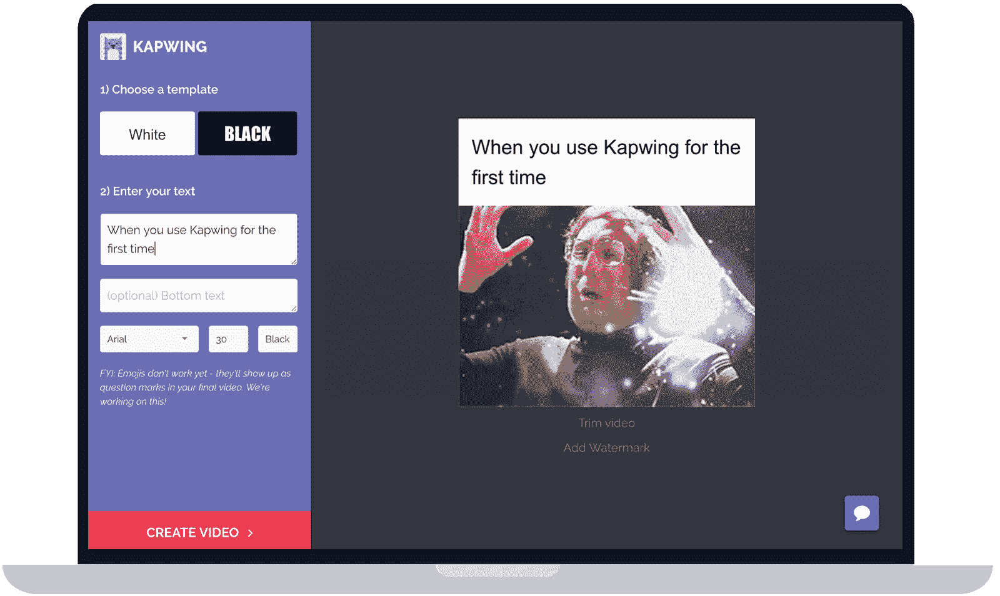
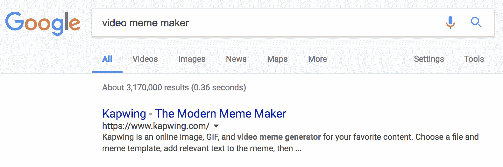
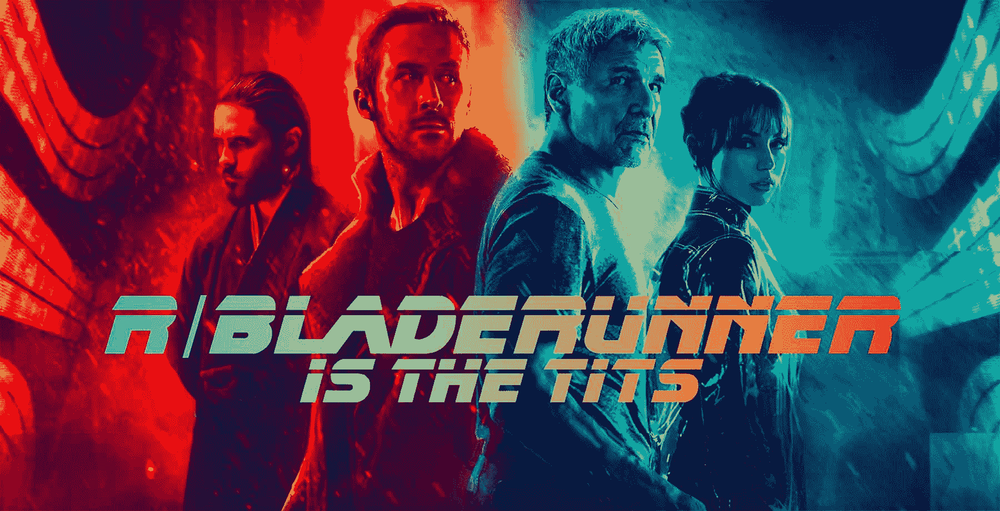
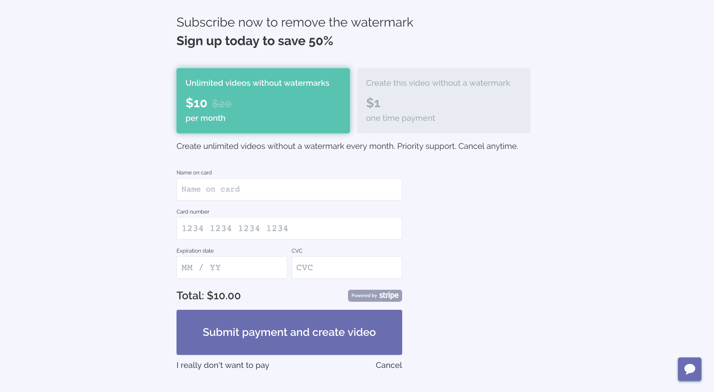
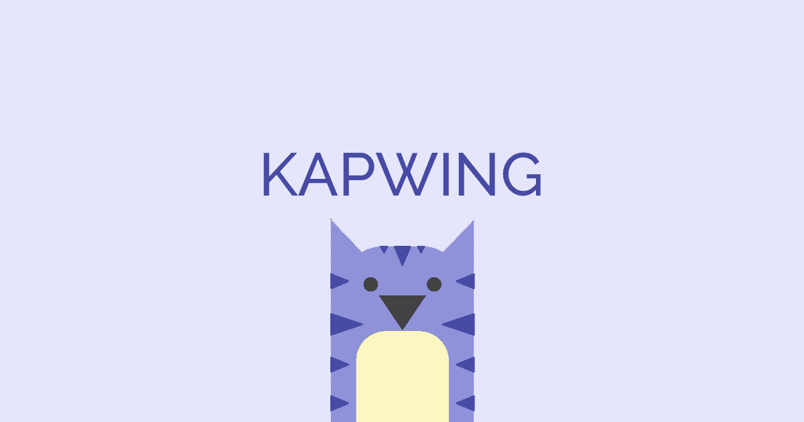

# 将我们对社交媒体的热爱转化为一项有利可图的业务

> 原文：<https://www.indiehackers.com/interview/channeling-our-love-of-social-media-into-a-profitable-business-17b24e043e>

## 你好！你的背景是什么，你在做什么？

嗨！我叫 Julia，24 岁，是一名网络开发人员，第一次创业，住在旧金山。我和我的联合创始人埃里克正在建立一个名为 [Kapwing](https://www.Kapwing.com) 的在线视频编辑器。

Kapwing 是一个简短视频的在线工具箱。现在，它有三个特点:[一个现代的模因制造者](https://www.kapwing.com) , [一个时髦的音效编辑器](https://www.kapwing.com/sound-effects)，和[一个在线视频缩放器](https://www.kapwing.com/resize-video)。

无论是在桌面还是移动设备上，用户都可以上传他们的视频，添加文本和效果，并下载输出。Kapwing 可以免费使用，但客户需要付费才能移除一个出现在角落的小水印。

大约两个月前，我们推出了 Kapwing，一个月后又增加了一个付费墙。现在，Kapwing 拥有 20 多个订阅客户，每月收入超过 240 美元。我们的客户包括营销机构、像 [Chubbies](https://www.chubbiesshorts.com/) 这样的品牌、社交媒体影响者、小企业主和临时创作者，我们在平台上有数百名免费用户和数千个迷因。

埃里克和我是在谷歌做产品副经理时认识的。他在谷歌的 APM 项目中比我高一届，两年后离开，从零开始建立自己的项目。我们保持联系，7 月份我决定离开谷歌加入他的团队。我们自力更生，靠自己的积蓄生活，用朋友办公室里的几张多余的桌子自己动手建造一切。

 

## 是什么促使你开始学习 Kapwing？

我们都是脸书、Instagram 和 Twitter 的忠实用户。今年，我们注意到视频迷因——视频周围有黑色或白色的标题栏——似乎正在蚕食我们的新闻提要，并且越来越受欢迎。

埃里克有了 Kapwing 的想法，当时他试图在 iMovie 中制作一个视频 meme，并发现尽管有这种趋势，但在他的电脑上制作它是一种巨大的痛苦。几个月前，他建立了一个网站，让用户免费制作这些迷因。但是仅仅几个月后，他不得不关闭它，因为它在亏钱。

当他今年夏天让 meme maker 离线时，几个用户紧急写信给我们，要求我们把它带回来。这些狂热的粉丝表示，他们热爱这个网站，每天都在使用，有些是为了工作，有些是为了个人频道。

如果我能重来一次，我会花更少的时间去分析，而花更多的时间去创造和尝试。没有完美的想法。

TweetShare

当时，我刚刚离开谷歌，我们两人正在研究其他想法。但最终这些用户的鼓励和热情把我们拉回了 Kapwing。

从对 [Google Trends](https://trends.google.com/trends/) 的研究中，我们发现查询量为“视频迷因制造者”、“热图生成器”等。相当高，尽管很少有网络应用程序来帮助人们制作它们。于是我们从零开始重建旧址，Kapwing 诞生了。

## 构建最初的产品需要什么？

Kapwing 是一个非常简单的 React web 应用程序，它花了我们大约三周的时间来构建。我们在 [Namecheap](https://www.namecheap.com/) 上购买了域名，在 [Fiverr](https://www.fiverr.com/) 上花钱请人制作了商标，并在我们开发产品的时候建立了一个登陆页面，以便从感兴趣的早期用户那里获得一些电子邮件地址。(最终，我们从“电子邮件订阅”邮箱中获得了大约 100 个初始地址。)

我们通过给这些订户和最初网站的高级用户发电子邮件，在网上推出了这款基本产品。用户可以上传视频，添加文字，并下载一个迷因。MVP 的费用约为每月 50 美元，包括购买域名、租用服务器和托管网站的费用。

我们最初的几个用户喜欢 meme maker。根据他们的反馈(我们通过电子邮件征求的)，我们迭代并添加了字体选择器、水印编辑器和修剪器等功能。我们在网站上添加了一个漂移聊天机器人来帮助我们发现可用性漏洞和错误。

一旦我们对该产品感觉良好，我们就用 [Stripe](https://stripe.com/) 建立了一个付费墙，并开始向用户收费，以移除视频角落里的“Kapwing.com”水印。

## 你是如何吸引用户并成长的？

在我们推出付费墙后，我们从发展模式转向增长模式，集思广益，寻找增加流量和收入的方法。我们尝试了冷接触、付费广告、社交媒体、获取新闻、利用我们的网络和提供折扣。大多数事情都没有成功。

尽管 Eric 和我都曾在谷歌搜索上工作过，但我们基本上不知道 SEO 的重要性，直到我们开始推广自己的创业公司。谷歌上的有机发现无疑是我们最强大的获取渠道，我们的 10 个首批客户都是在搜索“meme maker”之类的东西后找到我们的。为了赢得客户，我们需要 Kapwing 出现在谷歌搜索结果的顶部，比如:

 

绝对有效的方法:

*   我们**在 Kapwing 域名上开了一个关于我们创业经验的博客**，并在相关的互联网论坛上分享新帖子。一篇关于我们支付流程的帖子在黑客新闻上半病毒式传播，有数百个随机的博客和新闻网站链接。互联网上几乎 75%指向 Kapwing.com 的链接都指向这篇文章，这给了我们在谷歌上很大的提升。
*   我们**制作了一些不相关的酷东西**:尽管它们与迷因制作无关，我们还是制作了一些足够有新闻价值的东西，从博客或媒体网站上获得了一些初始链接。当火灾威胁到 Eric 父母在圣罗莎的家时，他制作了一个[交互式火灾地图](https://www.kapwing.com/sonoma-county-fire-map)，帮助被疏散的人获得关于他们财产的信息，这个工具在几个[当地](https://ww2.kqed.org/news/2017/10/13/map-santa-rosa-residents-see-your-home-after-the-fires/) [新闻媒体](http://www.mercurynews.com/2017/10/13/before-and-after-the-fire-satellite-photos-of-santa-rosa-neighborhoods/)中出现。我们还制作了一个 [Bladerunner 海报生成器](https://www.kapwing.com/blade-runner-generator)，并在 [reddit](https://www.reddit.com/r/bladerunner/comments/78zohb/found_a_blade_runner_font_generator_online_and/) 上发布。令人惊讶的是，这些前几个链接对我们的谷歌有机排名帮助很大。

 

有点效果的东西:

*   **在创业网站上注册 kap wing**:Hacker News、AngelList、Crunchbase、AlternativeTo、Beta Page、StartupRanking、NextBigWhat、GetWorm、BetaList、F6S 等几个网站允许创始人在自己的创业公司上发布免费的个人资料(带链接！).因为我们自己编写了描述，所以这些链接都与我们的目标查询高度相关。
*   **在 Quora 和 reddit 上对相关问题的左评论**
*   **在 Medium、YouTube 和 [Snapguide](https://snapguide.com/guides/make-a-video-meme/) 上制作操作指南和视频**。
*   与博客作者和记者进行了一些冷接触:我们搜索了关于迷因制造者的文章，并联系了相关作者。我尝试在数百个新闻网站上发布“提示”,并尝试了许多不同的电子邮件策略，看看记者是否会报道或提及 Kapwing。但是我几乎没有得到回应:(早些时候，一位来自 [Try Modern](https://www.trymodern.com/638/how-to-make-instagram-tumblr-memes) 的博客作者写了关于 Kapwing 的文章，这很有帮助。我们了解到，当一个新闻网站就一个产品发表博客或文章时，其他网站会在自己的订阅源上重新发布内容，这意味着即使一篇文章也会在互联网上引起反响，并为您带来数十或数百个链接。

不起作用的事情:

*   脸书上的病毒帖子:我们分享了一些在 Kapwing 上制作的视频。我们有一个视频在网上疯传，有超过 500 万人参与！但遗憾的是，它并没有转化为任何狂热的客户…我们从中得到的启示是，确保你的目标受众由有可能成为客户的人组成是很重要的。
*   **AdWords** :我发起了一项针对类似“GIF meme maker”、“如何制作视频 meme”等相邻查询的活动。花大约 3.30 美元，我们的网站每天会有 50 次点击。老实说，我认为对于一个小企业主来说，Adwords 的产品/用户体验*糟透了*。谷歌上的广告昂贵、混乱、无聊，而且不如尝试有机排名有趣。我们没有通过 AdWords 转化任何客户。好的一面是，在你的第一个 25 美元之后，谷歌会给你 100 美元的广告，这很划算。
*   **复制我们的登陆页面**:一旦我们支持 gif，我们就复制我们的“视频迷因制作”登陆页面，调整文本以优化 gif，然后在黑客新闻上重新推出。虽然 Kapwing 获得了一些转发和投票，但新的登录页面没有排名为“GIF meme maker”。对于这个查询，它没有任何“链接果汁”。
*   要求我们的免费用户将我们加入他们的网站/博客:由于我们的用户是内容创作者，我们给非付费用户发了电子邮件，要求他们通过链接到 Kapwing.com 来帮助我们。这封邮件包括一段代码。但是没人和 Kapwing 有联系。我们的要求背后没有动机。
*   **冷淡地接触潜在客户**:尽管我们向视频内容创作者发送了数百封电子邮件，但没有说服任何人订阅这项服务。推广工作比我们的搜索引擎优化工作花费了更多的时间和精力。推文和 Instagram DMs 似乎是垃圾邮件，我们发现，由于机器人垃圾邮件，流行的创作者已经厌倦了消息和电子邮件。我们从互联网上挖掘电子邮件地址，并发布了一个虚假的 Craigslist 广告，以获得更多的社交媒体经理电子邮件，但由于 Kapwing 服务于一个特定的目的，因此获得一封随机的电子邮件既是垃圾邮件，也是断章取义的。我们得到了一些不冷不热的回复(回复率可能只有 2%)，但没有转化。在脸书群体中有相似的结果；发布一个 Kapwing 的链接是没有帮助的，除非它与某人提出的问题特别相关。

我们的观点是，除非你*需要* it，否则你不需要 Kapwing，这意味着构建有用的工具并尝试有机排名是我们最好的增长策略。我们转回到开发模式，并在产品搜索上推出了[时尚音效编辑器](https://www.producthunt.com/posts/trendy-sound-effect-editor)和[在线视频大小调整器](https://www.producthunt.com/posts/online-video-resizer#comment-546015)，这帮助我们获得了一些博客和[新闻媒体的报道](https://www.tekcrispy.com/2017/11/16/kapwing-video-resizer/)。

## 你的商业模式是什么，你是如何增加收入的？

我们还不能依靠金钱或大量用户来保持我们的积极性；我们是这个想法的唯一拥护者。

TweetShare

Kapwing 用户可以免费制作一个视频，但是输出的视频在底角有一个小水印。用户可以支付 1 美元来删除他们视频的水印，或者他们可以支付 10 美元/月来无限量的无水印视频。

这种商业模式很好，因为随着我们添加新的有价值的功能和增加网站流量，我们的经常性收入会随着时间的推移而缓慢增长。Kapwing 是一家纯软件企业，这意味着基本上没有边际成本，每一分钱都是利润。

 

在推出付费墙大约一个月后，我们有 22 个订阅客户。我们缓慢而稳定地获得了它们，大约每天 1 个，即使我们的流量有增无减。

| 周 | 收入 |
| --- | --- |
| 第一周 | 65 |
| 第二周 | 55 |
| 第三周 | 70 |
| 第四周 | 90 |

关于支付处理的一个令人惊讶的发现:Stripe 在微交易上分了一大杯羹！收取 1 美元很难赚钱，因为 Stripe 收取的费用很高，超过 33 美分。

我们网站的很多访问者都表示，如果可以使用 PayPal，他们会付费，所以我们正在考虑增加 PayPal 支持。

## 你未来的目标是什么？

继续成长吧！下一个里程碑是付房租。我们在新功能开发和尝试发布酷的新内容之间分配时间。

我们正在努力扩展 Kapwing 的产品，以满足谷歌上更多的视频编辑查询，但我们也试图打造有新闻价值的东西，或者值得博客和新闻媒体报道的东西。我们的梦想是被主流新闻媒体报道，这样网站可以在谷歌上排名更高，并被更多需要它的人发现。

最终，我们希望 Kapwing 成为网络上最好的视频编辑器，这样临时创作者和空间有限的人就不需要下载和学习使用应用程序来制作精彩的视频。从我们采访过的专业视频编辑和社交媒体经理那里，我们了解到了几十种单调乏味、令人沮丧的视频编辑任务，这些任务应该更简单、更快捷。

我们自力更生，靠自己的积蓄生活，用朋友办公室里的几张多余的桌子自己动手建造一切。

TweetShare

如果你在谷歌上搜索“视频编辑器”，许多顶级网站都是垃圾邮件，没有功能，或者需要你在你的机器上安装重型软件。我们还了解到，今年早些时候，微软停止了 Windows Movie Maker，谷歌关闭了 YouTube 编辑器。

Kapwing 将用人们信任的快速、有趣、廉价的工具取代这些糟糕的选择。如果我们能够围绕 Kapwing 和云视频编辑技术的专业知识建立一个品牌，我们也将建立轻量级的原生应用。

我们的梦想是在我们的领域里把我们自己从那些傻瓜和傻瓜中区分出来。因此，我们已经为 Kapwing 制定了大计划，包括在线讲故事和除了模因制作之外的创意视频工具。

## 你面临的最大挑战和克服的障碍是什么？

由于 Kapwing 还很小，我们已经被自己的自我怀疑拖慢了脚步。(你可以在[我写的一篇博文](https://www.kapwing.com/blog/founding-a-startup-I-dont-really-care-about)中读到更多相关内容。)我们还不能依靠金钱或众多用户来保持我们的积极性；我们是这个想法的唯一拥护者。通常，还不清楚我们是否能够将 Kapwing 构建成我们梦想中的在线视频编辑器。

这种怀疑有时会分散我们取得进步的注意力。我们浪费了时间和精力来谈论为什么 Kapwing 是个坏主意，并争论我们是否应该做些别的事情。

我给其他创始人的建议是，你从这些对话中学不到多少东西。*做*让我们学到了更多，也创造了收入，如果我可以重来，我会花更少的时间去分析，花更多的时间去创造和尝试。没有完美的想法。

## 有没有发现什么特别有帮助或者有优势的？

我们从为自己的社区发布和构建东西中受益匪浅。我们是技术人员，在产品搜索、黑客新闻和 reddit 上发布内容时，我们会考虑技术人员的需求。我们在产品搜索评论中添加表情符号，我们阅读科技新闻来改善我们在博客文章中的语气。

尽管 Eric 和我都曾在谷歌搜索上工作过，但我们基本上不知道 SEO 的重要性，直到我们开始推广自己的创业公司。

TweetShare

在我离开谷歌的这段时间里，我对将内容定位于特定社区的重要性有了新的认识。

当然，我们也受益于良好的合作关系。埃里克给了我信心，并帮助我发展新的想法。我们让彼此开心，乐观，有动力。我觉得一个人去太孤单了。

## 对于刚刚起步的独立黑客，你有什么建议？

**使**。

不要想太多:我们已经做了很多事情，尽可能频繁地构建和发布。构建和推出新事物，无论是博客文章还是 Bladerunner 海报生成器，都有助于你发展和学习。

试着保持快节奏做事。这听起来很俗气，但我发现不要对自己失去信心是发展公司最困难也是最重要的方面之一。

 

## 我们可以去哪里了解更多？

来制作或[调整视频](https://www.kapwing.com/resize-videp)的大小吧！请在 [Twitter](https://twitter.com/JuliaEnthoven) 上与我联系，或者给我发电子邮件 [【电子邮件保护】](/cdn-cgi/l/email-protection#d8b2adb4b1b998b3b9a8afb1b6bff6bbb7b5) ，让我知道你的想法。我喜欢与内容创作者谈论新的想法，并获得对产品的反馈。

你也可以看看我们的[博客](https://www.kapwing.com/blog)，在那里我们发布了创业之旅。

感谢阅读！希望在下面的评论中听到你的想法。

—[<picture id="ember8036739" class="user-avatar ember-view user-link__avatar"></picture>茱莉亚·恩托文](/jjejje?id=ZJPeO55wnMY0zlrgaisc6aSqxww1)，Kapwing 的联合创始人

## 想像 Kapwing 一样建立自己的事业？

你应该加入独立黑客社区！🤗

我们是几千名创始人，互相帮助建立有利可图的业务和副业。来分享你正在做的事情，并从你的同事那里获得反馈。

还没准备好开始使用你的产品吗？没问题。这个社区是一个认识人、学习和实践的好地方。随意[随便浏览](/)！

——[<picture id="ember8036744" class="user-avatar ember-view user-link__avatar"></picture>柯特兰艾伦](/csallen?id=ibTLPyjwVebnZjMGKvz6ztarnuV2)，独立黑客创始人

14votes