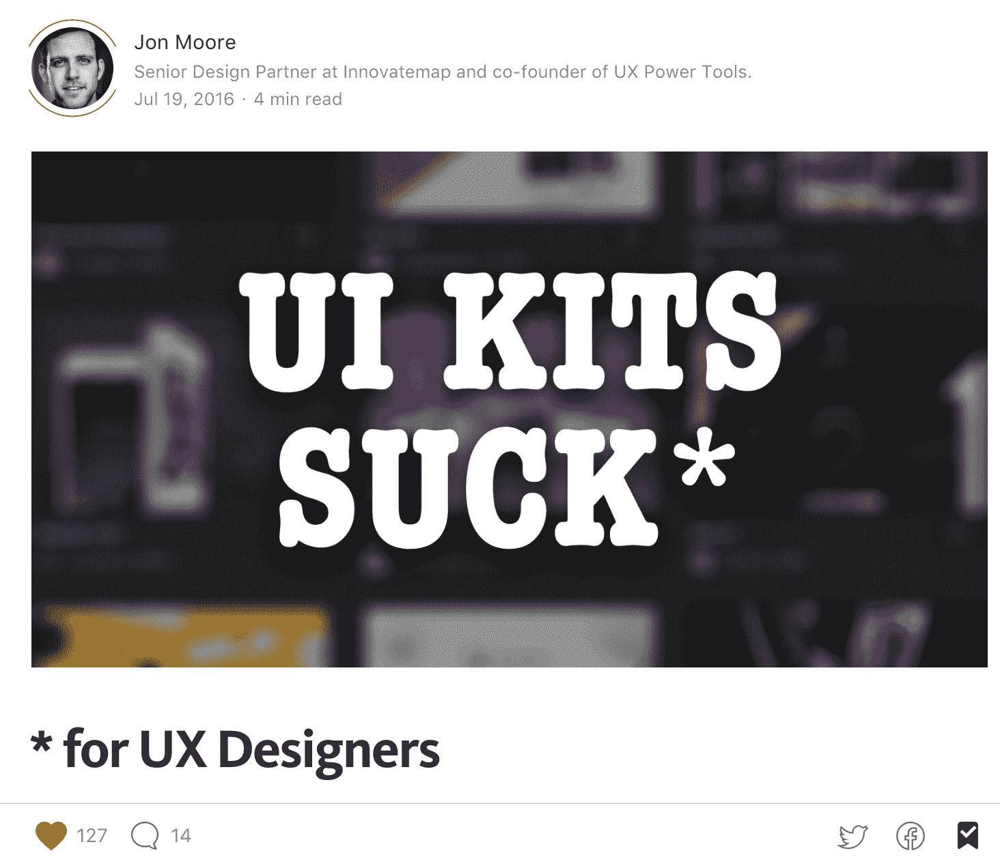
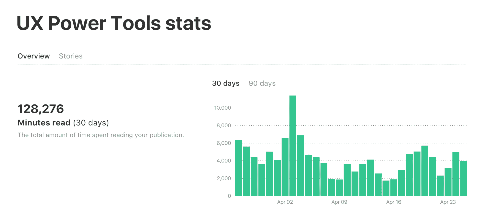
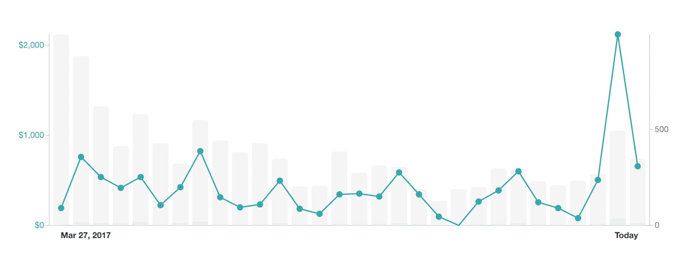

# 结合被动收入梦想，创造一个可行的业务

> 原文：<https://www.indiehackers.com/interview/combining-passive-income-dreams-to-create-a-viable-business-2dc98be806>

克里斯蒂安·贝克

UX 电动工具公司的联合创始人，Innovatemap 公司的首席设计合伙人

我就直截了当地说，创建 [UX 电动工具](https://www.uxpower.tools)最初是出于赚取额外收入的愿望。

在一位家庭成员多次呼吁我投资出租房产后，我开始寻找收入机会，做我实际上知道如何做的事情。设计看起来…嗯…很自然。

今天，我和我的联合创始人乔恩实际上有一个更高的使命，那就是帮助 UX 的设计师更快、更有效地使用设计工具——尤其是草图。事情并不是那样开始的。

在我们作为 UX 设计师为创业和扩大业务服务的日常工作中，我们开发了各种启动新项目的效率。时间是至关重要的，我们合作的许多公司都有严格的时间表来完成融资，建立他们的 MVP(最低可行产品)，并最终推出。

并不是每个伟大的想法都必须受到最终支撑它的使命的启发。

TweetShare

当我们构建这些内部效率时，我们从未想到其他设计师也可能从我们的方法中受益。一旦我们开始认真考虑创造被动的副业收入(而不是更主动的自由职业模式)，我们就开始把我们的技术作为一种销售产品的手段。

*但是等等，我们不是开发者……所以我们怎么卖不是 SaaS 的东西，或者 GitHub 上的东西，或者 React 上的东西，或者<其他热门的新开发者术语>？！*

所以我们像其他人一样求助于谷歌，看看我们*能卖什么。*

**电子书！**

不，没人读这些。(旁注:人们实际上*确实*阅读它们，但我们只是懒得去写它们。稍后将详细介绍。)

UI 套件呢？！我们看着已经非常饱和的 UI 套件市场，意识到为什么我们从来不买它们。UI 工具包是高度程式化的，几乎不可能定制。*天啊，我们找到了我们的使命:*

面向高效、可伸缩和可持续的 UX 设计的 UI 工具包。

你看，UX 设计师在一个关键方面不同于视觉和图形设计师(即通常构建 UI 套件的设计师):我们与开发人员并肩工作，尽管我们可能不愿意承认，但我们已经学到了很多关于效率和规模的知识。因此，尽管 UI 套件看起来很性感，但我们觉得设计者想要更少风格化的东西，更多可伸缩的东西。就像 [Twitter Bootstrap](http://getbootstrap.com) ，但是对于设计师来说。

在完成我们的就职工具包之前，我们在 Medium 上发布了我们的第一篇文章，以开始建立一个读者群。(我们还试着站在星巴克外面用拿铁咖啡交换该套件的演示，但这并没有奏效。就像他们说的，快速失败！)

对内容营销一无所知，我们只是做了我们认为正确的事情，写了一篇煽动性的文章:

 

这让我们有了很多追随者，也有一些憎恨者，这是内容营销的一个很好的开端(这个词我在 9 个月前还从未听说过)。

嘿，还记得我说过我们不想写电子书吗？相反，我们写了大约 1000 分钟的中等长度文章——足够写几本电子书了🙄

以下是我们过去 30 天的统计数据:

这些图表不总是看起来像是在给你竖中指吗？

大峰值出现在文章发布的时候，小峰值出现在文章被其他热门账号分享的时候。如果你看看我们的销售，你会发现类似的趋势:

当我们发布内容或播放内容时，会出现大量峰值。(注意:那个高峰是我们在多个渠道发布的新产品发布。)

这里的要点是，我们的内容直接推动我们的销售。我们在 Twitter 和脸书的广告上到处浪费了一些钱。我们已经建立了附属机构。但是没有什么能像我们的内容那样立竿见影、持续有效。

为什么？见鬼，我不知道。我是设计师，不是营销人员！

但我可以猜一猜。当我们第一次推出产品时，我们知道对我们来说显而易见的是*而不是*对其他人来说显而易见的。我们的设计方式已经变成了第二天性，如果给 10 分钟的时间当面咆哮，任何人听了都会像喝了可乐一样。我们的文章只是成为我们咆哮的数字替代品。

当你销售代表一种新的做事方式的产品或服务时，你必须不断教育和提醒人们。

TweetShare

那么，我们今天在哪里？

我们最近推出了一个移动设计系统，之前 8 个月我们以网络为中心的设计系统取得了长足的进步。我们已经尝试了不同的营销策略，但仍然看到通过媒体的简单内容营销是我们成功的最大贡献者。更好的是，我们的写作风格对我们来说很有趣，所以它从来不觉得是一件苦差事。我们这个圈子的人似乎也很喜欢它。

如果我们不提及收入可能是我们最初的抱负，但它从未驱动我们今天的决定，那将是我们的失职。成功源于个人需要，我们非常乐意与设计界分享我们的知识、最佳实践和效率。我们对教学充满热情，看到各种技能水平的设计师喜欢我们的内容并发现我们的产品非常有用，这令人激动。

我们成功的关键:

*   有思想的原创内容，写的是正常人怎么说话，不是博士生怎么写
*   Laser 专注于我们的关键价值主张:设计效率和可扩展性
*   点对点网站复制([我们的网站](https://www.uxpower.tools/)没什么特别的！)
*   简单明了的打包和定价(在撰写本文时:两个产品，一个包)
*   不断与我们的读者和用户互动
*   快速、诚实、周到的客户支持
*   愿意并渴望创造和分享酷的东西！

可以在 Twitter 关注 [@uxpowertools](https://twitter.com/uxpowertools) ，在下面的评论里随意打个招呼！

——[<picture id="ember8066252" class="user-avatar ember-view user-link__avatar"></picture>乔恩](/jon?id=DfmbkkoGHyZ6uEDjfWZR2ktwSvM2)，UX 电动工具的创造者

## 想像 UX 电动工具公司一样建立自己的企业吗？

你应该加入[独立黑客社区](/)！🤗

我们是几千名创始人，互相帮助建立有利可图的业务和副业。来分享你正在做的事情，并从你的同事那里获得反馈。

还没准备好开始使用你的产品吗？没问题。这个社区是一个认识人、学习和实践的好地方。随意[随便浏览](/)！

——[<picture id="ember8066257" class="user-avatar ember-view user-link__avatar"></picture>考特兰艾伦](/csallen?id=ibTLPyjwVebnZjMGKvz6ztarnuV2)，独立黑客创始人

8votes