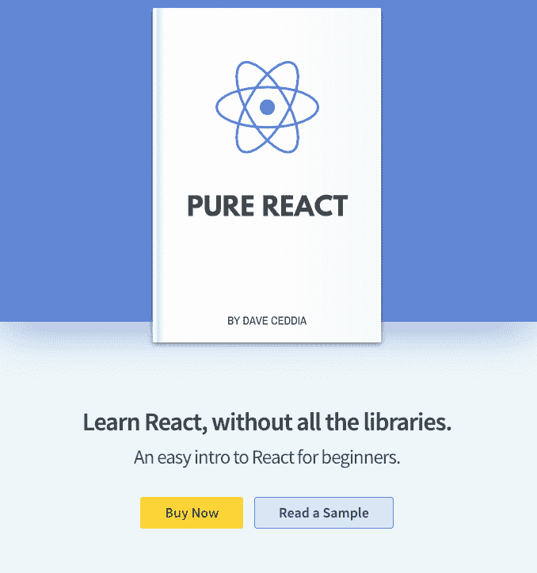
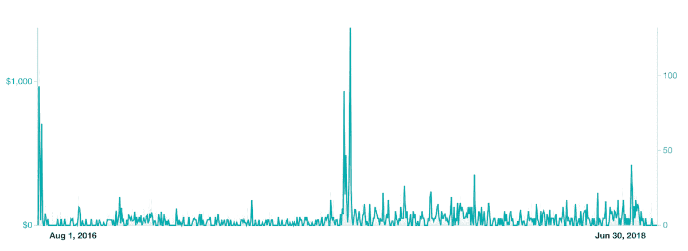

# 对抗我的恐惧，希望早点退休

> 原文：<https://www.indiehackers.com/interview/confronting-my-fears-in-the-hope-of-retiring-early-7b1fbc0821>

## 你好！你的背景是什么，你在做什么？

👋我是戴夫·塞迪亚。我现在是一名博客写手，从 2008 年开始，我一直是一名专业的软件开发人员。我小时候摆弄过电脑，高中时学过编程，并在麻省理工学院洛厄尔分校获得了计算机科学学士和硕士学位...所以，很多电脑，真的。

[纯 React](https://daveceddia.com/pure-react/) 是我写的一本教初学者 React 的书。学习 React 的最大障碍之一是有太多的*内容*倾向于同时教授，所以我的方法是将其剥离到最基本的内容，然后自己教授 React。

今天，这本书每月赚 2000-3000 美元，我可以在 2018 年 4 月全职创作产品。

 

## 是什么促使你开始使用 Pure React？

我从来没有真正喜欢过*工作*。有很多美好的日子。从理论上讲，这很棒，我也很荣幸能有一份软件开发员的工作。但我真正想要的是控制自己的时间。不过，我没有钱直接退出。我最初的计划是提前退休，但是我想我可以用一些额外收入来加快这个速度。

于是 2015 年初，我报名参加了 [30x500](https://30x500.com) 。它给了我一个坚实的整个创业过程的路线图，包括一个他们称之为“销售旅行”的研究过程，以发现人们在努力做什么，以及我可以创造什么来帮助他们。

我开始写 AngularJS，这是我日常工作中使用的 JavaScript 框架，但最终转向写 React(一个竞争框架)。这种转变令人伤脑筋，因为在我转行的时候，我已经建立了一个大约 1700 人的电子邮件列表，我担心他们都会退订。然而，这被证明是一种空洞的恐惧。几乎所有人都留了下来。

于是我有了一个清单，是时候打造一个产品了。一些小的东西，我可以完成和运输很快。Amy Hoy 和 Alex Hillman 是 30x500 的教师，他们坚持认为我们应该选择小的可实现的产品作为我们的第一次尝试。更接近于“电子书”或“指南”，而不是“综合教程”或“SaaS”。

因为我注意到人们在学习 React 的复杂性中挣扎，所以我认为一本教*React 的小书将是解决这种痛苦的方法，也符合我自己的限制——我可以兼职做一些事情，并很快完成。我的项目文件夹塞满了我从未完成的事情，我不希望这种事情发生在书上。*

## 构建最初的产品需要什么？

写这本书从头到尾花了大约两个半月，晚上和周末都在工作。在写这本书之前，我写了销售页，这样我可以收集电子邮件，衡量兴趣，也可以给自己一个各种各样的“清单”。在整个写作过程中，我有几次回头重读销售页面，以确保我没有偏离主题。

我从来没有真正把销售页面看作是一种确认的形式，至少不是说如果我没有达到 X 个订户或者其他什么，我就会取消这本书。从我的研究和不断增长的电子邮件列表中，我知道我正在解决的难题是真实的。

我试着专注于写真正有用的东西。我认为真正的信任是乐于助人的副产品。

TweetShare

从开始写博客到写作和发行这本书，整个过程中我都是全职工作。我尽量避免在服务和产品上花钱，所以开发这本书的成本差不多就是所花的时间。

我用 Markdown 写了这本书，用 pandoc 编译了它，用的是我在某处找到并破解的 LaTeX 模板。我还编写了一些 Ruby 脚本来管理构建。工具，尤其是乳胶，是一个痛苦的权利。我几乎换过几次工具，比如 Gitbook 或 Softcover，但最终似乎用我现有的工具前进更快。

我给自己定了一个期限——我要参加 2016 年 8 月的世界统治峰会，我想在那之前完成并推出这本书。我原本打算推出完整的格式:PDF、ePub 和 MOBI。相反，我最后把它剪成了一个 PDF 文件，还有例子和练习的代码。几个星期后，我把 ePub 和 MOBI 添加到捆绑包中，并作为免费更新发给每个人。

## 你是如何吸引顾客并增加 Pure React 的销量的？

我的电子邮件列表是我最初客户的主要来源。发布邮件发送给了 2489 人。我通过坚持写博客(每一两个星期)和与我的列表分享那些博客帖子，以及在像脸书、Reddit 和一些 JS 社区新闻聚合器这样的地方，建立了这种关系。

我的核心策略是写有益的、有教育意义的、可操作的文章。有时候，我认为人们把“建立信任”视为一种策略，并带着一种心态去做，他们试图找出如何获得最大程度的信任，或者如何让人们信任他们。我没有像那样接近它。我试着专注于写真正有用的东西。我认为真正的信任是乐于助人的副产品。

随着时间的推移，博客的有机搜索流量增加了。我没有做过多少有意的 SEO，但大多数帖子都是围绕我在论坛、Twitter 或其他地方看到的问题或痛点而写的。我想我已经获得了一些自然的 SEO，只是通过写一些人们想知道的东西，并使用他们使用的词语。

| 月 | 唯一访客 |
| --- | --- |
| 18 年 9 月 | 116276 |
| 18 年 10 月 | 140210 |
| 18 年 11 月 | 128283 |
| 2018 年 12 月 | 112333 |
| 19 年 1 月 | 130521 |

## 你的商业模式是什么，你是如何增加收入的？

我直接在我的网站上销售这本书，使用 SendOwl。我也通过亚马逊销售，尽管我在那里的销量不多。

当我第一次推出这本书时，我有三个层次——35 美元的书，45 美元的完整包(书和代码), 225 美元的团队许可证。大多数人，大概 70%左右，买了全套。几乎没人买过团队套餐。我想我已经卖了三次了。

原来这本书叫*学*纯反应过来的。这个标题感觉有点笨拙，我注意到有些人把它缩短为“学习反应”或“纯粹反应”，所以我在推特上[做了一个民意调查，纯粹反应赢了。](https://twitter.com/dceddia/status/876116947234164736)

2017 年 7 月，我更新了这本书，给它重新命名，并重新推出，同时重写了销售页面。

销售页面的重写对我的月销售额产生了很大的影响。你可以在图表中看到。中间的大峰值是 2017 年 7 月的重新发布，但发布后的所有小峰值都高于之前的峰值。

 

我认为重写更有效，因为那时我已经在观众中沉浸了一年，所以我更适应痛苦，副本出来得更好。另外，我参加了一个 UI 设计的课程，重新设计的界面看起来更好。

有一段时间，我尝试了更低的价格 19 美元/39 美元。当我在 2017 年重新推出这本书时，我在发布周结束时将价格提高到 29 美元/49 美元，这就是今天的价格。我把团队许可证换成了“联系我”链接，因为很少有人购买。

2018 年年中，我创建了一个为期 5 天的免费电子邮件课程，教授 React 的基础知识，然后以折扣价为这本书进行推介。我的转化率大约是 5%。我没有跟踪人们是在参加课程之前还是之后购买，所以这个数字并不一定表明有多少人是在参加了课程之后购买的，但我对这两种方式都很满意。

如今它是自动化的，但在推出电子邮件课程后的前六个月，折扣代码是硬编码的。不过，我不想只是用一个永久的代码“伪装”它。因此，每个周日我都会创建一个新邮箱并更新邮件，我会将订阅者按周分组，然后在每周一发送邮件。

在服务方面，我试图保持业务的精简。我的经常性开支是:

*   使用 ConvertKit 进行电子邮件营销(149 美元/月)
*   使用 Clicky 进行分析(10 美元/月)
*   带板凳的会计(约 85 美元/月，按年支付)
*   用 SendOwl 结账和送货(15 美元)
*   Netlify 托管(免费)

我注意到我的收入在年初会下降。并不是说我在这方面有很多数据点，但当它第一次发生时，在 2018 年初，我吓坏了。我第一个月的收入就超过了 2000 美元，然后一月份来了，大约是 800 美元，我想知道我是不是完了。但结果还不错。几个月后，收入又回升了。2019 年似乎也在遵循同样的模式。

| 月 | 收入 |
| --- | --- |
| 18 年 9 月 | 3333 |
| 18 年 10 月 | 2761 |
| 18 年 11 月 | 2763 |
| 2018 年 12 月 | 2369 |
| 19 年 1 月 | 1953 |

## 你未来的目标是什么？

我现在的首要目标是能够继续做我正在做的事情，为自己工作。为此，我需要将收入增长到更可观的水平，创造更多的产品似乎是一条很好的前进道路。我不知道我第一次听到这个想法是在哪里，但“做更多有用的事情”本质上是我的中期计划。

去年我签约成为了 egghead.io 的一名讲师，12 月我在那里发布了我的第一个 T2 课程。有另一个收入来源很有帮助，egghead 对他们的导师非常好。

我最近刚刚推出了第二个产品，[Pure Redux](https://daveceddia.com/pure-redux/)——这次是一个视频课程，帮助人们在 React 上迈出下一步，构建更复杂的应用程序。我还计划再次更新我的书，以纳入 React 的最新变化，并在更新后重新推出。

我想，如果我有三到四款价格在 49 美元到 299 美元之间的产品，能像我的书一样持续销售，那将是相当可持续的。所以我 2019 年的计划是创作更多的书籍和课程。我也对尝试其他形式感兴趣，比如研讨会和辅导。

一个潜在的障碍是 JavaScript 生态系统是不稳定的，而且*很容易发生变化。我确实认为 React 现在有一个稳固的位置，但如果最终没有其他东西出现，我会感到惊讶。如果生态系统发生变化，我希望能够随之变化，或者缩小范围，专注于教授 JavaScript、软件工程或其他相关学科。我喜欢教书，也很高兴在可预见的未来继续这样做。*

## 你面临的最大挑战和克服的障碍是什么？如果你必须重新开始，你会做什么不同的事？

我的大部分挑战都是自我强加的。比如让自己分心，浪费时间浏览社交媒体。或者变得懒惰，连续 6 周不发表文章，让罪恶感不断累积。或者担心我的价格太高——毕竟，你可以花 10 美元找到 35 小时的综合课程，那么我为什么要为一本电子书收取 49 美元呢？

我遇到的第一个挑战是，我需要创建*独特的*内容。如果有人写了一篇与我想写的文章相似的文章，或者已经有了与我相似的产品，我不应该“重新发明轮子”

我克服了恐惧，还是点击了发布。起初，恐惧并没有真正消失，但当我注意到没有任何不好的事情发生时，恐惧变得温和了一些。我记不清有多少次我发表了一篇看起来*如此基础*的文章，但随后从人们那里得到了很大的反馈，这很有帮助。久而久之，我想，我通过一遍又一遍的发表证明了自己是错的。

人们重视简洁和专注...专注可以是一种美德。

TweetShare

注意力分散仍然是一个棘手的对手。我发现苹果电脑上的[聚焦应用](https://heyfocus.com)很有帮助，但它仍然是一个难题。

关于定价，我开始意识到有些人重视简洁和专注。一本专注于教好一件事的书可以卖到 49 美元，并创造快乐的顾客，即使存在一门 10 美元的课程，涵盖数十个小时的无数主题。长度不一定等于价值。有一些人告诉我，他们经历了一个漫长的过程，离开时感到困惑，然后终于在阅读我的书时有了反应。专注可以是一种美德。

如果我必须从头再来一遍，我想我会推出一个更小的产品，并且更快地推出。只是为了得到一些东西，并向自己证明我可以创造一些人们会付钱的东西。

## 有没有发现什么特别有帮助或者有优势的？

有几个资源在我脑海中很突出。阅读蒂姆·费里斯的《每周 4 小时工作制》让我萌生了自己创业的想法。在那之后，在加入 30x500 之前，我跌跌撞撞地经历了几门课程、失败的项目和紧张的求职。我可以非常自信地说，如果没有艾米、亚历克斯和 30x500，我现在就不会有一个成功的企业。我欠他们很多。

事后看来，我认为我从 Angular 到 React 的选择是一个很好的选择。当我这样做的时候，做出这样的改变绝对是有一点运气的。我当时对 Angular 的发展方向也不是很兴奋，我认为强迫自己继续下去会让我更有可能放弃。

参加会议也很棒。去过几次[世界统治峰会](https://worlddominationsummit.com/)，[工艺+商业](https://conference.convertkit.com/)， [MicroConf](https://www.microconf.com/) 。我的社交圈里没有太多的企业家，在现实生活中，能够与做同样事情的其他人见面并建立联系，只会让一切变得更加有形。我天生内向，但我发现参加这些会议的人非常热情。

## 对于刚刚起步的独立黑客，你有什么建议？

我认为“建造它，他们就会来”是一个谎言，但是一个很多人接受为事实的谎言。我们听说过这样的故事，一个人辛苦工作多年，然后“有一天他们变得很大。”

很多建议只是“创造伟大的东西”，“坚持做三年”，“总有一天有人会注意到你。”我曾经认为这就是它的工作方式；我不再相信了。我认为这个公式缺少两个要素:“好东西”需要对某人有用(基于研究),你必须以某种方式分享它(不仅仅是每月有三个访问者的博客)。

挖一个 SaaS 形状的洞，然后去寻找合适的客户是落后的。相反，研究你的客户，了解他们的痛点，并为他们制造他们已经想要的东西。

TweetShare

在这些方面，格言“你不是你的客户”是一个很好的牢记在心。“挠自己的痒”是一个流行的策略，但不是一个可重复的策略。挖一个 SaaS 形状的洞，然后去寻找合适的客户是落后的。相反，研究你的客户，了解他们的痛点，并为他们制造他们已经想要的东西。

我已经提到了 30x500，他们的[堆砌砖块](https://stackingthebricks.com/)博客也很棒。我也强烈推荐 Kathy Sierra 的书 [Badass:让用户变得很棒](https://www.amazon.com/Badass-Making-Awesome-Kathy-Sierra/dp/1491919019)——这是关于如何设计你的产品，让你的*用户*变得更好，反过来，他们会喜欢并分享你的产品，因为他们变得很棒。

哦，还有一件事！努力尝试*避免构建自己的软件。如果你像我一样是一名软件开发人员，你可能喜欢为自己的问题构建解决方案。再加上节俭的天赋，每当我想到构建自己的课件、CMS 或电子邮件营销平台时，我都会点燃热情。会有多难，对吧？另外，这也是一种有趣的消遣，可以让你从写博客文章中转移注意力。不过，这是个陷阱。使用现成的解决方案。可以的话找个免费的！但是如果你不得不付钱的话。(我认为这个范围的另一端，也就是所谓的“SaaS 热”也不太好，在这种情况下，你每月在服务上花费数百美元。如果你不赚钱，就不要花钱；然后，只在你认为合理的时候花钱。*

## 我们可以去哪里了解更多？

你可以在 daveceddia.com[和我的推特](https://daveceddia.com/) [@dceddia](https://twitter.com/dceddia) 找到我的文章。我写的书是[纯反应](https://daveceddia.com/pure-react/)新课程是[纯还原](https://daveceddia.com/pure-redux/)。

——[<picture id="ember8117820" class="user-avatar ember-view user-link__avatar"></picture>戴夫·塞德迪亚](/dceddia?id=eRKOjkaRzGca9noL7UKeLw8Z43J2)，纯粹的创始人反应

## 想像 Pure React 一样建立自己的事业？

你应该加入独立黑客社区！🤗

我们是几千名创始人，互相帮助建立有利可图的业务和副业。来分享你正在做的事情，并从你的同事那里获得反馈。

还没准备好开始使用你的产品吗？没问题。这个社区是一个认识人、学习和实践的好地方。随意[随便浏览](/)！

——[<picture id="ember8117825" class="user-avatar ember-view user-link__avatar"></picture>柯特兰艾伦](/csallen?id=ibTLPyjwVebnZjMGKvz6ztarnuV2)，独立黑客创始人

50votes