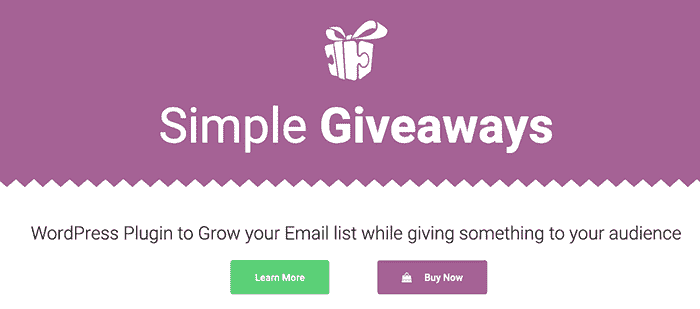
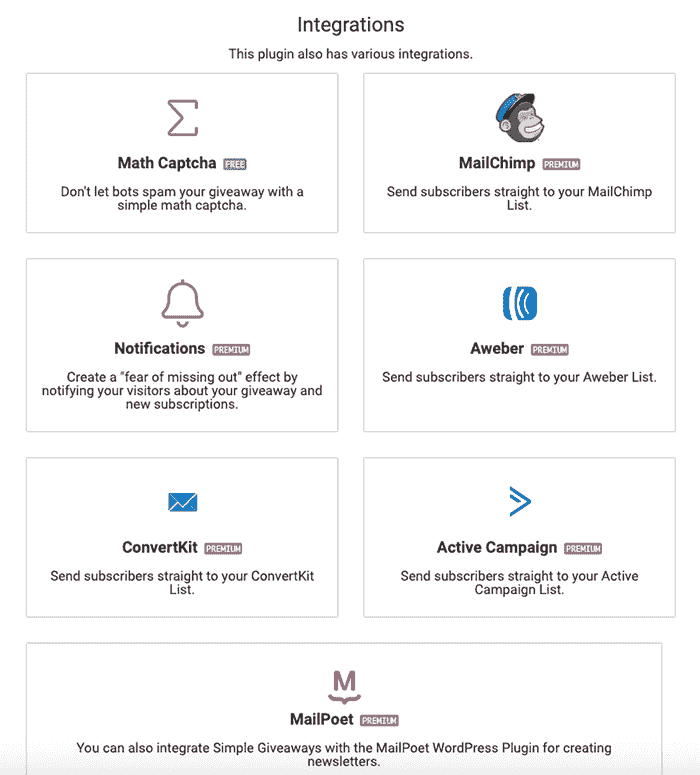
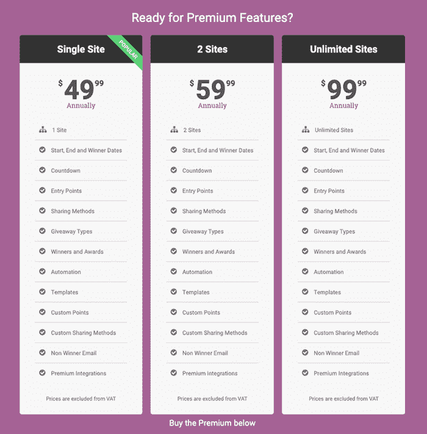

# 将我的 WordPress 解决方案转换成 500 美元/月的兼职项目

> 原文：<https://www.indiehackers.com/interview/converting-my-wordpress-solution-into-a-500-month-side-project-ed3bc95c07>

## 你好！你的背景是什么，你在做什么？

嗨！我叫伊戈尔·贝尼奇。我的背景是海事电子和信息技术。我在大学学习的时候开始学习编程。我从网页设计、HTML 和 CSS 开始，然后转向 PHP 和 MySQL。当我发现 WordPress 的时候，我立刻爱上了它。

在我大学的最后一年，我找到了一份与微软技术合作的工作，比如 ASP.NET 和 C#。这段时间我开始了我的前两个网站。其中一个专注于用克罗地亚语教授 web 开发，现在已经不存在了。我的另一个网站，[https://ibenic.com](https://ibenic.com/)，今天还在运行。我教授自己在从事各种项目时学到的技能。

[简单的赠品](https://wordpress.org/plugins/giveasap/)是我第一次“认真”的尝试。这是一个非常简单的产品，它收集电子邮件地址，然后使用一种算法来选择赠品的获胜者，同时建立一个可靠的订户列表。它被许多不同的行业使用。

 

简单的赠品仍然是一项副业，增长缓慢，因此收入会有波动，但进步是显而易见的。以下是收入增长数字(基于我使用的支付和许可服务的分析):

| 年 | 收入 |
| --- | --- |
| '16 | 0 |
| '17 | 1840 |
| '18 | 4145 |
| '19 | 3401 |

## 是什么促使你开始做简单的赠品？

我开始写博客是为了教育其他人 WordPress 和 web 开发，我读了很多关于如何增加流量、增加受众以及免费赠品的文章。一些文章建议像 KingSumo 赠品这样的产品，但是当时我买不起 99 美元的产品。

因为我已经是一名开发人员了，所以我想，“为什么我不建一个呢？不会那么难的”。我想，这就是一切开始的原因，这要感谢我当时的经济状况。:)

我从未想过这个插件可以赚钱，主要是因为我是为自己开发的。最初我想开始创建和销售 WordPress 主题的生意(我称之为 ThemeASAP ),在实现这个想法的同时，我开始构建能够增强这些主题的插件。当时我把简单的赠品命名为赠品 SAP。

## 构建最初的产品需要什么？

最初的产品非常简单。它只有几个特点——一个记录电子邮件和分享赠品的表格。它只包含一个模板。

我不记得我花了多少时间来建造它，但因为我的全职工作，它至少是一个月左右。我记得上班的时候很安静就在弄。我主要使用 HTML、PHP 和 CSS，以及 jQuery datepicker。

一旦它准备好了，只有在我亲自测试之后，我很好奇是否能从中赚钱。我又创建了四个模板和一个自动分发的选项，这样就可以自动选出获胜者。

在 Codester.com 上首次发布四个月后，我发布了一个高级版本。

## 你是如何吸引用户并开发简单的赠品的？

我决定把我的插件添加到官方的 WordPress 插件库中，那里是我大部分流量的来源。当一个人搜索赠品解决方案时，我的插件是最先出现的。

吸引新用户的方法有很多，但通常都需要预算，因为我没有预算，所以我选择了免费和低成本的方法:

*   [一篇描述如何使用插件的文章](https://www.ibenic.com/host-giveaway-wordpress/)
*   在我自己的网站上运行赠品并使用简单的赠品
*   [一个关于 WordPress 插件的播客](https://wppluginsatoz.com/)，我提供了一个高级许可
*   在[勇士论坛](https://www.warriorforum.com/)购买列表
*   脸书广告
*   Twitter(在 AnarielDesign.com 的人们发了关于我的插件的 Twitter 之后，我看到安装量增加了)
*   我还接受了[插件经济](https://theplugineconomy.com/simple-giveaways-interview-igor-benic/)的采访
*   我[以课程的形式制作了免费视频](https://practicalwp.teachable.com/p/grow-your-e-mail-list-with-simple-giveaways)来提供文档和社交媒体模板

就成本而言，脸书的广告还不错，因为我能够设定一个固定的预算，哪怕只是一两天。我开展了 5 美元的活动，结果转化率很低，只有 18 次点击，但印象深刻得多；所以(尽管它是不可测量的)人们即使没有点击也了解了这个产品。

[战士论坛](https://www.warriorforum.com/)也没有很好的回报，但我至少拿回了我的投资。我写了一篇关于如何和为什么使用这个插件的帖子，并提供了 50%的折扣，这确实让我多了一些销售额。

我的大部分流量最终来自口碑、Twitter 和 WordPress 插件库。我还没有创建一个可靠的营销策略，因为它没有太多的营销就自己成长了。

我最近实施了谷歌分析，开始准确跟踪人们来自哪里。我还从博客作者那里购买了内容写作服务，这将有助于通过搜索引擎优化增加流量。

我的建议是每个月写一篇文章来提高你网站的搜索引擎优化，把你自己(和你的产品)定位为你所在领域的专家。

 

## 你的商业模式是什么，你是如何增加收入的？

当我开始使用电子商务平台 [Freemius](https://freemius.com/) 销售我的插件时，我就开始赚钱了。它提供了关于我的客户和安装的数据。在 Freemius 之前，我尝试过 Codester.com，但运气不佳。

我开始对每个许可证的终身使用收取 49 美元。我觉得我当时没有太多的机会获得金苏莫的赠品；营销人员总是推荐它们作为 WordPress 赠品插件。由于他们的许可证是终身 99 美元，我认为收取更少的费用会给我带来竞争优势。

今天我回想起来，觉得那是一次彻底的失败(但我想我不得不吸取教训)。2017 年底，我修改了我的商业模式。我将终身价格提高到 89 美元，并引入了 49 美元的年度许可。大约在 2018 年年中，我再次提高了终身价格。

我害怕收取年度许可费和提高终身访问的价格，所以我最终等到我改进了几个功能并添加了新的集成。我创建了一个集成页面，其中列出了高级和免费集成。

高级集成有一个内置的“升级”按钮，可将客户带到价格表。由于客户仍然在自己网站的管理区域内，他们不需要创建帐户或浏览插件网站来升级。

我的业务模式现在侧重于不同层级的年度订阅:

*   一个网站:每年 49 美元，终身 149 美元
*   两个网站:年费 59 美元，终身 179 美元
*   无限的网站-每年 99 美元，终身 189 美元

Freemius 服务允许通过 PayPal 或 Stripe 处理支付，因此我不必考虑部署、支付(和增值税)或用户管理。

 

以下是 2019 年的订阅明细:

*   一月:92%年息，8%寿命
*   二月:年化 78%，终身化 22%
*   三月:100%年率
*   4 月:83%的年增长率，17%的寿命
*   五月:72%年化，28%终身化

我认为在推出一个产品之前，制定一个关注月收入和年收入的计划是很重要的。如果你选择提供终身计划，只要记住你总是要寻找新的客户。准备好退款，因为他们会发生。建立退款政策和清晰的购买流程。

我明白了，创业真的要有耐心。除非你向人们展示你的产品，否则他们不会知道或理解你的产品。

TweetShare

## 你未来的目标是什么？

我对简单的赠品有很多目标，包括商业和功能方面的。

我想实现一个功能，允许每个订户额外的条目。一些额外的条目可以通过登录脸书或推特，评论一篇博客文章，阅读一篇文章等方式获得。

我还想看到更多网站上使用的简单赠品。目前，免费版本已经有 1000 多个活跃安装。既然没有办法知道*确切的*数，我想推高到至少 2000。

Freemius 统计显示，该插件的高级版本在 4000 多个网站上使用，但我希望看到它在 6000 个网站上使用。

为了提高这些数字，我计划为我的网站写更多的 SEO 内容，解释如何使用这些功能。我已经聘请了一名作家，我希望这将增加流量和转换(无论是免费或收费)。

在收入方面，我想开始带来至少每月 1000 美元。一旦我达到每月 1000 美元，下一个里程碑将是 1500 美元到 2000 美元。达到这个数字可以让我花更少的时间在客户工作上，把更多的精力放在简单的赠品上，最终把它变成一份全职工作。

最大的挑战是弄清楚如何处理客户支持，同时保持每月发布的稳定的新功能流，同时做全职工作来支付我的账单。

我看到其他人为 WordPress 创建他们自己的免费插件，这可能会减慢我的目标的进度。这也可能是一件积极的事情，因为利基市场正在增长。

## 你面临的最大挑战和克服的障碍是什么？如果你必须重新开始，你会做什么不同的事？

最大的挑战之一是获得牵引力。达到前 100 个以上的活跃安装真的很难，但自从我达到这个数字后，增长缓慢但稳定。

我花了很长时间才接触到第一批 100 个用户，因为我没有专门的插件网站。如果让我重新来过，我一定会马上建好网站，多写点内容。

另一个错误是低成本的终身许可。如果我当初以更高的价格提供年度许可证，我今天就会有更高的 MRR。

我明白了，在创业或开发产品时，你真的必须要有耐心。除非你向人们展示你的产品，否则他们不会知道或理解你的产品。建立牵引力需要一些时间，但一旦建立了牵引力，继续定期改进以保持增长是很重要的。

一定要在你的产品名称上花些心思。简单赠品最初被命名为 GiveASAP，对潜在用户的描述性不够。如果我的产品从一开始就被命名为简单赠品，我可能会更快地接触到前 100 名活跃用户。

选择一个好的产品名称。想的朗朗上口，描述性强。确保你对此感到满意，不要操之过急。

TweetShare

## 有没有发现什么特别有帮助或者有优势的？

我总是发现播客采访制造产品的人是有益的。它们帮助我保持雄心勃勃，并提醒我，在业务增长的斗争中，我并不孤单。

我觉得有用的一些播客是*[马特报告](https://mattreport.com/)**[建立你的 SaaS](https://saas.transistor.fm/)**[WPMRR WordPress 播客](https://wpmrr.com/podcast/)* 和 *[独立黑客](https://www.indiehackers.com/podcast)* 。

我也喜欢看文章，所以独立黑客访谈是黄金。:)Freemius，我用来经营插件业务的服务，有一个博客，里面有很棒的商业相关文章。他们专注于 WordPress 业务、插件市场和插件营销最佳实践。

Freemius 也帮我做了品牌推广；他们为简单的赠品设计了我的标志和封面图片。

最近我开始使用 Audible，现在正在听一些营销/商业书籍。我推荐阅读(或听) *[这是营销](https://www.amazon.com/This-Marketing-Cant-Until-Learn/dp/0525540830)* 和 *[合一的](https://www.amazon.com/Company-One-Staying-Small-Business/dp/1328972356)* 公司。如果你是唯一一个致力于推出产品或业务的人，后者尤其有用。

与类似行业的其他人交流对我帮助很大。我是另一家插件公司的承包商，可以随时寻求建议，尤其是关于营销和销售方面的建议。WordPress 社区也很高兴听到其他人关于他们进步的消息。

## 对于刚刚起步的独立黑客，你有什么建议？

如果你刚刚开始，不要放弃。这才是最重要的。你的事业可能需要一年甚至更长的时间才能支撑你成为一份全职工作。我的产品现在已经快三年了，它仍然是一个副业。

从一开始就开始营销。创建一个网站，致力于你的产品/业务，并针对你的利基市场。创作视频，写文章，吸引合适的受众。

构建你的最小可行产品，这样你就有了客户可以开始使用的东西，并且可以通过持续的反馈来改进。

开始头脑风暴业务目标；写下你的里程碑，并专注于完成它们。

再次，选择一个好的产品名称！想的朗朗上口，描述性强。确保你对此感到满意，不要操之过急。

## 我们可以去哪里了解更多？

访问[简单赠品](http://wpsimplegiveaways.com/)网站，在 Twitter 上关注我们[@ WP 赠品](https://twitter.com/wpgiveaways)。我刚刚开始实施我的新营销策略，所以你可以从一开始就跟踪进展。:)

如果你有兴趣了解更多关于我的其他项目和我的工作(或教学)，你可以看看我的博客[ibenic.com](https://www.ibenic.com/)并在 Twitter 上关注我 [@igorbenic](https://twitter.com/igorbenic) 。

如果您对简单的赠品有任何疑问，或者您有任何想要分享的经验，请在下面的评论中告诉我！:)

——[<picture id="ember5267002" class="user-avatar ember-view user-link__avatar"></picture>伊戈尔贝尼奇](/igorbenic?id=vKaZBxkCFnPoq2IjCP9T3YZA9573)，简单揭秘的创始人

## 想像简单的赠品一样建立自己的事业吗？

你应该加入独立黑客社区！🤗

我们是几千名创始人，互相帮助建立有利可图的业务和副业。来分享你正在做的事情，并从你的同事那里获得反馈。

还没准备好开始使用你的产品吗？没问题。这个社区是一个认识人、学习和实践的好地方。随意[随便浏览](/)！

——[<picture id="ember5267007" class="user-avatar ember-view user-link__avatar"></picture>柯特兰艾伦](/csallen?id=ibTLPyjwVebnZjMGKvz6ztarnuV2)，独立黑客创始人

19votes