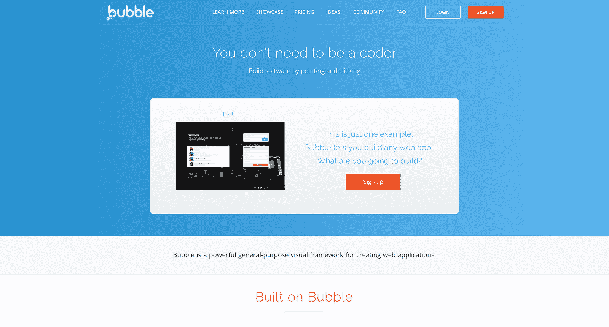

# 创建每月 10 万美元的业务，帮助人们学习编码

> 原文：<https://www.indiehackers.com/interview/creating-a-100-000-mo-business-that-helps-people-learn-to-code-c5e87bdbf9>

## 你好！你的背景是什么，你在做什么？

你好！我是艾曼纽，[泡泡](https://bubble.is)的联合创始人。Bubble 是一个可视化编程工具，让人们完全可视化地构建 web 应用程序，而不是编写代码。

可以构建的应用程序可以有一个自定义数据库的后端，连接到任何类型的 API，使用社区构建的插件，等等。一旦一个应用程序建立起来，Bubble 就会自动在幕后处理所有的技术基础设施。总之，任何人现在都可以创建、部署和运行一个基于网络的软件，而无需技术培训。

我原籍法国，在接触技术之前工作了几年。我在去中国做几年管理顾问之前，在法国学过数学。我来到美国读商学院，通过共同的朋友认识了乔希·哈斯。几个月前，他创办了一家公司(当时还不叫 Bubble)，并在寻找联合创始人。我们第一次喝咖啡后就决定合作了！

5 年后——相当令人惊讶，因为我们只有*一家*咖啡——Bubble 拥有超过 10 万名用户，一个 6 人团队(以及[招聘](https://bubble.is/jobs)！)并且仍然是完全自举的。我们目前每月收入约 10 万美元。

 

## 是什么促使你开始使用 Bubble？

乔希通过两个主要因素的结合产生了这个想法:

*   他在纽约，每个人，实际上是每个人，都邀请他成为他们的科技联合创始人来创业。
*   他曾在一家公司工作时使用过 SharePoint，并创造了一些非技术员工可以用来构建定制软件的东西。看着他们构建东西对他来说是非常有益的，他觉得他可以在更大规模的通用编程中这样做。

我们从一开始就相当有信心，如果我们有合适的产品，实际上可以不用代码编程，它会大卖！所以我们并没有真正尝试去验证这个想法或概念，而是马上开始制造产品。

随着技术成本的下降，自举变得越来越容易。

TweetShare

不过，我们确实得到了第一批客户的早期确认。在那个时候，这个产品真的没有太多的功能，而且相当的糟糕和缓慢，然而我们仍然有少数人为它付费。我们只是他们创业的唯一解决方案。

在财务上，我们从一开始就决定不融资，因为我们觉得产品开发周期对于传统的风险投资路线来说太长了。(我们在这个帖子中写了这个[。)我和乔希都有足够的前几份工作的积蓄，可以在纽约生活两年多(过着简单的生活……)，直到两年半后，我们才开始给自己发工资。](https://blog.bubble.is/on-not-raising-money-c5ffe0436944)

## 构建最初的产品需要什么？

一切都是我们自己做的。这需要多次迭代，我们的早期用户非常投入，我们每天至少会在 Skype 上与他们交谈一次。六个月后，我们建立了我们的 MVP(也是一个相当复杂的 MVP，因为像 [Bubble](https://bubble.is) 这样的产品的 MVP 必须允许用户建立他们自己的 MVP)。2012 年 12 月，我们从一位用户那里获得了第一笔付款。

起初，我们的服务器成本相当低，除此之外，我们只支付办公室费用，因为我们靠自己的积蓄生活。

就范围而言，我们决定一开始只专注于网络作为我们的主要平台。(很多人告诉我们应该从原生应用开始。)这主要是一个固执己见、凭直觉做出的决定，但回想起来，事实证明效果不错。

这是该产品的早期版本:

[https://player.vimeo.com/video/53130283](https://player.vimeo.com/video/53130283)

这是它目前的样子:

[https://player.vimeo.com/video/118643315](https://player.vimeo.com/video/118643315)

它已经发展了很多，但基本原理是相当相似的。:)

## 你是如何吸引用户并增长泡沫的？

我们开始在纽约的技术聚会上“招募”用户。在创业浪潮中，每个人都在寻找技术联合创始人，有很多联合创始人约会聚会。

我们去那里告诉人们，虽然我们不能成为他们的技术联合创始人，但他们可以使用 [Bubble](https://bubble.is) ，因为这将允许他们自己建立整个事情。我们有一些怀疑的回应，但是有几个团队决定尝试一下，他们和我们一起坚持了一年多！

第二年(2013 年)，我们在我刚刚毕业的哈佛商学院进行了试点。他们的第一年创业课程要求学生在非常紧张的预算下建立一些东西，Bubble 是一个很好的解决方案。它让我们有了更多的用户，其中一些人现在使用 Bubble 来[专业地为企业开发应用](https://airdev.co)！

接下来的几个月非常以产品为中心，没有太多的营销活动。虽然我们确实发布了一些内容，作为解释我们使命的一种方式，但尽管一些帖子做得很好(例如[你不应该学习如何编码](https://blog.bubble.is/you-shouldn-t-have-to-learn-how-to-code-96adc7d7c23d))，它们并没有转化为 Bubble 的用户。产品还没有准备好。

然后，2015 年 10 月，我们在 [ProductHunt](https://www.producthunt.com/tech/bubble-3) 上公开推出。它超出了我们的想象:我们在两周内获得了 3000 多名用户，两年后的今天，每天仍有大量的流量来自 PH。就 upvotes 而言，我认为我们一直处于前 30 名，投票还在继续。

我们是怎么做到的？我们[写到这里](https://blog.bubble.is/how-our-bootstrapped-startup-got-more-than-3-000-new-users-with-producthunt-161cf0686c84)。但老实说，最主要的是我们等了足够长的时间，才推出了人们真正喜欢的产品。

从那时起，我们的大部分增长都是由口碑和搜索引擎优化推动的。我们的[论坛](https://forum.bubble.is/)非常活跃，每天都创造大量内容，这些内容被谷歌索引得非常好。今天我们论坛 70%以上的流量来自 Google，而不是 Bubble！这是我们论坛/社区策略的一个意想不到但又奇妙的结果。

我对有抱负的企业家的建议是:尽管你应该立即走向市场以获得早期用户，但在推销自己并试图引人注目之前，尽可能地等待。大多数人这样做得太早了。

今天，我们开始着眼于扩大 Bubble 的足迹，并成为 web 应用程序开发的标准。我们仍在研究如何做到这一点，但希望你们很快会听到更多人谈论 Bubble。

## 你的商业模式是什么，你是如何增加收入的？

[泡泡](https://bubble.is)的商业模式相当传统。这是一个 SaaS(实际上，这是一个 PaaS——平台即服务),我们按月收取一些功能的费用，并在用户的应用启动时额外提供增加一些容量的能力。

我们也有一个市场，用户可以建立模板或插件，并获得补偿。在目前的型号之前，我们有一些不同的型号，但它们对我们的用户来说并不清楚。我们开始按用户访问量收费，然后按工作流运行收费，但我们从用户那里了解到，服务器容量是最好的销售资源。

你建立一个系统，认为你很了解它，然后你认识到新的东西，你重构。

TweetShare

由于市场组件，我们的定价相当高，Stripe 在这方面非常方便。但我们收到的第一笔付款是在我们将 Stripe 作为插件添加到 Bubble 之前(因为 Bubble 是建立在 Bubble 之上的！)，所以就以支票的形式来了！我们拍了张照片，然后兑现了。

这是我们这些年来的收入情况。

| 年 | 平均月收入 |
| --- | --- |
| 2014 | 800 |
| 2015 | 1900 |
| 2016 | 22000 |
| 2017 | 75000 |

这些数据不包括企业合同

## 你未来的目标是什么？

我们目前正处于扩张模式。

我们希望[泡泡](https://bubble.is)成为编程和构建软件的标准。当人们需要构建一些东西时，我们希望他们首先去 Bubble，然后，如果这似乎不是正确的解决方案，就考虑如何通过插件来扩展平台以构建他们的产品。我们知道这是一个雄心勃勃的目标，我们正在大力招聘以实现这一目标。

为了实现这一目标，我们需要工程力量来确保一切都在规模上运行良好，我们需要开发原生应用，我们还需要优秀的营销人员和社区经理来培育我们的社区，让它在保持原有精神不变的情况下发展壮大。

我们实际上已经公开了我们的技术路线图，你可以在这里看到。

## 如果你必须重新开始，你会做什么不同的事？

我们确实做出了一些糟糕的技术决定，但我不确定它们是否是“错误”。它们更像是必要的步骤。你建立一个系统，认为你很了解它，然后你认识到新的东西，你重构。

如果我们要做一些不同的事情，我们可能会更早开始招聘。我们等着经济实力足够雄厚的时候再一次雇佣两个人，但我们本可以在六个月前就开始招聘。

## 对于刚刚起步的独立黑客，你有什么建议？

我不能说 bootstrapping 对每个企业和初创公司都有效，但如果你能在头一两年负担得起，我认为这是一种很好的方式来建立一些真实的东西，学习如何早期赚钱，并开始扩大规模。

随着技术成本的下降，泡沫也有所帮助！)，自举变得越来越容易。

如果你能负担得起第一年或第二年的 bootstrap，我认为这是一个构建真实事物的绝妙方法。

TweetShare

此外，我要再说一遍:在努力变得引人注目之前，尽可能地等待。等到你知道你会充分利用这个机会。

## 我们可以去哪里了解更多？

请随意联系—我喜欢谈论这些事情:)。

*   泡泡:[泡泡.是](https://bubble.is)
*   我们的博客: [blog.bubble.is](https://blog.bubble.is)
*   我们的论坛: [forum.bubble.is](https://forum.bubble.is) (我们在那里超级活跃)
*   推特:[twitter.com/estraschnov](https://twitter.com/estraschnov)

请随意询问任何关于产品开发、社区开发、bootstrapping 甚至政治的问题！

——[<picture id="ember5265889" class="user-avatar ember-view user-link__avatar"></picture>艾曼纽](/estraschnov?id=wo2QqEVUM9c2p0eB81oZSPQb9R13)，泡沫的创造者

## 想像泡泡一样建立自己的事业？

你应该加入[独立黑客社区](/)！🤗

我们是几千名创始人，互相帮助建立有利可图的业务和副业。来分享你正在做的事情，并从你的同事那里获得反馈。

还没准备好开始使用你的产品吗？没问题。这个社区是一个认识人、学习和实践的好地方。随意[随便浏览](/)！

——[<picture id="ember5265894" class="user-avatar ember-view user-link__avatar"></picture>考特兰艾伦](/csallen?id=ibTLPyjwVebnZjMGKvz6ztarnuV2)，独立黑客创始人

28votes