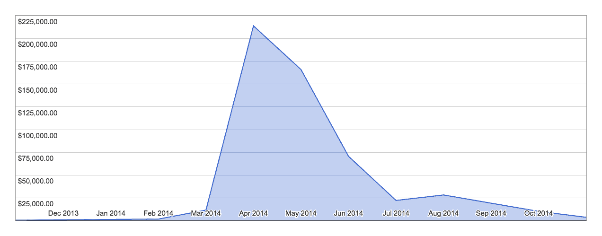

# 开发一款热门手机游戏，并在 App Store 上排名第一

> 原文：<https://www.indiehackers.com/interview/creating-a-hit-mobile-game-and-reaching-1-on-the-app-store-45ea61e1c4>

## 你是谁，你在做什么？

你好，我是阿米尔·拉詹。我于 2006 年大学毕业，获得了计算机科学学位。我在 2013 年之前的职业生涯主要是作为一名雇佣承包商(通过咨询公司)。我做到了。NET 开发(C#)，后来又扩展到 Node.js、Rails 和 mobile。

目前，我是一名独立(移动)游戏开发者。我建了一个暗室。当有人问我开发什么类型的游戏时，我通常会跳到下面这个讲台上:

游戏很重要。它们可以缓解压力。三十多岁了，很难找到时间玩我小时候玩的游戏(在那里你必须坐好几个小时才能取得进展)。大多数手机游戏都没有捕捉到我曾经拥有的那种逃避的感觉。坦白地说，当你的游戏周期很短，一个忙碌的成年人的注意力有限时，很难做到这一点。

我永远不会忘记晚上熬夜玩电子游戏(把音量调小，这样我父母就不会听到)。我真的很怀念能够逃避到一个新的世界。我制作的游戏试图捕捉这种感觉，但在一个忙碌的成年人的背景下，他们没有时间玩游戏。

## 你是如何开始你的事业的？

一开始真的是休假。2013 年 3 月左右，我只是需要休息一段时间。公司的发展环境让我不堪重负。我决定休息一年，去做我想做的事情(并且只靠我的积蓄生活)。

我省吃俭用，过着相当节俭的生活(即使现在我也尽力量入为出)。这种生活方式让我攒了足够的钱，以便在需要的时候休假。再说一次，我觉得我很幸运。选择软件开发作为职业让我在大学毕业后有了一份有收入的工作，并让我存了一大笔钱(同时我和我的妻子仍然过着相当舒适的生活)。

在那段休息时间里，我只想探索新技术，建造我想建造的东西。大约三个月后，我偶然发现了一款名为《暗室》(A Dark Room)的网络游戏，于是联系了迈克尔·汤森德，看他是否同意我把它移植到 iOS 上(并附上我自己的看法)。开发一款“高质量”的游戏一直在我的遗愿清单上，所以这是一个好机会。我花了大约 4 个月的时间把所有东西都移植过来。(我使用了一个名为 [RubyMotion](http://rubymotion.com) 的平台，因为使用 Objective C/XCode 太痛苦了。)它发布后收入很少，但通过我的基层营销努力(和大量的运气)，[一个黑暗房间 iOS](https://itunes.apple.com/us/app/a-dark-room/id736683061?mt=8) 在 2014 年 4 月成为 App Store 的第一名。

当我遇到一个黑暗的房间时，我的主要目标只是享受爱的劳动。从商业角度来看，由于游戏在 HackerNews 和 Reddit 上获得了积极的反馈，移植是有一定道理的。我目前的游戏名为 Noble Circle，采用了与 ADR 完全不同的方法。贵族圈的第一个版本几乎不可玩(你可以在这里阅读进度和收入)。

大约一个月后，我免费发布了游戏的第一个版本。在大约两分钟相当粗糙的游戏之后，一条关于我觉得移动游戏的前景有多破碎的信息被给了用户。我还承诺每月发布更新，并鼓励他们通过评论给我反馈。这种游戏开发的迭代方法很受欢迎。三个月后，我觉得一个高尚的圈子是值得收费的。尽管它还没有完成，但它现在已经产生了收入。人们看到新的更新会很兴奋，并继续向他们的朋友和家人推荐这个游戏。

## 你的发展计划是怎样的，你是如何资助的？

我自费休假，不小心做了一个销量靠前的 app。大多数时候，我觉得我能成功完全是因为运气太差了。

在[一个黑暗的房间](https://itunes.apple.com/us/app/a-dark-room/id736683061?mt=8)从它的头号位置掉下来后，我开始有点恐慌。我觉得好像“派对结束了”，又开始找工作了。(不，建立一个数字应用并不能让你退休去巴哈马，很不幸。)我妻子和我想从我们的清单上划掉“买房子”这一项，所以我用 ADR 的钱付了一大笔房子的首付。作为一个疯狂节俭的人，我想还清剩下的债务。所以，我从 2014 年第四季度到 2016 年 Q1 接了一些合同。我仍然想制作游戏，所以在这段时间里，我制作了 ADR 的一个名为 Ensign 的预续集，以及一个名为 Noble Circle 的新 IP(所有时间都在晚上和周末)。这些合同演出的收入(加上 ADR、TE 和 ANC 的被动收入)给了我偿还房子、家具、学生贷款和汽车的能力。冒名顶替综合症是一个非常真实的事情，在 ADR 的大起大落之后，我与它斗争了整整一年。

除了“失去的 2015 年”，我的工作日程相当一致。我每天工作 6 个小时。独自一人最大的好处是可以关掉闹钟。不累了就醒，累了就睡。你的里程数可能会有所不同，但对我来说这是一个令人难以置信的富有成效的时间表(尽管你很快就会忘记今天是哪一天)。利用共同工作的地点(并有一个锻炼时间表)帮助我掌握时间。

时至今日，事情并没有太大的变化。每天还是工作，累了还是睡，不累还是醒。我仍然锻炼。我仍然与人交往(除了更多的是在午餐时间，而不是去共同工作的地方)。制作一个成功的游戏为我打开了很多演讲的机会，所以这些天我做了很多演讲，我最近的一次演讲是我在 2016 年 RubyKaigi 上做的关于用 Ruby 开发游戏的演讲。我也写了一本书，讲述作为独立游戏开发者的[如何在应用商店中生存下来。](http://leanpub.com/survivingtheappstore)

## 你是如何吸引用户和发展业务的？

我把我的成功大部分归功于运气，但是当我回顾我所做的所有营销时。在 ADR 开发和发布的整个过程中，我让[做了一个开发者日志](http://amirrajan.net/a-dark-room)，并且在月收入和下载数量方面非常透明。

有了这些长长的条目，我喜欢上了 Reddit，并在 [/r/gamedev](https://www.reddit.com/r/gamedev) 和 [/r/apphookup](https://www.reddit.com/r/apphookup) 社区中保持活跃。如果他们阅读我的条目，我会在/r/apphookup 上发布推广代码，这为用户提供了一种方式，让他们看到我是一个真实的人，而不是一个无名的公司。在/r/gamedev 上，我花了大部分时间谈论收入和 App Store 的内部运作。这种“营销”帮助我保持了强大的追随者，并帮助我未来的标题变得成功。以下是我做过的一些帖子:

*   [/r/game dev x-post to/r/startups](https://www.reddit.com/r/startups/comments/4f74dv/quit_my_full_time_corporate_job_built_an_ios_game/)
*   [/r/app hook up x-post/r/Android gaming](https://www.reddit.com/r/AndroidGaming/comments/4ukppc/giving_away_redemption_codes_for_my_1_ios_apps/)。

我非常依赖那些知道我是谁的人(以及我有多关心游戏开发、最终产品和进度)。与向我伸出援手的人真诚互动已经成为我的“品牌”的一个极其重要的组成部分。你不能假装这一点，所以不要试图。

## 你的营收背后有什么故事？

我以 1.99 美元的价格在 App Store 上发布了 [A Dark Room](https://itunes.apple.com/us/app/a-dark-room/id736683061?mt=8) 。它有一个愚蠢的截图和一个小描述。我发现，将价格设置为 0.99 美元会导致下载量成比例增加。我把它留在那里是因为“游戏客户群”很大，玩我的游戏的人越多，就有越多的机会获得口碑推荐。

以下是美国存托凭证第一年的收入数据:

*   2013 年 11 月:478 美元
*   2013 年 12 月:943 美元
*   2014 年 1 月:1320 美元
*   2014 年 2 月:1720 美元
*   2014 年 3 月:11600 美元
*   2014 年 4 月:214 000 美元
*   2014 年 5 月:16.6 万美元
*   2014 年 6 月:7.07 万美元
*   2014 年 7 月:22200 美元
*   2014 年 8 月:28200 美元
*   2014 年 9 月:19200 美元
*   2014 年 10 月:10200 美元
*   2014 年 11 月:3700 美元

11 月，我开始恐慌，开始做合同工作。然而，2015 年销售确实有所回升。以下是我“走开”收入的粗略估计:

*   总收入:约 80 万美元
*   总收入(减去苹果 30%的份额):55.3 万美元
*   我的那一半 ADR(我很乐意给迈克尔他的那份):276，500 美元
*   33%的所得税(粗略估计，是的，我知道边际税率):91，245 美元
*   12%的个体户税:33120 美元
*   净额:152135 美元
*   每月净额(从开发到年底的 16 个月):9，508 美元
*   每小时(40 小时，48 周)做 ADR“全职”:59 美元
*   我被雇佣时的净时薪:51 美元
*   ADR 和朝九晚五之间的 16 个月差价:14280 美元
*   自营医疗保险(妻子也是 1099):10880 美元
*   制作一个排名第一的应用程序(相对于一个 9-5 英尺高的人):3400 美元

对于上述数字，有几点需要注意:

*   这有点偏向于厄运和黑暗/一个警示故事。我是一个最糟糕的人。
*   在 ADR 开发周期的末尾，我可能不会每周花 40 个小时在任何事情上。我花了更多的时间对抗骗子综合症和买房子。
*   即使当我工作 40 个小时的时候，我也在做我喜欢的事情...而不是穿着商务休闲装，花一个小时通勤，这样我就可以和一群不关心软件开发，只想要薪水的人坐在一个小隔间里。
*   如果你能得到一份每小时 110 美元的合同，那就去做吧，而不要辞掉工作，想着你可以随便找一个加拿大人做一个一流的游戏。
*   医疗保险很贵。
*   税收很混乱(以上是近似值)。坦白地说，我只是丢了一叠文件给我的会计师，然后尖叫着跑开了。我被多次告知“我交了太多的税”。我希望是这样。我的税收已经由其他注册会计师独立审核(我的独资有限责任公司的所有边际税收计算都是正确的)。所以，除非你是注册会计师或税务律师，否则不要告诉我怎么报税。我的业务开销是一台笔记本电脑、一个互联网连接和一些用于测试的移动设备(没有太多要注销的)，这也于事无补。

## 你未来的目标是什么？

我将在今年年底完成一个贵族圈。我有 3 个前期制作的其他游戏创意。我已经把一个暗室移植到了 Google Play 上。(现在判断是否值得还为时过早。目前它的收入仅占 iOS 的 5%。)

老实说，我只是想继续从“iOS/Android 移动游戏大饼”中分得一小块。我不希望有一个大型团队来开发游戏。我不是想征服世界。我只想按照我想要的时间表来建造我想要的东西，并且尽我所能去做。如果这口井干涸了，那么我会回到 9-5。不知何故，我一直抱着这种心态活下来。我不知道为什么，但我会继续写并展示它。

## 如果你必须重新开始，你会做什么不同的事？

我可能应该早点移植到 Android 上。当时 RubyMotion 只有 iOS(现在是跨平台的，这就是为什么现在有了 Android 端口)。用 Java 重写一切的想法一点也不吸引我，但如果我做了移植，并有来自另一个市场的额外收入，我可能就不会有“失去的 2015 年”。我未来的游戏将同时针对 iOS 和 Android(还是因为 RubyMotion)。我的下一个游戏将会写在动作游戏中，这是一个红宝石包装的 [Cocos2dx](http://www.cocos2d-x.org/) 。我也在关注[阿卡迪亚](https://github.com/arcadia-unity/Arcadia)。

## 你最大的优势是什么？

纪律和习惯。当“激情”和“创造的渴望”时好时坏，我只是用习惯来应付。我醒来。我致力于需要改进的东西。我累了就睡觉。我醒来。我致力于需要改进的东西。(Emacs 的组织模式极大地有助于对需要完成的事情进行优先排序。)

我继续过着入不敷出的生活。看到这么多人做着他们不想做的工作，这样他们就可以支付他们并不真正需要的东西，这绝对令人恼火。时间是迄今为止最有价值的“东西”。你生命中的一小时能卖多少钱(一小时的全部)...远离你的家人，远离你喜欢做的事情)？值得吗？

## 你会和有抱负的独立黑客分享什么建议？

弄点东西出来。建造一些东西并运送出去。你不需要投入巨大的营销努力来进行一次低调的发布。所以在公众中获得一些东西，找到一个愿意给你反馈的小众社区，倾听他们，迭代。

## 我们在哪里可以更多地了解你？

*   网址:[amirrajan.net](http://amirrajan.net)
*   推特: [@amirrajan](https://twitter.com/amirrajan)
*   书:[在 App Store 生存](http://leanpub.com/survivingtheappstore)

我的游戏:

*   [暗室 iOS](https://itunes.apple.com/us/app/a-dark-room/id736683061?mt=8)
*   [暗室安卓](https://play.google.com/store/apps/details?id=com.yourcompany.adarkroom&hl=en)
*   [军旗](https://itunes.apple.com/us/app/the-ensign/id908073488?mt=8)
*   [一个贵族圈子](https://itunes.apple.com/us/app/a-noble-circle/id977865620?mt=8)

如果你对我有任何问题，你可以在下面的评论中提问:

——[<picture id="ember5247706" class="user-avatar ember-view user-link__avatar"></picture>阿米尔·拉詹](/amirrajan?id=DU8nrjhpeMTmWJHR7vlLwTYAueI3)，《暗室 iOS》的创作者

## 想像暗室 iOS 一样建立自己的事业？

你应该加入独立黑客社区！🤗

我们是几千名创始人，互相帮助建立有利可图的业务和副业。来分享你正在做的事情，并从你的同事那里获得反馈。

还没准备好开始使用你的产品吗？没问题。这个社区是一个认识人、学习和实践的好地方。随意[随便浏览](/)！

——[<picture id="ember5247711" class="user-avatar ember-view user-link__avatar"></picture>柯特兰艾伦](/csallen?id=ibTLPyjwVebnZjMGKvz6ztarnuV2)，独立黑客创始人

17votes