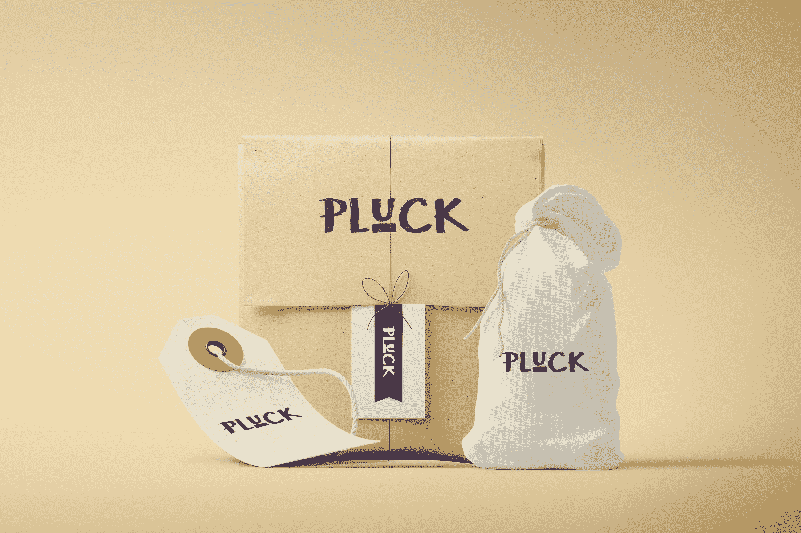
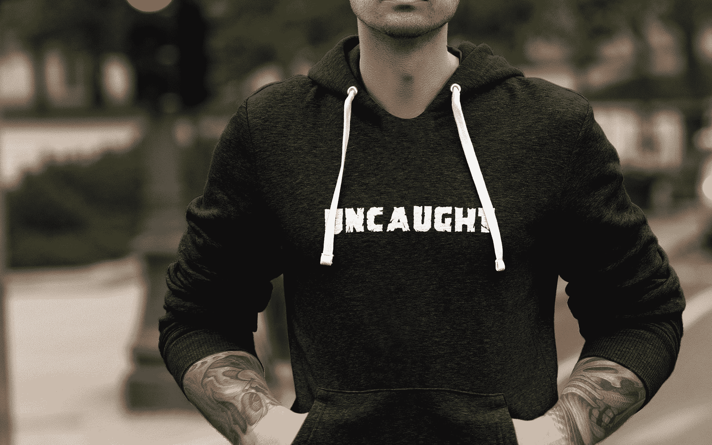

# 创建一个人工智能驱动的徽标创建器，每月收入 7 万美元

> 原文：<https://www.indiehackers.com/interview/creating-an-ai-powered-logo-creator-and-earning-70k-mo-4ebecd547f>

## 你好。你是谁，你在做什么？

我叫道森·怀特菲尔德。我最近推出了[logo joy](http://www.shareasale.com/r.cfm?B=951728&U=1479919&M=69265&urllink=)——一个在线标志制作工具，它使用机器学习来让你感觉像是在和一个真正的设计师一起工作。

Logojoy 是为任何试图创业、博客、非营利组织、俱乐部或任何需要 logo 的人准备的。通常，标志是人们开始任何事情的第一步，我们试图让这些人容易得到一个简单、好看的标志，他们可以在他们的网站、名片等上使用。

我认为人们选择 Logojoy 而不是 10 多家竞争的 logo 制造商，是因为它不仅仅是一个简单的 Photoshop。我们像设计师一样理解你的品味和需求，我们为你提供能让你思考的模型。即使这些设计并不完美，我们也会让看到变化和做出改变变得简单而愉快。

我会将产品分为两部分:徽标生成器，它接受输入并生成徽标；和编辑界面，允许用户看到变化和编辑如字体，颜色等。徽标生成算法仍处于起步阶段，所以现在它主要是作为大多数用户的一个想法来源。编辑界面实际上非常健壮，我最喜欢它的一点是我们以变体的形式呈现选项。例如，如果您想要查看不同的字体，我们不会给您一个字体下拉列表，相反，我们会向您显示您的徽标版本，每个版本都有不同的字体，因此非常直观。

 

## 人工智能驱动的标志制作是一个奇妙的想法。你是怎么想出来的？是什么激励你开始的？

我在为一个客户设计标志的时候想到了 [Logojoy](http://www.shareasale.com/r.cfm?B=951728&U=1479919&M=69265&urllink=) 这个创意。我做了 12 年左右的设计师，大概为客户做了 150 个 logos。我为小企业设计徽标时会感到沮丧，因为(a)创建 30 个实体模型非常耗时，(b)做这些小的来回工作需要几周时间，以及(c)徽标最终会非常简单，以至于我觉得整个过程都是浪费。

我一有了这个想法，又找不到合适的人，就开始着手去做。

激励我的主要事情就是做一些很酷的东西。我做了一个快速的[谷歌趋势查询](https://www.google.ca/trends/explore?date=all&q=logo%20maker,logo%20design,logo%20creator,logo%20download,website%20builder)，发现“logo maker”的搜索量是“网站建设者”的 3 倍多——这在开发过程中是一个很大的安慰。每当我没有动力的时候，我就会打开那个标签。我一定打开过 200 次了。

有趣的是，另一个很大的动机是当前的解决方案有多糟糕(在我看来)。想到我可以提供比第二好的产品好 10 倍的产品，这让我非常兴奋，尤其是因为市场如此之大。

最后，让我真正兴奋的是建立一个真正产生收入的小产品的是[独立黑客](/)，自从你在产品搜索上首次亮相以来，我一直在关注它:)

## Logojoy 的设计使用了人工智能。它到底是怎么工作的？你用的是什么技术？你花了多长时间建造？

这是有趣的部分。我们的徽标只是各种成分的组合——字体、颜色、布局、符号等。 [Logojoy](http://www.shareasale.com/r.cfm?B=951728&U=1479919&M=69265&urllink=) 利用机器学习来学习哪些食材搭配起来更好。

它从跟踪我们的用户所做的一切开始。我们跟踪的内容包括:他们选择的灵感、他们最喜欢的徽标、他们对徽标所做的更改(例如更改字体)、他们购买的徽标等等。我们目前跟踪大约 80 种行为。

每天，学习算法读取所有这些动作，并根据发生的次数对每个动作进行加权。由于它读取动作的结构化方式，它能够基于“繁重”的动作定义规则。

例如，一个动作可能被定义为“用户将字体粗细从 100(轻)更改为 600(粗)”。这个动作对象包括它发生的次数，每隔一个动作，以及所有的徽标成分。在这种情况下，假设算法得出的结论是，每次出现这种情况时，徽标的颜色都被归类为“浅”。该算法可能会定义一条规则，即“如果徽标的颜色较浅，请不要使用较浅的字体粗细”。

制作 V1 花了大约两个半月的时间。最具挑战性的无疑是为系统创建结构来定义自己的规则(换句话说，就是机器学习)。我的堆栈是老派的:PHP，MySQL，jQuery。

 

## 你哪来的钱买 bootstrap Logojoy？

我用积蓄和一点自由职业来资助 Logojoy。

## 在不到一年的时间里，您的月收入高达 15，000 美元。你的商业模式到底是如何运作的？你做了什么才能成长得这么快？

我们允许用户免费建立无限的标志。一旦他们对自己的 logo 满意了，他们会花 20 美元买一个基本版本，或者更常见的是，花 65 美元买一个包含矢量的高级包。

老实说，我们只是制造了一个好产品。logo 设计的关键是呈现。有些人花 65 美元购买一个极其简单的纯文本标志，仅仅是因为我们以一种美丽的方式展示了这个标志。

我们发起了产品搜索活动，并告诉了我们社交网络中的每一个人。我强烈建议让有发帖权的人在周二的 PH 上发布你的产品——这让一切都不同了。

从那以后，我们的流量几乎是 100%的口碑。真正让我吃惊的是这个消息在全世界传播的速度有多快。一天之内，日本成为我们最大的市场(占我们总流量的 25%)。我认为我们倾向于将美国视为整个馅饼，当你创造不受语言限制的东西时，你的市场会大 10 倍。

我们开始尝试 Adwords——每次点击付费 0.2 美元。我们每天花费大约 250 美元，每天大约有 1800 人访问这个网站。

我们看到每天大约有 5000 人访问这个网站。25%的访问者完成了标识制作过程并注册。在注册的人中，大约 0.5%的人购买了一个徽标。我们希望在下个月内将这一比例提高到 1-2%。

Logojoy 推出的那一天，它赚了 450 美元，而且从那以后一直在增长。2017 年 2 月，Logojoy 赚了近 7 万美元:

## 你未来的目标是什么？你面临的最大挑战是什么？

我认为最终 [Logojoy](http://www.shareasale.com/r.cfm?B=951728&U=1479919&M=69265&urllink=) 可以让企业家设计从标志到广告的任何东西。我现在真的很兴奋，因为我可以将我所有的时间投入到 Logojoy 中，并真正使它成为人们喜欢使用的世界级产品。

有一件事将是一个持续的挑战，那就是向我们的用户灌输信任，并将 Logojoy 定位在与设计师相同的水平上。即使 Logojoy 最终能够产生和设计师一样好的结果，人们仍然不会重视它。

 

## 你认为到目前为止你最大的优点是什么？如果你能回到过去，你会做什么不同的事情吗？

我认为我的设计和开发能力至关重要。当你能够自己从视觉到成品，你可以移动和旋转得如此之快。我认为我最大的优势是我有信心面对任何问题。一旦你真正知道每个问题都可以通过分解成小块来解决，没有什么可以阻止你。

如果能时光倒流，我一定会更早的获得内测用户。一旦人们开始使用这个网站，我就更有动力去完成功能和修复 bug。

## 你对有抱负的独立黑客有什么建议？

对我来说真正有用的是构建一个小产品。我对 Logojoy 的总体规划需要几年时间。我真的很兴奋，因为我决定用最简单的版本。花时间决定最关键的特性，并且只构建这些特性。

对我来说，这就是保持动力。有时候很难保持动力，对我帮助最大的两件事是 a)接近发布，或者从你想要构建的最简单的版本开始，b)从用户那里获得反馈。

## 我们可以从哪里了解更多关于您和 Logojoy 的信息？

*   网页:【http://logojoy.com 
*   博客:【http://logojoy.com/blog 
*   推特:[https://twitter.com/logojoyapp](https://twitter.com/logojoyapp)
*   https://www.facebook.com/logojoyapp 脸书
*   https://angel.co/logojoy
*   我是独立黑客论坛的道森。在下面给我留言或者提问吧！

—[<picture id="ember8068312" class="user-avatar ember-view user-link__avatar"></picture>道森怀特菲尔德](/dawson?id=J0FSECS392OD5PiJ62gSpjlpfaz2)【logo joy】的创造者

## 想像 Logojoy 一样建立自己的事业？

你应该加入[独立黑客社区](/)！🤗

我们是几千名创始人，互相帮助建立有利可图的业务和副业。来分享你正在做的事情，并从你的同事那里获得反馈。

还没准备好开始使用你的产品吗？没问题。这个社区是一个认识人、学习和实践的好地方。随意[随便浏览](/)！

—[<picture id="ember8068317" class="user-avatar ember-view user-link__avatar"></picture>考特兰艾伦](/csallen?id=ibTLPyjwVebnZjMGKvz6ztarnuV2)，独立黑客创始人

28votes