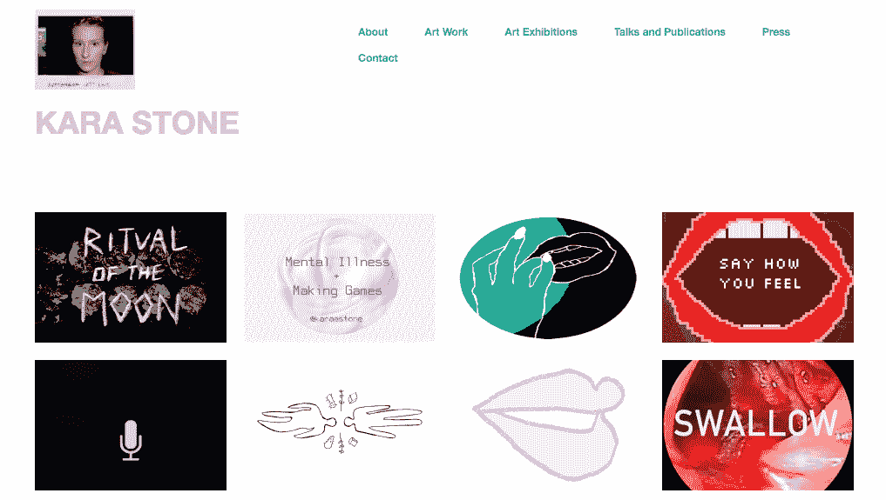
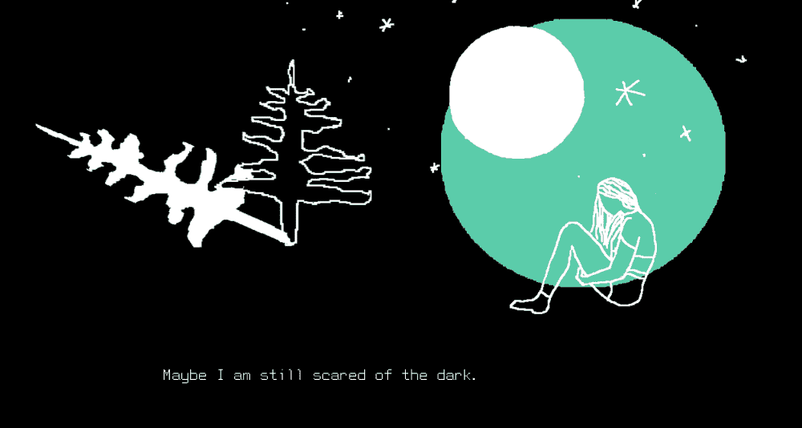
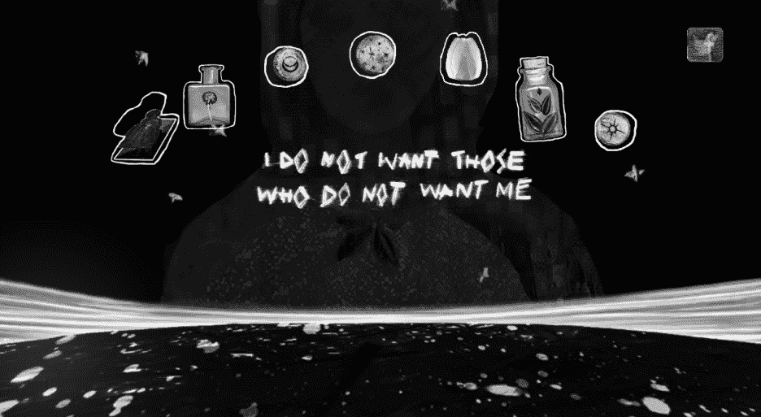

# 用艺术背景创作成功的独立游戏

> 原文：<https://www.indiehackers.com/interview/creating-successful-indie-games-with-an-art-background-5cee1e8e52>

## 你好！你的背景和工作是什么？

我叫卡拉·斯通。我大半辈子都在做艺术，主要是表演。我从戏剧开始，过渡到电影，然后从电影到电子游戏。

我制作游戏已经有七年了，它们是独立的，非常艺术化的游戏。许多人可能不会把它们归类为游戏，而是喜欢互动数字艺术。但我在视频游戏领域找到了很多立足点和社区。

现在我正在做一个最新的作品，是关于人工智能和环境保护主义以及自我和社区护理的数字形式。它被广泛地称为*发掘 U* ，它跟随一个人工智能，这个人工智能被设计成你的生活教练支持系统，并带你完成这些不同的练习。当你玩的时候，你会发现更多关于设计她的公司和她的生活是什么样的。

## 是什么促使你第一次着手游戏开发？

我从事艺术已经很久了。那时没有人谈论游戏。15 年或 20 年前，甚至在某种程度上，现在，如果你在艺术项目中，没有多少人谈论视频游戏作为艺术创作的可能媒介。

所以直到我读硕士的时候，才偶然发现一个社区在做独立游戏和美术游戏。我一生都在玩游戏，但只有[AAA](https://en.wikipedia.org/wiki/AAA_(video_game_industry))，非常主流的游戏。我不知道你可以自己制作视频游戏，也不知道有独立的艺术家和制作人在做这个，直到我遇到一个团队在做这个。我就像，*哦，我的天哪，我也想做！让我进去吧！*

我加入了不同的女权主义团体，比如分享游戏设计技巧和互相支持，这真的推动了我。那真的很有帮助。

当然，我总是在想，如果我早点开始做东西，早点做游戏，事情会有什么不同。来自不同艺术的背景真的很有帮助，感觉真的对艺术整体投入，而不仅仅是电子游戏，电子游戏有非常具体的规则和期望，艺术更自由一点。所以现在我回顾我是如何进入游戏的，觉得这很棒，但有一段时间我有点怨恨。

## 你制作的第一个游戏是什么，是怎么制作的？

叫做[药物冥想](https://karastonesite.com/2014/05/06/medication-meditation-release/)。这是一个非常开放、自由的游戏，你可以进入不同的层次，做一些关于精神疾病生活的小练习或小体验。一种是你可以去做冥想练习，另一种是你必须在正确的时间服药。另一种方式是，当脱离身体的治疗师引导你解决一些问题时，你可以和他们交谈。

这个游戏是由像素艺术制作的。我自己编程，所有的艺术都是我自己做的。然后一旦它变得有点流行，得到了一些媒体的报道，我和人们一起把它制作成一个 iOS 和 Android 的应用程序，直到今天它仍然存在。这都是七年前的事了。

## 你用了什么工具来制作那个游戏？有特定的语言吗？有没有你特别喜欢的游戏引擎？

当我第一次学习如何编程时，最初的版本是一个叫做 [GameSalad](https://gamesalad.com/) 的可视化编程引擎。有一段时间是免费的，后来是订阅。

当我们将游戏转移到手机应用程序时，我们使用了 [Unity](https://unity.com/) 。

## 你现在用什么？你在用 unity 吗？

我会用任何对项目有利的引擎。

所以我现在正在开发的游戏《发掘你》是在 Unity 里面。我的另一个游戏[地球是一个比我更好的人](https://karastonesite.com/2018/08/23/the-earth-is-a-better-person-than-me/)，是一部视觉小说，所以我用了[任。Py](https://www.renpy.org/) 去做吧。

我只会用对项目有益的东西。我会用加工，思考是什么项目？我希望它看起来像什么？有工具可以带我去吗？我为每个项目考虑这些方面，而不是真正投资于一个特定的工具。我不会说“我真的喜欢虚幻，所以我做的一切都是通过虚幻的。”因为这些不同的引擎和不同的工具有不同的启示和美学。

所以我用的会根据项目的不同而变化。

## 你如何吸引玩家并营销你的游戏，或者营销你自己是一个游戏设计师？

我讨厌营销！我是那种无法忍受的人；我觉得真的很不舒服。

但部分原因是我在艺术界，这带来了对自己和自己作品的另一种宣传。很多都是应用在节日和艺术画廊，做艺术家的演讲。另一个原因是，我的财务稳定不是基于我的艺术实践或我的游戏设计。这对我真的很有帮助。

有段时间想过走工作室路线，但是真的难以为继。人们很快就筋疲力尽了，工作室带着一两个项目来来去去，根据项目来雇佣和解雇。许多工作室甚至在一个游戏中就倒闭了。这也是一个很大的压力，你做的东西必须对普通玩家有市场和可行性，这不是我的目标受众。

游戏是一种有趣的互动体验。除此之外没有其他规则。这是一个非常简单的定义。

TweetShare

如果我考虑我的目标受众，我更感兴趣的是探索这种媒体的可能性，以及它的优势。我更感兴趣的是我觉得真正令人兴奋的事情，以及与众不同和有趣的事情...当然，这并不总是很受欢迎。

与我的作品有联系的人在画廊或节日里看到过它，或者看到过关于这些作品的文章。他们玩过这些游戏，感觉和它们联系在一起，因为它们与众不同，它们可能非常个性化、怪异、具有实验性，而且真的超出了人们对电子游戏的预期。所以我不愿意把它想象成玩我游戏的人的观众。这一直是一种非常奇妙的联系，非常酷。

## 当你想出一个新的游戏创意时，你的过程是什么样的？你通常需要多长时间？你如何设计这个项目？

我刚开始做游戏的时候，头几年，我在读硕士。我刚刚完成学位，我会让事情变得很快。我会很快做很多小项目，而且我会自己做很多。

我会一直从写作开始。我写日记，为自己设计，用别人看不到的草图写出来。我做了很多这样的计划工作。理论上，不使用任何引擎，不考虑如何编程，不考虑下一步的制作。当我有了大概的想法和概念后，我会思考它的意思是什么，它是如何传达这个意思的。

最后，我会考虑什么引擎最适合它。我有能力完全做到吗？审美是什么？我有审美能力完全做到这一点吗？或者我应该和其他艺术家一起工作，它应该是什么样的？我只是从那里开始建设。它总是从非常小或者非常独立和非常反思性的思考开始。

过去几年的发展速度慢了很多，这是有意识的，只是出于必要。我更倾向于那些更加专注的艺术家。我原本在想，“哦，我就这么做，然后执行它。”在此过程中不会有太多的灵感或改变。就像我第一次决定的那样，我会执行它。现在，它变得更加开放，感觉就像“哦，我不确定它会走向何方。”

事情需要更长一点的时间，就像我做*地球是一个比我更好的人*。里面有很多文字。当我写作的时候，这是一个非常愉快的过程。这是我做所有事情的另一个地方。我没有任何合作者。所以是我一个人制作它，编写它，写它。我会一次写一个故事线，里面有多个故事线，我都写了。当我开始的时候，我真的不确定它会走向何方；我没有像以前那样描绘出来。所以我试图更多地接触探索过程版本，我认为它真的可以创造令人兴奋的东西。

## 你提到工作室并不是你想要的游戏。你喜欢独自工作还是喜欢与人合作？

都有，不过要看项目。

作为一名视觉艺术家，我有自己的极限。我需要一段时间来找到一种我觉得我可以做到的，看起来很好很有趣的审美。所以和其他艺术家合作真的很棒。我在编程方面也有自己的极限。所以对于我认为超出我能力范围的事情，或者我不想花时间去做的事情，我很乐意与程序员合作。

《发掘你》是我第一部真正合作写作的作品。通常我几乎都是自己写的。

所以看情况吧。我喜欢和别人一起工作，也喜欢独自工作。

## 所以你在开发这个新游戏。你的目标是什么，你对未来的总体目标是什么？

在我开始玩这个游戏之前，我真的觉得自己的创造力停滞不前。并不是说我没有一百万个我想做的东西的想法，但是想到游戏和技术对环境的影响，我在想，当它是一个巨大的，巨大的能源浪费和电子垃圾的生产者时，我如何在道德上对此做出贡献？当我们已经是一场气候灾难的时候，我怎么能成为这种不考虑对环境影响的*制造文化的一部分。我住在加利福尼亚，在我住的地方发生了数以吨计的野火，人们被迫撤离，我的朋友实际上已经撤离到我家。这是一个非常真实的现实。*

所以我对此感到非常困惑。我该怎么做新东西？也许我们大多数人能做的最好的事情，尤其是我们这些从事技术工作的人，就是简单地停止制造东西。你不能再做了。

所以我感觉真的卡住了，我决定我不会做任何新的东西。相反，我打算重复使用我已经找到的东西。

我喜欢找到的镜头。所以在发掘你的时候，一切都已经被发现了，没有什么是新的。这是一个找到的镜头，视频，我编辑成我需要的混合，人工智能 3D 和声音模型被使用。所有的用户界面和背景图片都来自代码和图片。我正在尝试这种重复使用的风气，把所有东西都做成一个新的东西，这就是挖掘你将成为的项目和应用程序。唯一新的是文字，我甚至不知道一个*是否构成了*文字，但新的文字将所有发现的元素联系在一起。

然后我打算在应用程序制作完成后删除所有内容。

当然，像我这样的独立艺术家并不是那些像大堆废物一样制作的人。这是 AAA 公司做的。但是我仍然想支持环保主义的精神。我的目标是找到一种方法来制作对地球有害的数字媒体，在某种程度上，我觉得这是在支持环保主义的信息，并试图遵循环保主义的过程。

## 就你的旅程而言，从一个游戏设计并不在桌面上的艺术家，到现在已经制作了几款游戏，你在这条道路上面临的最大挑战和克服的障碍是什么？

我发现有几件事是障碍。一个当然是每个人对电子游戏应该是什么样子的期望。我不认为这是任何人的错。大多数电子游戏看起来完全一样。大多数电子游戏都是一样的。他们有相同的机制或者他们是射手。他们遵循非常相似的故事情节，有着非常相似的主角，彼此都非常相似。所以当你做一些不同的事情时，人们会说，“哦，我不认为这是一个游戏。”我做的好像不太合适。尤其是因为我是一个女人，我也不符合谁是游戏设计师，甚至谁是观众的陈词滥调。所以这是一场斗争。虽然现在已经过了这么长时间，我几乎不再关心它了，但它仍然会一直出现。

大多数人都在模仿他们已经看到的东西！它会变得很无聊，只能到此为止。

TweetShare

另一个真正让我质疑我为什么要这么做的问题，也是我真正纠结的问题，是游戏对环境的影响。一台游戏电脑浪费的能量是普通电脑的六倍。成为那个世界的一部分令人沮丧。当然，这只是所有流媒体和大量电子垃圾的一个例子，堆积起来的不可回收的物理硬件，依赖于开采稀有、珍贵的矿物，这些矿物的开采过程进一步破坏了地球，继续制造我们不需要的新游戏机。

所以很难成为那个世界的一部分，也很难感觉到我在其中有任何角色。即使我没有直接制造需要高性能游戏电脑或新游戏机的东西，我仍然觉得我参与了这种文化。

另一个障碍就是公司收购。5 到 10 年前的一段时间，游戏真的很刺激。这种感觉，这将是一种新的艺术形式，这将做真正令人兴奋的事情。举例来说，这是《童话故事》制作游戏的时候。在他们决定离开游戏公司*之前，这是一家伟大的公司，因为*消费主义和持续的公司收购。

在 Steam 占 30%，Android 占 30%，这些艺术游戏无法生存的情况下，处理那些大的削减可能真的很难。对于制作独立艺术的人来说，这是一个巨大的削减。然后你必须订阅 Unity，所有这些东西都不再是为独立创作者而建的。对于大多数独立游戏设计师的微薄收入来说，30%的提成是个大数目。如果不使用这些工具，很难将作品传达给读者。但是，我也不想支持这些工具，我不认为他们应该得到我所做的 30%。对于独立艺术家来说，处理公司控制的程度真的很难。

## 在这些挑战的另一面，你有没有发现什么真正有助于或有利于克服这些障碍的东西？

我发现了一个非常棒的社区，非常令人兴奋，人们在女权主义者、酷儿理论和创客圈子里做着非常酷的工作。

一些对我来说最宝贵的人，一些最聪明的人，都在游戏工人联合运动中，该运动试图为游戏工人创建工会。游戏工作者是被剥削最严重的雇员和工作者。这对我来说是如此的鼓舞人心，我真的在游戏中发现了很多与其他人的友情和团结。

还有，我是博士生，在学术界。所以我教游戏，我教大学生如何制作游戏。看到他们做的事情真的很令人兴奋，特别是当他们从游戏中走出来，他们可以摆脱他们对什么是好游戏的概念以及他们对游戏的期望，并做出一些真正有趣、独特和令人兴奋的事情，或者当他们对游戏一无所知时，他们来这里是因为他们必须上这门课或者他们喜欢我作为老师。后一组真的问了这么有趣的问题，做了这么有趣的东西，给了我很多快乐和兴奋。这让我觉得，“哦，也许这里有一些东西，像这是值得做的，真的很令人兴奋。”

## 既然你教书，我肯定这是你经常遇到的事情。你对制作游戏有哪些误解？

最大的误解是你需要知道如何编程，而编程就是一切。现在你知道了，有了这些可视化编程平台，我觉得你确实需要编程，但这肯定不是最重要的事情。故事、视觉美感和概念对于一个游戏来说，和编程一样重要。

人们认为他们永远也做不出游戏，因为他们觉得自己不够专业。很多学生都这么说，我的学生之外的很多人也这么说。

从像 [Bitsy](https://ledoux.itch.io/bitsy) 和 [Twine](https://twinery.org/) 这样更容易的访问工具开始真的很好，对于职业游戏玩家来说，他们不会认为他们很令人兴奋，但要做到这一点，并能够感觉到，“哦，哇，好像我可以做到这一点！我确实制作了这个游戏，我把这个过程神秘化了一点，让我感觉更容易上手。”我认为这是最好的学习方法之一。

我在多伦多的一个社区中心举办了一个长形式的研讨会，那里没有很多资源，我看到人们说，“我永远做不出游戏，我永远不会编程。”在 Stencyl 上制作他们的第一个游戏，或者制作他们的第一个平台，或者即使它是基于引擎教程，只是为了让他们感受到*我可以做这个*。那真的很好。

## 你对那些有兴趣开始制作游戏的人有什么建议吗？他们可能正在开始做一些你希望知道的事情。

不要听别人对电子游戏的规则。随意探索你认为有趣的东西，而不是试图模仿你已经看到的东西。大多数人都在模仿他们已经看到的东西！它会变得很无聊，只能到此为止。

你应该探索，即使它不符合其他人对游戏应该是什么样子的想法，去尝试它。

## 这是你在这次采访中说了很多的话，实际上，很多人可能不认为你的游戏是“游戏”。你对游戏的理念是什么？

我认为游戏是一种有趣的互动体验。除此之外没有其他规则。这是一个非常简单的定义。

我认为像所有艺术媒体一样，很难真正定义游戏的边界。如果有人给我看一些完全不同的东西，并说，“嗯，这另一件事是一种有趣的互动体验”，我甚至不会争辩我只想说这很酷，很好。技术定义没那么重要。

## 你喜欢玩哪种游戏？

我喜欢和其他竞争不是很激烈的人一起玩游戏，在那里我们可以玩游戏并更好地了解彼此。我也喜欢玩游戏，玩一个能真正让我反思我的生活、政治和文化的故事，让我思考。这和我从电视节目或小说中欣赏的东西是一样的，有着有趣角色的东西。

我也喜欢描绘不同世界的游戏，这些游戏非常有趣，你可以去探索那个世界。它非常宽泛，但我认为这是游戏的一个很好的卖点。

## 是什么激发了你的游戏？

我的大部分作品都是关于心理残疾的，或者更普遍的说法是精神疾病。这并不总是那么直接。

正如我描述我的第一个游戏，*药物冥想*，这真的很清楚。但是其他的大部分作品更多的是嵌入在设计、故事或者对话中。所以大部分是关于情感健康和自我反省，以及残疾人如何与世界联系。

## 我们可以去哪里了解更多？

我的网站是[Karastonesite.com](https://karastonesite.com/)

你可以在推特上关注我，地址是[@ karas tone](https://twitter.com/karaastone)

——[<picture id="ember5267147" class="user-avatar ember-view user-link__avatar"></picture>卡拉石](/KaraStone?id=8QMnYzzIPxQw6OQy2REQJ7N6Dis1)，卡拉石游戏的创始人

## 想像卡拉石头游戏一样建立自己的事业？

你应该加入独立黑客社区！🤗

我们是几千名创始人，互相帮助建立有利可图的业务和副业。来分享你正在做的事情，并从你的同事那里获得反馈。

还没准备好开始使用你的产品吗？没问题。这个社区是一个认识人、学习和实践的好地方。随意[随便浏览](/)！

——[<picture id="ember5267152" class="user-avatar ember-view user-link__avatar"></picture>柯特兰艾伦](/csallen?id=ibTLPyjwVebnZjMGKvz6ztarnuV2)，独立黑客创始人

12votes