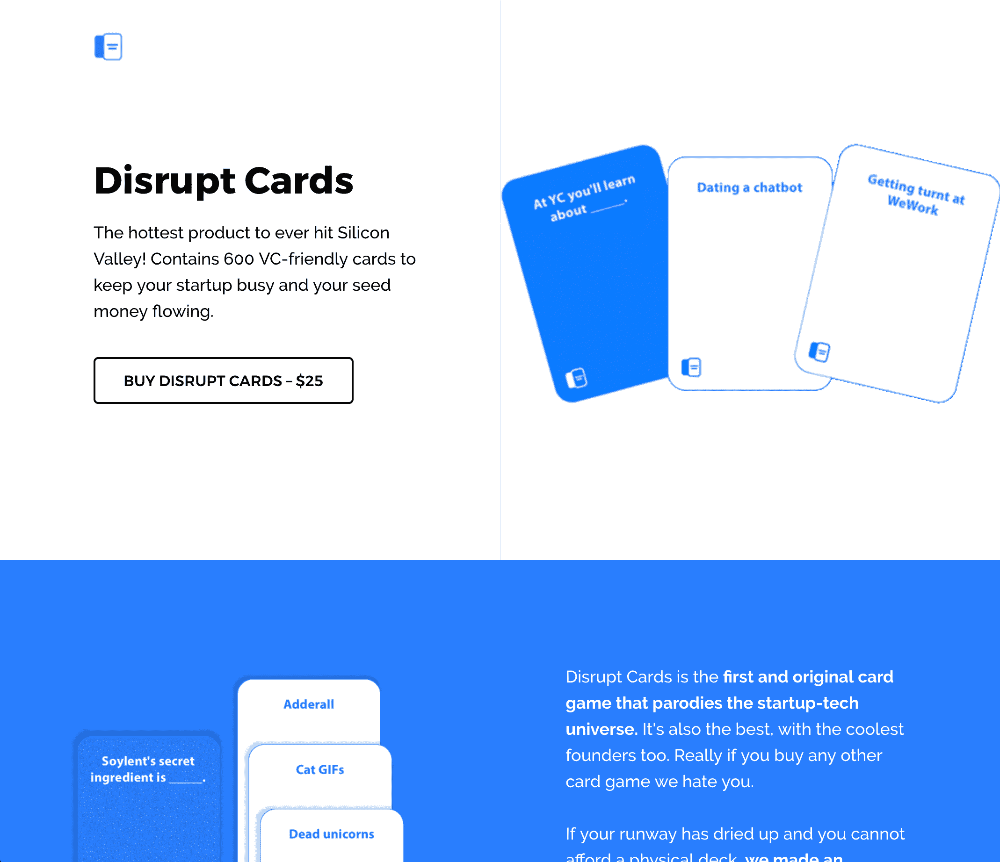
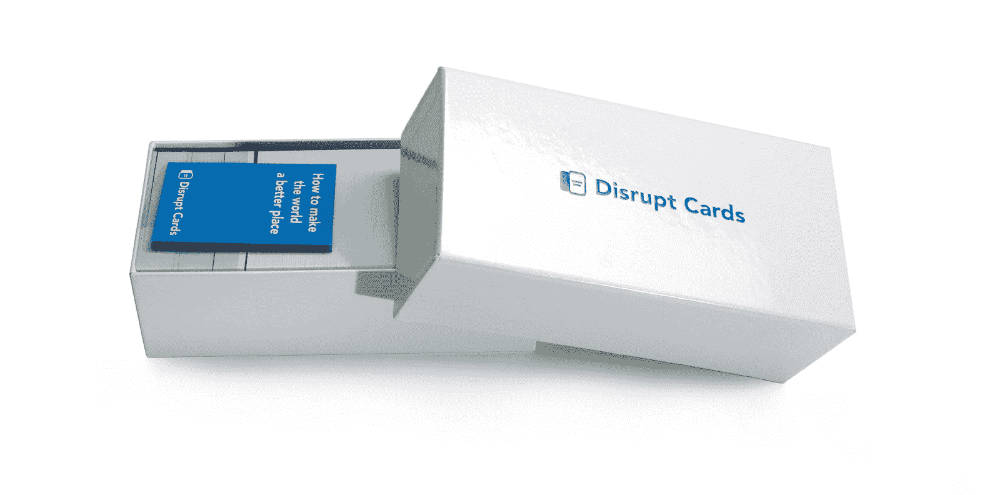
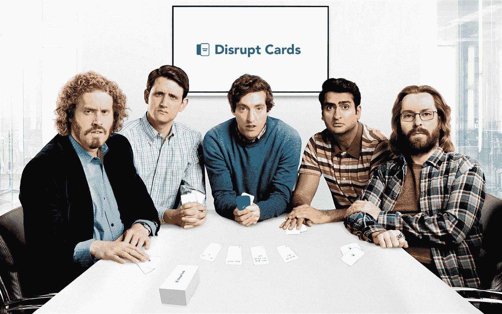

# 为创业公司设计和运送反人类的卡片

> 原文：<https://www.indiehackers.com/interview/designing-and-shipping-the-cards-against-humanity-for-startups-977c6fb1e7>

## 你好！你的背景是什么，你在做什么？

嗨，我叫[乔丹·戈宁](https://twitter.com/jrdngonen)！我热衷于利用技术让事情变得更好。我曾在许多公司的产品和增长团队工作过，比如优步、斯卡霍尔德(YC)、普鲁特(YC)和其他公司。我喜欢写作。此外，我喜欢做能影响尽可能多的人的副业。

我参与的一些项目致力于节省人们的时间。其他的能使人们在工作中做得更好。

然而，今天的故事与众不同。这是关于我和几个朋友如何制作[扰乱纸牌](https://disrupt.cards/)，一个滑稽的纸牌游戏，模仿硅谷泡沫中发生的事情。自从 8 个月前发布以来，世界各地有成千上万的人玩过我们的游戏，我们上了福布斯和 CNN 的专题，我们每月被动地产生大约 1500 美元。

直到今天，我们真的不知道自己在做什么。我想没有人真的知道，对吗？但是尽管如此，我们还是学到了很多！

 

## 是什么促使你开始使用 Disrupt Cards？

早在 10 月份，我就有了这个想法，想制作一个纸牌游戏，来取笑硅谷所有我讨厌(但又有点喜欢)的地方。拉克鲁瓦。宠物酒店。猫咪 gif。这样的例子不胜枚举。

以最千年的方式，我联系了两个我当时不太了解的“网友”——丹尼尔·辛格和杰里米·马鲁夫——问他们是否想参与进来。出于某种原因，他们同意了。

关于背景，我以前从未见过丹尼尔，几个月前我见过杰里米一次。但是无论如何我们都不是亲密的朋友。

从很多标准来看，我们有一个很棒的团队，但有一个明显的例外:我们都没有任何发行卡牌游戏的经验，更不用说生产它们了。信不信由你，学校里不会教你这些东西(反正也没什么用，因为丹尼尔和杰里米已经辍学了)。

我们的天真是唯一推动我们前进并激励我们接受这个不可能的挑战的东西。

有趣的是:我认为如果我们在项目开始前就知道我们会陷入什么样的境地，我们就永远不会去做。一般来说，项目都是如此；如果你曾经在 App Store 中启动过一个应用程序，你可能不太可能再次尝试，因为你知道这有多难，要求有多高。这是一次很好的学习经历——尝试新事物并不全是坏事。有时候没有经验是一种优势！(在职者会告诉你不同的答案。)

我们的第一步相当小。我们用大约 100 种卡片组合制作了一个谷歌电子表格。有些很有趣，比如“我们刚刚发现产品市场适合 __”“猫 gif”和“在费城空投你的混音带”其他人不那么有趣，但我们仍然试图笑。

通过与目标受众接触和交谈，我们逐渐发现哪种类型的幽默对他们来说特别有趣！

投资你的客户…了解他们。同情他们。这是你能做的最重要的事情。

TweetShare

我们的假设是硅谷的技术书呆子会喜欢这个游戏。(我们稍后将扩展这一思想，以包括但不限于:穿着 Allbirds 的风险投资家、认为自己是处理业务方面的业务开发人员的人，以及送餐企业家)。

为了测试这一点，我们联系了我们最“在泡沫中”的朋友，请他们玩一个游戏。我们在网上玩了一套虚拟游戏，并在采访潜在客户时尝试了演示游戏。

当然，我们的“朋友”说他们喜欢它…但这真的意味着我们的目标观众会喜欢它吗？我们很快就会发现，买东西和说你想买东西是非常不同的。兴趣不等于销售。利息验证不同于价格验证。这很重要，因为许多创始人混淆了这两者！

经过许多通宵游戏，我们拿出了数百张卡片(有些非常 NSFW)。最终，我们将范围缩小到 600 张我们和测试人员最喜欢的最好(和最差)的卡片。

## 构建最初的产品需要什么？

做一些你从来没有做过的事情总是有趣和有挑战性的。为什么？因为你真的不知道你会让自己陷入什么样的境地。设定期望真的很难。在构建和发布卡牌游戏方面，并没有一个规范的公式可以遵循，所以我们做了我们最擅长的事情:*我们刚刚开始。*

我们在寻找产品的过程中推出了这款产品，却没有一个明确的计划来说明我们将如何制造这些卡片。这很疯狂…对吗？谈论打破所有规则？

大多数人放弃是因为他们的期望太低了…一夜成功的故事是一个幻想。

TweetShare

一旦我们推出，我们意识到我们必须低头找出如何实际制作游戏。我们联系了全球数以吨计的制造商，试图找出实现这一目标的最佳方式。

我们得到了疯狂的高报价，这是我们没有预料到的。然后，将盒子运过太平洋的费用有时甚至超过了印刷费用！

最终，经过多次电话和数小时的谈判，我们找到了一个可以以合理价格打印游戏的联系人。需要说明的是，我们必须卖出 650 多盒才能收回成本。

我们的天真再次闪耀。我们认为我们会很容易达到这个里程碑。我们认为我们已经找到了一个几天内就会卖光的“好主意”。事后看来，啊哈时刻从未到来，相反，我们的成功完全是坚持和快速学习的产物。

## 你是如何吸引用户和发展扰乱卡的？

[打乱牌](https://disrupt.cards/)远非一夜成名。从外面看，我们最初推出的产品搜索看起来不可思议。我们获得了游戏史上第二多的投票。我们的推特信息快疯了！

然而，正如我们的条纹仪表板显示，我们收到了很少的销售。事实上，在最初几天，我们收到的销售额低得惊人。随着销售停滞不前，650 箱门槛的压力与日俱增。

这个游戏会存在吗？“快速移动和打破东西”这句话不应该从字面上理解吗？

发布两周后，销售额仍然远远低于达到收支平衡所需的门槛。

买东西和说你想买东西是非常不同的。兴趣不等于销售。

TweetShare

我们不得不做出一个非常艰难的决定。业务和项目是真正艰难决策的组合——这一个不是唯一的。

我们必须在两个选项中做出选择:

*   给大家退款，免费发布游戏的 PDF
*   投资我们自己的钱(大约 10，000 美元)，在接下来的几个月里努力卖掉它，然后找到一个收支平衡的方法

由于丹尼尔的鼓励，我们选择了后者。

接下来的五个月真是疯狂。TL；DR——我们推出了这款游戏，收支相抵，现在几乎是被动收入。我们是这样做的。

社交媒体:

虽然很多人认为 Twitter 已经死了，但我们知道我们的目标受众不仅使用这个网站。他们*住在上面*。我们在向一群 Twitter 超级用户营销。

所以我们花了大量的时间和资源在[推特](https://www.twitter.com/disruptcards)上打造我们的品牌声音。通过几乎每天发微博并与我们的粉丝互动，我们能够建立一个热爱我们游戏的社区。

我们还利用这个平台来娱乐和展示我们的品牌有多蠢。通过每周烤烤我们的联合创始人丹尼尔，用令人不快的 gif 回复客户，我们试图做与典型品牌相反的事情，让我们的整体体验变得有趣。

事件:

因为 Disrupt Cards 是这样一个社交游戏，世界各地的许多活动因为我们而聚集在一起。虽然我们为自己的活动主办并提供贺卡，但 Disrupt Cards 也在其他独立于我们的聚会上出现，包括黑客马拉松、产品搜索聚会、初创公司发布会以及随机的技术聚会。数万人玩过扰乱卡！

没有比给一群技术人员几瓶啤酒和一把取笑他们生活的卡片更好的娱乐方式了。

内容:

事实证明，人们喜欢听关于人们如何建立公司的疯狂故事——所以大约一个月左右，我们会发布一篇文章，向人们更新我们的游戏进展情况。许多媒体已经写了关于扰乱卡的文章。我们还会偶尔发邮件给仍在阅读这些内容的 4 个人。

另外，值得注意的是我们营销策略的独特之处:总的来说，我们在产品营销上没有花一分钱。每一笔销售都来自有机或直接的拓展，是某种竞争或增长战略的产物。

我为什么要说这个？

我想强调的是，只要你找到一个喜欢你产品的利基市场，你几乎可以卖出任何东西。当我把这个游戏展示给我的朋友们(他们对技术一点都不了解)时，他们当然会说这很愚蠢。但是我们很快认识到，我们的客户才是我们应该倾听的。

## 你的商业模式是什么，你是如何增加收入的？

我们用一个非常混乱的商业计划推出了 [Disrupt Cards](https://disrupt.cards/) 。我们不确定我们想要的价格，我们推出了一个未完成的网站，在后端有一些严重的缺陷。

发布几周后，我们认为最初选择的 30 美元价格太高，我们正在失去客户，所以我们将价格降至 25 美元，此后一直没有改变。我们还决定花一些时间清理后端，这在以前是很费钱的(例如，我们丢失了几个送货地址，这在运送产品时是件大事)。

自从去年冬天度过难关以来，我们的销售额一直保持稳定，月平均收入略有下降，因为越来越多的利基技术社区开始涉足我们的游戏。大量的销售来自几个特定的高峰——我们的发布会，我们被提名金猫奖的那一周，以及假日季节。(最后一个是一座山，显然打乱卡是一个受欢迎的圣诞礼物。)

## 你面临的最大挑战和克服的障碍是什么？

建立一个企业或项目会带来许多运营和技术方面的挑战。它们通常都很有策略，也就是说你可以通过谷歌搜索或者问一个做过很多事情的朋友来找到答案。

最难的事情，也是更抽象的事情，是学会如何从第一天就设定你的期望。我认为大多数人辞职是因为他们的期望值太低了。当大多数人认为他们的产品会一夜成名时，他们就放弃了，五个月后，他们刚刚开始收支平衡。

事实是，一夜成功的故事是一个幻想。

虽然我们知道要把这件事做起来需要努力，但是如果没有日复一日的经历，同情一个创始人的挣扎是不可能的。

我的一个愿望是，我们尽早花更多的时间，想想我们自己。思考我们想从这个项目中得到什么，定义我们的目标，并为我们的成功创建衡量标准。

当然，我们在这个过程中犯了许多其他的错误，其中大部分是技术性的，是可以避免的。

## 有没有发现什么特别有帮助或者有优势的？

产品搜索社区让我们惊叹不已。

我怎么说都不为过:无论你是像我们一样为技术爱好者制造产品，还是试图向农村农民销售产品，都要投资于你的客户。找出他们在哪里出没。弄清楚他们为什么在那里闲逛。了解他们。同情他们。

这是你能做的最重要的事情。

## 对于刚刚起步的独立黑客，你有什么建议？

我想我能给你的最好建议就是开始。

建造任何东西都很难。你问的每个人都有一个关于什么对你和你的产品最好的观点。他们会告诉你这是愚蠢和无望的。他们会告诉你这太棒了，会成为赢家。两者都不太可能是真的。

归根结底，这取决于您和您的团队执行您的假设，并从您的客户那里学习。有很多原因可以解释为什么你不应该构建一个项目。找一个理由去做吧。

另一件事——不要回避竞争。总有更小众的空间。

## 我们可以去哪里了解更多？

如果出于某种愚蠢的原因，你仍然想买这个游戏，你可以在这里买。

我们听说你拥有的[扰乱卡](https://disrupt.cards/)越多，你的创业公司的估值就越高！如果你不是创始人，给你的雇主发一封电子邮件——你会惊讶于创业公司愿意花多少钱。

如果你想听到更多我的消息，你可以在[推特](https://www.twitter.com/jrdngonen)上找到我。

我很想听听你的想法！具体来说，我想听听你是否有过任何你认为太愚蠢或太“超出你的舒适区”而无法实现的想法。是什么阻止了你？

—[<picture id="ember8062504" class="user-avatar ember-view user-link__avatar"></picture>乔丹宁](/jordangonen?id=QKptykVG3OX9ZlOoZP4JlASOCXc2)，打乱牌的共同创始人

## 想像 Disrupt Cards 一样建立自己的事业？

你应该加入[独立黑客社区](/)！🤗

我们是几千名创始人，互相帮助建立有利可图的业务和副业。来分享你正在做的事情，并从你的同事那里获得反馈。

还没准备好开始使用你的产品吗？没问题。这个社区是一个认识人、学习和实践的好地方。随意[随便浏览](/)！

——[<picture id="ember8062509" class="user-avatar ember-view user-link__avatar"></picture>考特兰艾伦](/csallen?id=ibTLPyjwVebnZjMGKvz6ztarnuV2)，独立黑客创始人

4votes