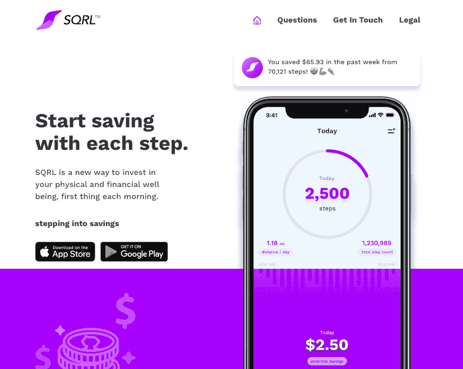
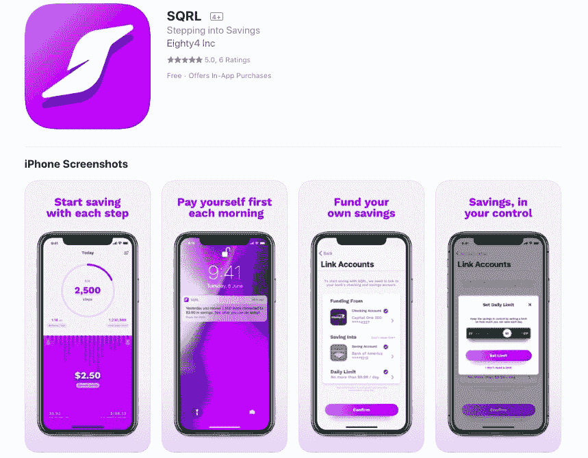
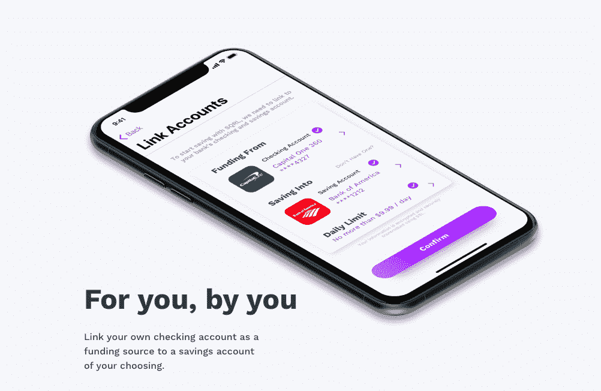

# 扰乱医疗保健行业，同时平衡朝九晚五

> 原文：<https://www.indiehackers.com/interview/disrupting-the-healthcare-industry-while-balancing-a-9-to-5-5c0c707c09>

## 你好！你的背景是什么，你在做什么？

我叫 Om Suthar，我的职业是产品设计师(数字和实物)。作为一名工业设计师，我有幸全程见证了产品开发，从概念草图到用户研究，一直到生产线审核我们的产品质量保证(QA)。当我在 2010 年开始开发应用程序时，这一点一直困扰着我，这真的很好地转化为我现在所做的事情，让我能够将我的角色扩展到设计技能之外，并与产品和技术团队建立牢固的关系。

我目前在 SQRL 工作，这是一个健康和创造财富的平台，允许雇主倡导员工的身体和财务健康。它通过使用苹果健康或谷歌 Fit 集成来读取步骤活动。每走 1000 步就可能节省 1 美元。用户可以通过将自己的支票账户作为资金来源连接到自己选择的储蓄账户来为自己的储蓄提供资金。我们根据他们的活动在每个周末转移资金。我们还为雇主提供了直接向员工(消费者)的银行账户支付有条件激励的能力。例如，员工每天每走 10，000 步，雇主就会支付 1 美元的奖励。这些支付是安全自动和可定制的。

我们刚刚在感恩节假期推出了我们的消费者应用，最近开始试点我们的企业健康平台，目前平均收入约为 1000 美元/月。我们已经帮助 300 多名消费者和 250 名员工为自己节省了 2000 多美元，平均每天增加 12 步。

 

## 是什么促使你开始接触 SQRL？

一段时间以来，我一直致力于解决金融行业的资金问题，我意识到人类是复杂的，我们的问题并不符合我们行业的“垂直行业”。更具体地说，金钱和健康在本质上是交织在一起的。健康状况不佳会导致决策失误，这反过来又会进一步损害健康，形成恶性循环。我认为良好的健康不仅仅是富人的特权，而是每个人都应该买得起、买得起的东西。

我第一次验证这个想法的尝试是进行一个月的测试。我每天晚上缠着大约 40 个熟人要他们走路的截图，第二天我会假装成 SQRL，早上第一件事就是用一个他们不知道我有的电话号码给他们发各种激励短信。“首先支付自己”的想法来自罗伯特·清崎的《富爸爸穷爸爸 T2》一书。

我学到了很多关于积极强化的力量，并发现我最有效的信息是非判断性的和鼓励性的。他们认可或奖励我的用户的活动水平，并通过预测向他们展示他们所做的事情的复合力量。例如，在周末，我会发短信说:“哇，这周你走了 67，000 步，可以省下 67 美元！照这样下去，一年下来你会有 1200 多美元，加油！”

一些很小的事情，比如以提醒你爱自己的认可开始你的一天，有能力为一天的剩余时间定下基调！

我在同理心、以人为本的设计和用户研究方面的背景，在试图解读人们做的、说的和感觉的不一致时，真的派上了用场，这帮助我在过去的八个月里反复定义我的产品。

在我思考这个问题的时候，我和妻子刚刚成为第一次为人父母的人。我不眠不休地创造了无数原型，并在 Usertesting.com 上进行测试，以获得陌生人和熟人的反馈。在整个过程中，我一直有一份全职工作，将一个假设扩展成一个测试，然后变成一个应用程序，现在已经发展成为一项业务。在过去的八个月里，我通常每个工作日从晚上 8 点工作到凌晨 2:30，周末再工作 20 个小时，让公司发展到现在的水平。

这是靠我们的积蓄和家人朋友的一小笔资金支撑起来的。

## 构建最初的产品需要什么？

最初的产品花了超过 15 个可点击的原型、8 个月的开发和超过 1500 小时的设计工作，如果没有我了不起的妻子的支持，这一切都不可能实现。我不确定这是出于爱还是纯粹的肾上腺素，但我们第一个孩子的出生激励我做了比正常的朝九晚五工作更多的事情。我一直渴望建立一些东西，但努力寻找一些可扩展的东西(我可以自己开始，但可以增长到更大)。在 SQRL 这个想法上，我已经拖延了足够长的时间，以至于我对实现这个想法充满信心。

在最初的几个月里，大量的时间花在了设计、测试和改进步骤和节省之间的联系上。我纠结于如何定义这个产品，一种身份危机——它是一个金融应用还是一个健康应用，为什么我必须做出选择？每个月，我都会测试一个新的原型。到了第三个月，我在叙述中感到足够自信，可以去找一个团队来建立一个更高保真的“原型”。几周之内，我从我当地的朋友那里招募了一个由三名本地开发人员组成的团队，一名负责 iOS，一名负责 Android，还有一名负责后端和架构。他们很高兴能从事一些让每个人都有强烈目标感的工作，利用他们的技能，并有望在某一天获利。

作为一个团队，我们的出发点是评估设计意图，并优先考虑功能和范围。对于我们的 alpha 版本，我们优先考虑 Apple Health 和 Google Fit 集成来构建核心仪表板。我们的第二个优先任务是开发和发布每日、每周和每月评审通知。我们的第三个也是最后一个核心特性是与用于 ACH 资金流动的 [Dwolla](https://www.dwolla.com/) API 和用于实时银行认证的 [Plaid](https://plaid.com/) 集成。我们使用 [Firebase](https://firebase.google.com/) 进行数据存储，使用 [Twilio](https://www.twilio.com/) 进行两步认证，使用 [Mailchimp](https://mailchimp.com/) 进行电子邮件通知。我们作为一个团队做出了投资本地语言的决定，这样我们就不必在未来重建代码库。我们在 Kotlin 中构建了我们的 Android 应用，在 Swift 4 中构建了 iOS 应用。我们的后端工程师扮演架构师的角色，而其他两个开发人员专注于他们各自的平台。我们使用 [Trello](https://trello.com/) 来组织看板上的标签，捕捉产品规格和意图，使用 [Zeplin](https://zeplin.io/) 来交流/分享视觉资产，使用[vision](https://www.invisionapp.com/)来展示原型。

伸出手问问题。如果你坦诚、正直，并且不是一个爱出风头的混蛋，你会惊讶地发现你得到了多少回应。

TweetShare

这是团队横向发展的时期。我们学习了如何与我们的 API 合作伙伴集成，如何组织我们的数据，以及在简单的推送通知中需要做多少工作(提示:总是比你计划的要多！).到 2018 年初，我们为 iOS 和 Android 推出了一个 alpha build，我们用了三个月的设计和开发时间来构建，没有动任何钱，但展示了潜在的节省，并根据用户的活动水平每天早上发送通知。有很多错误，我们做了很多工作来稳定我们的健康 API 集成的完整性。

当我们完成我们的 Alpha 测试后，我的期望越来越大，希望将产品变得更加成熟，成为一种更有吸引力和粘性的体验，我意识到我们的兼职开发工作不会让我们达到那个目标。与此同时，我的三个开发人员中有两个由于时间承诺问题和兴趣减弱而想退出。我们最终无法就他们所做工作的权益金额达成一致，我基本上不得不通过放弃迄今为止的整个 alpha 构建并重新开始来解决这个问题。对我来说，这是一个重要的学习时刻，让我明白了明确沟通、积极的期望管理以及在团队建设中相信自己的直觉的重要性。

我的顾问帮我联系了一个很棒的离岸团队，我也加入了这个团队，在一个月内我们就重建了整个 Alpha 原型。八个月过去了，我们上线了多个功能，稳定了核心功能，并为 2019 年建立了一个管道，以使体验更加“粘性”。我们通过与我们人数不多但热情的用户群建立密切关系来做到这一点，利用反馈作为我们如何发展产品的一种回声定位。我们运行了两周的 sprints，以小增量发布，在向公众发布之前，我们在 TestFlight/beta 中测试了所有主要功能。

 

## 你是如何吸引用户和发展 SQRL 的？

我们最初在 2018 年 3 月使用 [Product Hunt 的 Ship](https://www.producthunt.com/ship) 功能来建立一个微薄的潜在用户电子邮件列表。我使用[类型的](https://www.typeform.com/)调查来获取反馈和市场洞察。然后，我在我们的网站上部署了一个接收表单，将我们的邮件列表从 50 个增加到 400 个。然后，我们于 2018 年 6 月在 iOS 和 Android 上同时推出了我们的 TestFlight/beta，我们的测试人员增加到了 200 多人。

当我们在 2018 年 11 月下旬的感恩节假期公开推出我们的应用程序时，我们的网站平均流量为 1.2K 用户/月，我们平均每月有 300 名活跃用户，应用内购买的转化率为 6.5%。我们已经用自己的 API 在我们的数据集中构建了一个定制的分析仪表板，令我们惊讶的是，我们的顶级用户来自阿拉巴马州、佐治亚州和加利福尼亚州。我们的用户平均每天在该应用上花费两分钟，到目前为止，我们已经节省了 2000 多美元。考虑到这都是没有任何付费广告的有机增长，我宁愿继续投资改善产品体验，也不愿过早沉迷于付费的短期收益。例如，通过关注用户体验，我们在过去两周内将升级过程从 22 个屏幕状态减少到 12 个，从根本上提高了我们的转化率超过 14%。

与此同时，我接触了当地的企业主和健康保险领域的思想领袖，以快速提升我的行业知识。在过去的三个月里，我已经制作了我的推销原型，并更多地了解了我的目标受众，以便将过去“不感兴趣”的回应转变为安排介绍性会议。我用同样的产品开发过程来磨练我的 B2B 销售策略。我主要利用上下班的时间打这些电话(每天大约两个小时)，我把每一次谈话都视为一次机会，无论是对我的启迪还是潜在的线索。我有两家健康平台试点公司，总共有 250 名员工，另外三家公司，总共有 5000 名员工，我们将在 5 月份退出试点。

## 你的商业模式是什么，你是如何增加收入的？

虽然我们已经推出了消费者应用程序，通过一次性的应用内购买提供了一些收入，但我们从未想过这将成为我们的主要收入来源，而是我们公司健康平台的一个差异化因素。大多数 B2B 平台会要求您请求演示，但我们的消费者应用程序为我们产品的价值提供了独特的透明度。我们收取一次性安装费和每个用户每月 4 美元的订阅费，试用期为 60 天。

金钱和健康本质上是交织在一起的

TweetShare

虽然我们的竞争对手如 [Castlight](https://www.castlighthealth.com/) 、 [Fitbit](https://healthsolutions.fitbit.com/employers/) 和 [Classpass](https://classpass.com/try/corporate) 拥有出色的基于门户的解决方案，是自上而下构建的企业解决方案，但 SQRL 是自下而上构建的草根运动。我们非常关注用户保持和长期行为改变，从承认和接受你所处的位置开始，没有评判。在我们看来，这两个重点领域是我们的竞争对手所欠缺的。例如，三分之一购买可穿戴设备的人在六个月内停止使用它们，超过一半的人最终会完全放弃它们。对于 Fitbit 的程序来说，这是一个主要的缺点，因为硬件成本是分摊到订阅费用中的。低依赖性和高价值使 SQRL 成为进入企业健康服务的最低门槛。我们根据竞争产品的弱点和反馈建立了我们的竞争优势。

我的第一个企业客户是我通过个人关系找到的一家小型本地企业。我们利用我们的第一个试点，通过冰冷的电子邮件和 LinkedIn 吸引了接下来的几个客户。社交不是一项基于需求的练习，而是一项日常工作，这让我在过去的一年中增加了 1000 多个联系人。每一次谈话都是一次机会，可以进一步完善我的故事讲述，建立我在宣传产品时的信心。我们现在有一个超过 5000 名员工的等候名单，将在 5 月份完成我们的初步试点，并向更多公众推出我们的企业健康平台。

我们目前的月收入是 1000 美元。虽然我们目前没有盈利，但我们从第一天起就一直在赚钱。我们新增了分享用户生成的每日成就内容的功能、让用户与其网络内的人竞争的每周联盟、面对面的每日步数竞赛，以及允许最多六名用户一起为共同事业存钱的团体目标功能。从现在到 8 月，我们将陆续发布这些功能，一路为我们的产品增值。

 

## 你未来的目标是什么？

我的战术目标是帮助每个用户在一年内节省 1000 美元，并在他们的自然习惯上增加至少 2000 步，这相当于患心血管相关疾病的风险降低 8%(估计每人每年节省 500 美元)。我的六个月计划是扩大公司健康服务的试点范围，并启动我们的销售引擎。

我认为良好的健康不仅仅是富人的特权，而是每个人都应该买得起、买得起的东西。

TweetShare

我为期三年的使命是影响医疗保险行业，使其超越现有的状况，利用个人适应和保持健康习惯的能力模式，作为健康保险价值的积极衡量标准，希望让医疗保健更实惠。我的 10 年使命是以一种与各自文化相关的方式将 SQRL 扩展到全球，让世界各地的每个工作场所都能接触到储蓄和健康文化。我们最大的障碍将是如何与 HSA 计划整合，并为消费者提供税前价值。金融和医疗保健是监管最严格的两个行业，这使得创新更具挑战性和回报性。

## 你面临的最大挑战和克服的障碍是什么？如果你必须重新开始，你会做什么不同的事？

最大的挑战是，在你能负担得起的启动资金和种子期能筹集到的资金之间，为一家初创公司提供资金。过去，有一个令人敬畏的推介平台就足够了，然后是一个 MVP 原型，现在它实际上进一步进入了你是否能证明用户愿意为此付费，如果是的话，你知道为什么吗？如果我不得不从头开始，我会在引入 SQRL 货币运动之前构建一些社交功能，因为支持 API 很昂贵。今天的 MVP 是不够的，体验必须是粘性的，并展示指数级的采用曲线和巨大的转化。尽管如此，这必须是一次令人向往的经历。

## 有没有发现什么特别有帮助或者有优势的？

尽可能多的阅读你所在行业的内容——初创公司，无论是来自 reddit、播客还是 LinkedIn。我试着把从上班到去健身房的每一天都充实起来，让自己沉浸在我想要的生活中，同时过着我现在的生活。我发现伸出手问问题真的很有帮助。如果你坦诚、正直，并且不是一个爱出风头的混蛋，你会惊讶地发现你得到了多少回应。杰森·卡拉卡尼斯的([@杰森](https://twitter.com/Jason)在推特上)播客[本周在《创业](https://thisweekinstartups.com/live/)中的观点很有见地，听起来很有趣。

## 对于刚刚起步的独立黑客，你有什么建议？

这些听起来有些陈词滥调，但是在我的经历中听起来确实如此。热爱你所从事的工作，就像你需要空气来呼吸一样，因为那是你所需要的毅力和勇气的来源。创业的概念是将所有的痛苦、学习和成长从五年的时间跨度压缩到两到三年。在整个过程中检查自己，管理期望和你与自己的关系；这是马拉松，不是短跑。仅仅因为你努力工作并不意味着你有资格获得结果，这只是一个获得机会的限定条件。就像游泳一样，你试图为自己建立一个节奏来继续前进，并朝着一个目标串联起一系列的突破。

## 我们可以去哪里了解更多？

如果 SQRL 看起来很有趣并且符合你的价值观，我鼓励你访问我们的[网站](https://sqrl.me/)，甚至尝试一下这个应用程序。你也可以在推特 [@SQRLme](https://twitter.com/sqrlme) 、Instagram [@sqrlme](https://www.instagram.com/sqrlme/?hl=en) 和[脸书](https://www.facebook.com/SQRLme/)上关注我们。我重视您的反馈，并鼓励您在下面给我留下一些评论和问题👇🏽。

——[<picture id="ember8070400" class="user-avatar ember-view user-link__avatar"></picture>奥姆苏塔尔](/@astr0mnaut?id=q4ogQZJLGugJsY4ONxBdBXr23Kv2)，SQRL 的创始人

## 想像 SQRL 一样建立自己的事业吗？

你应该加入独立黑客社区！🤗

我们是几千名创始人，互相帮助建立有利可图的业务和副业。来分享你正在做的事情，并从你的同事那里获得反馈。

还没准备好开始使用你的产品吗？没问题。这个社区是一个认识人、学习和实践的好地方。随意[随便浏览](/)！

—[<picture id="ember8070405" class="user-avatar ember-view user-link__avatar"></picture>考特兰艾伦](/csallen?id=ibTLPyjwVebnZjMGKvz6ztarnuV2)，独立黑客创始人

32votes