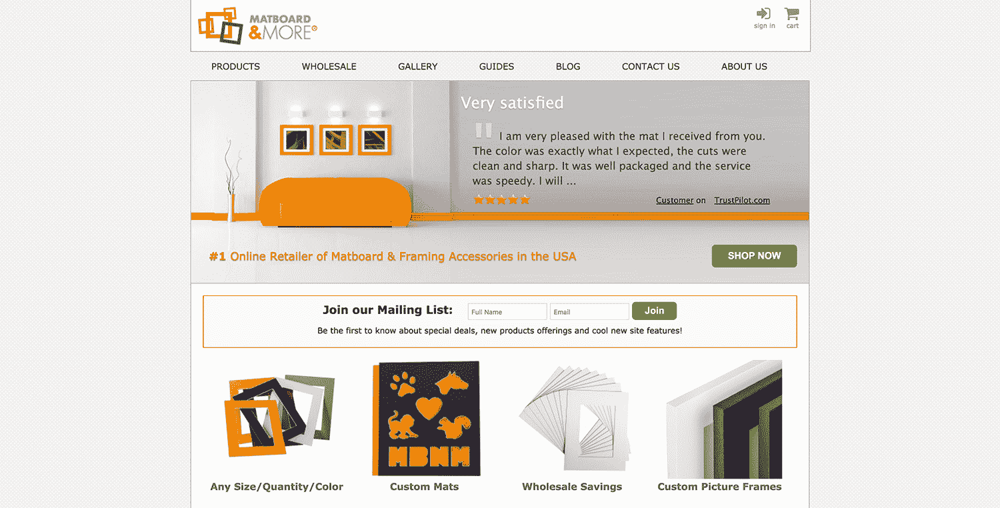
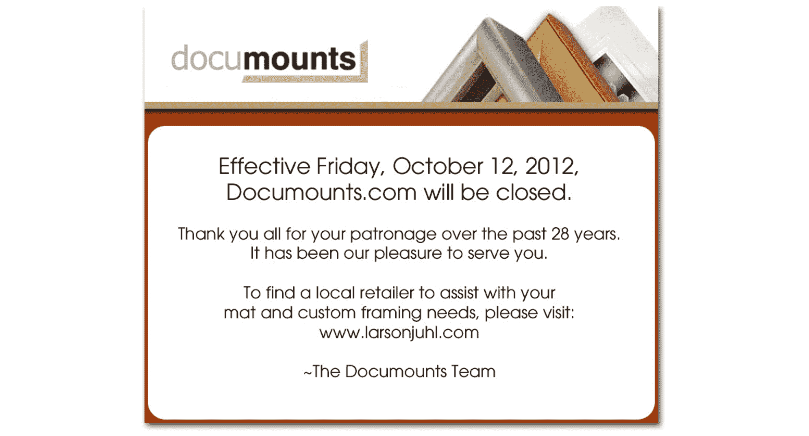

# 分而治之:通过委派任务增长到 17 万美元/月

> 原文：<https://www.indiehackers.com/interview/divide-and-conquer-growing-to-170k-mo-by-delegating-tasks-f0b7b2b98d>

## 你好！你的背景是什么，你在做什么？

嘿！我叫迈赫迪·卡吉巴夫。我是一名电子工程和 MBA 毕业生，在里斯本接受采访。我已经环游世界三分之一了，我和我的梦中情人结婚也有几个月了。:)

我出生在伊朗，在多伦多长大，我很兴奋地告诉你我如何用 Matboard 和更多的东西来换取网站流量和大量自由的故事！

[Matboard 等](https://www.matboardandmore.com/)为老派画框行业带来成熟。我们的使命是让世界变得更美好，一次一件艺术品。我们可以轻松获得任何尺寸、颜色和数量的*席子和框架。*

无论您是日常家居装饰者、希望专业展示您的作品的艺术家，还是需要数千张经济型地垫的大型零售商，我们都能让您轻松简单地在网上完成这一切。

我很幸运地将公司发展到了这样的地步，在周游世界的时候，我个人每年可以赚大约 25 万美元。

 

## 是什么促使你开始使用 Matboard 以及更多？

我早年的大部分时间都在自动驾驶。我是一个聪明的孩子，擅长数学和科学，像任何循规蹈矩的波斯人一样，我决定学习工程。我就读并毕业于加拿大最好的学校——滑铁卢大学，并找到了一份制作交通控制产品的好工作。(我所说的“交通”指的是高峰时间、红灯，以及我们每天开车上班时都讨厌的一切。)

一年后，我意识到我不知道自己在做什么。这不是一个糟糕的生活。我周围的大多数人真的很开心，很享受，但我开始觉得被困住了。

我意识到，如果我不做出改变，我将永远沿着一个领薪水的工程师的道路走下去，这吓坏了我。我一直想去看看这个世界，但一年只有两周的假期是不可能实现的。所以我辞掉了工程方面的工作，在秘鲁呆了一个月(包括一次马丘比丘徒步旅行)，完成了我的工商管理硕士学位，不久之后推出了 [Matboard 和更多](https://www.matboardandmore.com/)。

开始吧。这意味着开发你的产品并投放市场。不要等待它变得完美。

TweetShare

Matboard 和 More 是我与我的兄弟和妹夫的合资企业。对我来说，动机是非常私人的。我想建造一些神奇的东西来获得自由去生活。对画面取景的热情来自姐夫，技术功力来自哥哥。

该公司最初是一家向大型在线印刷公司销售产品的 B2B 企业。然后，我哥哥建立了网站，推出电子商务方面的东西，但销售缓慢，网站没有得到太多的牵引力。那时，我加入了领导营销和商业战略。

一个伟大的网站并不足以保证成功——即使是一个伟大的产品。营销是至关重要的，你需要一个业务管理员来组织事情。我不太了解市场营销、业务发展或相框，但我有信心知道我可以创建一个成功的企业。

我在 Schulich 大学攻读 MBA 期间学到，成功背后没有灵丹妙药。我遇到了许多成功的商业人士，并注意到…嘿，他们没有什么特别的地方是我没有的。他们不是超级聪明，超级勤奋，或者什么都不是。他们只是出去做了。我想我也可以。

这花了大约 4 年时间，我很自豪地说，我得到了我迫切需要的自由。选择住在世界上的任何地方，在不牺牲我的职业或生意的情况下进行冒险，这是令人难以置信的回报。

当然，在这个特殊的行业中，如果没有合作伙伴帮助运营日常业务，这是不可能的。我可以带来客户，但卓越的运营是留住他们的关键。

## 构建最初的产品需要什么？

我们 5 年前推出的 [Matboard 和 More](https://www.matboardandmore.com/) 网站与你今天看到的非常不同。它基本上是一个购物向导，允许你选择你的尺寸、颜色和数量，然后结帐。

我们只卖垫子(没有框架或配件)，这很简单，但它证实了人们正在寻找定制的垫子。从那时起，我们对设计进行了无数次迭代，现在我们有了数百种颜色、框架和配件。

这种伙伴关系运作得非常好，部分原因是我们拥有让它在内部运作的所有必要技能。正如我之前所说，我哥哥创建了网站，我姐夫有寻找和购买设备并建立生产的行业经验，我负责所有的市场营销和业务开发。

一个伟大的网站并不足以保证成功——即使是一个伟大的产品。营销至关重要。

TweetShare

总的来说，它在设备、启动库存和设施设置方面花费了大约 50，000 美元，以及 18 个月的软件开发，以开始接受和履行订单。

## 你是如何吸引用户和发展 Matboard 等的？

我们最初的客户来自搜索引擎营销——几乎完全来自 [AdWords](https://adwords.google.com/) 。我们的 AdWords 支出迅速增加(第一个月 1000 美元，第二个月 2000 美元，然后 6 个月每月约 6000 美元)。

在开始的时候获得流量是至关重要的，这样我们就可以获得客户体验的反馈。在这个阶段，我花了很多时间与客户交谈，分析谷歌分析数据，优化营销活动。我们利用我所学到的知识来改进网站，同时不断增加产品和扩大业务。

然后，这基本上是一个营销支出，分析客户行为，优化网站的向上循环。12 个月后，我们的营销支出获得了正的投资回报，因此我们的预算达到了极限。

我应该指出，在过去的 12 个月里，我们进行了大量投资，并对自己充满信心。有时候，这对一些企业来说是难以下咽的药丸，但那句老话是对的:你必须花钱才能赚钱。SEO 很快就出现了，我们目前在所有 matboard 相关的关键词中排名前 3。

| 年 | 用户(会话) |
| --- | --- |
| 2012-2013 | 88345 |
| 2013-2014 | 138585 |
| 2014-2015 | 304253 |
| 2015-2016 | 370881 |

前两年，我们最大的支出是广告。获得客户是昂贵的，所以我们尽最大努力留住他们。(回头客是我们收入的 65%。)我们通过卓越的客户服务和高质量的工作做到这一点。

通过[重新评价](http://www.resellerratings.com/store/Matboard_And_More)(1813 条评论中的 9.96/10)和[信任试点](https://www.trustpilot.com/review/matboardandmore.com?utm_medium=trustboxes&utm_source=Horizontal)(3302 条评论中的 9.79/10)，成千上万的客户给了我们反馈，证明了我们的良好工作。

这些积极的评价是我们成长的另一个重要因素。拥有良好的网上声誉，并且诚实地获得，对于说服人们给你一个机会是非常重要的。

我们在社交媒体或公共关系方面没有取得多大成功；这是一个棘手的问题。部分是因为我们的生意并不那么性感。很难找到新的渠道来发展在线业务，因为我们几乎已经开发了搜索。尽管如此，我们继续通过口口相传实现有机增长。最终，最好的营销是做好工作，让你的客户满意。

## 你的商业模式是什么，你是如何增加收入的？

我们开始 [Matboard 和更多的](https://www.matboardandmore.com/)线下 B2B 销售。早期的一笔交易让我们能够为运营提供资金并建立网站，我们知道，在这个以网络为中心的世界里，网站将成为我们业务的真正核心。

正如我之前提到的，我们通过 AdWords 获得销售，后来能够利用有机搜索。现在，这是一个非常健康的组合的点击付费，搜索引擎优化，重复业务，和有机转介。

头三年我们的销售额翻了一番，但最近开始稳定下来。我们错过了一个巨大的机会，没有一个手机友好的网站，但我们已经有了一个完全响应的版本，相信它会给我们一个很大的推动。

## 你未来的目标是什么？

我们现在在 Matboard 和 More 的最大目标是推出我们的响应网站。这比预期的时间要长一点，但这将会改变游戏规则。

自从我们推出了我们的网站，手机已经完全起飞，我们在这方面失败了。这也损害了我们转化社交媒体流量的能力，这些流量几乎都是移动的。

我们知道这将改善我们业务的各个方面，所以这是我们的首要任务。

之后，我们将真正专注于业务的框架方面。我们确实垄断了定制席子的市场，但框架是一个更大、更有利可图的市场，更难突破。为此，新网站将是巨大的。

## 你面临的最大挑战和克服的障碍是什么？

我们最大的错误是没有在早期充分投入时间。在我们的合作关系中，我们有两位全职联合创始人和一位兼职联合创始人。兼职人员负责技术部分，不幸的是，我们在完成网站的事情上慢了很多。

我相信，如果我们从第一年或第二年就有一个全职的 web 开发人员，我们现在已经领先两年了。Mobile 将会完全实现，我们所承担的数百项功能和产品改进将会更早完成。

我们的第二个错误是授权不够。运营成功体现在质量、速度和降低成本上。随着我们员工人数的增加，我们努力委派任务和建立有效的系统。

有时候，投资于人力资源并雇佣大量劳动力来预期增长是很可怕的。另一方面，当你成长的时候，工作仍然需要完成，所以它最终落在了所有者的肩上。

作为一家年轻的初创公司，创始人承担大部分工作，而转型成为一家真正的企业，创始人管理，员工执行，这两者之间需要平衡。简而言之，授权。我们花了比必要时间长得多的时间来完成这一转变，我认为这主要是由于低风险承受能力。然而，这也是一种必须培养的技能。

对我自己来说，尽快从日常工作中抽身出来一直是我的目标。这是成功的一个巨大标志，大约 14 个月前我实现了这一点。现在，我可以在里斯本冲浪，在布拉格聚会，在世界各地旅行，同时管理和做出重大决定，而我的团队则负责日常工作。

我意识到，如果我不做出改变，我将永远走在领薪水的工程师的道路上。

TweetShare

## 你最大的优势是什么？有什么特别有用的吗？

坦率地说，我们最大的优势是选择了一个技术尚未掌控的行业。图片取景仍然是一个相当老派的行业，所以我们一开始就有巨大的优势。我们的网站刚推出时，比其他网站都强。

我们还有一位拥有 40 多年经验的联合创始人，他能够与供应商达成令人难以置信的交易，并建立了一个高效、高质量的生产体系。

事实上，我们所有的联合创始人在他们的领域都非常有才华，令人惊讶的是，这三种截然不同的技能组合在一起，为我们提供了取得成功所需的一切。

我们在早期确实很幸运，因为我们的一个大竞争对手，Documounts，在我们发布网站几周后就关闭了。我们能够利用这一点，将他们的客户转化为我们自己的客户，因为我们在正确的时间做好了准备。时机真的很重要。

  

我们的另一大优势是，我们的产品利润极高，因此我们能够在第一年实现盈利(尽管我们几乎没有向联合创始人支付任何费用)。当你获得规模经济和稳定的客户群时，盈利能力会快速增长。对我来说，成功的最大标志之一是运输成本两年来取代营销成本成为我们最大的支出。从那以后我们再也没有回头。

## 对于刚刚起步的独立黑客，你有什么建议？

开始吧。这意味着开发你的产品并投放市场。不要等待它变得完美。用你的钱来测试和验证你的想法，并仔细倾听你的客户。疯狂迭代，永不停止改进，确保留住每一个客户。

最好的营销是好的产品和令人惊叹的服务。

专注于做好所有的小事比试图做单个的大事更容易，也更省钱。

大多数企业都不擅长做小事——当有人打电话时拿起电话，回复邮件，修复任何错误！把所有的小事都做好，让你的客户有更好的体验，钱就会随之而来。

我遇到了许多成功的商业人士，并注意到…嘿，他们没有什么特别的地方是我没有的。

TweetShare

我要给出的最后一条建议是尽可能多地获得您的系统，即支付处理器、客户服务通信、生产集成、运输等。在游戏早期排序。当你很小的时候，更换供应商和系统比你很忙很习惯的时候要容易得多。

这些年来，许多支付处理商都与我们接触过，但幸运的是，他们只是确认我们已经有了一笔最好的交易，这笔交易是我们在转换多次后在流程早期获得的。

## 我们可以去哪里了解更多？

请访问我们在 www.matboardandmore.com[的网站](https://www.matboardandmore.com/)，如有任何问题或意见，请随时在[T5【电子邮件保护】](/cdn-cgi/l/email-protection#89e4e2e8e3ebe8efc9e4e8fdebe6e8fbede8e7ede4e6fbeca7eae6e4) 与我直接联系。我也会在这里查看评论。

—[<picture id="ember5307811" class="user-avatar ember-view user-link__avatar"></picture>迈赫迪](/MehdiKajbaf?id=matboard-and-more-owner)，Matboard 的创建者等等

## 想像 Matboard 等一样建立自己的企业？

你应该加入独立黑客社区！🤗

我们是几千名创始人，互相帮助建立有利可图的业务和副业。来分享你正在做的事情，并从你的同事那里获得反馈。

还没准备好开始使用你的产品吗？没问题。这个社区是一个认识人、学习和实践的好地方。随意[随便浏览](/)！

——[<picture id="ember5307816" class="user-avatar ember-view user-link__avatar"></picture>柯特兰艾伦](/csallen?id=ibTLPyjwVebnZjMGKvz6ztarnuV2)，独立黑客创始人

6votes