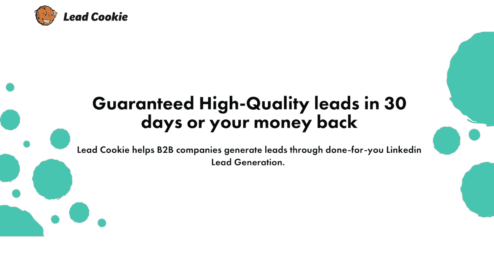
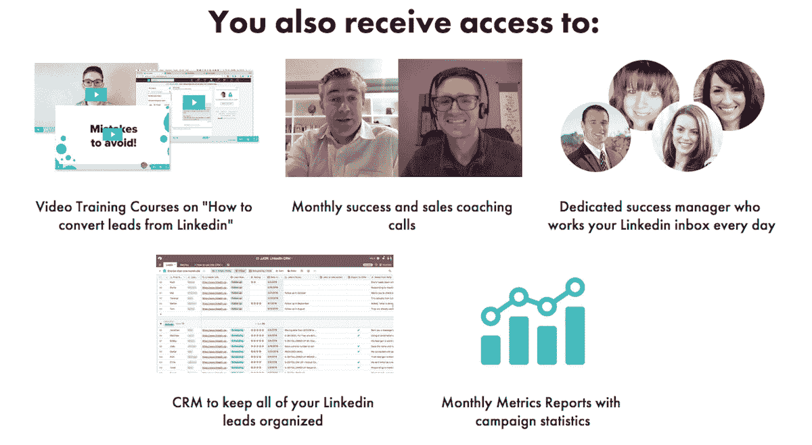
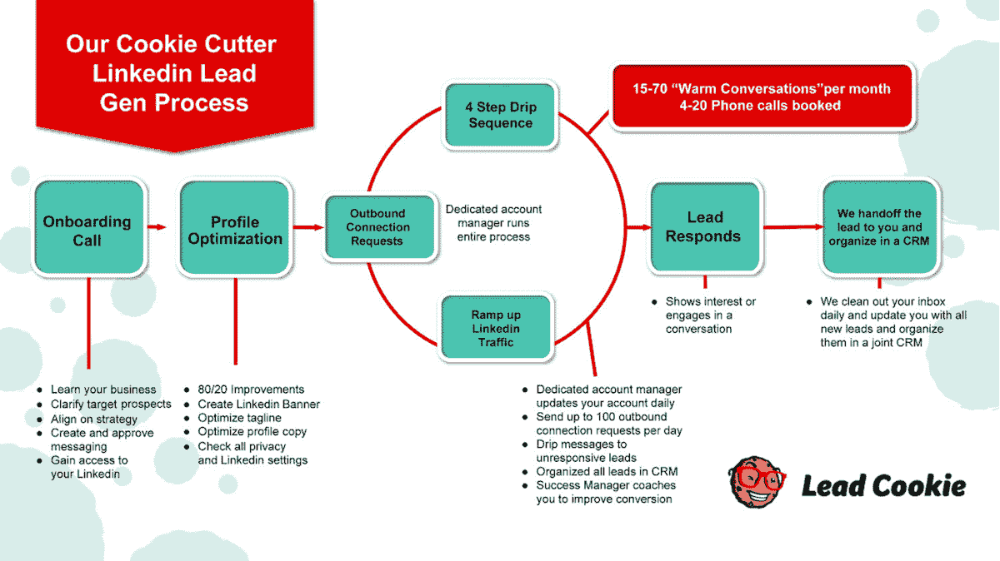
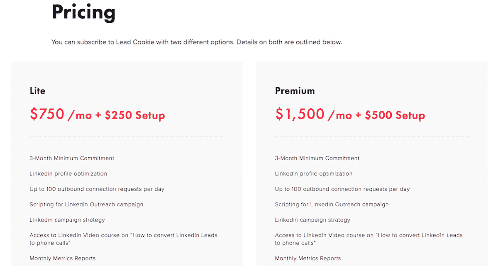

# 吃我们自己的狗粮，将产品化服务发展为盈利能力

> 原文：<https://www.indiehackers.com/interview/eating-our-own-dogfood-to-grow-a-productized-service-to-profitability-c19aecaeb7>

## 你好！你的背景是什么，你在做什么？

我是杰克·约尔戈万，[领先饼干](https://www.leadcookie.com/)的创始人。在过去的几年里，我一直是代理公司和咨询公司的销售顾问，一年多前，我推出了 Lead Cookie。

线索 Cookie 是一个为你做的 LinkedIn 线索生成服务。我们管理您的 LinkedIn 帐户，并在您和您的理想客户之间开始热烈的交谈。我们的大多数客户平均每个月从我们提供的线索中预订 3-8 次电话。

Lead Cookie 目前每月产生约 4.5 万美元的经常性收入，我们有望在 2018 年底达到 5 万美元的 MRR。

 

## 是什么促使你开始使用 Lead Cookie 的？

多年来，我一直在与代理机构进行一对一的咨询，并痴迷于找出可重复的系统来产生新客户。最终，我偶然发现战略性地使用 LinkedIn 作为一种策略。在那里，我研究了几个领先一代的思想领袖——像约翰·尼莫和乔什·特纳——以了解什么对他们有效，然后用这些知识创造一个为你做的服务。

为了开始行动，我利用了我现有的关系网。在我的咨询工作中，我与近 400 家不同的机构进行过销售拜访，所以我开始在那里销售，并得到了很多早期的确认。第一周，我在 MRR 赚了 5000 美元，第二周在 MRR 赚了 12000 美元。

当时我有一个糟糕的网站，并把这项服务称为“LinkedIn Panda”。在接下来的一年里，我慢慢地从咨询转变为全职负责线索 Cookie。今天，我全职负责领导 Cookie，尽管我偶尔也会兼职做一些咨询项目，我们在美国和海外有一个 16 人的团队。

## 构建最初的产品需要什么？

最初的产品是粗糙和肮脏的，因为我们不是一个软件产品，也不打算成为。我们出售一项服务，并主要专注于此，所以虚拟助理和其他团队成员基本上运行我们的整个操作。

构建我们的服务包括创建定义的标准操作程序，然后开发一些内部软件工具和集成，帮助我们提高效率和生产力。由于我们建立在 LinkedIn 之上，我们有一个移动的基础。我们一直在努力重组和完善我们的服务，以跟上 LinkedIn，所以我永远不会说它是一个成品，或者我们已经达到了一个可以停止迭代的点。

聘请一位教练或导师，他已经做了你想做的事情。这是通往成功的最快捷径。

TweetShare

这整个项目是自筹资金，没有外部资本。在我还在做全职咨询的早期，我在晚上和周末拼命工作，创造出必要的时间来扩大服务，同时控制账单。我分析出我最讨厌做的事情，并试图最快地把它们从我的盘子里拿走，这样我就可以专注于我的优势，并在我周围建立一个支持我的团队。

WPCurve 的联合创始人亚历克斯·麦克拉弗蒂(Alex McClafferty)在整个过程的开始阶段发挥了重要的影响，并提供了巨大的支持。在创业的前六个月，他为我提供了建议，并在帮助我提升企业家水平方面发挥了不可估量的作用。没有他的指导，我不会有今天。

 

## 你是如何吸引用户和销售线索的？

正如我提到的，我利用现有的客户群来建立初步的销售、验证和信誉。在那之后，我们制作了一个[基石内容](https://jake-jorgovan.com/blog/a-how-to-guide-on-linkedin-lead-generation)，在那里我们基本上展示了整个销售线索生成流程。钩子？然后，我们提供了一个内容升级来接收我们的实际脚本。

这一部分内容是一项惊人的投资。它已经遍布互联网，发布在 reddit 和许多其他在线社区上，而我们没有做任何推广或营销。这篇文章现在也被列为 LinkedIn lead generation 的第一个谷歌结果，位于 LinkedIn 本身之下，SEO 排名现在已经开始产生重要的线索。总的来说，内容为我们带来了大约 20%的收入。

我们还吃自己的狗粮，通过冷冰冰的电子邮件和 LinkedIn outreach 获得客户，这大约占收入的 25%。我们用 PersistIQ 处理冰冷的邮件，我写了一篇[博客文章](http://blog.persistiq.com/a-step-by-step-framework-to-streamlining-your-entire-cold-email-process)详细描述了我们的过程。

我们做的最后一件事是建立几个推荐合作伙伴，大部分是通过我自己现有的网络建立的，因为我多年来一直在咨询和代理领域建立自己的影响力。其中许多都是在营销领域，并提供附带服务，如广告或内容。这种推荐系统约占我们收入的 50%。

 

## 你的商业模式是什么，你是如何增加收入的？

| 月 | 收入 |
| --- | --- |
| 17 年 10 月 | 15696 |
| 17 年 11 月 | 15696 |
| 2017 年 12 月 | 16498 |
| 2018 年 1 月 | 25648 |
| 2018 年 2 月 | 33148 |
| 18 年 3 月 | 29599 |
| 2018 年 4 月 | 33799 |
| 2018 年 5 月 | 24799 |
| 2018 年 6 月 | 30499 |
| 2018 年 7 月 | 29550 |
| 2018 年 8 月 | 40250 |
| 18 年 9 月 | 46775 |

我们的商业模式很简单。我们收取少量的安装费和每月服务费。在 beta 测试阶段，我们收费很低，我们的第一批客户以每月 499 美元的价格签约。从那时起，我们一直在提高价格，以保持我们认为我们提供的价值，最终达到每月 2000 美元。围绕这个数字，我们遇到了很多阻力，所以我们最终回落到 1500 美元。2018 年 7 月，我们决定推出售价为 750 美元的“精简版”产品，这非常棒，为我们可以服务的新客户层打开了大门。

在物流方面，我们使用[Invoiced.com](https://invoiced.com/)搭配条纹。我经历了一吨不同的经常性支付解决方案，但 Invoiced.com 原来是我们业务的最强有力的竞争者。首先，它有很好的循环计费功能，具有很大的灵活性和定制性。第二，他们只收取月服务费，而不是像许多其他发票提供商那样收取一定比例的交易费。

我没有预料到的一件事是高流失率。起初，我认为这与我们的特定服务有关，但我最终了解到，大多数领先一代公司都有很高的流失率。潜在客户生成并不像帮助核心处理或运营的服务那样重要或具体化，因此营销总监和其他当权者经常会围绕预算转移，以测试不同的潜在客户生成策略。我们每月流失大约 20%的客户。虽然这个数字可能看起来很高，但你必须记住，流失既有积极因素，也有消极因素。一些客户流失是因为他们得到了太多的线索！

 

## 你未来的目标是什么？

最初，我的目标是将这项业务扩大到数百万美元和数百名客户。随着我对潜在客户生成服务中固有的流失率了解得越来越多，我意识到这有多难。每月流失 20%的客户意味着你必须收回所有的销售额才能达到收支平衡。

每月 50 个客户，我们将流失 10 个客户，这意味着我们需要做 10 次销售才能保持不变。那似乎是合理的。在 500 名客户中，我们每月流失 100 名客户。这意味着我们每个月必须创造 100 个*新*销售额，才不会倒退。试图建立如此大的销售量和运营基础设施的想法似乎是疯狂的，这就是为什么我们公司的愿景是 60 个客户加上一个等待名单。这将使我们每年花费大约 100 万澳元。我们每个月大概会有 12 个客户，但是实际上可以有一个客户经理监管所有这些客户。我认为我们将能够在大约一年半的时间里达到这个目标。

## 你面临的最大挑战和克服的障碍是什么？如果你必须重新开始，你会做什么不同的事？

我们最大的挑战无疑是销售线索生成即服务中隐含的客户流失。这不是我最初计划中考虑的一部分，很难接受。有利的一面是，潜在客户总是有需求的，有无限多的潜在客户需要这项服务，因此获得新客户相当容易。

客户流失的原因有很多，比如销售线索太多，难以转化销售线索，我们已经饱和了他们的市场，等等。我们正在尽我们所能提高我们的客户成功率和保留率，并为我们的销售团队提供培训和资源，以保持新客户的到来。

如果你不像一个人那样成长，你的事业就不会发展。

TweetShare

坦率地说，如果我必须从今天开始，我不会做一个潜在客户的生意。我会做一些更稳定和可预测的事情。但我不是在抱怨。这是我第一次在生意上取得真正的巨大成功，一路上我学到了很多！

## 有没有发现什么特别有帮助或者有优势的？

在制作领先饼干的前六个月，我聘请了亚历克斯·麦克拉弗蒂作为教练，帮助我发展业务。正如我之前说过的，他的指导是无价的，并防止我一路上犯这么多错误。

吉诺·维克曼的《T2 牵引》是一本关于如何组织会议和为公司建立愿景的好书。我们整合了本书中概述的许多流程。

[设计公司](http://russperry.co/)[的 Russ Perry](http://designpickle.com/)Pickle也受到了启发。虽然我还没有能够聘请他作为顾问，但他向我介绍了[觉醒战士](https://www.thekingskit.com/kings)，这已经改变了我的生活。《唤醒勇士》背后的原则很简单:如果你不像一个人那样崛起，你的企业就不会崛起。

## 对于刚刚起步的独立黑客，你有什么建议？

聘请一位教练或导师，他已经做了你想做的事情。这是通往成功的最快捷径。和他们一起工作，你会学到比几个月内独自工作更多的东西。

## 我们可以去哪里了解更多？

如果你想学习如何使用 LinkedIn 为你的企业创造商机，请访问我的个人博客并阅读本指南。

如果你想要一个为你做的 LinkedIn 潜在客户生成服务为你做这一切，那么去 LeadCookie.com。

如果你对我如何发展业务、LinkedIn 或其他任何东西有任何问题，请在下面告诉我！

——[<picture id="ember8114397" class="user-avatar ember-view user-link__avatar"></picture>杰克·约尔戈万](/JakeJorgovan?id=SiMCVwp8xSWjoQ8Mew0LNIVBMrz2)【引曲奇创始人

## 想像铅饼干一样建立自己的事业吗？

你应该加入独立黑客社区！🤗

我们是几千名创始人，互相帮助建立有利可图的业务和副业。来分享你正在做的事情，并从你的同事那里获得反馈。

还没准备好开始使用你的产品吗？没问题。这个社区是一个认识人、学习和实践的好地方。随意[随便浏览](/)！

——[<picture id="ember8114402" class="user-avatar ember-view user-link__avatar"></picture>柯特兰艾伦](/csallen?id=ibTLPyjwVebnZjMGKvz6ztarnuV2)，独立黑客创始人

36votes