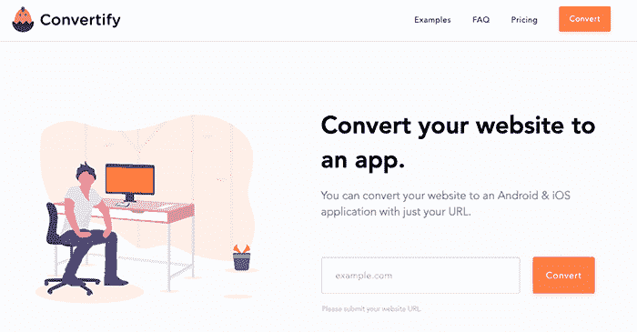
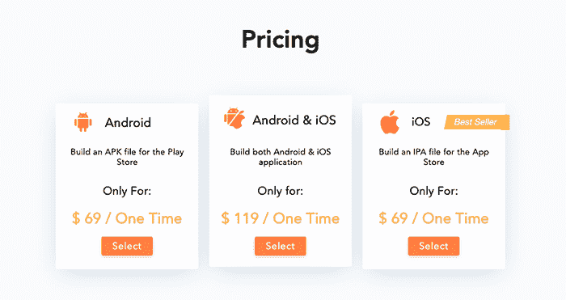
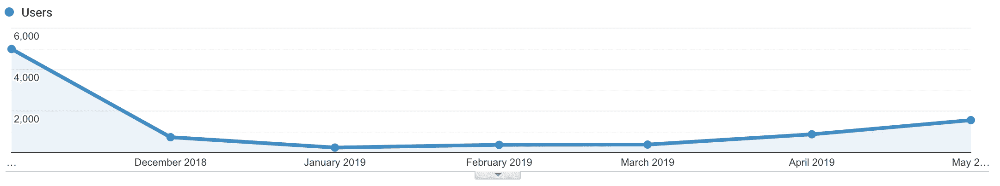

# 逃离“悲伤的低谷”,增长到每月 5000 美元

> 原文：<https://www.indiehackers.com/interview/escaping-the-trough-of-sorrow-and-growing-to-5k-month-0ab0dd3b44>

## 你好！你的背景是什么，你在做什么？

你好！我叫卢卡斯·马尔多纳多，是一名来自阿根廷的企业家和开发人员。我 16 岁的弟弟和我创建了 [Convertify](https://convertify.app/) ，这是一项将网站转换成 Android 和 iOS 原生移动应用的服务。

八年前，我开始了自己的创业生涯，从那以后，我与人合伙创办了几家公司:

*   拥有约 40，000 家分支机构的图像托管网站。
*   [PopMyAds](https://popmyads.com/) ，一家广告网络，每天提供超过 1000 万次广告投放。
*   [医生](https://doctor.com.ar/)，一个超过 100，000 名注册医生的可搜索数据库。

但是今天我要说的是 Convertify。我们帮助零移动开发知识的人将他们的网站转换成移动应用。如今，我们每月从这项服务中获得约 5000 美元的收入。

 

## 是什么促使你开始使用 Convertify？

当我和哥哥意识到我们需要创建一个移动应用程序时，我们正在做一个兼职项目。我们的网站非常强大，但拥有移动应用所需的用户体验。从那时起，我们开始考虑将网站转换成应用程序。

作为 web 开发人员，我们一直认为不可能创建一个原生的 Android 或 iOS 应用程序。应用程序开发与 web 开发有很大不同。但是我们认为，如果我们使用一些最新的网络技术(Angular，React，Vue ),我们可以创建一个响应性的网络应用程序，它的外观和功能就像一个本地应用程序一样。我们决定向几个从事科技行业的朋友推销这个想法，并收到了很好的反馈。

提前计划，在你可以完全投入的那一天开始。

TweetShare

## 构建最初的产品需要什么？

为了尽快发布，我们开始构建一个 MVP，仅用了一周时间就组装好了网站。这是一个简单的登录页面，简单介绍了我们产品的用途和价值。

困难的部分是开发将网站转换到 Android 和 iOS 的实际框架。没有太多开发移动应用的经验，我们真的不知道如何开始。在我们准备好 MVP 产品之前，花了无数个小时阅读 Android Studio、Xcode 文档和堆栈溢出。

因为 Convertify 开始时是一个完全自举的辅助项目，我们花了将近五个月的时间来构建它；Android 大概两个月，iOS 大概三个月。我们发现 iOS 开发有点困难。

这是 Convertify 的核心。我们已经消除了创建原生应用程序的麻烦和工作时间，因此独立黑客可以轻松地在 Google Play 和 App Store 上推出他们自己的应用程序。

 

## 你是如何吸引用户并发展 Convertify 的？

正如许多创始人选择做的那样，我们决定发起产品搜索，并进一步决定在周二进行。由于产品搜索服务器是基于 PST 时间的，所以我们设置了闹钟来提前唤醒并发布我们的产品。我们非常兴奋，但还是回去睡觉了。

第二天早上，我们的产品着火了。我们已经有了 108 次投票，15 条评论和 9 个转换网站的请求。

发射日总是过山车；我们的建议是提前计划，选择在你可以完全投入的一天去做。你将整天回复评论、电子邮件和聊天。每一次互动都很重要；我们当天达成的许多销售都是直接通过实时聊天完成的。

第一周，我们在产品搜索上获得了 525 次投票和 64 条评论，这使得我们的产品在网站上排名第三。在我们实际推出的那天，我们在第一周就卖出了 21 件，总共 43 件。

我们最终在第一个月有 4000 名独立访客。然而，在最初的产品搜索发布后，我们并没有得到更多的关注。因此，我们决定把我们的努力和重点放在通过写高质量，提高搜索引擎优化的文章来增加有机流量。我们主要写了如何使用 Convertify 来解决特定的问题，使用的关键字有“[将网站转换为 android 应用](https://convertify.app/)”和“[将网站转换为 ios 应用](https://convertify.app/)”

游客在 2018 年 12 月迅速降至 1000 人，并在 2019 年 1 月和 2 月跌至 200 人的谷底。我们几乎放弃了这个项目。但是 SEO 需要一段时间才能生效，我们开始注意到在三月份访问者增加到 400 人，然后在四月份达到 1200 人。

## 你的商业模式是什么，你是如何增加收入的？

我们的商业模式很简单:销售应用程序。当我们将网站转化为应用程序时，我们销售的是终身应用程序。一旦我们转换应用程序，我们与客户的关系就结束了。

尽管我们在产品搜索上非常成功，但我们很快就进入了著名的悲伤低谷。第一个月，我们卖出了价值近 900 美元的应用转换，但在接下来的三个月里，这一收入迅速下降到 100 美元以上。我们很快意识到我们需要一个可持续的新客户流。

我们的 SEO 工作在 2019 年 3 月开始起步，并将我们的价格从 14 美元提高到 49 美元。我们增加了 Stripe 作为支付选项，更多的人开始购买。我们设法获得了大约 500 美元的有机收入。正是在这个月，我们开始觉得 Convertify 可能会相当成功。

我们的下一步是确定如何从现有客户那里获得更多的钱。我们添加了推送通知作为额外功能，价格为 30 美元。这被证明是一个巨大的成功；我们 90%的客户选择将推送通知添加到他们的订单中，我们在 4 月份成功赚取了大约 5，000 美元。

 

## 你未来的目标是什么？

我们有许多目标和目的:

*   我们提供的每个应用程序都是由我们精心手工制作的。我们希望在不放弃定制的情况下，尽可能自动化这一过程。
*   我们希望每月平均收入达到 10，000 美元。
*   SEO 仍然有很大的增长空间，因为我们甚至不会出现在我们关键词的第一页。
*   与推送通知插件类似，我们将继续开发新功能，为我们的客户提供更多价值。
*   我们希望集成更多的原生 SDK，如应用内购买。
*   我们计划在博客上增加更多内容。

## 你面临的最大挑战和克服的障碍是什么？如果你必须重新开始，你会做什么不同的事？

定价真的很难确定。我们开始对每个转化为 iOS 或 Android 的应用收取 15 美元。我们认为通过收取很少的费用，我们可以吸引成千上万的顾客。但是我们很快意识到这个定价方案是完全错误的。在与数百名客户的交谈中，大多数人表示他们认为该网站是一个骗局，他们不信任我们的网站。

我们的服务是相当人工的。我们必须根据客户的规格转换每个应用程序，我们很快就厌倦了花几个小时转换网站，只需 15 美元。

所以我们把价格提高到了 49 美元。通过这一简单的改变，我们再次受到激励，并发现更多的客户信任我们的服务。我们几乎立刻就看到了销售额的增长。从那以后，我们又把价格提高到了 69 美元，同样取得了积极的结果。

如果我们可以重新开始，我们会在一开始就定一个更高的价格，而不是反过来。

## 有没有发现什么特别有帮助或者有优势的？

拥有经营在线业务的知识肯定有所帮助，但我想说的是，有我哥哥作为联合创始人真的让旅程尽可能顺利。我们是一家小型企业，很多时候工作量都很大。在这方面，有一个合作伙伴真的很有好处。

早期专注于 SEO 真的可以为你未来的成功做好准备。搜索引擎优化已经成为我每项业务的重要组成部分。第一步是确保你有现场搜索引擎优化，这为一个坚实的搜索引擎优化战略奠定了基础；没有这一点，一切都有分崩离析的危险。使用两个必备工具选择你的目标关键词:[谷歌关键词规划器](https://ads.google.com/intl/en_in/home/tools/keyword-planner/)和[谷歌趋势](https://trends.google.com/trends/?geo=US)。确保所有为你的网站写的东西都与这些关键词相关。

我明白了博客是任何软件业务最重要的部分之一，因为写关于你的领域的内容会让你成为权威。

一旦你确定了站内搜索引擎优化，就把目光转向站外搜索引擎优化或者链接建设过程。为与您的业务相关的博客撰写客座博文，将您的业务添加到 Capterra 和 AlternativeTo 等软件目录中，并在尽可能多的网站上分享您的产品。站外搜索引擎优化真的很重要，但只有当你有很好的站内搜索引擎优化支持时，它才会起作用。这就是你在谷歌上排名靠前的方法。

我们意识到实时聊天也是我们成功的一个重要因素。与客户实时沟通是必须的。我们每天只有一到两次聊天，所以我们一收到消息就回复。大多数客户都需要额外的购买推动力，而实时聊天正好可以让我们做到这一点！我们的业务严重依赖[对讲机](https://www.intercom.com/)，理由很充分。

写关于你的领域的内容会让你成为权威。

TweetShare

## 对于刚刚起步的独立黑客，你有什么建议？

以下是我能给刚刚起步的创业者的一些最佳建议:

*   船。作为一个创业型公司，放弃你的项目真的很容易。努力工作，直到你发射。我向你保证，从长远来看，这对你的企业来说是最好的。
*   快速交付。你发货越快，你就能越快发现它是否畅销。不要试图做一个完美的产品；首先建立一个 MVP，你将能够更快地看到你是否在正确的轨道上。最坏的情况是，你已经在一个没有机会的产品上节省了无数的时间。
*   从第一天开始收费。你为你的产品等待收费的时间越长,“免费”部分就变得越正常，要钱就变得越可怕。

## 我们可以去哪里了解更多？

如果有人对我们有任何问题，请不要犹豫，在评论中提问。我们会尝试回答所有问题。谢谢你让我们上独立黑客！

您可以通过以下网址了解有关 Convertify 的更多信息:

*   [我们的网站](https://convertify.app/)
*   [兑换博客](https://convertify.app/blog)
*   推特 [@ConvertifyApp](https://twitter.com/ConvertifyApp)
*   我的个人推特: [@lucas](https://twitter.com/lucas)
*   邮件: [【邮件保护】](/cdn-cgi/l/email-protection#3d4e484d4d524f497d5e52534b584f49545b44135c4d4d)

—[<picture id="ember5296723" class="user-avatar ember-view user-link__avatar"></picture>卢卡斯·马尔多纳多](/lucasmaldonado?id=fop2OMT4KnX5w9sLFUG1Oi1XFGQ2)，Convertify 创始人

## 想像 Convertify 一样建立自己的事业？

你应该加入独立黑客社区！🤗

我们是几千名创始人，互相帮助建立有利可图的业务和副业。来分享你正在做的事情，并从你的同事那里获得反馈。

还没准备好开始使用你的产品吗？没问题。这个社区是一个认识人、学习和实践的好地方。随意[随便浏览](/)！

——[<picture id="ember5296728" class="user-avatar ember-view user-link__avatar"></picture>柯特兰艾伦](/csallen?id=ibTLPyjwVebnZjMGKvz6ztarnuV2)，独立黑客创始人

34votes