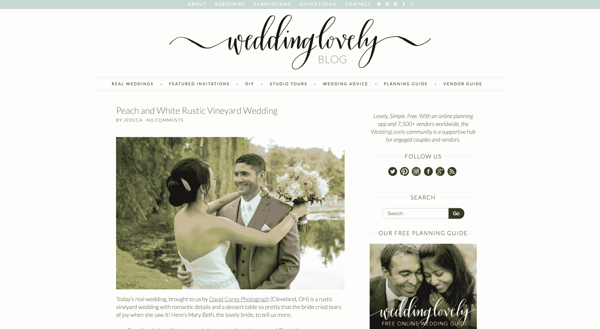

# 找不到开发人员，自己开发产品

> 原文：<https://www.indiehackers.com/interview/failing-to-find-a-developer-and-building-the-product-myself-5029985845>

## 你好！你的背景是什么，你在做什么？

你好。我叫 Tracy，是一名住在加拿大多伦多的设计师-开发商-作者-企业家。我来自加州，在加州理工学院圣路易斯奥比斯波分校获得了艺术与设计 BFA 奖。

当我在大学时，我开始在一家初创公司(实际上是在一个车库里)工作，作为他们的第一个也是唯一的设计师，在那里我真正开始享受在一个小团队中工作，并负责我想去的方向。这是开始我自己的创业的一个很好的介绍。

4 年半后，我离开了那个角色，这样我就可以开始为自己工作了——首先是自由职业者，然后是建立我的创业公司。WeddingLovely 的首个房产于 2011 年 1 月推出。今天，WeddingLovely 是一个婚礼供应商市场和规划应用程序，有八个专门的目录(如 WeddingInviteLove.com 的，我推出的第一个网站，我学会了用什么来编码)，我们的主要总目录(【WeddingLovely.com/vendors】的)我们的规划应用程序([的 WeddingLovely.com](https://weddinglovely.com))，最后但同样重要的是，一个流行的婚礼博客([的](http://weddinglovely.com/blog/))。

我们是盈利的，我们在 2017 年 8 月实现了有史以来最好的一个月，收入为 7200 美元。

 

## 是什么促使你开始使用 WeddingLovely？

生活在硅谷，很容易染上创业 bug！我的(现在的)丈夫正在经历 Y Combinator，我很幸运地在 2010 年夏天为他的初创公司以及他团队中的其他几个人做自由设计。

我决定我想建立一个网站，为人们在家打印婚礼请柬设计。作为一名设计师，我喜欢婚礼请柬的设计，并希望帮助更多的人为他们的 DIY 请柬设计漂亮的字体。

实际上，我并不是婚礼策划的最大粉丝(我在拉斯维加斯为自己的婚礼私奔，因为我看到了策划中的压力！)，但是婚礼请柬是一个有趣的地方，在那里我可以应用我的设计技能。不幸的是，我害怕编程，花了几个月时间寻找一位联合创始人来建立这个想法。

更糟糕的是，找不到一个联合创始人，所以我决定缩小规模，建立一个我可以自学编码的东西:一个婚礼请柬设计师目录。存在其他目录，但我发现它们相当丑陋，Haystack by 37 Signals(现在的 [Sortfolio](https://sortfolio.com/) )启发我建立了一个简单的应用程序，它有大而漂亮的图片和易于访问的联系信息，这样人们就可以与当地和小型企业的文具设计师合作。

我在大约六周的时间里创建并推出了 MVP，我写的关于这个过程的[博客文章](https://limedaring.com/articles/im-a-designer-who-learned-django-and-launched-her-first-webapp-in-6-weeks/)在黑客新闻上疯传，在我参加的任何聚会上给我起了“那个 HN 婚礼的人”的绰号。它开始只是一个教我如何编码的有趣的兼职项目，但在接下来的几个月里，我被[设计师基金](https://designerfund.com/)和 [500 家创业公司](https://500.co/)接受了——所以我辞去了自由职业，一头扎进了全职创业生活。

## 构建最初的产品需要什么？

老实说不多！我是一个很大的倡导者，建立一些小而精的东西，尽快用真实的客户来检验你的想法。我作为设计师的背景无疑有所帮助——人们只能看到抛光的前端，而看不到后端的巨大混乱。

我继续通过学习如何构建功能来自学如何编码——增加支付意味着一大堆谷歌搜索和新知识，增加地理定位是一整套全新的谷歌搜索和更多知识。MVP 本身花了六周时间(再次，作为一名程序员从零开始)，它只是一个注册表单、一个“个人资料”页面和一个主页，都是基于 Django/Python 构建的。

我很高兴我有一个早期的 MVP，因为在发布几周后，我碰巧和蒂娜·罗斯·艾森伯格共进午餐，她是瑞士小姐的博客作者。我一直想见见她，在碰碰运气并给她发了邮件后，我加入了她的工作空间，和她共进午餐。我并不想向她推销我的新网站，但由于它是在线的，我演示了一下，4-5 个小时后，我的手机被她的新注册通知打爆了。她的观众非常适合我想要吸引的人群，所以这是一个完美的营销意外。

长话短说，我拿到了最初的目录，并(随着时间的推移)推出了另外七个目录，专注于其他婚礼业务领域，然后建立了一个“中心”，将网络中的所有业务包含在一个可搜索的屋顶下，然后是一个规划指南，以更好地指导规划夫妇找到我们合作的业务。

如果我没记错的话，第一年只有目录，然后我在第二年或第三年左右添加了规划应用程序和通用供应商目录。我现在是经营网上婚礼业务的第七个年头了。

多年来一直在尝试不同的事情，看看哪些事情能坚持下去，有时勉强维持在破产边缘。

TweetShare

## 你是如何吸引用户并让 WeddingLovely 成长起来的？

哦，天哪，这是一条艰难的路！WeddingLovely 并不是一艘火箭船——它多年来一直在尝试不同的东西，看看哪些东西能坚持下来，有时甚至勉强维持在破产边缘。

WeddingLovely 成功的关键之一是与婚庆公司合作。今天，我们与全球超过 8000 家婚礼企业合作，这些小企业是我们的发展伙伴。我们越能帮助他们，WeddingLovely 就越壮大。

| 年 | 商业 |
| --- | --- |
| 2011 | 496 |
| 2012 | 1644 |
| 2013 | 2468 |
| 2014 | 3861 |
| 2015 | 5417 |
| 2016 | 7187 |
| 2017 | 8392 |

一个有趣的营销技巧是我们的婚礼博客。

首先，我开始写博客，因为我想参加一个婚礼贸易展，但不想付费进入，并发现“新闻”得到了免费门票。在 Wordpress 上呆了几个小时，发表了一周的博客文章后，我收到了一份贸易展的邀请，并接触了大约 100 家参展企业。

我带着我的 DSLR，给摊位和他们的产品拍照(后来在博客上使用，并与企业分享，这样他们就会分享帖子，我就会获得更多的流量)。我还从当地的一家面包店订购了一些饼干，用我的名片包装起来。我想企业主们会因为一整天的展览而筋疲力尽、饥肠辘辘，事实上，这帮助我脱颖而出，并在业内结交了一些朋友(更不用说，更多的企业在我们的市场上注册了。)

博客成了我们最好的营销工具。我们的内容很大程度上来源于我们平台上的企业:他们乐于分享他们的作品，来自他们产品的照片，来自他们参加的婚礼的照片，或者接受采访。商家推广我们在上面做的功能，向我们的博客展示新的策划夫妇和商家，因此也展示了我们的供应商网络和策划指南。博客增加了流量，让我们的企业开心(因为我们展示了他们的作品)，也给了我们另一个来自广告和附属机构的收入来源。

起初，我们非常关注搜索引擎优化和冷冰冰的电子邮件，但现在，我们的大部分流量和用户来自推荐、新闻和公关以及社交媒体。我们尽可能多地利用我们的商业伙伴，因为提升他们也提升了我们——这是双赢。

 

## 你的商业模式是什么，你是如何增加收入的？

我们主要从我们的商业伙伴那里赚钱。虽然我们的绝大多数供应商都是免费账户，但有两种不同的付费计划可供企业选择。我经常想让 [WeddingLovely](https://weddinglovely.com) 只接受付费(正如我们的许多竞争对手所做的那样)，但从本质上来说，我想帮助小企业，我讨厌仅仅因为他们付不起费用就拒绝注册。我们也是一家小企业，理解经营和宣传一家企业是多么困难和昂贵。

通过我们的婚礼博客，我们在联盟营销方面也取得了成功。这完全是一个意外——有几篇我推荐产品的博客帖子，发布后发现它们有联盟计划。这些帖子在几个谷歌搜索中排名第一，所以在好的月份里，仅代销商收入一项我们就能赚 2000 美元左右。

我们还在博客上投放广告，一些侧边栏广告(变得越来越难销售)以及赞助帖子。我们每天发布 2-3 次，并尽量保持每周一次的赞助内容。我认为我们已经在自然内容和付费内容之间找到了一个很好的平衡。

经常有人问我为什么不把我们的策划产品做成付费产品。我们实际上是在它推出的时候收费的！它最初有一个婚礼网站的功能，这是我在没有考虑后果的情况下快速编写的，作为一个额外的功能加入到产品中。

支持请求越来越多:“我能有一个不同的背景颜色吗？”"我可以添加比你目前支持的更多的图像吗？""能给我一张每个地点的地图吗？"所有合理的要求，对于一个人的开发团队(我)来说都是完全无法承受的。

我去掉了婚礼网站的功能，免费提供 WeddingLovely 的策划指南，而是专注于与尽可能多的策划夫妇合作，以最大限度地提高我们的供应商合作伙伴的流量。

| 月 | 收入 |
| --- | --- |
| 2011 | 572 |
| 2012 | 19092 |
| 2013 | 36479 |
| 2014 | 22085 |
| 2015 | 27602 |
| 2016 | 32246 |
| 2017 | 62000 |

## 你未来的目标是什么？

我已经爱上了招聘！

在热情的团队成员的帮助下，WeddingLovely 发展得更快了，我喜欢看他们一起解决问题。我肯定会把所有的利润再投资到招聘上，看看我能把公司带多远。在独自在 WeddingLovely 工作了这么多年(告诉自己这样做是在为公司省钱)之后，管理一个团队变得如此有趣。

我们在婚礼业务方面也做了很多出色的工作，但我们还有很多工作要做，才能真正让我们的婚礼策划应用程序大放异彩。

流量方面，它在过去几年停滞不前，因为我们一直专注于我们的供应商，我想把它建成最好的免费在线婚礼策划应用程序。或许是一款手机 app！我不知道如何构建移动应用程序，所以这可能是我新的学习编码项目。

## 如果你必须重新开始，你会做什么不同的事？

哦，天哪，在过去的七年里，我犯了*那么*多的错误。

最大的错误是在自力更生和筹款之间摇摆不定。有了自举业务，你想尽早赚尽可能多的钱。对于风投资助的企业来说，最好是专注于用户增长和病毒式传播，而不要分心于收入数字(尤其是对我来说，在企业成立的前五年，收入并不多)。

我开始[婚礼，想着我会把它变成一个自举生意(成为](https://weddinglovely.com) [patio11](https://twitter.com/patio11) 和黑客新闻上其他著名自举者的粉丝)。)当我得到我的 500 Startups offer 时，我决定追求风投资金(最终只拿 500 Startups 给的 5 万美元)。

在筹集失败后，我决定再次启动它，但在一年后试图筹集另一轮资金，拿了一小笔钱，但最终未能筹集到另一轮资金……*再次*。我又回到了自举。每一次交换都大大降低了我的业务速度，分散了我的注意力。

去年年底，我正考虑尝试卖掉公司，这时一位老远程员工(在此之前一年左右因个人原因离职)给我发来电子邮件，问我是否可以重新聘用她。筋疲力尽的我决定不卖了，而是把我微薄的 20，000 美元工资作为兼职工资给她，让她自由支配生意。我不会拿薪水(写书，这是我的另一个项目)，而是作为一名“顾问”呆在那里。

创业日复一日就像过山车，如果你独自一人，会变得非常沮丧。

TweetShare

她对业务充满热情所带来的影响(相比于精疲力竭的我)已经完全改变了我们的工作。如今，WeddingLovely 通过她的全职员工、两名兼职合同工(包括我自己)和一名全职虚拟助理实现了盈利。我们的收入和流量都超过了我单干的任何一年。

当时，我感觉自己在解雇自己，老实说，我几年前就应该解雇自己，去雇佣更好的人。当我对工作失去热情时，我固执地坚持自己经营企业，这实际上是在阻碍它的发展。

## 有没有发现什么特别有帮助或者有优势的？

以前，我认为我应该在业务不顺利的时候关闭网站——节省自己的大脑周期，并能够完全转移到其他项目上。现在我很高兴我坚持下来并保持了网站的运行，因为现在我有一个团队在我的领导下工作，他们对[婚礼和](https://weddinglovely.com)充满热情和兴奋。我雇佣了这些优秀的员工，给他们一份他们喜欢的工作，我很高兴我没有把“失败得快”这句格言放在心上。

特别是因为 WeddingLovely 是一个市场——我们比以前做得更好，因为我们终于在平台上有足够的业务和选择，让 WeddingLovely 对寻找婚礼供应商的人有用。

我也很高兴 WeddingLovely 主要与小企业合作并从中获得收入(而不是那些计划他们婚礼的人)。我见过很多婚礼企业失败，因为婚礼行业产生了一吨*的客户流失，迫使企业年复一年地产生一批全新的用户。通过从婚礼供应商那里获得收入，我们不必担心每年都要进行激进的营销来取代我们的用户群。*

## 对于刚刚起步的独立黑客，你有什么建议？

利用你的社区！在我想放弃的困难时期，依靠别人和知道我不是一个人是有帮助的。创业日复一日就像过山车，如果你独自一人，会变得非常沮丧。朋友、当地聚会、在线社区(比如独立黑客！)都是发泄情绪、获得建议、帮助你保持动力的好地方。

另一件让我受益匪浅的事情是保持低成本，并设置我的项目主要通过自动化的电子邮件和流程运行。因此，当我需要休假一天(或三周，在某些情况下)时，我可以这样做，而不会因为我的缺席而让业务完全瘫痪。

最后但同样重要的是，雇佣一个虚拟助理。我[用](https://medium.com/@limedaring/on-hiring-a-virtual-assistant-something-i-should-have-done-years-ago-21719e377d7e) [OnlineJobs.ph](https://www.onlinejobs.ph/) 写了一篇关于我的过程的博文。

几年前我就应该雇佣我的全职助理*。她负责处理收到的电子邮件，使用我写的文档来处理基本任务(比如从供应商那里为我们的博客获取内容，帮助处理用户名请求，批准供应商申请)。*

很长一段时间(年！)这些任务都是我自己做的，这让我觉得自己很有成效。但是现在我已经把这些任务委派出去了，我意识到我实际上是在拖业务的后腿，因为那些日常琐事分散了我发展业务的注意力。

我可能会把上面的建议扩展到一般的招聘上——当我解雇了自己，聘用了我的营销经理，她的热情提高了我自己的热情和生产力。冒险用我的收入支付她的兼职是值得的，因为收入增长到支付她的全职，雇佣更多的人，并开始再次支付我自己。

几年前我就应该解雇自己去雇更好的人。

TweetShare

## 我们可以去哪里了解更多？

可以在[weddinglovely.com](http://weddinglovely.com)报名 WeddingLovely。我的个人网站在[limedaring.com](http://limedaring.com)，我活跃在[推特上@ lime daring](https://twitter.com/limedaring)——随时给我发 DM。

我也会在下面的评论区回答问题。期待聊天。谢谢你邀请我！

—[<picture id="ember8070095" class="user-avatar ember-view user-link__avatar"></picture>特雷西·奥斯本](/tracymakes?id=6hJTHbDw9CTd1gZycr05YSNDgBi2)【婚礼的创造者可爱

## 想像 WeddingLovely 一样建立自己的事业？

你应该加入独立黑客社区！🤗

我们是几千名创始人，互相帮助建立有利可图的业务和副业。来分享你正在做的事情，并从你的同事那里获得反馈。

还没准备好开始使用你的产品吗？没问题。这个社区是一个认识人、学习和实践的好地方。随意[随便浏览](/)！

——[<picture id="ember8070100" class="user-avatar ember-view user-link__avatar"></picture>柯特兰艾伦](/csallen?id=ibTLPyjwVebnZjMGKvz6ztarnuV2)，独立黑客创始人

14votes