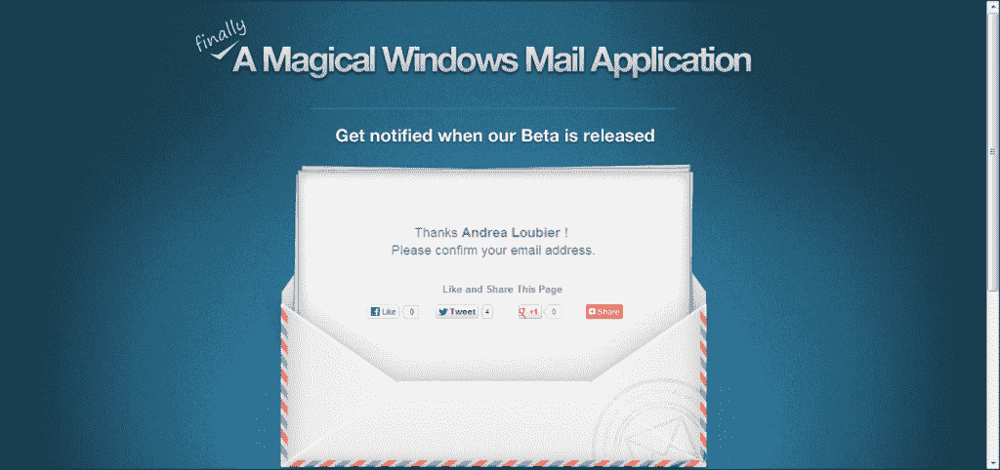
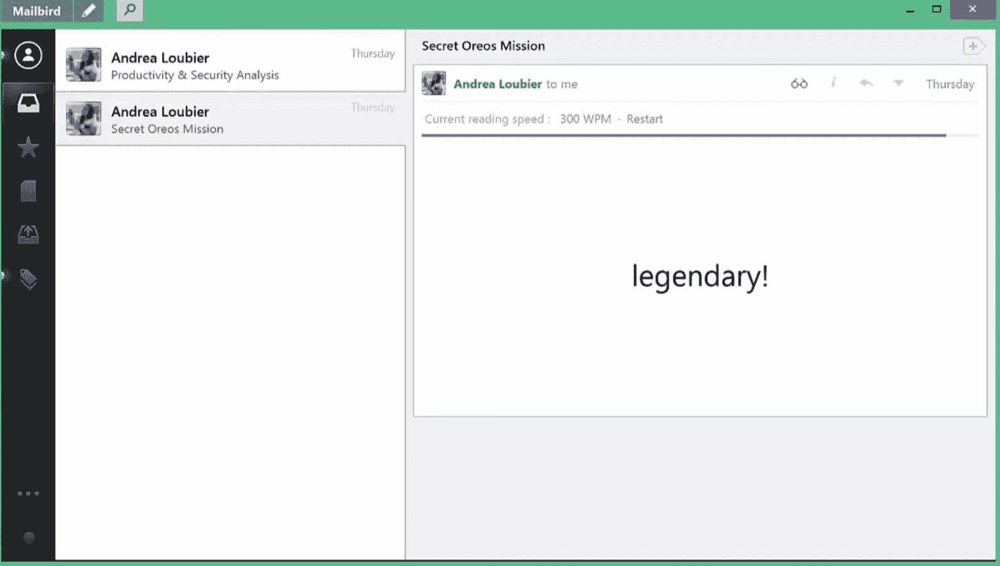
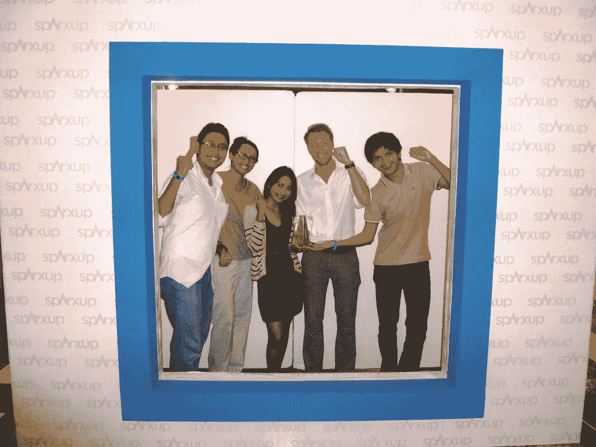

# 填补了市场空白，收入增长到每月 60，000 美元

> 原文：<https://www.indiehackers.com/interview/filling-a-gap-in-the-market-and-growing-revenue-to-60-000-mo-fe4ceb0823>

## 你好！你的背景是什么，你在做什么？

你好，我叫穆罕默德·迪马斯。我是前端开发人员，也是 [Mailbird](http://getmailbird.com) 的初期团队成员之一。我有计算机科学的背景。大学毕业后，我在一家数码代理公司工作，积累了与许多国际客户打交道的经验。此后不久，我遇到了其他联合创始人来创建 Mailbird。

专为 Windows 制作的 Mailbird 是一个统一了许多通信工具的电子邮件平台。当我们开始时，我们对现有的产品采取了一种稍微不同的方法。大多数(如果不是全部的话)电子邮件应用程序都是为“商业用户”设计的。它们往往相对昂贵，而且在毫无吸引力的用户界面中包含了太多的功能。

另一方面，Mailbird 是为临时用户设计的，并不打算与这些应用程序直接竞争。假设用户在办公室使用 Outlook。我们希望他们回家后能使用 Mailbird。

今天，我们已经成功地将 Mailbird 发展到超过 100 万个帐户，并且我们每月产生大约 6 万美元的收入。我们有一个相当小但不断成长的团队，由 13 人组成，在世界各地远程工作。

## 是什么促使你开始使用 Mailbird？

电子邮件是每个人日常交流的一大部分。当我们在 Mac 和 Windows 上查看管理电子邮件的选项时，我们注意到 Mac(通过 Mail 和 Sparrow)提供的出色默认体验在 Windows 上找不到。

考虑到 Windows 在个人电脑市场上占有超过 80%的市场份额，我们相信我们的产品在那里一定有机会。

我们的主要目标是在每一台 Windows PC 上运行。

TweetShare

所以不久之后，我们在[推出了我们的登陆页面](http://magicalmailapp.com)，为访问者提供了一个输入电子邮件地址的表格，并在 MailChimp 中收集了这些电子邮件，以便我们可以在有更新时回复他们。

我们用精益启动方法快速构建了产品。我们的重点是尽快将产品送到用户手中——私有测试版是我们的第一个里程碑。

 

## 构建最初的产品需要什么？

知道我们在非常有限的资源上运行，我们试图提出一个特别最小的 MVP(最小可行产品)，然而它需要传达我们的主要关键区别——我们是一个面向 Windows 的*用户的*电子邮件应用程序。我们决定第一个版本应该具有以下所有内容:

*   很棒的 UI(其实灵感来自麻雀)
*   单一电子邮件帐户
*   仅限 Gmail
*   应用集成

我们花了大约 5 个月的时间来打造这个 MVP。

 

Mailbird 是使用 C#编程语言在 Windows Presentation Foundation 上构建的。我们是一个五人团队:

*   2 个人(包括我自己)在前端工作
*   1 人在后端工作
*   1 正在进行部署
*   最后但同样重要的是，1 从事与营销相关的工作

下一个里程碑是公开测试。我们利用私人测试用户的反馈来改进我们的产品。当时我们使用这个名为 [UserVoice](https://www.uservoice.com/) 的网站来收集用户的反馈。UserVoice 允许用户发布他们的功能想法和请求，并让其他用户投票支持。这再次向我们展示了哪些特性的需求最高，使我们能够区分优先级并规划我们的路线图。

为终端用户开发一个应用程序确实是一个挑战。当时还没有 Windows 应用商店，所以我们必须考虑从网站到下载应用程序、安装体验、帐户设置、支付网关、应用程序更新程序等一切。

终于到了时候:我们发布了第一个公测版，每个用户都可以从我们的网站上下载这个应用。我们将发布时间设置为与我们的主要目标市场美国时区一致。我们住在世界不同的地方，所以我们有一个 Skype 通话的“发布会”。在我们的一些时区是晚上，支持票进来了。要处理的事情太多了——毫无疑问，这是一次疯狂的经历，但也很有趣。

## 你是如何吸引用户并发展 Mailbird 的？

如果我没记错的话，我们的电子邮件列表第一次显著增加是在 Mozilla 宣布他们[停止了雷鸟](https://techcrunch.com/2012/07/06/so-thats-it-for-thunderbird/)的开发，也是在谷歌收购 Sparrow 的消息传出后不久。时机是完美的。我们接触了相关文章的用户和作者。我们将自己定位为 Windows 版的 Sparrow 你可以在我们的第一个版本中看到。我们的 UI 大部分都是受他们的启发，这并不是一件坏事！引用[The Verge](http://www.theverge.com/2013/4/1/4171498/mailbird-is-a-fast-lightweight-sparrow-inspired-gmail-app):“mail bird 是一款快速、轻量级、受麻雀启发的 Gmail 应用”。

离我们的公开测试版越来越近，我们参加了在印度尼西亚举行的创业竞赛，我们团队的大部分成员都在那里。该活动名为 Sparxup，我们获得了最佳生产力应用奖。这是我们的第一个奖项，我们甚至在推出产品之前就赢了！

 

我们参加比赛是为了让邮差鸟更加出名。我们会见了许多媒体的联系人。作为一种消费品，我们必须了解并意识到媒体报道对我们的成功非常重要。

后来，当我们推出产品时，我们得到了 Lifehacker 的报道。这篇文章发表后，其他大型媒体也纷纷跟进。一些经销店甚至在我们的发布会上联系了我们。

尽管我们的 MVP 对一些用户有效，但对其他人来说，它缺少太多必要的特性。这并没有让我们感到惊讶，所以我们继续开发并保留了那些离开我们的人的电子邮件，以及他们离开我们的*原因*。随着开发的继续，我们小心地实现了越来越多的功能。每次我们推出一个新版本，我们都会联系那些用户，如果我们已经解决了他们的卸载原因。

尽快推出第一个版本，从用户那里获得反馈，更经常地改进你的产品。

TweetShare

随着用户越来越多，我们雇佣了更多的人，包括营销人员。当时，甚至今天，我们在营销 Mailbird 上投入了大量的时间和精力，因为营销是增长的主要原因(仅次于巨大的发展)。

仅举几个我们的策略，我们利用了内容营销、社交媒体营销、付费广告、用户调查、可用性测试、数据分析和应用内通知。应用程序中的社交分享按钮在让我们的用户分享他们使用 Mailbird 的体验方面特别有帮助。

我们还做了一个*批次*的 A/B 测试。我们认为这是进行低风险、高影响力变革的最佳方式。

最后，我们知道电子邮件简讯有时会进入用户的垃圾邮件文件夹或被忽略。所以我们也将这些更新实现为应用内调查和通知。这些通知有 35%的打开率，而电子邮件简讯的打开率只有 25%。

我们每年的用户增长如下:

*   2014: +526%
*   2015: +170%
*   2016: +109%
*   2017: +52%

## 你的商业模式是什么，你是如何增加收入的？

一旦我们推出我们的网站，我们开始测试我们的定价计划。当时有两种:免费计划和年度订阅。我们还没有准备好产品，但是我们需要知道有多少人*想要*付钱。因此，我们发起了一项预购活动，并获得了受邀参加我们的私人测试版的额外奖励。

此后，我们增加了第三个计划:一次性支付 39.50 美元。不过，我们仍在进行定价测试。

我们刚刚推出了自己的代销商项目，正在创收。我们还把我们的推荐系统游戏化了，这个系统得到了很好的发展，但是需要更多的改进。从长远来看，我们希望扩大与不同应用的合作关系，以便能够通过共享盈利模式产生更多收入。

作为一款消费类 app，对我们来说真正管用的一件事就是推广。每个宣传片总是对我们的销售有很好的影响。但是表现特别好的是《黑色星期五》或《网络星期一》。在这些日子里，我们的销售额可以跃升至平时的 400%。

## 你未来的目标是什么，你打算如何实现它们？

我们的主要目标是在每一台 Windows PC 上运行。；-)

我们希望实现最终的主要功能，如过滤器、排序、规则、高级搜索等。另一个必要且令人兴奋的步骤是转移到其他平台，以便真正做大。我们目前正在开发 Android 版本，并希望在年底前发布第一个测试版本。

Windows 拥有超过 80%的市场份额…我们相信我们的产品在那里一定有机会。

TweetShare

另一个目标是进入中小型企业。我们将忠于我们的核心产品——一个干净简单的电子邮件应用程序——但是进入小企业总是让我们感兴趣。

我们还不能进入那个市场的主要原因是因为我们不支持在那些用户中广泛使用的 Microsoft Exchange Server。一旦我们增加了对该功能和其他功能的支持，我们相信 [Mailbird](http://getmailbird.com) 将成为他们的绝佳解决方案。

## 你面临的最大挑战是什么？

增量生产产品的一个缺点是，我们不得不多次重做，因为以前的版本没有被设计成适应后来的变化。我们遇到过很多次这种情况，其中一次是我们想引入多语言支持。我们的代码在设计时没有考虑到这一点，所以当我们决定这样做时，我们必须搜索代码中的所有字符串，并将它们放入资源文件中，以便它们可以被翻译。

在我们的第三年，我们试图外包 [Mailbird](http://getmailbird.com) 的一个零件。它是支持本地日历的第三方应用。一开始看起来很有希望，但要让它像我们希望的那样完美真的很难。最终，我们认为它不够好，我们砍掉了它。

另一件值得一提的事情是我们想转换域名的时候。我们的主要域名是 getmailbird.com 的，但我们也购买了 mailbird.com 的，因为它更短，更容易沟通，更容易混淆(毕竟，这是我们产品的实际名称)。

在为使用新的 mailbird.com 域名做了很长时间的准备后，我们终于做出了改变。但此后不久，我们的销售和流量急剧下降。我们不确定我们做错了什么，但这与我们的搜索引擎优化和我们在谷歌的排名有关。因此，我们不得不恢复所有的更改，并切换回我们的旧 getmailbird.com 域。

我们还必须知道我们不能让每个人都满意，并且对用户的请求说“不”，即使用户抱怨。

## 你最大的优势是什么？有什么特别有用的吗？

我不得不说这是我们了不起的团队。拥有遍布全球的团队使我们在客户服务和其他运营活动方面拥有 24 小时覆盖的优势。别人睡觉的时候，总有人在。

我们借助一些工具来管理远程工作文化，比如用于沟通的 [Skype](https://www.skype.com/) 、用于任务管理的 [Asana](https://asana.com/) 以及用于时间追踪的[时间医生](https://www.timedoctor.com/)。

我们每年都会举办一次邮件鸟黑客马拉松，在那里我们会聚在一起一个月来相互了解，并就某个功能进行深入的研究——我们通常在巴厘岛举办这种活动。

## 对于刚刚起步的独立黑客，你有什么建议？

不要犹豫开始。只要你在解决一个真正的问题，就一定会有市场。

大计划，小执行。不要浪费时间在你的第一个版本中加入每一个特性。尽快推出第一个版本，从用户那里获得反馈，更经常地改进你的产品。

参加科技活动可能会给你机会介绍你的产品或建立良好的关系网，但不要在这上面花太多时间。相反，专注于构建你的产品。

使用你自己的产品，以它为荣，不要羞于(过度)宣传它。

## 我们可以去哪里了解更多？

*   [http://getmailbird.com](http://getmailbird.com)
*   [https://www.facebook.com/getmailbird](https://www.facebook.com/getmailbird)
*   [https://twitter.com/mailbird](https://twitter.com/mailbird)
*   [https://www.instagram.com/mailbirdemail](https://www.instagram.com/mailbirdemail)

—[<picture id="ember5304986" class="user-avatar ember-view user-link__avatar"></picture>Bali email](/BaliEmail?id=C0V1NORn0dPRXASb4iXKk5olV8G2)，Mailbird 的创建者

## 想像 Mailbird 一样建立自己的事业吗？

你应该加入[独立黑客社区](/)！🤗

我们是几千名创始人，互相帮助建立有利可图的业务和副业。来分享你正在做的事情，并从你的同事那里获得反馈。

还没准备好开始使用你的产品吗？没问题。这个社区是一个认识人、学习和实践的好地方。随意[随便浏览](/)！

——[<picture id="ember5304991" class="user-avatar ember-view user-link__avatar"></picture>考特兰艾伦](/csallen?id=ibTLPyjwVebnZjMGKvz6ztarnuV2)，独立黑客创始人

6votes