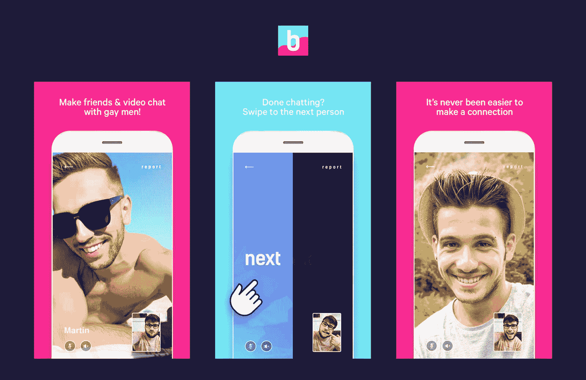
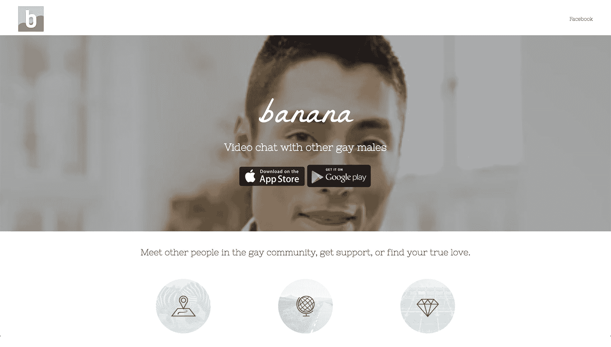

# 找到一个合适的位置，推出一个同性恋视频聊天平台

> 原文：<https://www.indiehackers.com/interview/finding-a-niche-and-launching-a-gay-video-chat-platform-0a2d39c830>

## 你好！你的背景是什么，你在做什么？

嗨！我叫 Edmund Mai，是一家混合孵化器/软件咨询公司 [Potato Labs](http://taterlabs.com/) 的联合创始人。我和我的合伙人亚伦·瓦斯奎兹有几个互联网业务，其中[香蕉](http://meetbanana.com/)是我们最先也是最有趣的业务之一。

我最初在锡拉丘兹大学(Syracuse University)学习经济学，最终被一家房地产公司解雇，我讨厌(老实说，我很讨厌)这份行政工作。当时我不知道我要做什么，是 Aaron 说服我在[大会](https://generalassemb.ly)上学习编程。

我周围的每个人都认为我毕业后马上去上学是疯了。经过四个月的兼职网络开发(这是在编码训练营存在之前)和在 StackOverflow 上问了数百个问题后，我鼓起勇气申请了一份开发人员的工作。我向纽约所有的 Ruby 商店寄出了简历，除了一家网络代理公司，其他都拒绝了我。在最终开始我的创业冒险之前，我会在接下来的四年里做一名网页开发员。

香蕉是安卓和 iOS 上针对男同性恋的随机视频聊天应用。我们在 2017 年 1 月底/2 月初出货，不到一年零营销已经获得差不多 20 万用户。目前每月收入 300 美元。

 

## 是什么促使你开始接触香蕉？

其实我们俩都不是同性恋。

起初我们只是想探索 [WebRTC](https://webrtc.org/) ，一种用于点对点通信的技术。我们反复思考了一些想法，最终选定了一款[聊天轮盘](https://www.chatroulette.com/) / [Omegle](https://www.omegle.com/) 类型的手机视频聊天应用。

作为那些成功的网络应用程序的用户，我们很早就意识到它们都有一个根本性的问题——男女比例总是很糟糕。这是一个很难平衡的双边市场。

我们如何解决这个产品问题？在试图获取新用户的同时保持平衡将是一件令人头疼的事情。我们决定简化这个等式:那么，如果每个人都在寻找同样的东西呢？我们知道我们在做一些事情。

顺便说一下，这一切都发生在我辞职后。我打破了所有的规则，做每件事的顺序都不对。通常，人们会想出一个他们认为有潜力的想法，然后他们在晚上和周末工作，并在辞职前验证这个想法。另一方面，我厌倦了全职为别人的公司工作，所以我决定大胆一试，辞去我的工作——甚至在我还不知道我要建立什么之前。最重要的是，我们最终在一个我一无所知的人群中建立了一个产品。

作为一名开发人员，我总是喜欢从零开始创造东西，因为我知道在我人生的某个时刻，我会想要掌控自己的未来，并创办自己的公司。在工作中，我总是渴望创造新的项目，因为我想经历从零到完成的运动。当我们开始制作香蕉的时候，我非常有信心我们能从头到尾制作它，因为我已经通过工作经验积累了很多技术知识。

## 构建最初的产品需要什么？

第一个版本花了一个月的时间才发布，所有代码都被塞进一个 2000+行的文件，一个 200+行的后端被塞进一个主文件。这是可怕的，但允许我们尽快发射。由于是从我们的储蓄中自筹资金，我们想尽快验证这个想法。

香蕉最初纯粹是出于好奇而建造的。老实说，我们只是想找个借口玩玩有趣的技术，比如 WebRTC、使用[药剂](http://elixir-lang.github.io/) / [凤凰](http://phoenixframework.org/)和[反应原生](https://facebook.github.io/react-native/)的 websockets。在我们确定了技术之后，我们决定了一个想法，并开始在头脑中建立它。幸运的是，我们认识一个非常优秀的设计师，他很快帮助我们设计了一个 MVP。

最大的风险/承诺是时间，我们通过尽可能快的运输将时间最小化。

TweetShare

我们头脑风暴的时候有很多想法。我们希望包括短信、Snapchat 式的面部过滤器、人口统计过滤等。然而，我们将其范围缩小到只有脸书注册的随机视频匹配的最低限度。

在我们推出一个月后，我们意识到我们的势头有多大，然后增加了电子邮件注册，这使我们的日注册量立即翻了一番。

我们只花了 100 美元就启动了这个项目。最大的风险/承诺是时间，我们通过尽可能快的运输将时间最小化。只有在我们积累了 10k+用户后，我们才意识到 v1 有重大 bug，我们很快修复了这些 bug！

 

## 你是如何吸引用户并种植香蕉的？

老实说，到目前为止，我们对用户的增长感到非常惊讶。

我们只用了几个星期就跨越了 10000+的用户，而且都没有任何营销！现在我们有将近 20 万人，并且还在增长。我认为我们很幸运选择了一个服务不足的利基市场，现在我们是该领域最大的参与者之一。同时在 iOS 和 Android 上推出是一个非常好的举措，因为这两个市场都很受欢迎，帮助我们接触到了大量用户，因此用户几乎可以在一天中的任何时间立即进行匹配。

由于我们的应用程序商店排名，我们每个月持续获得 15，000-20，000 名用户，而没有花一分钱。我们也很幸运地成为印度谷歌应用商店的特色。

除了 ASO，应用内营销对用户获取的影响是最大的。有链接来喜欢和分享我们的脸书页面已经极大地帮助了我们毫不费力地传达信息。总的来说，感觉同性恋人群比我们调查的其他市场更愿意在社交媒体上分享。

| 月 | 用户 |
| --- | --- |
| 一月 | 709 |
| 二月（February 的缩写） | 3213 |
| 瑕疵 | 12500 |
| 四月 | 29301 |
| 五月 | 46251 |
| 六月 | 64311 |
| 七月 | 85043 |

## 你的商业模式是什么，你是如何增加收入的？

最初，[香蕉](http://meetbanana.com/)只是一个免费的视频聊天平台。我们最近才整合了应用内短信和应用内购物。用户现在可以购买宝石，用来与他们过去匹配的人开始对话。我们有六种不同的套餐，从 4.99 美元到 199.99 美元不等。

我们也对视频广告进行了简单的测试，但我们认为它从体验中带走了太多东西，却没有什么回报。自从移除广告后，我们的活跃用户持续增加。

| 月 | 收入 |
| --- | --- |
| 2017 年 6 月 | 0 |
| 2017 年 7 月 | 17 |
| 2017 年 8 月 | 365 |
| 2017 年 9 月 | 371 |

## 你未来的目标是什么？

我们有大量关于参与度的数据，所以还有很大的空间来赚钱。我们应该跟踪如此多的指标/事件。这一切发生得比预期的要快，我们刚刚开始跟踪更多的指标，这样我们就可以做出更多数据驱动的决策。

我们正处于创建网页版的初级阶段，这不仅有助于获得更多的用户，而且有助于营销，因为它将为 SEO、博客等打开大门。我们的网络存在不足，鉴于 Omegle 和聊天轮盘的成功，我们认为网络有大量的机会。鉴于我们的技术栈，我们可以很容易地完成这一点(WebRTC 万岁！).

我们甚至和一个知名品牌的买家就我们软件的授权进行了谈判。作为工程师，我们以这样一种方式重构我们的代码，它几乎已经变得像一个模板。由此，我们可以使用相同的代码推出[女同性恋](http://talkcherry.com/)和[结识新朋友](http://vibe.chat/)版本。

在你成为自己的老板的早期阶段进行多样化的尝试会增加你最终取得成功的机会。

TweetShare

一位潜在买家发现了我们快速推出不同模板的能力，并向我们提出了收购要约。不幸的是，我们无法达成协议，但有这样的报价真的很令人兴奋，我们希望在未来的更多业务交易中营销得足够好。我们认为与营销专家的合作可以真正加速香蕉的发展。

## 你面临的最大挑战和克服的障碍是什么？

凭借我们的工程背景，营销一直不是我们的强项，我认为这是让[香蕉](http://meetbanana.com/)更上一层楼的关键。

我们都不是社交媒体的大用户，但我们正在努力推动更多的社交媒体内容。我们增加了一个脸书页面和 Instagram 账户，但都没有真正做到这一步。我认为这就是我们都不太熟悉我们的目标市场的原因。

我们仍在犹豫是否要对应用程序收费，因为我们认为如果一切都是免费的，参与度和保留率将大幅提高。消费应用的货币化是一个量的游戏，随着苹果和谷歌从应用内购买中抽取 30%的份额，我们认为其他收入来源将更加有利可图。

我们正在考虑与其他公司合作，达成独家赞助协议。在视频聊天或比赛历史屏幕的底部角落有类似“由 XXXXX 赞助”的字样。因此，如果你是一个赞助商，并有兴趣合作，寻找我的联系方式如下！

## 有没有发现什么特别有帮助或者有优势的？

我真的为我们迄今为止做出的产品决策感到骄傲。

在技术方面，我们选择了 Elixir/Phoenix 作为我们的后端和 WebRTC，这是一种点对点视频协议，通过利用 Heroku 和 AWS，它有助于在几乎没有 devops 的情况下在一台服务器上扩展到数十万并发用户。这大大降低了我们的服务器和维护费用。此外，使用 React Native 使我们能够轻松地在 iOS 和 Android 上快速构建。

对于设计来说，聘请专业设计师来设计香蕉是帮助我们打造完美产品的关键因素之一。这个领域中只有少数其他应用程序，其中大多数都缺少干净的外观和感觉。我不认为我们会如此成功，如果我们两个只是一起扔东西的话。我把 Banana 的成功很大程度上归功于它的精心设计。

就总体产品方向而言，我们模仿了该领域的成功应用，如[阿扎尔](https://azarlive.com/)和[赫拉](http://www.holla.world/)，并试图尽可能地“保持沉默”。我们使用经过验证的模型来实现我们的目标，并在每一步都将风险降至最低。

## 对于刚刚起步的独立黑客，你有什么建议？

人们给出的普遍建议是进入你熟悉的市场。然而，有时候专注于自己的优势也是可以的。在我们的例子中，我们都是工程师，喜欢玩新技术，但最终都是逆向工作。我们通过找出我们想要使用的技术可以服务于哪个市场，从而找到了合适的市场。

将你的竞争对手作为研究对象。他们成功地做了什么，你如何将这些特性应用到你自己的产品中？你如何能使它变得更好？他们冒了风险，你应该利用这一点。你不应该被竞争吓倒，而是应该拥抱它。

我还建议在你刚开始的时候，同时做多个项目。很多事情都需要时间，这不是你能控制的。每小时刷新你的应用商店统计数据不会让你更快地获得用户。运送一件东西，然后运送另一件，然后回到你的第一件事，看看是否有任何牵引。冲洗并重复，直到你有了看起来有希望的东西。

不是所有的项目都会成功。将失败视为过程的一部分。在你成为自己的老板的早期阶段进行多样化的尝试会增加你最终取得成功的机会。

## 我们可以去哪里了解更多？

要了解更多关于香蕉的信息，请访问[网站](http://meetbanana.com/)。

如果你需要移动、网络或区块链开发，你可以在这里找到我。

我很乐意回答下面评论中的任何问题！

——[<picture id="ember5272702" class="user-avatar ember-view user-link__avatar"></picture>PotatoLabsLLC](/PotatoLabsLLC?id=Hi7K6vdyhygwRuBlwKgvdjHMm6J3)，香蕉联合创始人

## 想像香蕉一样建立自己的事业？

你应该加入[独立黑客社区](/)！🤗

我们是几千名创始人，互相帮助建立有利可图的业务和副业。来分享你正在做的事情，并从你的同事那里获得反馈。

还没准备好开始使用你的产品吗？没问题。这个社区是一个认识人、学习和实践的好地方。随意[随便浏览](/)！

—[<picture id="ember5272707" class="user-avatar ember-view user-link__avatar"></picture>考特兰艾伦](/csallen?id=ibTLPyjwVebnZjMGKvz6ztarnuV2)，独立黑客创始人

7votes