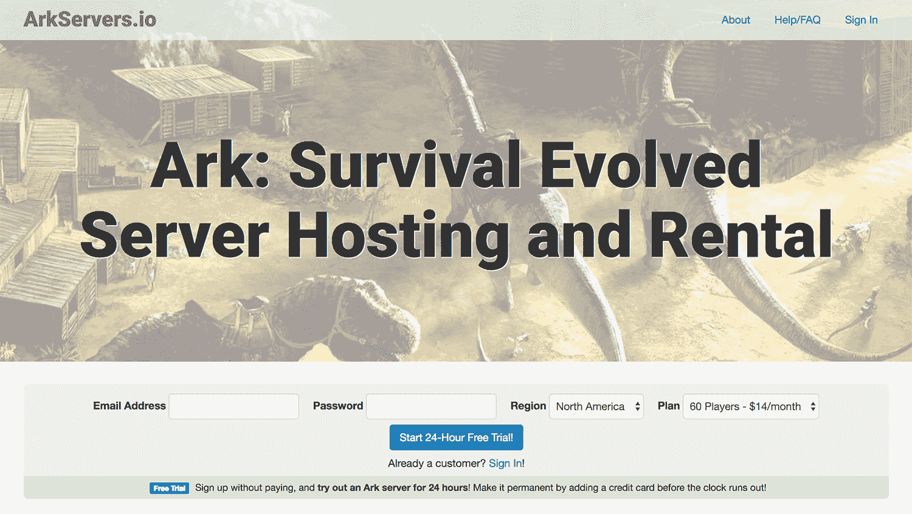

# 找到一个“现成的”观众，增长到每月 20，000 美元

> 原文：<https://www.indiehackers.com/interview/finding-a-ready-made-audience-and-growing-to-20-000-mo-e108977d91>

## 你好！你的背景是什么，你在做什么？

我是谢尔盖！2017 年我 30 岁了，我是哈维·马德学院的计算机专业毕业生。自 2010 年以来，我一直是一名自由职业者，在此期间，我开始从事各种自己的项目，既是为了娱乐自己，也是为了赚取收入。

其中最近的是 [ArkServers.io](https://arkservers.io) ，这是我在 2016 年 9 月推出的一家游戏服务器托管公司。有一些网络游戏，像[方舟:生存进化](https://www.playark.com/)，很多玩家会租服务器给自己和朋友一起玩。游戏开发者可以免费获得服务器软件，但配置它需要技术技能，并且全天候运行它需要可靠的硬件和快速的互联网。

ArkServers.io 通过每月 14 美元托管游戏服务器软件来满足这些需求。我建立了一个基于网络的控制面板，我的客户用它来设置他们喜欢的游戏服务器，然后我在高速互联网的优秀硬件上运行它。

截至 2017 年 6 月下旬，我为我的客户运行着 1400 台游戏服务器，每月带来约 2 万美元的收入。在过去的几个月里，我一直以每周 8%的速度增长。

 

## 是什么促使你开始使用 ArkServers.io？

我一直喜欢将“__ 主机”作为一种商业理念。我经常注意到，在大多数流行的开源项目背后，都有一个价值数百万美元的企业，其计划只是购买或租赁一些服务器，托管开源软件，并为客户提供一个基于网络的控制面板。想想 Git、Apache、Sendmail、MySQL、ElasticSearch 和类似的服务。这是一个容易想出的主意，一个容易构建的产品，并且很容易找到客户，因为你可以在人们聚集讨论开源项目的任何地方做广告。

有时候潜在的利润是巨大的。那些商业模式是“免费下载 Apache，设置它，并在商用硬件上运行它”的公司现在被称为*虚拟主机公司*，他们是一个数十亿美元的产业。

作为一家现有产品的托管公司，好处之一就是…你有一群现成的观众。

TweetShare

游戏服务器托管要小得多。潜在的市场总额可能是每年 5000 万美元，但这一利基规模代表了一个机会。由于风投永远不会资助一家独角兽潜力如此之小的公司，而且许多潜在的创始人也不会费心去创办一家，所以整个领域几乎没有竞争对手——而且他们中的许多人能力不足。

我的技能和经验非常适合建立一个托管公司。我从中学就开始做 web 应用了。我唯一的非自主工作是大学毕业后在 Dreamhost 度过的一年(2009-2010)。正因为如此，再加上我自己十多年的修补经验，我对 Linux 服务器和网络了如指掌。我知道如何以低于市场的价格获得装满服务器的机架，如何管理这些服务器，以及如何创建一个客户将用来控制他们游戏的 web 应用程序，这是一个完美的组合！

我的计划一直是扩展到许多不同的游戏，但从一个游戏开始是有意义的。它将让我测试商业模式，消除所有商业上的东西，并在我不得不担心回答几十个游戏问题的支持票之前得到一些推广的练习。

我选择从[方舟:生存进化](https://www.playark.com/)开始，是因为我看到了多大的增长潜力。在发布之前，我通过 [SteamSpy](https://steamspy.com/) 和 [Google Trends](https://trends.google.com/trends) 研究了各种游戏的增长趋势，Ark 是明显的赢家。

[

方舟:生存进化](https://www.playark.com/) 

## 你是如何资助最初产品的创作的？

2010 年，我停止了一份“真正的工作”,从那以后，我的职业生涯就是创建和创办这样的公司。在我建造下一个项目时，每个成功项目的半被动收入将资助我的生活费用。我还在上大学的时候就创办了第一家盈利公司，但那是以后的事了。

花了大约 2 个月的时间，每天工作 4-6 个小时，为 [ArkServers.io](https://arkservers.io) 创建了最初的产品。除了支付我的生活费用，我只需要很少的钱来启动它。我花了几百美元租用我的第一批客户会使用的服务器，但是当第一张信用卡账单到期时，收入已经超过了这些初始费用。直到很久以后，当我可以从利润中支付广告费用时，我才开始在广告上花钱。

## 构建最初的产品需要什么？

从我开始开发这个产品到发布它，我花了大约 2 个月的时间。我将分几部分介绍产品创建。

**第 1 部分:作业队列**

我构建的第一个东西是在 [Go](https://golang.org/) 中的[作业队列](https://en.wikipedia.org/wiki/Job_queue)。在做了一些研究后，我发现我对我发现的所有热门工作队列都不满意。大多数人只使用一种语言和框架(通常是 Rails ),要求你用这种语言编写应用程序和工作。我想要更灵活的东西，作业本身只不过是 shell 命令。这意味着我的应用程序的不同部分可以用不同的语言编写，我可以在不放弃作业队列的情况下切换语言。

我选择 Go 作为作业队列，因为[快速并发](https://www.golang-book.com/books/intro/10)是必不可少的，使用静态类型的编译语言带来的正确性也是如此。我仍然对 Go 缺乏异常和其独特的错误处理方式感到困扰，这导致了令人痛苦的冗长代码。我不会在我的日常编程中使用它——但是对于这个作业队列，我不后悔使用它。

我花了大约 2 周的时间来构建作业队列，并将其开源为 [brooce](https://github.com/SergeyTsalkov/brooce) 。实际上，我试图在 reddit 和 Hacker News 上推广它，但我的努力没有引起多少兴趣。我认为这是一个遗憾——许多其他开发人员可能会从我在这里所做的事情中受益，但推广它不是我的主要目标，所以我继续前进。

大约 9 个月后，brooce 的初始版本仍然在运行，与初始版本相比几乎没有任何变化。它运行数百个并行线程，每天处理大约 30，000 个作业，从为客户配置服务器到监控硬件，无所不包。我真的很高兴我花时间来建立它，而且没有计划要离开。

**第二部分:网络应用**

web 应用程序是使用 [LAMP](https://en.wikipedia.org/wiki/LAMP_(software_bundle)) 用了大约一个月的时间编写的。我意识到提倡 PHP+MySQL 在这里不会给我加分，但是我真的很喜欢它们两个。PHP 易于使用，运行速度比大多数替代产品快得多，并且非常成熟，经过了充分的测试。MySQL(在其 MariaDB 版本中)也因速度和易用性而得分，20 多年的使用和滥用使它基本上没有错误。最重要的是，我有大量使用这些工具的经验，并且可以立即使用它们。

我对 HTML/CSS 相当精通，但设计好看的页面从来不是我的强项。我没有浪费很多钱去请设计师，而是使用了 [Bootstrap](http://getbootstrap.com/) 库，很快就做出了一些看起来不错、功能强大的东西。我一直认为，一旦资金允许，网站的外观将在专业人员的帮助下得到改善，我希望在接下来的几个月里能有时间关注这个问题。

**第三部分:作业/后台任务**

正如您所记得的，我开发的作业队列只是调用 shell 命令，而不关心它们是用什么语言编写的。我将这些作业写成 PHP 脚本，设计成从命令行运行。一开始可能有 5-10 个(现在更多)，他们可以做类似“在 15 号机器上设置游戏服务器 id 5124”或“从游戏服务器 1934 备份保存文件”的事情

## 是什么让你有别于你的竞争对手？

我的 web 应用程序的质量！几乎所有游戏服务器托管公司都使用相同的标准控制面板，称为 tcadmin 2——基本上是游戏服务器的一个[cPanel](https://en.wikipedia.org/wiki/CPanel)——这很糟糕。因为它被设计成容易地推广到所有游戏，现在和未来，它没有提供一个好的 UI 来配置任何一个特定游戏的选项。

因为主机不是自己创建的，所以他们不可能修复 bug 或添加客户要求的功能。当他们的所有竞争对手都获得漏洞修复和新功能时，他们就被困住了。

对于 TCAdmin2 无法处理的游戏功能，我的竞争对手的网站通常会有知识库文章告诉客户“如果您希望在您的游戏服务器上启用功能 X，请联系支持部门。”这种事情会惹恼客户，减慢速度，并通过迫使他们雇用更多的支持人员来削减公司的利润。

此外，他们不能完全集成计费，这导致不断需要人工干预，以确保所有客户付款都已入账，未付款的客户被禁用，等等。这些都是 [ArkServers.io](https://arkservers.io) 自动做的事情。

## 你们是如何吸引用户并壮大 ArkServers.io 的？

正如我之前所讨论的，作为一家现有产品的托管公司，一个好处就是你有现成的受众可以推广。《T4 方舟:生存》社区围绕一个由游戏创作者策划的游戏 wiki(T7)展开。那个 wiki 有一个页面，托管公司可以在那里列出自己，我把自己加到了列表中。这个列表是按字母顺序排列的，所以把我的公司命名为 ArkServers.io 对我有利。这份清单足以让我开始招揽我的第一批顾客。

对于你的下一个项目，从你非常确定你可以提升的项目开始。

TweetShare

帮助访问者转化为买家的一个特点是 24 小时免费试用。我的竞争对手都没有这个功能，但对我来说这是显而易见的。我让人们注册并立即获得一个游戏服务器，而无需支付任何费用。如果你想保留你的服务器，只需在 24 小时倒计时结束前添加一张信用卡——否则它(以及你在游戏中取得的任何进展)就会被删除。

一旦我有了一点利润可以再投资，我就尝试不同的付费推广策略。像“方舟服务器托管”这样的热门搜索关键词的谷歌广告效果非常好，必应的广告也相当不错。必应的每次转化成本是谷歌的一半，但必应的低流量意味着我无法买到我想要的那么多点击。

Reddit 广告完全失败了。我找到了几个专用于 Ark 的 subreddits，包括 [/r/playark](https://www.reddit.com/r/playark/) 。很多人会点击广告，但没有人会买。我一直不知道为什么。我仍然每个月在 Reddit 上花 50 美元，仅仅是为了分享思想和曝光度，但是谷歌和必应有最好的投资回报率，并且赚了我大部分的钱。

我还尝试了一个推荐项目，付钱给现有客户来介绍新客户。很长一段时间没有人在意，但现在我有 1000+的客户，其中一些人开始通过介绍一两个朋友赚点小钱。

尽管如此，增长一直相当稳定。[保罗·格拉厄姆鼓励 Y Combinator 创业公司为之奋斗的](http://www.paulgraham.com/growth.html)每周 10%的增长率从未远离。

夏季的开始也促进了增长，大概是因为孩子们去度假了。

| 月 | 收入 |
| --- | --- |
| 2017 年 4 月 1 日 | 7382 |
| 2017 年 5 月 1 日 | 11608 |
| 2017 年 6 月 1 日 | 14239 |
| 2017 年 7 月 1 日 | 19831 |

## 你的商业模式是什么，你的费用是多少？

我的基本计划每月花费 14 美元，许多客户将与我一起维护多个游戏服务器。

其中，大约 4.8%用于支付处理。33%用于我的数据中心成本。广告费用是固定的，通常是每月 2000-3000 美元。每月花费 1000 美元来支付帮助提供支持的承包商。剩下的就是利润了。

说到 Stripe，我仍然把它作为我唯一的支付处理工具。PayPal 支持的缺乏激怒了许多欧洲客户，但也有重大优势。Stripe 使用起来非常友好，非常容易集成，并且可以处理每月自动计费，无需我或客户的任何额外输入。客户只需在注册时输入他们的卡号，Stripe 就会每月自动向该卡收费，直到他们被告知停止。

如果我添加了 PayPal，我就不得不自己花时间开发循环计费软件，并且不得不自动给 PayPal 用户发电子邮件，提醒他们每月付款。任何人没有看到电子邮件的风险被禁用不付款。

北美和非洲的消费者并不介意缺少 PayPal，但欧洲人似乎对此感到愤怒。为了安抚他们，将来添加 PayPal 可能是值得的，但我更愿意先做许多其他事情。

## 你如何处理客户支持？

支持请求的数量目前大约是每天 20 条消息，这是我的一个持续的眼中钉。我每月付给支持承包商 1000 美元来帮助我回答一些问题，但是我每天仍然要花 30-60 分钟来处理支持。这占用了我宁愿花在编码上的时间，找到最小化这种情况的方法将是未来的主要目标。

一个问题是，大多数支持票处理的事情，我们真的帮不上什么忙。以下是一些例子:

1.  人们会问一些我们不知道的游戏细节。这些都是他们必须自己解决或者在游戏论坛上询问的事情。
2.  人们抱怨游戏中的错误，并要求我们修复它们。方舟:生存进化版刚刚离开测试版，仍然有一些问题。我们运行的服务器软件是闭源的，我们没有能力用它来解决问题。

几个月前我添加了一个 [FAQ 页面](https://arkservers.io/help/faq)，这有助于减少一点支持量。我还计划增加一个论坛，希望能让客户互相帮助，进一步减轻我们的支持负担。

我发现的一个令人惊讶的事情是，支持量几乎没有增加，即使我们的客户数量在过去两个月翻了一番。支持量似乎更多地与增长相关，而不是与客户的绝对数量相关。

## 你未来的目标是什么，你打算如何实现它们？

我有更多的成长想法，却没有时间去实现它们。目前，我仍然只托管*方舟:生存进化*服务器，但还有许多其他类似的游戏。我的一些客户已经问我什么时候能够接管他们所有的游戏托管需求，我希望答案是“很快”

这些天来，*《死亡 7 天》*发展得非常快，而*《《我的世界》》*也一直很大。我计划先添加这些。

我还希望增加更多的社区功能，让我从其他游戏托管公司中脱颖而出。我的一些更有经验的客户会为他们的游戏服务器创建网站，并将其链接起来，这样网站就会报告谁现在在线，告诉他们关于服务器的情况，让他们通过网络相互交谈，并为玩家提供一种为他们的账单捐款的方式。我计划为我的每个客户自动生成这些类型的网站。

## 如果你必须重新开始，你会做什么不同的事？

*方舟:生存进化*有超过 100 个配置选项，服务器管理员可以设置自定义他们的游戏服务器。我选择了我认为最重要的，并在发布日通过我的 web 应用程序进行配置。从一开始就没有绝对可行的选择是一个巨大的错误。我想，如果我有 100 多种选择，没人会注意到少了几个。

反而大家马上注意到了。我后来了解到，客户大多想要——也要求——一个由刻度盘和旋钮组成的控制面板，类似于波音 747 的驾驶舱，并提供极大的灵活性。

当我将来添加游戏时，我将确保游戏服务器软件提供的每个设置都可供我的客户使用。

## 对于刚刚起步的独立黑客，你有什么建议？

在过去做得不太好的项目中，我最常见的错误是在完成产品构建之前不考虑推广。

我会浪费几个星期或几个月的时间来建造一些东西，我相信某个地方的某个人可能会想要它。然后我会意识到我不知道如何开始寻找那个人。我认为这种错误在黑客中很常见——我们热爱构建，任何让我们更快构建的借口都可以绕过我们脑海中的红旗。

我的建议是，对于你的下一个项目，从你非常确定你能提升的项目开始往回做。

*   有没有一个论坛，一半的会员可能需要你的产品？
*   有没有一个流行的谷歌搜索短语，类似于我的“方舟服务器托管”，由积极寻找你要提供的任何东西的人组成？
*   有没有博客、Twitter 标签、杂志、脸书页面或者其他你的潜在客户聚集的地方？
*   是否有一半的与会者是你的潜在客户的商展？
*   有什么特别的门你可以去敲吗？

把这些列个清单。在你写一行代码之前，假装你已经写完了，并盘点一下你的推广渠道。如果你可以对任何搜索短语进行排名，你会选择哪一个？谷歌趋势在这里实际上是一个很大的帮助，因为你可以测试不同的单词和短语，看看哪些是真正流行的。如果你可以在任何博客上得到评论，哪个博客会帮助你获得数百名客户？如果你能在任何一个贸易展会上获得最大的展位，哪一个会让你吸引新用户？

一旦你做到了这一点，你就会对你的产品是否值得开发有一个更好的想法。

由于风投永远不会资助一家独角兽潜力如此之小的公司……整个领域几乎没有竞争对手。

TweetShare

我甚至没有谈论你学习如何实现这些事情的步骤(如何为你有利可图的搜索词排名；如何让博客写你；如何在 Twitter 上自我推销而不显得自己在 Twitter 上自我推销)。这些都是你以后可以学到的东西，网上也有很多帮助。我真的很喜欢文·克兰西的[秘方:终极成长黑客指南](https://www.amazon.com/Secret-Sauce-Ultimate-Growth-Hacking/dp/1635877393)，但是稍微搜索一下，你应该能找到适合你的东西。

## 我们可以去哪里了解更多？

你可以看看我的网站， [ArkServers.io](https://arkservers.io) ，亲自看看我的产品！如果你需要一个游戏服务器，我希望你能成为我的客户！

如果你想说更多，只需向下滚动到下面的评论区！很想听听大家的问题！

  

谢尔盖·察尔科夫

—[<picture id="ember8172282" class="user-avatar ember-view user-link__avatar"></picture>Meekro](/Meekro?id=DPfkdVDxQmVi6NvqJMhy1LYfeMt1)【arkservers . io 的创建者

## 想像 ArkServers.io 一样建立自己的企业？

你应该加入独立黑客社区！🤗

我们是几千名创始人，互相帮助建立有利可图的业务和副业。来分享你正在做的事情，并从你的同事那里获得反馈。

还没准备好开始使用你的产品吗？没问题。这个社区是一个认识人、学习和实践的好地方。随意[随便浏览](/)！

——[<picture id="ember8172287" class="user-avatar ember-view user-link__avatar"></picture>柯特兰艾伦](/csallen?id=ibTLPyjwVebnZjMGKvz6ztarnuV2)，独立黑客创始人

43votes