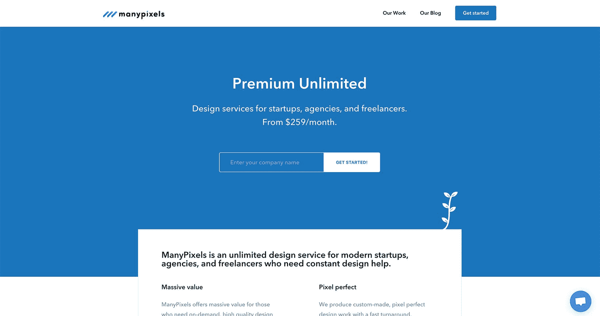
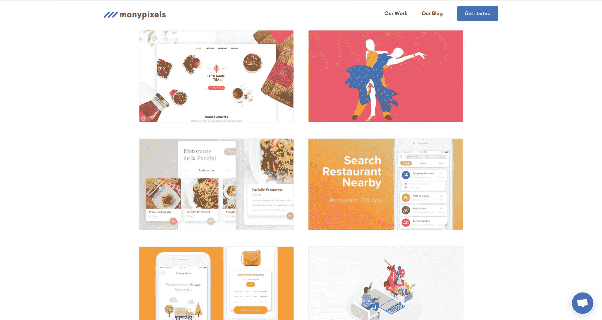
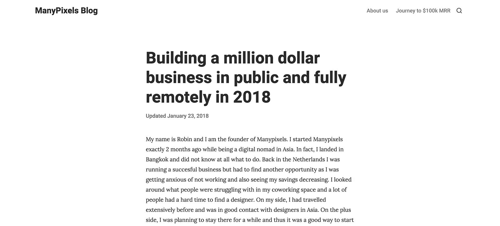

# 在国外寻找灵感，快速发货，并增长到 5 万美元/月

> 原文：<https://www.indiehackers.com/interview/finding-inspiration-abroad-shipping-fast-and-growing-to-50k-mo-e55f6feafd>

## 你好！你的背景是什么，你在做什么？

嘿！我是罗宾·范德·海登，许多像素公司的创始人。我们是一家面向初创公司的优质无限设计即服务公司，目前每月经常性收入为 50，000 美元。

 

## 是什么促使你开始使用 ManyPixels？

在开始[之前，我在荷兰学习法律。那时，我经营着一家成功的国际学生在线租赁机构，年收入增长到 25 万欧元。然而，在过去的一年里，由于通过了一项关于房地产公司的新法律，规定他们只能向房东收费，而不能再向学生收费，收入下降到 2.5 万欧元。我必须找到另一个商业想法！](https://www.manypixels.co)

毕业后，我飞到乌干达在比利时大使馆实习(我的第一份真正的工作)，但我讨厌它。我在该地区旅行了一段时间，非常想知道接下来我会做什么。我有一个学位，申请了几份工作，并不断查看我朋友的 LinkedIn 账户，想知道我是否也应该得到一份公司工作。当你已经成功地做了自己的事情，却不知道自己是否会再次大获成功，这是相当有压力的。你认为你只是幸运，并开始怀疑自己，失去信心。

我没有花太多心思去开始。我刚刚开始。

TweetShare

环游非洲后，在一位住在亚洲的朋友推荐下，我买了一张去亚洲的单程票。我以为我会在一个新的地方找到灵感。我去了台北，最后决定在曼谷住两个月。我订了一个合作空间，不知道下一步该做什么。

当我到达我的共同工作空间时，我看到入口处有一个小布告板，上面有许多注释，如“寻找自由设计师”和“寻找 UX 设计师”，我无意中听到一些成员抱怨聘请平面设计师有多难。我没有这个问题，因为我有一个巨大的 Skype 列表，上面全是伟大的设计师，我想，“也许让我们来解决这个问题。让我们做一个网站，我保证质量(退款保证)，简化操作，每月支付设计师一个固定的价格，让他们和我在一起，让我们寻找客户。”

我没有花太多心思去开始。我刚开始，从一开始就很有效。我要求我名单上的所有设计师在 Skype 上给我发送他们最好的作品，买了一个 HTML 模板，并建立了一个支付系统。大约五个小时后，我们就开始运行了。我把网站贴在了几个脸书的企业家团体上，我们做了第一笔生意(一天大约 1500 美元)。

## 构建最初的产品需要什么？

首先，我认为重要的是要强调，虽然 [ManyPixels](https://www.manypixels.co) 看起来像是一夜成名，但在制造第一个产品之前发生了很多事情。在大学期间，我过得像国王一样，因为我有一个成功的企业，但在我攻读硕士学位期间，由于一些规定限制了我们的收费(我们的年收入从 250，000 美元增加到 25，000 美元)，它崩溃了。我曾经认为我所做的一切都会变成金子，我感谢我之前的学习让我摆脱了这种想法。事实是:当你失败并从中吸取教训时，它会帮助你再次成长。我不认为还有其他办法。

其次，离开我的房地产生意给了我一些积蓄，也让我有能力去旅行一两年，寻找更多的灵感。正如[皮特·里维斯](https://twitter.com/levelsio)所说，旅行让你变得不那么“正常”，因为你将不同文化的点点滴滴联系起来，这有助于你更有创造性地思考。我认为我们都是“创意企业家”，因为我们的想法来自我们的学习和我们混合产生想法的不同点点滴滴。出差和不太正常是创业者的竞争优势。

关于构建产品本身:

*   我让我在 Skype 上的所有设计师把他们最好的作品发给我。
*   然后，我购买了一个 HTML 模板，把所有的作品放在那个网站上，并在网站上放置了一个“购买”按钮以及一个实时聊天小部件。

老实说:网站烂透了。但是谁在乎呢？我们是街道边上卖镇上最好的油炸圈饼的古怪商店。这才是人们关心的。(当然现在我们有了更好的网站。😉)

我们在发布这个的时候有一个有趣的发现:人们在购买，但有些人也在想，“这不可能是真的，这太便宜了。”我们提高了价格，增加了销售额。这看起来很愚蠢，但是很有效。

我认为，早期启动最重要的技巧是足智多谋和克制。我不会编码。所以我必须找到一个支付提供商来处理事情。我必须找到一个好的模板。如果我是一名优秀的程序员或设计师，我可能会花更多的时间来完善网站。

至于我们开始使用的工具，它主要只是一个 Excel 电子表格。我把所有的新客户放在那里，并通过电子邮件发送可交付成果。我们也用 Skype 和我们的设计师交流，有时也用 WhatsApp。我还通过 WhatsApp 接到了很多客户的电话。

 

## 你是如何吸引用户和增加像素的？

我们最初的用户完全是通过脸书的创业者和初创公司群体获得的。我加入了许多脸书小组，并写了一篇帖子，征求对多像素和我们的价值主张的反馈。我的信息基本上是，“嘿，伙计们，这就是我们所做的，你们对此感兴趣吗？是/不是/为什么不是？”我还尝试承诺给我们反馈的每个人都会有一个促销代码。这工作得很好——很多人评论，这是一个小的黑客攻击，让我们有很多的嗡嗡声。

我认为我们在这里所做的就是把正确的产品和正确的信息放在正确的用户面前。我很诚实:我告诉他们，我是曼谷的一名数字流浪者，正在尝试一个新想法，并试图验证需求。人们对此反应良好(尽管在某种意义上这是广告)，并表示支持。老实说，我不确定它是否会被标记为垃圾邮件，但我还是决定冒这个险。

另一个优势是我自己是一名科技企业家。我确切地知道人们喜欢什么样的现代设计风格，我也知道网上企业家在哪里会面和讨论。(独立黑客是其中之一。)我不需要做大量的客户调查。我所有的决定都是基于直觉，可能都很有偏见。我也很幸运能进入这样一个领域，并瞄准一个对尝试新想法非常开放的社区。

我的努力包括:

*   在 reddit 上发布案例研究
*   活跃在独立黑客和黑客新闻上
*   积极联系脸书和天使名单上的公司。虽然我的账户被这些平台封禁了几个星期，所以我会尝试不同的策略。

我们正在考虑下一步发展分支机构和推荐，然后在更多的内容，公关，广告以及合作伙伴关系，甚至可能是白色标签上工作。

到目前为止最有效的是什么？正如我前面提到的，这与我们使用的策略无关，而是将正确的信息和正确的产品放在正确的受众面前。我们有 25%的天使名单外发邮件的转化率，这绝对是高得离谱。到目前为止，我们尝试过的每个销售渠道都有客户。在我之前的工作中，我主要是做销售(获得房东和房客)，我喜欢销售。我只是喜欢与人交谈，做出承诺并努力兑现。我认为这很有挑战性，当我做销售的时候，我真的很兴奋。

我给那些刚开始的人的建议是:集中精力，尽快开始做一些事情。

与您的用户一起构建，获得快速反馈循环，然后迭代。作为人类，我们是如此的有偏见和不完美，以至于不可能从一开始就做对。此外，你可能会得到它的权利，但你可能会错过其他更大的机会。专注，快速开始，把你的产品放在用户面前，让自由市场摧毁它或者爱上它。

 

## 你的商业模式是什么，你是如何增加收入的？

我们是一个基于订阅的设计服务。人们每月向我们支付固定费用，并可以享受无限的高级设计服务。现在我们有两种定价方案:基本(每月 259 美元)和高级(每月 349 美元)。

我们开始直接向客户收费，但基本计划的介绍价格为 99 美元，高级计划为 179 美元。我们使用 Stripe 向客户收费。

我们现在有 210 个经常性客户，我们每月产生 50，000 美元的经常性收入。

对我们收入增长的最大推动:主要是我们的产品搜索和黑客新闻发布。我们在产品搜索的第三点上得到了特写，我发表了一篇关于我如何开始 ManyPixels 的文章，这篇文章登上了黑客新闻的第一页，并在那里停留了一天的大部分时间。我在 Reddit 上也有一些点击(这比黑客新闻更容易)。这些让我们每天都有几十个新客户。

我对商业模式的建议是:尽早收费。如果你不赚钱，你就没有生意。(这不适用于那些建立媒体公司或社交网络的人。)

我们的利润率:我们在 12 月份有 20-30%的利润率，但在 1 月份这个数字增长到了 50%以上。我们应该比二月份还要高。

我还没有开始跟踪我们的转化率，但自从我们推出以来，我们的总访问量约为 30，000 人次。

| 月 | 收入 |
| --- | --- |
| 2017 年 12 月 | 8500 |
| 2018 年 1 月 | 15000 |
| 2018 年 2 月 | 50000 |

## 你未来的目标是什么？

我对事业有三个目标，对个人生活有一个目标:

我的目标是到 2020 年年销售额达到 1 亿美元。我们希望我们的客户对 ManyPixels 上瘾，并让它成为他们的首选平台，以承担他们新公司的创意工作。

我想修正设计的主观性。我想开发最先进的系统(可能由人工智能支持)，以了解客户的需求的本质。我们如何确保我们总是超额完成客户的期望？设计是非常主观的，最终会成为疯狂增长的瓶颈(从 100 万美元到 1 亿美元的业务)。目前没有人修复这个问题。因此，如果我们能够解决它，理解客户的需求，并超越他们的期望，那么天空就是极限。

我想创建一所 Pixel 学校，为亚洲主要城市有抱负的企业家提供免费英语课程、免费商业课程和免费 UI/UX 课程。这将有助于我们加强我们的品牌，雇佣有才华的设计师，并回馈社区。我计划在今年夏天从一个小型训练营开始，看看反应如何，是否有真正的价值。

出差和不太正常是创业者的竞争优势。

TweetShare

就个人而言，我想有更多的时间发展其他兴趣。我对其他学科也很感兴趣，比如建筑、设计和文学，但自从我开始做生意以来，我发现自己只想着生意，这限制了我的大脑容量。简而言之，我想让我的大脑跟上时代。我总是担心，我现在已经取得了一定的成功，但如果我不把我的大脑训练得足够好，从长远来看，我在很长一段时间内都不会想出好主意。

## 你面临的最大挑战和克服的障碍是什么？如果你必须重新开始，你会做什么不同的事？

我们是服务行业。最大的障碍是人员管理和不断寻找有才华的设计师。我们与亚洲的自由设计师合作。胡萝卜加大棒的激励措施——例如金钱——在激励人们在这里工作方面不像在欧洲和美国那样有效。社区、家庭等其他方面更加突出，需要拥抱。生活在这里和非洲帮助我理解和同情其他文化，但我确信我只是触及了表面。

其次，在我之前的工作中(以及大学期间)，我一直被要求把事情做到尽善尽美。我会投入疯狂的工作时间，确保我的员工每天至少打 100 个销售电话。大多数情况下，这只会让人们精疲力竭，包括我自己。从那时起，我意识到，有时候，做得更好更完美。快速行动、取悦客户、获取价值和理解杠杆是超级重要的概念。

## 有没有发现什么特别有帮助或者有优势的？

我最喜欢的博客是沙恩·帕里什的《法南大街》。几年前，当我遇到它时，它的某些方面让我觉得很无聊，但随着我自己和我的业务的增长，我意识到它是一个如此伟大的资源。

其次，我最喜欢的信息来源是黑客新闻。我有时认为它太消极了，但总的来说，评论和讨论是平衡的，它似乎总是更先进。

我认为我最重要的技能是我从不满足，总是有一团火在燃烧。我想把自己推向最大。我只想尽我所能地努力工作，尽我所能地赚钱，并希望在我死后产生最大的影响，留下一份遗产。

我最大的优势是我来自比利时的一个中产阶级家庭，有一个支持我的童年，良好的教育和很多自由。我生来就有一手幸运牌，我在这方面的适度成功主要是因为来自一个良好的环境。

从很小的时候起，我的父母每周至少有一天会带我去公共图书馆去积累书籍(不是疯狂的父母；如果我们想看的话，我们可以看，大部分是漫画书。我读了很多小说，但也读了很多经典书籍。那个图书馆有一个视频游戏租赁店，我爸爸和我哥哥会做局域网聚会(主要是雷神之锤 3 和虚幻锦标赛)。我爸爸是一名软件工程师，他总是给我们买电脑，还帮我编写了我的第一个网站。当我 10 岁的时候，我是一个哈利波特迷，我爸爸编写了一个在线 MMORPG，人们可以在那里注册霍格沃茨。我爸爸还向我介绍了易趣，并向我解释了如何在那里卖东西。他还告诉我如何使用社区(usenet)和 IRC。我想，我爸爸在我妹妹还没有出生的时候就为她创建了一个电子邮件地址。

不可否认，童年的支持对我的成功起到了很大的作用。我父母的唯一要求是让我完成学业，但他们并不太在意成绩或任何特定的职业道路，只要我开心就好。他们给了我很多自由，我不应该得到我所得到的一切。我的父母全力支持(现在仍然支持)我，把我介绍给他们的朋友做学生工作和实习，我也去澳大利亚和我的堂兄弟住了几个月学习英语。我也有很棒的朋友，我喜欢和他们竞争。

最后，我也认为很大一部分原因是，虽然我有时喜欢谈论自己，但我没有太大的自我。我只想继续做酷的东西(当然也赚钱)。我不在乎是否会失败；我不在乎明天是否会失去所有的钱。我认为最让我激动的是建造一个东西，看着它起飞，然后修复它的各个部分，让它变得更大。我有时会上汽车网站，想知道我能用那些钱买什么样的酷车，但后来我真的想知道买东西和制造东西是否会让我真正快乐。

## 对于刚刚起步的独立黑客，你有什么建议？

我最好的建议是尽可能多的尝试。

其次，是要受到启发。通常这些点会在某个点连接起来。对几门学科感兴趣是很棒的，偶尔(甚至在人生的几个点上)有点失落也没关系。这都是成长过程的一部分，有助于我们重新聚焦，排除杂念。

## 我们可以去哪里了解更多？

我有一个[个人博客](https://www.vinrob.co)，我有时会[发微博](https://www.twitter.com/Vinrob)。

欢迎提问！

—[<picture id="ember7408147" class="user-avatar ember-view user-link__avatar"></picture>罗宾·范德·海登](/Vinrob?id=N1geO27cYqUrDh0sXfJu0jcYyG52)，ManyPixels 联合创始人

## 想像 ManyPixels 一样建立自己的事业？

你应该加入独立黑客社区！🤗

我们是几千名创始人，互相帮助建立有利可图的业务和副业。来分享你正在做的事情，并从你的同事那里获得反馈。

还没准备好开始使用你的产品吗？没问题。这个社区是一个认识人、学习和实践的好地方。随意[随便浏览](/)！

——[<picture id="ember7408152" class="user-avatar ember-view user-link__avatar"></picture>柯特兰艾伦](/csallen?id=ibTLPyjwVebnZjMGKvz6ztarnuV2)，独立黑客创始人

91votes