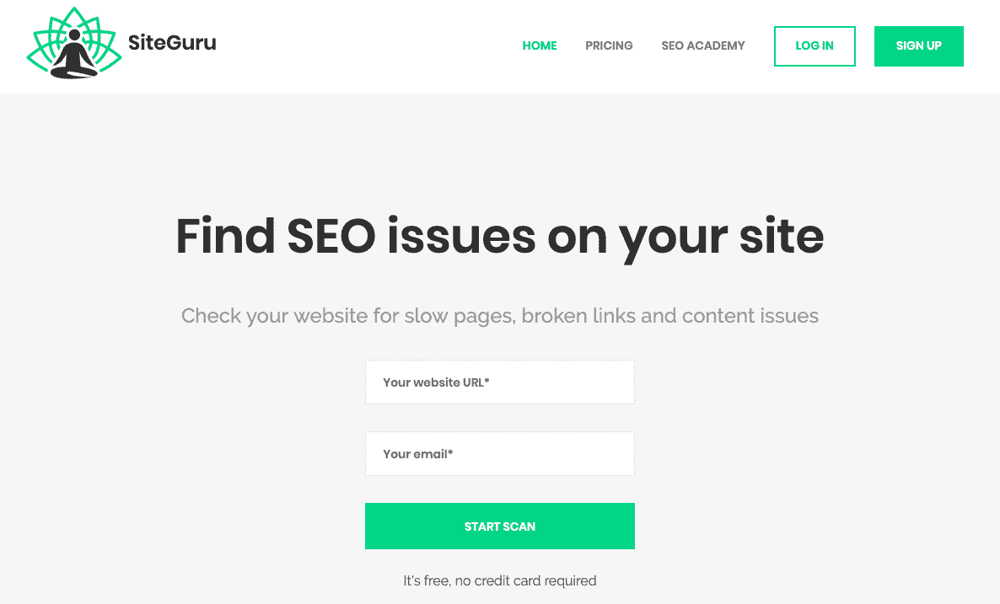
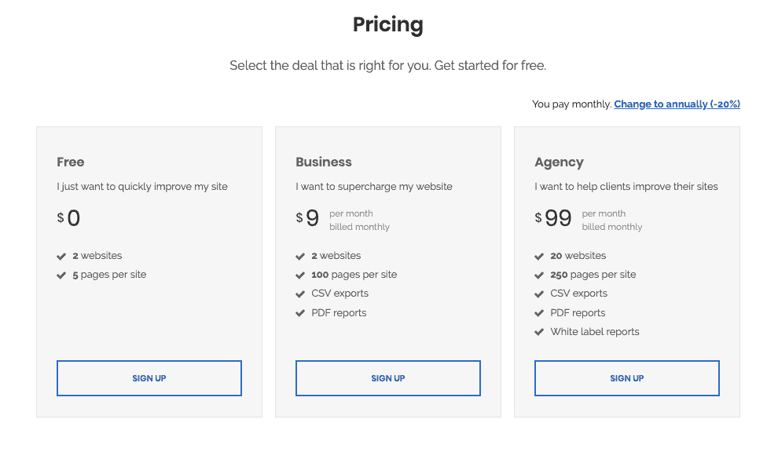
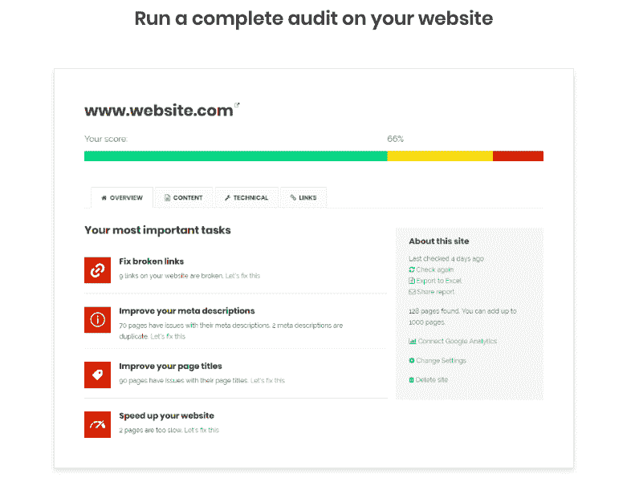

# 找到合适的受众并发展到 5，000 名用户

> 原文：<https://www.indiehackers.com/interview/finding-the-right-audience-and-bootstrapping-to-5-000-users-b4903e2aad>

## 你好！你的背景是什么，你在做什么？

你好。我叫里克·范·哈斯特伦，是 [SiteGuru](https://www.siteguru.co) 的创始人。我住在荷兰，离阿姆斯特丹 30 分钟，离海滩两分钟。SiteGuru 是我的副业项目；我的日常工作是在一家互联网代理公司担任团队领导。我是一个喜欢建筑的开发者和在线营销者的奇怪混合体。

我一直在做副业。在我高中学会如何建立网站后，我创建了一个非常成功的在线 HTML 课程。去澳大利亚旅行后，我开办了一个旅游博客服务，让人们与朋友和家人分享他们的故事和照片。那是在 2002 年，在社交媒体真正起飞之前——那时我正在给父母发送打印好的照片。这两个网站我都卖了。我还和妻子一起经营了一家[网上酒店](https://www.wijnvandekaap.nl)，生意非常好。

SiteGuru 帮助网站所有者和营销人员找到并修复他们网站上的问题。我相信你的网站有点像冰山:你只能看到它的一部分。一些问题可能隐藏在表面之下，影响你的访问者的体验，损害你的搜索引擎排名。SiteGuru 旨在让你全面了解你的网站是如何运作的，以及你可以如何改进。

我喜欢我的工作，但也喜欢兼职做些东西。我希望未来能够完全专注于 SiteGuru，但我还没到那一步。SiteGuru 每月产生 500 美元的收入，并且每月都在增长。

SiteGuru 目前有超过 5000 名用户，每天都有大约 100 人使用 SiteGuru 来改进他们的网站，这真是太棒了。我得到了很多积极的反馈，这是继续前进的巨大动力。

 

## 是什么促使你开始使用 SiteGuru？

在一家互联网机构工作时，我一直在寻找一种方法，在网站上线后检查常见错误。它始于 Excel 表格，但没有人喜欢使用 Excel 清单。所以我把这个列表变成了一个工具，可以自动检查你网站上的问题，并告诉你哪里出了问题。这最终变成了 SiteGuru。

我在一两周内做了一个简单的版本，花了 100 美元来验证这个想法。我在网站上放了一个屏幕录制工具，并使用谷歌广告来吸引一些访问者。我观察了他们在我的网站上所做的一切，他们中的大多数人似乎对这个工具非常满意。我采访了一些报名的人，以收集更多的反馈，他们积极的经历激励我继续前进。

在这一点上，我不知道构建一个成熟的网站检查器会有多难。我想这是一件好事，因为如果我知道自己会陷入什么样的境地，我可能永远都不会开始。

## 构建最初的产品需要什么？

我不是世界上最好的开发人员，但是我喜欢自己做东西。我也没有任何预算来雇佣开发人员，所以自己动手是我唯一的选择。

构建一个网站审计工具很难——比我想象的要难得多。每个被检查的网站都是完全不同的。当我刚开始的时候，每检查一个新的网站，我都会发现新的异常，这些异常要么会破坏工具，要么会破坏正在检查的网站。事实证明，检查网站上的所有链接可能会很快变成意外的 DDOS 攻击，使客户的网站瘫痪。

你不需要风险投资或庞大的团队来打造一个伟大的产品。开始吧，保持简单。

TweetShare

慢慢地，但确实有了很大的改善，我对现在的报道质量非常满意。尽管如此，每周我都会发现一个新的边缘案例或一些我从未想过的东西。幸运的是，我的用户非常支持我，他们会分享他们发现的问题，这样我就可以解决它们。

SiteGuru 的一个 USPs 是，我们不会用数据轰炸用户，而是给他们可操作的提示来改进他们的网站。一个很大的挑战是以一种有意义的方式展示这些发现，这种方式可以真正帮助你作为一个网站所有者。我在每页上运行大约 15 个不同的检查，有时是数百页。将所有这些数据点组合成一份可操作的报告需要大量的反复试验。

总而言之，我花了大约三个月的时间来构建一个刚刚好的产品。这个市场的问题是，你没有用 okay 的产品取胜；你需要有一个伟大的产品才能成功。两年过去了，这个产品慢慢变得超级可靠和有用。

找时间开发产品是一个持续的挑战。将制作产品与我的日常工作和抚养两个小女孩结合起来并不容易，但幸运的是，我总能找到一些时间把自己锁起来，专注于制作。

## 你是如何吸引用户并壮大 SiteGuru 的？

我在 [ProductHunt](https://www.producthunt.com/posts/siteguru) 上推出了 SiteGuru，这带来了很多新访客。我还确保自己出现在所有的创业名单上——T2 分享了如何做到这一点。我还分享了[如何在独立黑客网站上接触到我的第一个 1000 名用户](https://www.siteguru.co/blog/how-i-got-my-first-1000-users)的故事，这真的很好，还上了黑客新闻的头版。与其他创始人分享你的成长战略非常酷，同时也是获得积极反馈和曝光的好方法。

我认为，包括我自己在内的许多创始人都犯了一个错误，那就是把目标对准了其他初创企业的创始人。这似乎是合乎逻辑的，因为你在那些社区中闲逛，他们中的大多数都对新工具感兴趣。但通常，这些人并没有从你的产品中获得最大价值，也没有成为付费客户。

如果可以的话，在 StackSocial 这样的网站上进行交易。当然，你需要给一个巨大的折扣，但你会得到如此多的关注作为回报。我认为这是加速你早期成长的好方法。仅仅一个月，我的用户数量几乎翻了一番。

| 月 | 用户 |
| --- | --- |
| 2017 年 7 月 | 79 |
| 2017 年 8 月 | 181 |
| 17 年 9 月 | 205 |
| 17 年 10 月 | 229 |
| 17 年 11 月 | 469 |
| 2017 年 12 月 | 667 |
| 2018 年 1 月 | 793 |
| 2018 年 2 月 | 878 |
| 18 年 3 月 | 949 |
| 2018 年 4 月 | 1013 |
| 2018 年 5 月 | 1619 |
| 2018 年 6 月 | 1886 |
| 2018 年 7 月 | 2099 |
| 2018 年 8 月 | 2295 |
| 18 年 9 月 | 2462 |
| 18 年 10 月 | 2633 |
| 18 年 11 月 | 2764 |
| 2018 年 12 月 | 2925 |
| 19 年 1 月 | 3050 |
| 2019 年 2 月 | 3165 |
| 19 年 3 月 | 4709 |
| 2019 年 4 月 | 5048 |

## 你的商业模式是什么，你是如何增加收入的？

我提供付费计划，让你检查更多的网页和更多的网站。

我还在苦苦寻找最终的定价模式。我已经尝试了几件事:14 天免费试用，之后你必须升级，预先定义的计划与一套网站和网页的数量，可定制的计划，你可以选择多少网站和多少网页，你需要的。没有一种模式是完美的，每种模式似乎都有严重的缺点。

现在，我提供无限期的免费试用，只检查五页。好的一面是，你会得到关于你的网站的每周更新，而检查网站并不需要花费太多的资源。那些每周联系点让我有机会保持联系，并说服人们升级。

你可以选择 9 美元/月的 100 页套餐，也可以选择 99 美元/月的 500 页套餐。我们使用 Stripe 是因为它非常容易设置和管理订阅。

我现在正在为代理机构制定一个计划，重点是需要查看许多不同网站并与客户分享报告的在线营销人员。我也在考虑对付费用户限制特定的功能(比如断开的链接检查或 PDF 报告下载)。

 

## 你未来的目标是什么？

我的短期目标是扩大 SiteGuru 的用户群，并把收入增长到我可以全力以赴的程度。

为了达到这个目标，我需要能够接触到正确的受众:专业的在线营销人员。这是我目前最大的挑战。这些人将从产品中获得最大价值，并习惯于为帮助他们工作的在线工具付费。

我最大的动力是帮助人们改进他们的网站。如果他们的所有者可以看到他们网站的全貌，那么有很多企业可以做得更好。我坚信 SiteGuru 可以在这方面提供帮助。

## 你面临的最大挑战和克服的障碍是什么？

尽管我的营销策略取得了巨大的成功，吸引了大量的访问者和注册用户，但问题是这些用户并不合适:他们对价格敏感，没有从 SiteGuru 中获得足够的价值。他们对报告很满意，做了一些修改，然后继续。他们没有动力定期升级和监控他们的网站。

我意识到，相反，我应该专注于在线营销机构和搜索引擎优化专业人士。这些人愿意为一个伟大的报告工具付费，因为它使他们的生活变得更加容易。在这样一个竞争激烈的市场中接触他们将是一个挑战，但我相信这是唯一的成功之路。

## 有没有发现什么特别有帮助或者有优势的？

我是大卫·海涅迈尔·汉森和杰森·弗里德的超级粉丝。*返工*和*变得真实*向我证实，你不需要风险投资或庞大的团队来构建一个伟大的产品。开始吧，保持简单。

我也学会了欣赏专注的价值。长时间的专注工作真的会让你进入状态，让你变得超级有效率。像卡尔·纽波特的《深度工作》和托尼·克拉布的《忙碌》这样的书帮助了我。

这么多人分享他们的想法和数字，提供反馈，互相帮助，真是太棒了。这对个人和社区都有好处。

TweetShare

更普遍地说，个人创业者和独立黑客的崛起是很值得关注的。这么多人分享他们的想法和数字，提供反馈，互相帮助，真是太棒了。这对个人和社区都有好处。科特兰无疑为此创造了一个伟大的平台，所以非常感谢你！

## 对于刚刚起步的独立黑客，你有什么建议？

当我创办 SiteGuru 的时候，我从来没有真正想过我的受众是谁。我应该花更多的时间来定义我的理想观众。谁会使用我的产品，并愿意为此付费？他们在哪里闲逛？我如何能联系到他们？我希望我能早点想到这一点。制造正确的产品、使用正确的信息、与正确的人接触会更容易。

如果你已经开发一个产品几个月了，你就不再“新鲜”了了解新客户如何体验你的产品是非常重要的，而且也非常容易做到。在你的网站上放一个屏幕录制工具，看看人们在做什么。

每周，我都会看至少五段真人使用我的网站的录像。这是我给自己定的规矩。毫无例外，至少有一次会议给了我新的见解。这是一个很好的方式来体验你的用户正在经历什么，看到他们的挫折，然后解决他们的问题。这就是一切，对吗？

 

## 我们可以去哪里了解更多？

在[SiteGuru.co](https://www.siteguru.co)上了解产品的所有信息，并在 Twitter 上关注我 [@rickvanhaasteren](https://twitter.com/rickhaasteren) 。

—[<picture id="ember8089536" class="user-avatar ember-view user-link__avatar"></picture>里克·范·哈斯特伦](/RickVanHaasteren?id=5jX6GfSuYnOu29VNSBmo5idEGiK2)【site guru】创始人

## 想像 SiteGuru 一样建立自己的事业？

你应该加入独立黑客社区！🤗

我们是几千名创始人，互相帮助建立有利可图的业务和副业。来分享你正在做的事情，并从你的同事那里获得反馈。

还没准备好开始使用你的产品吗？没问题。这个社区是一个认识人、学习和实践的好地方。随意[随便浏览](/)！

——[<picture id="ember8089541" class="user-avatar ember-view user-link__avatar"></picture>柯特兰艾伦](/csallen?id=ibTLPyjwVebnZjMGKvz6ztarnuV2)，独立黑客创始人

12votes