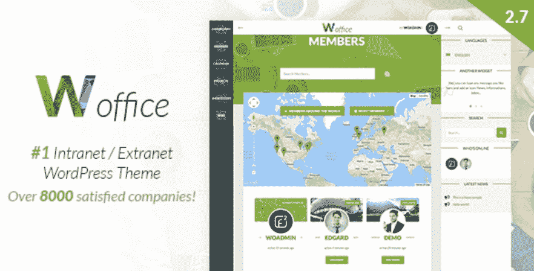
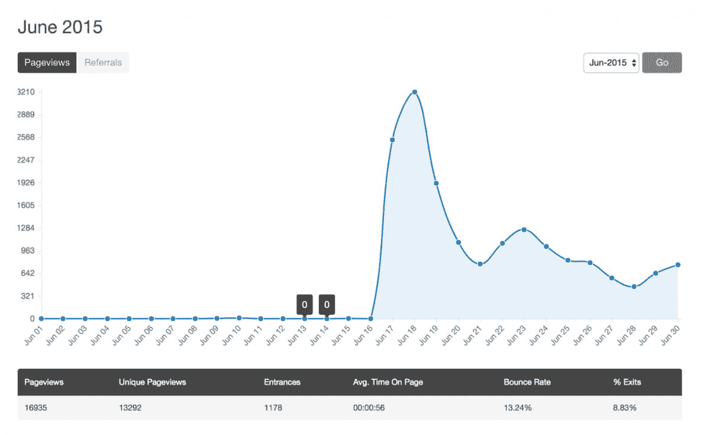
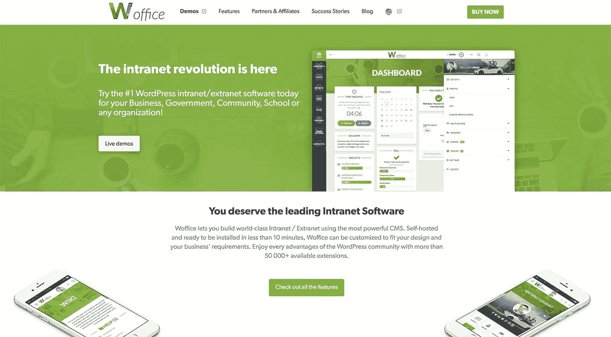

# 注重质量胜于数量，每年增加 1 万美元的收入

> 原文：<https://www.indiehackers.com/interview/focusing-on-quality-over-quantity-to-increase-revenue-by-10k-yr-c205196497>

## 你好！你的背景是什么，你在做什么？

我叫巴蒂斯特。我来自法国，目前住在法国北部一个可爱的小镇。我从事 Web 开发和在线业务已经 3 年多了，我是 Alkalab 的联合创始人，Alkalab 是 [Woffice](https://woffice.io) 背后的公司。

虽然我有技术背景，但我现在专注于营销方面的事情，使命是将我们的风险投资提升到一个新的水平。我的另一位联合创始人兼大学朋友[弗朗索瓦·福里斯特](https://twitter.com/2F_webd)负责技术方面。

[Woffice](https://woffice.io) 是一个基于 WordPress 的内联网/外联网解决方案，适用于全球各种规模的公司。

弗朗索瓦是 2015 年开始的，我是后来加入的。我们在 theme forest 上以一次性 75 美元的终身许可费出售 Woffice，这是 WordPress 相关产品的主要市场。

…到今天为止，我们已经卖出了 8，000 多份许可证！🚀

 

## 是什么促使你开始使用 Woffice？

当时，WordPress 主题市场竞争并不激烈，这仍然是一个进入的好时机。我现在不会这么说了。对于与佛教相关的主题来说尤其如此。这是一个非常不错的利基市场。BuddyPress 是在你的 WordPress 网站上创建和管理在线社区的插件。

Franç ois 最初的想法是建立一种内部网/外部网主题，或者一个社区解决方案。在 ThemeForest 团队的帮助下，他最终承担了前者，并开始画草图、绘制东西，并构建第一个 HTML 模型。

他回忆说，当时他在欧洲的一次旅行激发了他的创造力，并引导他完成了该产品的最终版本 1。

他已经对 WordPress 市场有了很好的了解，他以前设计过一些主题(之前发布过 5 个主题，设计过 10 个高级 HTML 模板)，但是 Woffice 是最具挑战性的一个。ThemeForest 进行的彻底发布和代码审查过程在当时相当漫长，大约 2 个月，但最终导致了该产品在 2015 年 6 月的发布。

产品/市场的契合度很快得到了验证:在头两天，服务器出现了几次故障，主题森林页面被访问了 5000 多次。太疯狂了。🙀

 

我不建议在没有首先验证市场的情况下开发一个产品。这在当时是一个相当大胆的举动，但后来证明是一个好主意！😄

值得指出的是，当时我们还在攻读硕士学位，这意味着赚钱不是最首要的事情。

## 构建最初的产品需要什么？

花了大约 4 个月的时间到版本 1，或者最小可行产品，加上额外的来自 ThemeForest 的审查时间。

也就是说，自 2015 年以来，Woffice 已经更新了 105 次，增加或修复了 1000 多项功能。你可以在这里找到完整的变更日志。

WordPress 也非常强大，这要归功于它在 WordPress.org 的[上提供的 55K+免费插件，以及你可以在(Envato)[https://elements . Envato . com/WordPress/plugins]和专用网站上找到的所有优质插件。这意味着，当有一个现有的好插件时，你不必重新发明轮子，这是 Woffice 提供的一些功能的情况，例如内置的日历管理或甘特图功能。](https://wordpress.org/plugins/)

做你自己的向导，做你自己的裁判。你拥有自己的命运。换句话说，不要太在意你的竞争对手。提供一些独特和更好的东西。

TweetShare

然而，当我们遇到麻烦或与[插件作者](https://alkaweb.atlassian.net/wiki/spaces/WOF/pages/2162713/EventON)发生冲突时，我们不得不在这个过程中做出一些选择。

这是一个完全自举的产品和公司，没有任何外部资金。这真的是一个人的骗局，主要是在大学毕业后的晚上。

最后一点，对于更懂技术的人来说，我们的代码堆栈非常简单，即:SASS、Gulp、带有 [Unyson](http://unyson.io/) 代码库的 WordPress 框架、现代面向对象的对象 PHP、jQuery，我们后来添加了 Vue.js 以使事情变得更强大。

## 你是如何吸引用户并发展 Woffice 的？

首先，WordPress 社区非常大，在 ThemeForest 上尤其如此。

鉴于当时 Woffice 是一个非常小众的产品，由于 ThemeForest 社区的力量，我们在开始时很容易吸引新人。它所需要的只是一个好的设计，一个好的工作产品和一个好的销售页面。

但是，当实际从 0 到 100 时，这就是橡胶落地的地方！

这意味着在森林之外建立我们的搜索引擎优化和在线存在，主要是通过我们的网站 Woffice.io，但也包括我们在 alka-web.com 的博客。

加倍投资你的利基市场，并专注于教育他们。从第一天起就开始关注内容。从长远来看，这是值得的。

TweetShare

除此之外，我们还努力确保在每一篇产品对比文章中提到 Woffice，以及关于 WordPress 社区网站的文章。

我们也尝试了一些广告和 AdWords，但效果不是很好，主要是因为当你在一个竞争非常激烈的地方以 79 美元出售一次性许可证时，很难获得良好的投资回报。

最后，我们现在更加关注合作伙伴关系和内容建设。

因此，简而言之，我们正试图在我们的市场之外获取更多的内容，但我们的大部分流量(~80%)仍然来自他们。

总之，我们的建议是加倍投资你的利基市场，并专注于教育他们。从第一天开始就更注重内容。从长远来看，这是值得的。

 

## 你的商业模式是什么，你是如何增加收入的？

我们的商业模式很简单。我们通过 ThemeForest 出售许可证，我们得到全价，减去佣金。

除此之外，我们还从推荐给托管合作伙伴和定制开发合作伙伴获得资金。

两年多以前，我们决定提高许可证的价格，因为我们希望将自己定位为更好的*顶级*解决方案。此外，我们还注意到，提供质量，而不是数量，是最好的。例如，我们不是以 50 美元的价格出售 100 个许可证，而是以 75 美元的价格出售 20 个许可证。它大大减少了支持时间，使我们能够专注于产品改进。

这也帮助我们将年收入增加了 10 多亿美元，10K。

我们的开支非常有限，因为我们与其他项目共享我们的专用服务器，所有的支付和交易邮件都由 ThemeForest 处理。我们使用 Mailchimp 的免费版本来发布时事通讯。

## 你未来的目标是什么？

我们的目标是扩大合作，保持稳定的客户流。随着收入的增加，我们能够更新产品并微调不同的功能。

例如，我们目前的重点是通过引入图表和更好的搜索让我们的项目经理更上一层楼。但是我们也在人力资源方面加倍努力，最近与 [WPERP](https://wperp.com/) 合作。然后，我们将在此基础上添加更多功能。最后，我们还想关注集成和通知。

## 你面临的最大挑战和克服的障碍是什么？如果你必须重新开始，你会做什么不同的事？

首先，我们建议在打造“科技产品”的同时，在技术和质量上投入更多的时间。一切都取决于它。如果你有野心，避免构建*有效*的代码。考虑构建可维护和可伸缩的代码。例如，不要写 JavaScript，而是写一个真正的 JavaScript 框架。

然后，我们的第二个错误是不欢迎竞争对手，甚至对他们着迷。你最好制造一个更好的产品，而不是与竞争对手比较数字。

另一个障碍是开始时收到的反馈和评论的流动。我们犯了错误，接受一切，努力让大家开心，而不是放过蛮横的人。

你不可能取悦所有人。不要开发只有 0.5%的用户会使用的功能。想想你正在建设的东西的真正影响，而不仅仅是让人们开心。

你不可能取悦所有人。不要开发只有 0.5%的用户会使用的功能。想想你正在建设的东西的真正影响，而不仅仅是让人们开心。

TweetShare

最后，最后两条建议是关于项目管理和招聘的。

从第一天开始就使用一个好的项目经理工具。我们现在使用的是 JIRA，我们对此非常满意。在招聘过程中多花些时间。做测试和试用期。弗朗索瓦不得不解雇我们的第一个后勤人员，因为招聘过程做得非常糟糕。

## 对于刚刚起步的独立黑客，你有什么建议？

我首先要说的是，你需要找到你的利基市场。不要为大众造东西。

但这还不是全部，做自己的向导，做自己的评判。你拥有自己的命运。换句话说，不要太在意你的竞争对手。提供一些独特和更好的东西。

不要误解我。我并不是说你不应该听从你的亲密关系网，但你最终还是会做好工作，所以向前迈进吧！😄

最后——我们通过我们的新软件 [Feedier](https://feedier.com) 了解到这一点——我要指出的是，人们并不是因为功能 A 或 B 而使用你的产品，而是因为他们想打造一个更好的自己，他们的公司。

人们购买 Woffice 不是因为它提供了项目管理功能，而是因为它有助于他们更好地协作，没有任何内部和外部利益相关者的麻烦。

我会推荐艾伦·克莱门特在[网站](https://jtbd.info/)上的资源，以及启动的*对讲机。*

“经典”书籍也是一本好书，比如彼得·泰尔的《零比一》,或者埃里克·里斯的《精益创业》。

## 我们可以去哪里了解更多？

我们都在推特上的 [@baptistedebever](https://twitter.com/baptistedebever) 和 [@2F_webd](https://twitter.com/2F_webd) ，而 Woffice 可以在 [Woffice.io](https://woffice.io) 找到。

我们还有其他产品，所有这些都可以在我们的网站[alka-web.com](https://alka-web.com/)上找到。我还鼓励大家看看我们的新项目 [Feedier](https://feedier.com) ，这是一个通过游戏化过程帮助公司收集更好反馈的应用程序，专注于用户参与和用户体验。

如果你有任何关于创建或销售 WordPress 主题的问题，请在下面提问！我们会努力给你一个最好的答案。

—[<picture id="ember8045784" class="user-avatar ember-view user-link__avatar"></picture>巴蒂斯特·德贝弗](/bdebever?id=YmfLSOU6M2gxFdpWCA5j0uRGSZg1)，Woffice 创始人

## 想像 Woffice 一样建立自己的事业？

你应该加入独立黑客社区！🤗

我们是几千名创始人，互相帮助建立有利可图的业务和副业。来分享你正在做的事情，并从你的同事那里获得反馈。

还没准备好开始使用你的产品吗？没问题。这个社区是一个认识人、学习和实践的好地方。随意[随便浏览](/)！

——[<picture id="ember8045789" class="user-avatar ember-view user-link__avatar"></picture>柯特兰艾伦](/csallen?id=ibTLPyjwVebnZjMGKvz6ztarnuV2)，独立黑客创始人

6votes